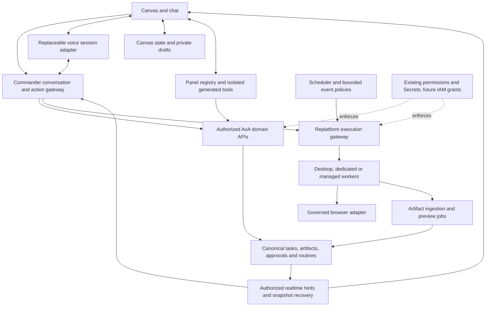

> Current scope authority: [master scope](master-scope.md). Source revisions, tests and unresolved integration dependencies: [code evidence](code-evidence.md). This companion describes planned behavior unless explicitly evidenced.

# Commander Canvas — architecture map

Status: proposed integration architecture, September 10, 2026. Synthesizes the [technical review](code-evidence.md), [voice research](voice-provider-research.md) and [experience draft](master-scope.md). Implementation evidence is from local source inspection; no new runtime acceptance tests were performed for this map.

## Ownership

The diagram describes logical responsibilities, not a requirement to deploy a microservice for every box. Retain existing modular boundaries where practical. Routine execution must retain the current canonical run/task path when routed to replatform; the diagram does not authorize a parallel scheduler. Live media requires its own authenticated connection, distinct from the application event channel.

## Capability and dependency ledger

| Area | Reuse / inspected evidence | New or extended work | Acceptance evidence needed |
|---|---|---|---|
| Commander | Durable conversation/submission identity and action tools; distributed Commander path is shadow-only in inspected evidence | Voice delegation context, corrections, result correlation and heard-response tracking | Duplicate/reconnect and cross-conversation tests; no false completion claims |
| Voice | External provider capabilities documented | OpenAI Realtime first, direct behind adapter; Gemini and ElevenLabs also intended; pipeline/local speech later | Interruptions, pending tool work, provider expiry, language quality and usage accounting |
| Canvas state | Viewer currently retains page-lifetime state only | Company/user/conversation-scoped document, revisioned operations, drafts, schema migration | Concurrent tabs, lost acknowledgement, reload, resize, deleted/revoked references |
| Panels | Existing task and artifact viewer bodies; typed references | Multi-instance registry, declarative trusted blocks, isolated code bridge | Instance isolation, safe action validation, state-preserving updates, keyboard navigation |
| Artifacts | Canonical versions and provenance references | Format support matrix, ingestion-to-preview linkage, stage-specific retry | Original/version preserved, failed preview does not invalidate successful file, permission checks |
| Realtime | Replatform MIG-003 log/replay code and reported result | Integrate cursor/snapshot protocol; repair append failure through authoritative state | Authenticated cross-replica socket path, replay gaps, duplicates, access changes |
| Browser | Sandbox Playwright runtime; general command transport exists, browser governance applier not established | Browser Use preferred candidate, governed adapter, interactive view, manual pause/resume | Pause acknowledgement, stale-controller rejection, in-flight outcome, session reuse and credential scope |
| Routines | Scheduled tick, scoped transactional dispatch and run records | Conversational creation bridge; bounded event rules; personalized briefing checkpoint | Duplicate trigger, overlap policy, retry exhaustion, actor visibility and missed-event reconciliation |
| Access | Existing permissions and Secrets | Separate IAM workstream for human/agent account grants; canvas presents requests | Use versus reveal, scope/expiry, revocation during action, external session teardown limits |
| Long sessions | Existing UI and task services | Visibility-aware rendering, media/tool limits, recoverable state | Long-duration memory/resource checks, hidden work continuity, reduced-motion/readability |

## Shared contracts to specify

1. **Identity and authority:** every request carries company, user/agent principal, conversation, target reference and correlation identity. Authorization is re-evaluated on the server; a visible panel or saved reference grants nothing.
2. **Commands:** accepted/queued/running/result/failed/cancelled are distinct; uncertain is an observation of unknown outcome, not a canonical execution state. Retries use canonical request identity and check outcome. Speech interruption, task cancellation and browser pause are separate commands.
3. **Presentation state:** save schema version, document revision, stable panel identities and user layout intent. Private drafts remain separate from domain records and future shared layout. Never use whole stale-document overwrite as conflict resolution.
4. **Events:** delivery is a hint to canonical state. Replatform durable append is best-effort, so critical automation requires durable intent or reconciliation; never rely on receiving every UI event. Snapshot/replay must not resubmit commands.
5. **Voice:** backend capabilities describe turn detection, cancellation, transcript handling, connection lifecycle and usage. Keep provider history reconciled with the durable conversation and what actually played. Local speech is not offline AoA.
6. **Generated content:** validated input/state/action schemas, source provenance, narrow API capabilities and isolated execution. Full backend/database provisioning is deferred. Snapshot scenarios and live dashboards have different refresh behavior.
7. **Browser:** authoritative controller state plus worker acknowledgement. Manual pause/take-control is sufficient; automatic takeover is optional. Re-observe on resume, reject stale actions, distinguish already-completed effects. Remote adapters must not weaken existing launch guards.
8. **Operations:** propagate correlation through conversation, routine, job and artifact; log state transitions without secret/audio leakage. Bound concurrency, media resources, retries and storage. Define retention and provider session teardown explicitly.

## Dependencies and sequence

Architecture and canvas UI/state work can proceed independently of complete replatform delivery. Develop adapters against explicit versioned contracts and fixtures, then integrate with the verified execution path. No separate prototype gate is imposed; empirical tests are part of implementation.

Replatform acceptance is required before advertising governed execution and reconnect guarantees. Browser provider integration needs an explicit isolation/credential/control contract. Future IAM grants, communications/shared canvases, meetings/calendar/email and full generated applications remain separate workstreams; existing permission checks remain mandatory meanwhile. Do not quietly claim these future foundations already exist.

## Review gates before epic slicing

- Confirm adapter boundaries with the current replatform revision, including browser provider scope and Commander execution routing.
- Specify message/state schemas, ownership and failure behavior for the eight contracts above.
- Attach acceptance tests to each contract and an end-to-end journey: open conversation, delegate work, inspect artifact, interrupt speech, take browser control, reconnect, resume and complete without duplicate actions.
- Preserve settled policies: transcript by default, audio opt-in, provider-supported languages with capability validation, and explicitly authorized routine actions. Cloud commercial ownership and rollout remain deferred product decisions; do not reopen settled layout/voice choices.
- Then group epics by independently testable outcomes and dependency gates. No release date or version allocation is established by this document.
