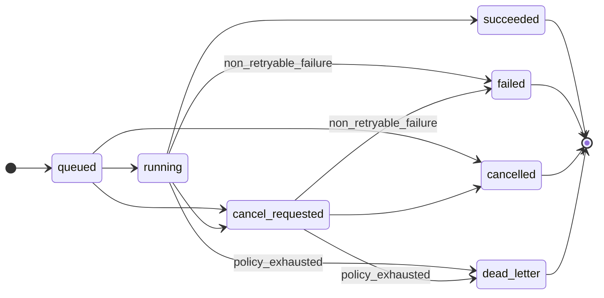
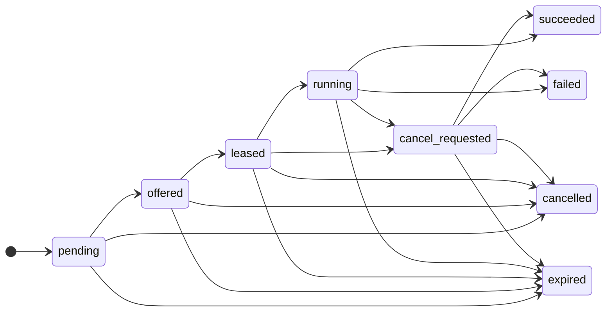
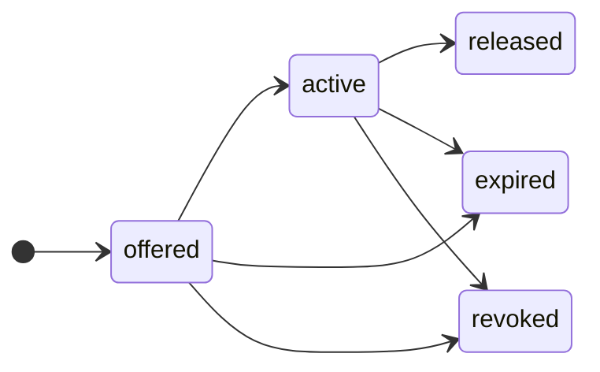
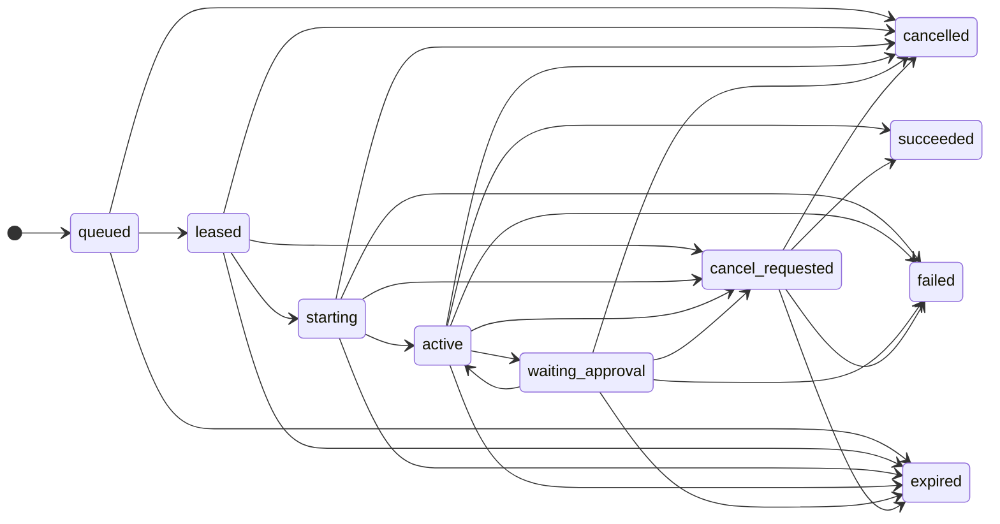
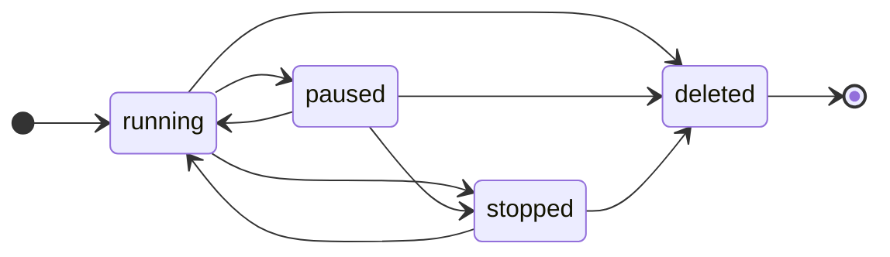
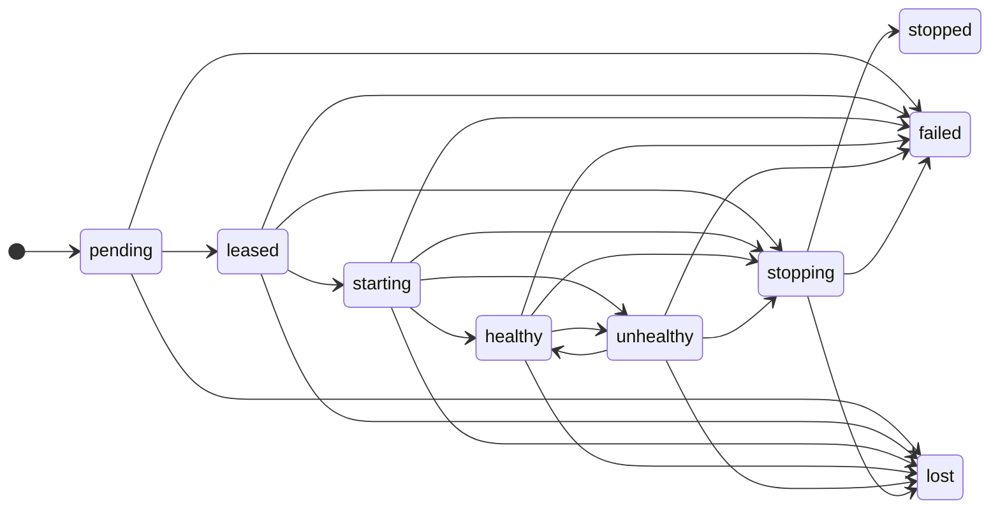

# Distributed Execution Lifecycles

Canonical workload and transition semantics for the cloud control plane's `batch`,
`browser_session`, and `service` workloads. This record is the human-readable peer of the
machine-readable authority [`distributed-execution-lifecycles.json`](distributed-execution-lifecycles.json);
the two must agree on every state set, allowed edge, guarded-edge reason, terminal set, and
forbidden cross-lifecycle edge. `scripts/check-distributed-execution-foundation.mjs` parses both
files, validates graph reachability and terminal immutability, and fails on any JSON↔Markdown
drift. String-fragment presence alone is never sufficient evidence for this contract. See
[Decision #121](decisions.md).

## Shared identity and ownership

Every execution is identified by Organization, Company, discriminated execution source, job,
attempt, lease, and sandbox/service-instance identity. Only `task_run` requires run and issue
identity; Commander, crew, one-shot, browser, and service sources use their own typed provenance
and opaque principal IDs. Delivery is at least once. Only the active lease fence may emit accepted
events, fetch secrets, commit artifacts, or complete an attempt.

The `job`, `attempt`, and `lease` delivery machines are distinct. Browser-session state and
service desired/instance state are separate again: a generic attempt terminal event can never
encode a service-instance `healthy`, `stopped`, or `lost` value, and a lease status can never
complete a job directly. The forbidden cross-lifecycle transitions below make that separation
machine-checkable.

## Job lifecycle

Statuses: `queued`, `running`, `cancel_requested`, `succeeded`, `failed`, `cancelled`, `dead_letter`.

Allowed transitions:

| From | To |
|---|---|
| `queued` | `running`, `cancel_requested`, `cancelled` |
| `running` | `cancel_requested`, `succeeded`, `failed` (`non_retryable_failure`), `dead_letter` (`policy_exhausted`) |
| `cancel_requested` | `cancelled`, `failed` (`non_retryable_failure`), `dead_letter` (`policy_exhausted`) |

`dead_letter` means retry/reconciliation policy is exhausted and is reachable only with the
explicit `policy_exhausted` reason; `failed` is a non-retryable aggregate failure and is reachable
only with the explicit `non_retryable_failure` reason. No context-free predicate may bypass those
guards. Terminal states (`succeeded`, `failed`, `cancelled`, `dead_letter`) are immutable. While
retry remains possible, the job stays `running`.

## Attempt lifecycle

Statuses: `pending`, `offered`, `leased`, `running`, `cancel_requested`, `succeeded`, `failed`,
`cancelled`, `expired`. Retry creates a new increasing `pending` attempt; it never reopens a
terminal attempt.

Allowed transitions:

| From | To |
|---|---|
| `pending` | `offered`, `cancelled`, `expired` |
| `offered` | `leased`, `expired`, `cancelled` |
| `leased` | `running`, `cancel_requested`, `expired`, `cancelled` |
| `running` | `cancel_requested`, `succeeded`, `failed`, `expired` |
| `cancel_requested` | `cancelled`, `succeeded`, `failed`, `expired` |

Attempt terminals (`succeeded`, `failed`, `cancelled`, `expired`) are immutable. Service
`healthy`, `stopped`, and `lost` are service-instance states, not generic attempt terminals.

## Lease lifecycle

Statuses: `offered`, `active`, `released`, `expired`, `revoked`. A replacement creates a new lease
and fence; a renewal extends only the matching active lease.

Allowed transitions:

| From | To |
|---|---|
| `offered` | `active`, `expired`, `revoked` |
| `active` | `released`, `expired`, `revoked` |

Lease terminals (`released`, `expired`, `revoked`) are immutable.

## Batch lifecycle

Batch workload completion is represented by its attempt terminal plus declared patch/artifact
output. It does not add another delivery state machine. A `batch` job retries a new attempt from a
declared base snapshot; there is no separate batch status table.

## Browser-session lifecycle

Statuses: `queued`, `leased`, `starting`, `active`, `waiting_approval`, `cancel_requested`,
`succeeded`, `failed`, `cancelled`, `expired`.

Allowed transitions:

| From | To |
|---|---|
| `queued` | `leased`, `cancelled`, `expired` |
| `leased` | `starting`, `cancel_requested`, `cancelled`, `expired` |
| `starting` | `active`, `cancel_requested`, `failed`, `cancelled`, `expired` |
| `active` | `waiting_approval`, `cancel_requested`, `succeeded`, `failed`, `cancelled`, `expired` |
| `waiting_approval` | `active`, `cancel_requested`, `failed`, `cancelled`, `expired` |
| `cancel_requested` | `cancelled`, `succeeded`, `failed`, `expired` |

`active` and `waiting_approval` may transition between each other. Starting or active sessions may
be canceled, fail, expire, or succeed. Cookies, storage state, downloads, screenshots, trace, and
video are job-scoped sensitive artifacts with explicit retention. Retry starts clean unless an
approved checkpoint is declared. Browser-session terminals (`succeeded`, `failed`, `cancelled`,
`expired`) are immutable.

## Service desired-state lifecycle

Desired states: `running`, `paused`, `stopped`, `deleted`. `deleted` is terminal.

Allowed transitions:

| From | To |
|---|---|
| `running` | `paused`, `stopped`, `deleted` |
| `paused` | `running`, `stopped`, `deleted` |
| `stopped` | `running`, `deleted` |

A service update creates an immutable increasing generation; it does not mutate a running
generation in place. Desired replicas are limited to one in the first release.

## Service-instance lifecycle

Statuses: `pending`, `leased`, `starting`, `healthy`, `unhealthy`, `stopping`, `stopped`, `failed`,
`lost`.

Allowed transitions:

| From | To |
|---|---|
| `pending` | `leased`, `failed`, `lost` |
| `leased` | `starting`, `stopping`, `failed`, `lost` |
| `starting` | `healthy`, `unhealthy`, `stopping`, `failed`, `lost` |
| `healthy` | `unhealthy`, `stopping`, `failed`, `lost` |
| `unhealthy` | `healthy`, `stopping`, `failed`, `lost` |
| `stopping` | `stopped`, `failed`, `lost` |

The reconciler creates or replaces instances to converge on desired state. Health events never
renew a lease. A replacement instance uses a new attempt and fence. No two generations may perform
external effects simultaneously unless the service definition explicitly opts into overlap in a
later design. Service-instance terminals (`stopped`, `failed`, `lost`) are immutable.

## Forbidden cross-lifecycle transitions

These edges are explicitly forbidden and are recorded in the JSON authority so a checker can reject
any attempt to collapse the distinct machines. Each cell is `lifecycle:state`.

| From | To |
|---|---|
| `attempt:running` | `serviceInstance:healthy` |
| `attempt:running` | `serviceInstance:stopped` |
| `attempt:running` | `serviceInstance:lost` |
| `serviceInstance:lost` | `attempt:failed` |
| `lease:active` | `job:succeeded` |
| `lease:revoked` | `job:failed` |
| `lease:revoked` | `job:dead_letter` |
| `job:running` | `attempt:succeeded` |
| `attempt:succeeded` | `job:succeeded` |

A generic attempt terminal event cannot encode service-instance health, stop, or loss; the
reconciler replaces a lost instance with a new attempt and fence. A lease status never completes or
fails a job directly — only the fenced attempt terminal result contributes to aggregate job
completion, and `dead_letter` is reached only through exhausted job retry/reconciliation policy.
The job and attempt machines are distinct; neither auto-mutates the other.

## Lifecycle diagrams

Job delivery machine. `failed` and `dead_letter` are guarded edges; no other predicate reaches them.

Attempt machine. Retry allocates the next increasing `pending` attempt; a terminal attempt is never
reopened.

Lease machine. A replacement lease is a new node with a new fence; the diagram never re-enters a
terminal lease.

Browser-session machine.

Service desired-state machine. `deleted` is the only terminal desired state.

Service-instance machine. The reconciler converges each running instance toward the desired state
and replaces failed or lost instances with a new attempt and fence.

## Worked journeys

### Batch example

1. A `task_run` source submits an immutable `batch` job; the job is `queued` and attempt 1 is
   `pending`.
2. A compatible worker is `offered` attempt 1, ACKs, and takes an `active` lease with a fresh
   fence; attempt 1 → `leased` → `running`, job → `running`.
3. The worker streams sequenced events under the fence and, on success, commits a patch/artifact
   against a declared base hash. Attempt 1 → `succeeded`; the aggregate job → `succeeded`.
4. On a retryable crash, attempt 1 → `failed` (attempt-local) or `expired`; the scheduler allocates
   attempt 2 (`pending`) from the declared base snapshot while the job stays `running`. Only when
   retry policy is exhausted does the job move to `dead_letter` (`policy_exhausted`); a
   non-retryable aggregate failure is `failed` (`non_retryable_failure`).

### Browser-session example

1. A `browser_request` source submits a `browser_session` job; the session is `queued`.
2. The session is `leased`, `starting`, then `active`. A product approval pauses it in
   `waiting_approval`; approval returns it to `active`.
3. Screenshots, trace, video, cookies, and storage state are job-scoped sensitive artifacts written
   with explicit retention under the active fence.
4. On success the session → `succeeded`. Retry starts from a clean session unless an approved
   checkpoint is declared; a canceled session reaches `cancelled` and a lease-loss orphan upload
   goes only to quarantine.

### Service example

1. A `service_reconcile` source creates a service with desired state `running`, generation 1.
2. The reconciler places instance A: `pending` → `leased` → `starting` → `healthy`. Health events
   never renew the lease.
3. A generation bump creates an immutable generation 2; the reconciler starts instance B under a new
   attempt and fence and stops instance A (`stopping` → `stopped`). No two generations perform
   external effects simultaneously.
4. A provider interruption drives instance B → `lost`; the reconciler replaces it with instance C
   (new attempt/fence), resuming from an approved checkpoint or replayable input rather than
   claiming one uninterrupted process. Desired state `deleted` is terminal and stops reconciliation.

## Deadlines and provider interruption

- **Offer/ACK deadline.** Before ACK, an expired offer returns the job to eligibility; the attempt
  offer moves to `expired` and the job stays `queued`.
- **Cancellation deadline.** After ACK, cancellation is requested durably and observed through lease
  renewal or polling. Batch and browser attempts eventually terminate after cancellation; services
  use graceful stop followed by a bounded force-kill deadline.
- **Fence and lease loss.** Lease loss immediately forbids secrets, artifact commit, completion, and
  new remote effects. A replacement lease always receives a new unpredictable fence; the control
  plane rejects stale fences even if a late worker finished computation.
- **Quarantine.** A late worker may upload an orphan patch or artifact only to the separate
  device-authenticated quarantine prefix; it can never update the authoritative run or become an
  approved checkpoint automatically.
- **Cleanup deadline.** Provider cleanup authority is monotonic and deadline-bounded: it lists,
  inspects, and cancels/kills/destroys matching resources and reconciles idempotently, and it can
  never restore effect authority.
- **E2B pause/resume (or replacement).** E2B continuous-runtime limits are an accepted product
  constraint, not a lifecycle change. A service may span multiple fenced instances through approved
  checkpoints or replayable input across provider pause/resume or sandbox replacement; the design
  never claims one uninterrupted E2B process across the wait. A `park_run` human-wait releases the
  active sandbox lease and ends the current attempt, resuming as a new fenced attempt rather than
  holding a compute-bearing parked state.

## Cancellation and lease-loss rules

- Before ACK, an expired offer returns the job to eligibility.
- After ACK, cancellation is requested durably and observed through lease renewal or polling.
- Lease loss immediately forbids secrets, artifact commit, completion, and new remote effects.
- Lease loss preserves only the monotonic provider cleanup authority: matching-resource
  list/inspect with a management-only safe projection and cancel/kill/destroy/idempotent
  reconciliation remain available, while create/execute/resume/checkpoint/egress and
  command/env/log/secret/customer-byte inspection remain forbidden. This cleanup authority is
  resource/ownership/generation/deadline-bound and can only reduce or terminate work; it can never
  reveal a foreign resource or open egress.
- A late worker may upload an orphan patch or artifact only to quarantine; it cannot update the
  authoritative run.
- Batch and browser attempts eventually terminate after cancellation.
- Services use graceful stop followed by a bounded force-kill deadline.

## Legacy concept mapping

Current AoA execution concepts map onto the new job/attempt/lease/workload model as migration
inputs. The new machines own delivery; the legacy concepts remain product provenance and are frozen
by FND-007's crosswalk.

| Current concept | New lifecycle concept | Notes |
|---|---|---|
| Heartbeat run (`heartbeat_runs`) | `batch` job + attempt + lease | Push-based org-agent wakeup becomes an immutable job with a fenced attempt; the run is one attempt, not the source of truth. |
| Commander turn | `batch` job from a `commander_turn` source | Warm per-conversation E2B lease (Decision #120) is a placement/lease detail; the turn is a fenced attempt with opaque principal identity, no `runId`/`issueId`. |
| Crew run (`kind='aoa'`) | `batch` job from a `crew_run` source | Crew dispatch becomes a job; loopback/summary side effects are post-terminal control-plane projections, not worker writes. |
| One-shot extraction/compaction/readiness | `batch` job from a `one_shot` source | Discussion/debrief/file-import CLI extraction becomes a bounded job; principal ID is opaque. |
| Atomic issue checkout (`SELECT FOR UPDATE NO WAIT`) | Attempt lease + fence | Single-assignee authority becomes the single active lease; a replacement lease receives a new fence. |
| Ask Human / `park_run` wait (`work_questions`) | Attempt release + new fenced attempt | The human wait ends the current attempt and releases its lease; resume is a new fenced attempt, not a compute-holding parked state. |
| Execution workspace (`execution_workspaces`) | Declared base snapshot + patch/artifact output | Workspace promotion becomes a fenced artifact commit; conflicting late output is quarantined. |
| Browser automation session | `browser_session` job + service-scoped artifacts | Cookies, storage state, screenshots, trace, and video are job-scoped sensitive artifacts with explicit retention. |
| Long-running supervised agent | `service` desired state + reconciled instances | A service is desired state plus generation and instance records, not an infinitely renewed batch job. |
