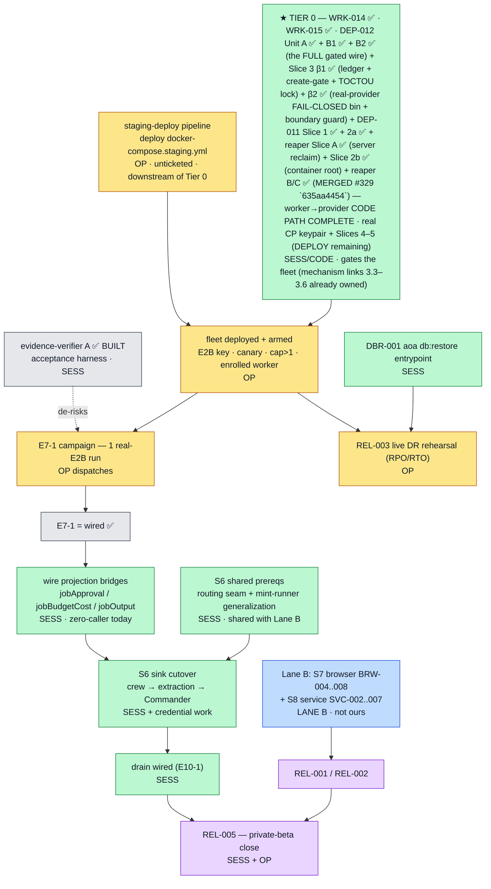

# GO-BOOK — the re-platform, sprint by sprint

**This is the only document you need to start a session.** Hand it to any session, name a
sprint, and that session runs the sprint end to end. Written 2026-08-25 (Sprint 0), against
branch `docs/replatform-program`, worktree `C:\e3`.

**Read §1 and §2 once. Then jump to your sprint in §4** (Sprints 1-3 have full plans linked in §3.1).

> **★ In a hurry? Go straight to §9.** It holds a **copy-paste prompt per sprint** — self-contained,
> and each one ends by updating this document and the registers, so the next session starts from
> what is true rather than from what was true when its plan was written.
>
> **CI is green.** As of 2026-08-27 (PR #327) `verify` is a 4-shard matrix and §2.0 is RESOLVED —
> `ci-required` passes. A red shard is now a REAL failure to own, not an inherited timeout. (The
> §3.1 rows below say "inherits the §2.0 red" as an accurate record of each sprint's ship-time
> state; that condition is now retired.)

---

## 1. What we are building, and where it actually stands

A founder runs agents — coding, browser, long-running services. Those agents execute in an
isolated place: an **E2B cloud sandbox**, the founder's **own desktop**, or **any device
connected to the account**. Many devices connect to one account; each becomes a *worker*; the
control plane routes each job to a worker allowed to run it.

**The engine is built. It is not connected to the controls.**

The shipped worker daemon starts, reports healthy, and never asks for work. Three wires are
open, by deliberate design:

1. no **sandbox provider** is injected (and the daemon may not construct one — E4-D01),
2. `AOA_WORKER_DISPATCH_ENABLED` is **default-off**,
3. it cannot yet read **its own self-model** (no session is threaded to the read).

Consequence, stated plainly: **no agent has ever run on a distributed worker.** Everything
that works today runs the legacy in-process path. That is why 17 epic gate clauses name a
capability whose production path has **zero callers** — the audit's central finding.

**The good news:** the foundation is real and honest. The wire protocol, tenant isolation
(forced RLS, non-owner role), job control, and the D1 harness are genuinely proven. Every
ticket doc told the truth about what it did and did not do. What over-claimed was the
aggregation — "epic complete" counted tickets shipped, not capability delivered.

### The one-paragraph status

105 plan nodes · 88 with ticket files · 17 backlog. Of ~70 gate clauses: ~19 genuinely
proven, ~17 proven weakly, ~17 not proven, **17 unprovable (no caller)**. `ci-required` is
green-capable again as of Sprint 0. The distance from here to "an agent runs on a real
distributed worker, proven once" is **Sprints 1–5**.

### ★ CURRENT STATUS & forward sequence (reconciled 2026-08-28)

The paragraph above is the **pre-Sprint-1 census**. After Sprints 1–5b + S6/S7-1/S9-1/S9-2 (ground-truth
reconciliation of E7–E11): **the distributed-execution mechanism is BUILT and proven for coding
agents.** What remains is breadth (other workload classes), two owed live-infra runs, and a set of
guards/residuals.

- **✅ DONE (verified):** E0–E6 (the whole mechanism — wire protocol, tenant kernel, job control, worker
  daemon, workspaces/secrets, deploy harness); **E7** CLI-001..007 (code-complete); **E10-desktop**
  DSK-001..004; **E10 realtime foundation + drain** (MIG-002/003/008/shadow/009); **E8** Lane-B features
  (BRW-001/002/003*) + BRW-hostspawn-gate; **E9** SVC-001 (storage half only); **E11** REL-004(+C/D) /
  REL-FOUNDATION-GATE / REL-003 core / GATE-clause-3-rollback / foundation-suite-unrun. Sprints S1–S5b,
  S6, S7-1, S9-1, S9-2, S9-3.
- **🟡 OWED — built, needs a live-infra run (OPERATOR, not session):** **E7-1** staging-canary campaign
  (real-E2B distributed coding journey; code-complete, blocked only on the staging fleet being
  deployed) → promotes E7-1 `unwired`→`wired`; **REL-003** DR staging rehearsal (measured RPO/RTO;
  E11-F002 — the `aoa db:restore` entrypoint half is session-buildable).
- **🚫 BLOCKED (absent features/deps):** REL-001 (BRW-006/S7 + SVC-007/S8), REL-002 (SVC-006/S8),
  REL-005 (all REL + kill-switch write path); **E10 cutover sinks** (MIG-005/006/007 — need the routing
  seam + mint generalization, E10-F001); **E9 SVC-002..007** (service dispatch unreachable); **E8-1
  governed browser path** + BRW-004..008 (Lane B).
- **🔨 SESSION FRONTIER — TIER 0 + residuals.** The current build front is **TIER 0** (the forward
  sequence above): **WRK-014 ✅ BUILT-INERT** (container identity — the hard gate; shipped provably-correct-
  but-unwired, the CMD/compose untouched) and **WRK-015 ✅ SHIPPED** (the POSIX enrolment-input validator —
  `assertLocalAbsolutePath` is now platform-aware, so the container-path crash-loop hazard is removed and a
  real container can present a `/worker/...` ticket path). The one remaining TIER-0 code link is
  **adapter-manager DEP-012/DEP-011** — of which **DEP-012 Slice 1 · Unit A ✅ SHIPPED** (the create+execute
  **wire plumbing**: `packages/provider-wire` codec+driver + `packages/adapter-manager` server, proven
  driver↔server over the key-less mock, 17 tests / 6-of-6 mutants; worker-daemon untouched —
  [`DEP-012-unit-a-result.md`](./epics/E6-deployment-test-harness/tickets/DEP-012-unit-a-result.md)) →
  **Unit B1 ✅ SHIPPED** (the signed-capability **`execute` OWNERSHIP GATE** — `execute` is now gated OVER
  THE WIRE: a signed owned-labels capability [ordered TUPLE, not a hash] + a fail-closed Ed25519 verify + the
  AM-local field-wise owned-check MIRRORING `#requireOwned`, with both oracle-collapse arms uniform; this
  closes the **cross-tenant code-execution** hole Unit A left open; 33 new tests / 11 clauses mutation-killed;
  worker-daemon + `cleanup-authority.ts` untouched; 4-reviewer+skeptic pass found one LOW fail-closed gap
  [non-finite `expiresAt`], fixed —
  [`DEP-012-unit-b1-result.md`](./epics/E6-deployment-test-harness/tickets/DEP-012-unit-b1-result.md)) →
  **Unit B2 ✅ SHIPPED** (the **rest of the gated wire** — the 4 teardown ops
  `cancel/kill/destroy/reconcile_cleanup` gated + `inspect`/`list` redacted to `RedactedResourceProjection`
  server-side, so **NO** raw `InspectResult`/env/secrets ever crosses; B1's `gateExecute` generalized to
  `gateOwnedOp`, its inspect-catch now a FAITHFUL `#requireOwned` mirror [transients SURFACED, not collapsed —
  correcting a teardown sandbox-leak]; EXHAUSTIVE fail-closed routing [the 5 new ops 404 on a keyless server,
  never raw]; the driver's port-satisfying `inspect`/`list` synthesis; on `v:1`; 29 new tests / 12 clauses
  mutation-killed; worker-daemon + `cleanup-authority.ts` + supervisor untouched; 4-reviewer+skeptic pass found
  one LOW cross-tenant `nextPageToken` cursor leak, fixed [`list` now exposes no cursor, mirroring
  `CleanupAuthority.list`] —
  [`DEP-012-unit-b2-result.md`](./epics/E6-deployment-test-harness/tickets/DEP-012-unit-b2-result.md)) →
  **Slice 3 · Wave β1 ✅ SHIPPED** (the durable **identity-namespaced idempotency ledger** + **create-gating**
  + the **TOCTOU lock**, on the MOCK — a per-key write-once CAS ledger [temp→fsync→`link()`→PARENT-DIR fsync,
  the WRK-014 idiom] keyed by an UNAMBIGUOUS ordered-tuple identity [NOT `hashResourceLabels`' space-join],
  which FORCES `create` into the gated ops [verify → `labelsEqual(spec, cap.ownedLabels)` → the ledger →
  `provider.create` with a STRIPPED key, so the provider's key-alone map can't echo tenant A to B]; a
  per-(identity,key) mutex + check-after-create against double-provision; an AM-local per-`sandboxId` TOCTOU
  lock across inspect→dispatch; 28 new tests / 7 mutations killed [the strip + the space-join collision + the
  mutex + the check-after-create all isolated]; **worker-daemon + `cleanup-authority.ts` untouched**;
  4-reviewer+skeptic pass found 0 HIGH [leak A→B fully refuted], one LOW corrupt-read orphan, fixed —
  [`DEP-012-wave-beta1-result.md`](./epics/E6-deployment-test-harness/tickets/DEP-012-wave-beta1-result.md)) →
  **Slice 3 · Wave β2 ✅ SHIPPED** (`8ba98ed7f`, independently verified — the real-provider **composition-root
  bin** [`packages/adapter-manager/src/bin/adapter-manager.ts`: a literal dynamic import of the BARE barrel →
  `new E2bSandboxProvider({transport: createRealE2bTransport()})`; the **FAIL-CLOSED sole guard** on the OPTIONAL
  `controlPlanePublicKey?` — a missing/empty/unreadable/unparseable/non-ed25519/private key REFUSES with
  `createProviderServer` NEVER called; `.listen(process.env.PORT)`], the new **`adapter-manager-boundary.mjs`**
  guard [subpath-aware default-deny allow-list, provider confined PREFIX-based to the ONE bin path, `e2b`
  default-denied EVERYWHERE, `E2B_API_KEY` banned over RAW source, exact-set deps sans `e2b`; 5-part registration
  + a test-execution-census entry], and the **devDep→dep** move; conformance **INHERITED** [the mock suite is
  green + the operator keyed HOSTED-provider lane exists — NOT wire-end-to-end]; 98/98 AM vitest + 18/18 guard
  self-test + 15/15 bin fail-closed test; a build-caught `check-gate-clause-wiring` count 2→4 fix kept
  E7-1-coding-journey honestly `unwired`). →
  **DEP-011 Slice 1 ✅ SHIPPED INERT** (`c3d26657d`+`0ff947718`, independently verified — the server-side
  owned-labels-capability **MINT** in the `resolveExecutionSecret` `resolved ∧ sandbox_local_only` reply:
  a fresh-7-field label literal [no `{...fenceIdentity}` spread — the fence token stays out], the positive
  mint gate, a lease-clamped `expiresAt`, behind an INJECTED control-plane key [undefined in `app.ts` ⇒ the
  reply is byte-identical ⇒ inert]. A pure `@armyofagents/provider-capability` leaf was extracted so the
  control-plane image imports the mint without the worker/e2b closure; provider-wire re-exports it [one shared
  canonical, mint↔verify parity]. 6/6 mutation kills; E6-F003 stays OPEN + owned [no result doc]). →
  **DEP-011 Slice 2a ✅ SHIPPED INERT** (`28e544a80`+`93501d1c1`, independently verified — the WORKER consumes the
  capability: a per-run networked provider FACTORY (`makeRunProvider`) + capability threading [a LOCAL structural
  type + a vendored guard, dedup-on-`ownedLabels`], NULL-OBJECT late-binding [no-op authorities at `buildRun`, the
  real driver rebuilt post-redemption], and the HONEST-ORPHAN cleanup [`convergeNetworked` is clock-first with a
  skew-safe RNA re-check and records a DISTINCT `orphaned` metric — NEVER masking a live-sandbox strand as
  `success`, the WRK-004 leak the review caught], plus the #104 credential crossing. Teardown fork → **Option A
  (server owns reaping)**; the `(compose)` cleanup variant ABSORBED into 2a. Deviations: a worker-daemon test
  devDep'ing its own consumers = a `pnpm -r build` order cycle → the real gated crossing moved to an
  adapter-manager `.test.ts`; metrics `outcome` is a CLOSED set [register `orphaned`]).
  **DEP-011 reaper Slice A ✅ + Slice 2b ✅ SHIPPED INERT** (`35ac5f29d` + `45d930066`, built CONCURRENTLY,
  independently verified) — **reaper Slice A** = the pure `reconcileReaper` in the adapter-manager (Option-A
  reclamation: a POSITIVE-confirmed-dead INJECTED oracle + a structural pre-filter + snapshot-first + per-target
  containment + counts-not-metric — it reclaims ONLY a confirmed orphan, NEVER mass-kills a live sandbox); **Slice
  2b** = the container networked-host root (`makeRunProvider` threaded through the bin at 4 sites + a new LEAF
  `worker-networked-host` pkg; the F-cast fix REBUILDS the cap from the pinned consts — property-narrowing doesn't
  re-type a single-interface object). **The worker→provider CODE PATH is now COMPLETE** (mint → worker-consume →
  dispatch through the AM → honest-orphan → server-reaper).
  **DEP-011 reaper Slices B1+B2+C ✅ VERIFIED CI-GREEN** (`1d8aab688`/`f7e47f335`/`e77e7499b` + fixes
  `09cc68d2a`/`3d2262b84`, run `33293683375` on tip `3d2262b84`, verify(1-4)+e2e RAN not skip-green; independently
  verified against the PR-head blobs, not the report) — **B1** the CP read-only lease-truth endpoint (double-gated
  behind `AOA_ADAPTER_MANAGER_TRUTH_ROUTE_ENABLED` + a monotonic-columns-only classifier reading the lease ROW) +
  **B2** the AM outbound PULL client (positive-allow-list, res.ok-first, AbortSignal.timeout, never-rejects,
  iterate-own-summaries) + **C** the self-rescheduling contained loop (setTimeout + re-entrancy guard + `.catch`,
  refuse-loud, strict-parse) + `/metrics`. **★ MERGED into `docs/replatform-program` (merge commit `635aa4454`,
  2026-08-30) via PR [#329](https://github.com/MeteoriteLabs/AoA/pull/329), the FIRST PR-based slice** (prior slices
  committed DIRECT; all four SHAs preserved, merge not squash; one comment-only follow-up `7485139df` fixed a
  now-stale reaper comment the Codex P2 gestured at — its substantive "never wired" claim was B1-only stale).
  **Still unbuilt (DEPLOY only):** the real **control-plane KEYPAIR** + **Slice 5** (deploy = the AM Docker image +
  the compose control-plane-key env + mTLS) + re-mint-on-renewal (deferred). WRK-015's Part 2 (a CI-exercised d1 first-enrol proof) **SPLIT to
  WRK-017** at its own Step-0 gate — the d1 harness has NO worker-enrol flow and adding one is large
  (platform-scope seed + ticket-file delivery + a multi-phase bring-up; see WRK-015-result.md); WRK-017 is
  NOT on the E7-1 critical path (the campaign enrols one worker at campaign time). The mechanism links
  (session/hello/self-model/loop) are already owned. Beyond
  Tier 0, the
  guard/register-hardening layer is SOLID and mostly shipped: **E4-F013 ✅** (ownership-guard
  successor chain + DBR-001 stub) and **foundation-suite-unrun ✅** (S9-3, the checker's own suite now
  runs in `policy`) landed. The two remaining guard candidates did **NOT survive scoping**: **E9
  gate-clause guard is PREMATURE** (no real service-execution symbol to track until SVC-002 lands — the
  batch-only capability is a constant and the routing symbols are wired-for-batch, so a clause would be
  vacuous) and **E4-F015 is OBVIATED** (the `DispatchRefusalReason` union is already compile-time-pinned
  by the total `DISPATCH_REFUSAL_MESSAGES` Record + `tsc`; a runtime guard would just duplicate the
  compiler) — **resolved 2026-08-28**. The **E10 keystone crux is SETTLED but the cutover is BLOCKED**: E10-F001 corrected
  2026-08-28 — crew RIDES the mint (iff a v1 provider: anthropic/openai, not google/opencode), so crew
  is the cleanest first sink; but the crew *cutover* (the routing-seam + the sink flip) needs the
  zero-caller projection bridges + E7-1, so its seam-decision is inert-until-fleet and not worth
  building alone (see `qa/2026-08-28-e10-keystone-scoping.md`). **What's left session-buildable is LOW
  value:** the cheap doc closures (E6-F005 / E6-F007 / E4-F014).

**★ CORRECTION (2026-08-28, C0 review + WAVE-4 STEP-0 RECONCILIATION — verified against source):** the
frontier is **NOT dry** and E7-1 is **NOT one operator act away** — but the chain is **materially shorter
than the "seven links, four unowned" framing**, and that framing is now retired. `WAVE-4-RESEQUENCE.md`
(the 7-link map) is a **snapshot dated 2026-08-23**; Sprints **2.5 / 2.75 / 3 landed 2026-08-25/26,
AFTER it**, and they own four of its links. STEP 0 (fix the tracking + re-derive every no-owner claim
from the current tree) is **DONE** — [`qa/2026-08-28-worker-dispatch-chain-reconciled.md`](./qa/2026-08-28-worker-dispatch-chain-reconciled.md).
Reconciled verdicts, each cited to source in that doc:

- **Now OWNED** (moved since the snapshot, composed behind the default-off flag, real exercise owed to
  Sprint 5): **3.3 session acquisition** (WRK-010 slice 2 — `onSessionMinted` sink + device-proof
  renewal), **3.4 matchable hello** (WRK-011 — real `self/hello` route + provisioned matchable hello +
  the `profile_snapshot` update channel), **3.5 self-model read** (WRK-008 slice 1 server +
  slice 2b daemon `readWorkerSelfModel`), **3.6 loop composition** (WRK-008 slice 2b —
  `composeDispatchRuntime.start()` calls `pollLoop.run()`; `bin/worker-daemon.ts:531` — WAVE-4's "no
  start seam" is stale).
- **STILL unowned / unbuilt** — the true TIER-0 remainder as of the reconciliation, **three links**: **3.1
  container identity** (`MountedSecretKeyStore` has zero prod constructors; a container never enrols) → ticket
  **WRK-014 ✅ SHIPPED inert**; **3.2 POSIX enrolment input** (`assertLocalAbsolutePath` was Windows-only) →
  ticket **WRK-015 ✅ SHIPPED** (the validator is now platform-aware; the d1 first-enrol proof split to
  WRK-017); **3.7 provider transport** (`adapter-manager` declared in the staging compose, no build produces
  it) → new server ticket **DEP-012**, with **DEP-011** (the worker→provider wire, E6-F003) repointed onto it.
  **DEP-012 Slice 1 is PLUMBING + the FULL gated wire: Unit A ✅ (create+execute wire) + Unit B1 ✅
  (`execute`'s signed-capability server-side ownership gate — cross-tenant exec closed) + Unit B2 ✅ (the 4
  teardown ops gated + `inspect`/`list` redacted server-side — the gated wire is COMPLETE; no raw
  `InspectResult`/env/secrets crosses, exhaustive fail-closed routing); and Slice 3 · Wave β1 ✅ (the durable
  identity-namespaced idempotency ledger + create-gating + the TOCTOU lock, on the mock — the create-time
  cross-tenant/replay leak + double-provision closed; leak A→B skeptic-refuted); and Slice 3 · Wave β2 ✅ (the
  real-provider FAIL-CLOSED composition-root bin + the subpath-aware `adapter-manager-boundary.mjs` guard +
  devDep→dep; conformance inherited — verified 98/98 + 18/18 + 15/15).**
  Remaining on 3.7: **DEP-011 Slice 1 ✅ SHIPPED** (the server-side owned-labels-capability mint, inert;
  `c3d26657d`+`0ff947718`; a `provider-capability` leaf extracted) → the real control-plane KEYPAIR + DEP-011
  Slice 2 (worker composition root + credential crossing) + Slice 3 (the `(compose)` no-op/trust
  `CleanupAuthority` variant + the reconcile guard B2 recorded) + Slices 4–5 (credential crossing; deploy = AM
  Docker image + compose control-plane-key env) — still unbuilt.

So **TIER 0 is buildable code — WRK-014 + WRK-015 + DEP-012/DEP-011 — then the operator deploy**, not a
mostly-unowned multi-link programme. The mechanism (session/hello/self-model/loop) is built and waiting.
Reconciled order: **(0) fix tracking + reconcile [DONE] → (1) provider-topology contract [DONE —
`qa/2026-08-28-adapter-manager-scope.md` §8, credential=(i)] → (2) WRK-014 container identity (the hard
gate) → (3) WRK-015 POSIX input → (4) DEP-012 adapter-manager + DEP-011 wire → the composed links (3.3–3.6)
get their first REAL exercise = Sprint 5 / E7-1 on real E2B → C0 deploy → campaign → verify A.** The
"operator + Lane B / one operator act" framing below is superseded. Full analysis:
`qa/2026-08-28-worker-dispatch-chain-reconciled.md` (the reconciliation) +
`qa/2026-08-28-adapter-manager-scope.md` §8/§9 (the settled provider contract) +
`qa/2026-08-28-c0-staging-deploy-scope.md` §0.

**Forward sequence (reconciled 2026-08-28 — the honest order):**
1. **★ TIER 0 (session/code — the current build front):** **WRK-014 container identity (the hard gate) —
   ✅ BUILT-INERT** (the `file_record` custody mode + `FileRecordStore` + container host, shipped unwired;
   CMD/compose untouched) → **WRK-015 POSIX input ✅ SHIPPED** (the platform-aware validator; the d1
   first-enrol proof split to **WRK-017**, off the critical path) → **DEP-012 adapter-manager: Slice 1 Units
   A + B1 + B2 ✅ + Slice 3 · Wave β1 ✅ + Slice 3 · Wave β2 ✅ SHIPPED (the FULL server-side gated wire —
   create/execute/teardown/inspect/list — PLUS the durable idempotency ledger + create-gating + the TOCTOU lock,
   on the mock; PLUS the real-provider FAIL-CLOSED composition-root bin + the subpath-aware boundary guard +
   devDep→dep, conformance inherited — verified 98/98+18/18+15/15) + DEP-011 Slice 1 ✅ SHIPPED (the server-side
   owned-labels-capability MINT, inert; a `provider-capability` leaf extracted; independently verified) + DEP-011
   Slice 2a ✅ SHIPPED (the worker per-run networked factory + capability threading + null-object late-binding +
   the honest-orphan cleanup [Option A]; independently verified) + reaper Slice A ✅ (the pure `reconcileReaper`,
   Option-A server reclamation) + Slice 2b ✅ (the container networked-host root) — the worker→provider CODE PATH
   is COMPLETE incl. reaper Slice B/C ✅ (MERGED `635aa4454`) and **DEP-012 Slice 4+5 ✅ MERGED `07ed2cc42`**. ★ **A 2026-08-31 pre-deploy investigation DISPROVED the earlier claim that session code was finished** — it found FOUR more session-code blockers (no lease could EVER be offered; no shipped worker image could construct a provider; a 60s execution ceiling; a silently-unset mint key). Those are **Unit 1 ✅ MERGED `b6e02a478` (PR #331)** → **Unit 1.5 ✅ MERGED `42c124258` (PR #332)** — a live GO/NO-GO probe then returned NO-GO because the rollout hook never reached the EXECUTING heartbeat instance; Unit 1.5 is the module-level port that fixes it (§9e). Together they make a real distributed run POSSIBLE. **Unit 2 (CAPABILITY) is filed as E7-F003, owned by CLI-008, and only its Unit A (the JUDGE) is built** — the sandbox still has no MCP tool surface, no instructions bundle, no workspace and no output capture. So the ball is the operator's C0 (see §the campaign preconditions), and a green E7-1 proves the MECHANISM, not agent capability. ★ **That caveat is no longer prose.** Since CLI-008 Unit A (2026-09-02) the acceptance verifier computes it: `capabilityProven` is a second verdict beside `ok`, and every PASS prints `CAPABILITY: NOT PROVEN` with both produced-output counts. It is **false on every real run today** and stays false until CLI-008 Unit F builds the return path; `--require-capability` is the flag that enforces it then, off by default until it can be met.** ★ **BLOCKER E (§9e.2) holds the DECISION shut and is THREE defects, not two. Units 1.6+1.7 ✅ MERGED `c7ead3a73` (PR [#333](https://github.com/MeteoriteLabs/AoA/pull/333)) fixed E-1 ONLY** (the preflight's read authority, via THREE owner-owned organization-bound `SECURITY DEFINER` evidence functions — migration `0267`, superseding `0266` — granted `EXECUTE` on `aoa_operator` ALONE, plus a `prosecdef` certificate; the tenant-facing `aoa_app` pool holds none, because the GRANTEE is the boundary and a caller-supplied company id never was): the gate now refuses `credential_authority_not_moved` — a POLICY refusal — instead of `preflight_error`, an unfalsifiable "I could not read". **The canary is still gated shut**; E-2 (the reconciler has zero non-test callers) and E-3 (its inventory is a strict subset of the gate's by construction) are OPEN (§9e.2.2). The provider-topology contract is
   settled (`qa/2026-08-28-adapter-manager-scope.md` §8, credential=(i)); the mechanism links
   (session/hello/self-model/loop) are already built + composed behind the default-off flag and get their
   first REAL exercise at E7-1.
2. **C0 — operator deploy:** stand up the staging fleet — one Postgres DB + the `aoa_app`/`aoa_operator`
   role logins, S3/realtime, the E2B key on adapter-manager, a host; **`docker compose up`, not swarm**
   (`qa/2026-08-28-c0-staging-deploy-scope.md`).
3. **E7-1 campaign (operator):** arm the canary Org → dispatch ONE real-E2B coding run →
   `pnpm verify:e7-1-distributed-run <runId>` (**evidence-verifier A** blesses it — a mechanized verdict,
   not an eyeballed column; it flips no gate) → cite the green → flip `E7-1-coding-journey` → `wired`.
   ★ The verdict has TWO dimensions since CLI-008 Unit A: a PASS reads `PASS (mechanism) … |
   CAPABILITY: NOT PROVEN`, and cite it that way. `E7-1-coding-journey` is a MECHANISM clause, so
   the capability half being false is expected and does not block the flip — but the flip must not
   be written up as "the agent can work". Do not pass `--require-capability` at this campaign; it
   cannot be met until CLI-008 Unit F.
4. **Then (unlocked, session):** wire the zero-caller projection bridges → the **S6 sink cutover** (crew
   first — rides the mint for a v1-provider company) → drain wired → REL-005.
5. **Parallel — Lane B (`C:\e8`):** S7 browser BRW-004..008 + S8 service SVC-002..007 → unblock REL-001
   (BRW-006/SVC-007), REL-002 (SVC-006), the E9 service-dispatch enable (shares E10's routing seam).
6. **Operator DR (any time staging is up):** the **REL-003 DR rehearsal** (RPO/RTO); DBR-001 owns the
   `aoa db:restore` entrypoint. **Last:** REL-005 — the private-beta close (after all REL + the
   kill-switch write path).

**Honest read:** the session-driven cadence has delivered what it can — the mechanism (E0–E6), the
coding path (E7 code-complete), the guard/register layer, and the reconciliation/corrections. The
substantive remaining work is **operator-gated (the E7-1 fleet, the REL-003 DR rig) and Lane-B-gated
(S7/S8 features)**, not more session units. The 11 open findings (`finding-ownership.json` + §5) are
the tracked-debt ledger (E4-F015 resolved 2026-08-28 — obviated); most are blocked on those same deps,
a handful are the cheap closures above.

### ★ The critical path, on one page (the sequencing map)

§1.5 is the **narrative** (status + timeline). This is the **dependency graph** — every remaining
item, ordered by what-blocks-what, each tagged by its gate: **`OP`** = operator/live-infra (the
session can never do it), **`SESS`** = session-buildable, **`LANE B`** = the parallel `C:\e8` track.
Register-sourced (`gate-clause-wiring.json` + `finding-ownership.json`), reconciled 2026-08-28.



**The whole backlog, gate-tagged and dependency-ordered:**

| Band | Item | Gate | Blocked by | Size |
|------|------|------|-----------|------|
| **Frontier (buildable now)** | ~~Evidence-verifier A — the E7-1 acceptance harness~~ ✅ **BUILT** (`pnpm verify:e7-1-distributed-run`; flips no gate). ★ **CLI-008 Unit A (2026-09-02)** gave it a second verdict: `capabilityProven`, computed and always printed, `--require-capability` off by default — so a green E7-1 can no longer be quoted as capability | `SESS` | — | done |
| | E6-F005 · E6-F007 · E4-F014 — doc-only closures | `SESS` | — | XS |
| **★ Critical path — Tier 0 (session/code, the build front)** | WRK-014 **✅ BUILT-INERT** → WRK-015 **✅ SHIPPED** (d1 proof → WRK-017, off-path) → DEP-012 adapter-manager **Slice 1 Unit A ✅ (create/execute wire) + Unit B1 ✅ (signed-capability execute gate) + Unit B2 ✅ (teardown + `inspect`/`list` redaction — the FULL gated wire) + Slice 3 · Wave β1 ✅ (durable idempotency ledger + create-gating + the TOCTOU lock, on the mock) + Slice 3 · Wave β2 ✅ (real-provider FAIL-CLOSED composition-root bin + subpath-aware `adapter-manager-boundary` guard + devDep→dep; conformance inherited) + DEP-011 Slice 1 ✅ (server-side owned-labels-capability MINT, inert; `provider-capability` leaf extracted) + DEP-011 Slice 2a ✅ (worker factory + honest-orphan cleanup) + reaper Slice A ✅ (the pure `reconcileReaper` — Option-A server reclamation, positive-confirmed-dead) + Slice 2b ✅ (the container networked-host root) + reaper Slices B1+B2+C ✅ (MERGED `635aa4454`, PR #329 — the CP lease-truth endpoint + the AM PULL client + the contained loop/metrics)** → the worker→provider CODE PATH is COMPLETE; **DEP-012 Slice 4+5 ✅ MERGED `07ed2cc42` (PR #330, CI-green — the AM image + the CP matched-pair mint keypair + the AM↔CP bearer + credential leak-proofing + a C0 smoke tool)** → **Unit 1 ✅ MERGED `b6e02a478` (PR #331)** — Blocker A (the canary submitted an EMPTY workload, so no lease could ever be offered) + Blocker B (no shipped worker image could construct a provider) + H1 (the real execution ceiling was 60s, not 600) + H3 (an unset mint key was a silent total outage) → **Unit 1.5 ✅ MERGED `42c124258` (PR #332)** — the Step-0 blocker, found by PROBING the live fleet: the rollout hook never reached the EXECUTING heartbeat instance (`enqueueWakeup` executes on its own bare instance), so an eligible canary task produced `execution_owner = NULL` and NO `[CLI-006]` line — indistinguishable from a legitimate legacy decision. Fixed with a module-level port resolved LAZILY per run (a factory-scope capture was itself a no-op, because `createApp` builds the route instances ~466 lines before registration), plus an unconditional `[CLI-006] rollout resolved` log so a declining canary says WHY (§9e/§9e.1). ~~**A real run is now POSSIBLE.**~~ **RETRACTED 2026-09-01 — see BLOCKER E** ([`qa/…campaign-blockers…md`](./qa/2026-08-31-campaign-blockers-and-fleet-terrain.md) §9e.2): the canary CANNOT flip to distributed on a correctly-booted flag-on deployment. E is **THREE** defects stacked — **E-1 ✅ FIXED (Unit 1.6)** the preflight store is bound to the non-owner `aoa_app` pool and was permission-denied on three of its evidence reads (measured with psql; a bare GRANT is drift and drift is a FATAL boot error, and `aoa_operator` is more restricted still) — now served by **three** owner-owned org-bound `SECURITY DEFINER` functions (migration `0267_canary_preflight_evidence_org_scope.sql`, which supersedes `0266`) with `EXECUTE` on **`aoa_operator`** — the tenant-facing `aoa_app` pool holds none — plus a `prosecdef`-keyed certificate that closes the blind spot the fix relies on. ★ An intermediate revision granted `EXECUTE` to `aoa_app` and scoped each function by a caller-supplied `p_company_id`; that was a lateral read of ANY Company's evidence through owner authority, REPRODUCED against real PostgreSQL, and `0267` is the fix. **The binder is the GRANTEE, not the parameter** — the org predicates are defence in depth, the one thing a caller cannot forge is the role it connects as; **E-2 ❌ OPEN** `reconcileCompanyLegacyResources` has **ZERO non-test callers**, so the one evidence table the gate CAN read is never populated; and **E-3 ❌ OPEN** `environments.ts:142` inserts a lease on EVERY legacy cloud run while the pass `continue`s past a lost-CAS paused lease without recording it, so the pass's inventory is a strict subset of the gate's re-derived inventory BY CONSTRUCTION — a permanently-losing race on any box with traffic. **Fixing E-1 alone does NOT open the gate; it only makes the refusal HONEST** — `credential_authority_not_moved` (a policy refusal, measured on a real `aoa_app` connection) instead of `preflight_error` ("I could not read"). §9e.2.2. The MECHANISM up to the decision seam is proven (Unit 1.5, §9e.0: all seven conjuncts hold live); the DECISION itself is still gated shut.  Unit 2 (CAPABILITY — MCP surface, instructions bundle, workspace, prompt beyond argv, output capture) is filed E7-F003, UNOWNED, not started.** Remaining before a canary: the operator C0 preconditions (a `provider:anthropic` company secret; a ratified `pooled_gvisor` target; org `concurrency_cap` NULL-or-≥2; an enrolled worker using an `aoa_tkt_` ticket) | `SESS`→`OP` | — | ✅ mechanism / ❌ capability |
| | **C0 · staging-deploy pipeline** (deploy the staging compose) | `OP` | Tier 0 | **L** |
| | C2 · fleet deployed + armed (E2B key, canary, cap>1, worker) | `OP` | C0 | M |
| | C3 · E7-1 campaign — one real-E2B distributed run → **E7-1 wired** | `OP` | C2 | S |
| | C4 · wire the projection bridges (jobApproval/Budget/Output) | `SESS` | C3 | M |
| | C5 · S6 shared prereqs — routing seam + mint-runner generalization | `SESS` | C3 | L |
| | C6 · S6 sink cutover — crew → extraction → Commander (E10-F001) | `SESS`+cred | C4, C5 | L |
| | C7 · drain wired (E10-1-drain) | `SESS` | C6 | S |
| | C8 · REL-005 — kill-switch write-path + drain trigger | `SESS`+`OP` | C7, all REL | M |
| **Parallel — Lane B** | S7 browser BRW-004..008 · S8 service SVC-002..007 | `LANE B` | dispatch-live | L |
| | REL-001 / REL-002 | mix | S7/S8 | M |
| **Operator DR** | DBR-001 · `aoa db:restore` entrypoint (E11-F002 session half) | `SESS` | — | S |
| | REL-003 · live DR rehearsal (measured RPO/RTO) | `OP` | C2, DBR-001 | M |
| **Deferred daemon stubs (LOW, fail-closed)** | WRK-012 self-model refresh + lease-in-flight (E4-F008) | `SESS` | — | M |
| | WRK-013 durable lease-candidate + startup reconciler (E4-F009 → unblocks E5-3) | `SESS` | — | M |
| | E3-18 revocation-fanout consumer | `SESS` | dispatch-live | M |

**The one thing to see:** the mechanism is built; the campaign is gated on **Tier 0** (WRK-014 ✅ + WRK-015 ✅
+ DEP-012 Unit A ✅ + B1 ✅ + B2 ✅ + Slice 3 · β1 ✅ + β2 ✅ + DEP-011 Slice 1 ✅ (mint) + Slice 2a ✅ (worker
factory + honest cleanup) + reaper Slice A ✅ + Slice 2b ✅ + reaper B/C ✅ (MERGED `635aa4454`) (worker→provider CODE PATH COMPLETE) → **DEP-012 Slice 4+5 ✅ MERGED `07ed2cc42`** → **Unit 1 ✅ MERGED `b6e02a478`** → **Unit 1.5 ✅ MERGED `42c124258`** (the Step-0 rollout-port blocker, §9e — the mechanism up to the decision seam is proven — but see BLOCKER E (§9e.2), which holds the decision itself shut — Units 1.6+1.7 ✅ MERGED `c7ead3a73` (PR #333) fixed E-1 only (the refusal is now the POLICY reason `credential_authority_not_moved`, not `preflight_error`); E-2/E-3 remain OPEN (§9e.2.2); Unit 2/capability filed E7-F003, NOT started), then the operator C0 (keypair + preconditions + deploy)), then the run. Everything downstream (**C4–C8**: bridges, sinks, drain, close) is dammed behind
**E7-1 wired**.

- **Session, now** — **Tier 0** is deep in: **WRK-014 ✅** (container identity — `file_record` custody +
  `FileRecordStore` + container host) + **WRK-015 ✅** (POSIX enrolment input) + **DEP-012 Slice 1 Unit A ✅**
  (the create/execute wire plumbing — `provider-wire` + `adapter-manager`, over the key-less mock) + **Unit B1
  ✅** (the signed-capability **`execute` ownership gate** — cross-tenant code-exec closed OVER THE WIRE;
  `cleanup-authority.ts` + worker-daemon untouched). **Next: DEP-012 Unit B2** (the 4 teardown ops
  `cancel/kill/destroy/reconcile` gated + `inspect`/`list` redaction + the CleanupAuthority-coexistence fork).
  The d1 first-enrol proof **WRK-017** (WRK-015 Part 2 split; a compose `command:` override, not a CMD repoint)
  is still open, off the critical path. **evidence-verifier A is already BUILT** and waiting to bless the first
  run. Cheap fill: the doc closures (E6-F005 / E6-F007 / E4-F014).
- **Operator, after Tier 0** — deploy the fleet (C0) → run the campaign → flip E7-1. The fleet alone cannot
  execute a canary run until Tier 0 lands (adapter-manager's wire + `execute` gate are IN; the teardown +
  redaction, the real provider, and deploy remain).
- **Lane B, parallel** — S7/S8 features (`C:\e8`); they share C5's routing seam (build it once).

Full analysis: `qa/2026-08-28-worker-dispatch-chain-reconciled.md` (the chain) ·
`qa/2026-08-28-adapter-manager-scope.md` §8 (the settled provider contract) ·
`qa/2026-08-28-c0-staging-deploy-scope.md` (the deploy decomposition).

---

## ★★★ 1.9 CURRENT STATE AND THE TRACK STRUCTURE — measured 2026-09-03, supersedes conflicting text above

> **Read this before scheduling anything.** Every number here was produced by running a command or
> reading a file at HEAD `6a649d7c7`, by a 15-agent audit whose five load-bearing claims were each
> adversarially verified. Where this section disagrees with anything earlier in the GO-BOOK, **this
> section is correct** — several passages above are stale and are named as such below.

### 1.9.1 The parallelism ceiling is a CADENCE limit, not a track count

The long-standing "two lanes" framing is **wrong**, and so is the "only two tracks are safe" advice
that circulated on 2026-09-03. Measured:

- `pr.yml:27-47` scopes the concurrency group **per PR** (`github.ref` on a `pull_request` event is
  `refs/pull/<n>/merge`). GitHub keeps **one in-progress + one pending** per group; a newer push
  replaces the older *pending* run, which then executes **zero jobs and carries no verdict**.
- **So the integration branch absorbs ~1 push per run-duration (~18 min today).** `12 of the last
  100 pushes` to it produced no check-runs at all.
- ★ **Feature-branch PRs each get their OWN group and do not contend.** #339 and #340 never
  competed. Parallel lanes are therefore FREE; only the merges serialize.
- The failure mode is **push-rate vs run-duration, not lane count**: on 2026-09-01 a *single* lane
  dropped four verdicts with five pushes ~5 min apart against a ~23 min run. Three lanes pushing
  hourly would drop nothing. **There is no threshold at two.**

**The rule that follows:** work on `claude/*` branches with their own PR; let the orchestrator
**serialize merges into the integration branch ~20 minutes apart**, and after each merge confirm the
run exists for that sha (a pushed sha cannot be assumed to have a verdict).

★ Two more measured constraints that bite: the **docs-only fast path is dead on #323** (`pr.yml:94`
diffs the whole 100-commit PR, not the push, so even a docs-only push runs the full suite), and
`docs/replatform-program` **has no branch protection** (`gh api …/protection` → 404).

### 1.9.2 The programme is running as ONE lane. Lane B is dormant.

`C:\e8` is on `lane-b` at `30861d0be` (2026-08-24) — **275 commits behind, 0 ahead, ~10 days idle.**
The last E8/E9 landing on the integration branch was `5fbd3b3fb` (2026-08-24). **Every mention of
Lane B as an active parallel track in this GO-BOOK (§ lines 251, 284, 321, 671, 1125) is a PLAN, not
an observed state.** Reviving it is real work: rebase off 275 commits, and re-pin its migration
baseline first — `HANDOFF-lane-b-browser-service.md:§5.4` still says "Lane A has taken 0262 and
0263" while the tip is **0271**.

### 1.9.3 The four tracks

Each track runs on its own `claude/*` branch with its own PR. Sizes are the ticket's own.

| Track | Scope | First unit | Blocked by |
|---|---|---|---|
| **A — E7 critical path** | CLI-008 Units C and D | **D** (M) — instructions bundle; also closes **E7-F008**, a LIVE refusal. Then C (L–XL) | nothing. Runs on the E2B/desktop lane |
| **B — free parallel** | WRK-017, DAT-009 slice 3, DBR-001 | **WRK-017** (M–L) — both deps (WRK-014, WRK-015) shipped | nothing |
| **C — register + doc repair** | the three register defects + the drift below | the **duplicate-id defects** (see 1.9.5) | nothing |
| **D — Lane B revival** | BRW-004 → 005/006, SVC-002 → 003+ | **rebase `C:\e8`**, then BRW-004 (M) | its own rebase; BRW-004 itself is unblocked |

★ **Track A takes D before C** deliberately: D is M against C's L–XL, it is the first real consumer
of Unit B's channel (so it validates that work rather than stacking a second unbuilt thing beside
it), and "the prompt stops being a positional" IS the fix for E7-F008 — the only LIVE refusal among
the open findings.

★★ **Nothing in Track A, B or D flips `capabilityProven`.** That needs Unit F (output capture),
which is four unbuilt links. A green E7-1 proves the MECHANISM, not capability — the verifier
computes and prints both since Unit A, and `--require-capability` is the flag the campaign flips at F.

### 1.9.4 Stale passages in THIS document, named

| where | what is wrong |
|---|---|
| `:312` Tier-0 backlog cell | three errors in one cell: E7-F003 marked **UNOWNED** (it is `owned`/CLI-008 in both findings.md and `finding-ownership.json`); **E-2 OPEN** (= E10-F002, resolved by MIG-010 Unit 2.3, `597e77715`); **E-3 OPEN** (= E7-F004, resolved by MIG-010 Units 2.4a+2.4b) |
| `:59-60`, `:65-67` | "E7 CLI-001..007 code-complete" and "E7-1 blocked only on the staging fleet" are true of tickets 001–007 but read as an epic verdict they are wrong: **CLI-008 is a filed E7 ticket (size L) whose Units C/D/E/F are unbuilt**, and the E7-1 clause names a DEP-011 daemon-consumer precondition too |
| `:251, :284, :321, :671, :1125` | Lane B scheduled as active — see 1.9.2 |
| `:326` | WRK-013 row says "unblocks E5-3". It unlocks **E4-3**, not E5-3: E5-3's declared symbol is `createPatchApplyService`, a server-side DAT-003 service WRK-013 never touches. A substitution, not an addition. `gate-clause-wiring.json:61`'s own reason makes the same substantive error and is the likelier origin |

### 1.9.5 Three LIVE register defects — Track C's first work

1. **Two different locked decisions are both "Decision #104"** (`docs/architecture/decisions.md:854`
   and `:913`, one day apart). `CLAUDE.md` cites #104 as load-bearing in **four** places. No
   uniqueness check exists anywhere.
2. **Two different findings are both "E1-F008"** (`E1-worker-protocol/findings.md:96` and `:132`).
   `check-finding-ownership.mjs` keys by id, so **one silently shadows the other**.
3. ★★★ **The ownership guard is BLIND to the E0/E1/E2 registers.** It parses `**Status:**`; those
   three epics use the older house style (`- **Severity:** / - **Disposition:**`) documented in
   `artifact-policy.md:48`. Verified by positive control: a synthetic HIGH gate-blocking unowned
   finding in E0's own house style returns `{ok:true, openCount:0}` — the same finding rewritten with
   a `**Status:**` line returns `undeclared_finding`. **A new gate-blocking finding filed in those
   epics' own documented style would ship green.** This is the guard's own stated failure class, one
   register over.

### 1.9.7 The orchestration handoff

**[`HANDOFF-orchestration.md`](./HANDOFF-orchestration.md)** is the document to hand a session that
will run the track board — it carries the merge protocol, a copy-paste prompt per track, how to
verify a builder's report, and a table of eight things that are repeated in this programme and are
not true. It supersedes the parallel-lane framing in `HANDOFF-wave-4.md` and
`HANDOFF-lane-b-browser-service.md`, whose deconfliction contract stays useful and whose numbers do not.

### 1.9.6 Open findings: 17, across 9 registers

`node scripts/check-finding-ownership.mjs` → OK. **Unowned on the record:** E10-F001, E11-F001,
E3-F034, E4-F014. ★ That count EXCLUDES E0/E1/E2 entirely for the reason in 1.9.5, so **17 is a
floor, not a total.**

---

## 2. How to run a sprint (read once, applies to every sprint)

### ★ 2.0 — `verify`: RESOLVED 2026-08-27 (sharded + two timeout-masked bugs fixed → `ci-required` green)

**RESOLVED — `ci-required` is green for the first time in the programme.** PR #327 (run
`33037143412`): all four `verify` shards pass in **12.8–16.2 min**, `ci-required` **PASS**. `verify`
was one job running the whole vitest suite in a single lane (~56 min at `maxForks=2`), capping out at
`timeout-minutes: 60` on 5+ consecutive runs. It is now a `fail-fast:false` shard matrix of 4 legs
(`pnpm exec vitest run --shard=i/4`); the 60-min cap is **unchanged** (now a per-shard cap). Full
plan + evidence: `docs/replatform/CI-VERIFY-PARALLELIZATION.md`.

**The timeout was masking two real, pre-existing failures** (verify had not *completed* since
~2026-08-24, so CI never reported them). Sharding surfaced both; both are fixed in the same PR:
1. `job-control-module-load-sentinel.mjs` threw `ReferenceError: normalized is not defined`
   (`e7b58cec3` deleted the `const normalized = specifier…` line but kept using it) → 5 failing tests
   in `distributed-execution-db-startup.integration.test.ts`.
2. `redact-sensitive.ts` logged request-body strings verbatim, so a 4 MB oversized-payload field
   (`job-submission` size-ceiling tests) became a multi-MB log line that stalled a vitest fork past
   the birpc timeout and **HUNG** a whole shard (42 min of silence → cap). Logged strings are now
   capped at 8192 chars. **Lesson: the "slowness" was PART volume and PART a real hang — a single
   complete run does NOT prove "no hang"; the STEP-0 diagnostic that trusted one completed run was
   wrong on this, and only executing the sharded matrix exposed it.**

The diagnostic record below (how the regression was first found) is kept for the audit trail; its
"do not raise `timeout-minutes`" instruction still holds and was honoured (the cap was not raised).

| Run | SHA | `verify` wall clock | Outcome |
|---|---|---|---|
| 32727172193 | `259dba6c4` | 48m | **failure** (a real test failure, not a timeout) |
| 32751635948 | `5fbd3b3fb` | 65m00s | cancelled at the cap |
| 32753452892 | `30861d0be` | 65m00s | cancelled at the cap |
| 32769954082 | `e33f33efa` | 65m01s | cancelled at the cap |
| 32775229849 | `43acb1a91` | 65m01s | cancelled at the cap |
| 32780086655 | `5314e62a3` | 64m59s | cancelled at the cap |

**It predates the Sprint-0 work.** The first two timeouts are on SHAs pushed hours before any
Sprint-0 commit existed, and on `5314e62a3` **every other job is green** — `policy`,
`brand-check`, `lint`, `e2e`, `e2e-pgvector`, `migrations`, `distributed-contract`, `browser`,
`changes`, and both `worker-protocol-contract-bytes` lanes.

**What is known and what is not.** The job's own comment budgets ~37 min of tests plus ~8 min of
build and calls 60 "durable headroom" — so this is a regression against a measured baseline, not
drift. Beyond that, do not trust the logs without re-measuring: the two timed-out logs stop at
very different points (one after ~3.5 min of the test step, one after ~49 min), which is more
consistent with **log truncation** than with a single hang, and I did not resolve which. Five
identical 60-minute stops is deterministic; **stop re-running it and bisect.**

**Suspect window:** the last `verify` that produced a full run is before ~12:30 on 2026-08-24;
the first cap-out is ~16:41. Both lanes pushed heavily in between. `git log --since` over that
window is the bisect range.

**Consequence for the sequence:** Sprint 1's "Gate to start: none" is true of its *code*, and
false of its *definition of done*. Either fix `verify` first, or accept that Sprints 1-3 land
with the required check red and say so out loud in each result doc. **Do not raise
`timeout-minutes` to make it green** — that converts a regression into a permanently slower gate
and hides whatever caused it.

---

### 2.1 Boot

```bash
cd C:\e3
git fetch origin docs/replatform-program && git reset --hard origin/docs/replatform-program
node scripts/check-guard-inventory.mjs && node scripts/check-gate-clause-wiring.mjs
```

One branch, `docs/replatform-program` (PR #323). One worktree, `C:\e3`. **Execution is
strictly sequential — one sprint per session, no parallel sprints.** Parallel *subagents
within* a session are fine and encouraged for research and review; parallel *sprints* are
not, because they share this branch and cancel each other's CI.

### 2.2 The per-ticket process — every ticket, no exceptions

1. **Terrain** — read the code the ticket touches. Verify every claim the plan makes; plans
   go stale. Where a doc and the disk disagree, **trust the disk and say so**.
2. **Design** — write it, **commit it before any code**. That commit SHA is the ticket's
   **Start SHA**. (Sprints 1–3 already have full plans — see §3.1. Sprints 4–9 write theirs at
   sprint start, deliberately, so they are written against the code as it exists then.)
3. **Fail-first TDD** — write the failing test, run it, *see it fail*, then the minimal
   implementation, run it, see it pass. Commit.
4. **Adversarial review** — attack your own work, or dispatch a reviewer subagent. Every
   ticket in this programme that ran this step found a real defect.
5. **Mutation-test every guard** — delete the guard, re-run, confirm the test fails. Rules
   learned the hard way, all three from real incidents:
   - **Positive control FIRST.** Break the function outright; if the suite still passes, it
     does not exercise the function and every later result is meaningless.
   - **DELETE a guard; never rewrite it into an equivalent.** `return false && false` *is*
     `return false` — that mutation measured nothing and nearly produced ten phantom gaps.
   - **Print whether your anchor matched.** CRLF and indentation mismatches produced three
     confident wrong verdicts in one day.
   - A surviving mutant is a **question**, not a verdict. Prove equivalence by deleting both
     the guard and its backstop and showing the suite then fails.
6. **Result doc** — `<TICKET>-result.md`: what landed, what did not, what you got wrong.
7. **Push, watch CI to green.** Not "pushed" — **green**.

### 2.3 The traps this repo has actually hit

- **A check that nothing runs is not a check.** Four blockers reached the top of the critical
  path unscheduled; three were already written down. Noticing is not scheduling.
- **A refusal suite with no positive control** cannot tell "correctly refused" from "never
  got there". Finding E1-F008: five security guards were deletable with their own named tests
  still passing, because one helper line discarded a fixture field and every test refused at
  an earlier check than the one it was named for.
- **A comment naming a symbol is not a call site.** Strip comments before concluding. One
  comment that read "this function has zero callers" was itself counted as a caller.
- **Counting nodes is not counting capability.** That is the whole reason for
  `check-gate-clause-wiring.mjs`.

### 2.4 If you find something mid-sprint

**Do not silently absorb it, and do not let it derail the sprint.**

1. **File it as a finding** in the epic's `findings.md` with `**Status:** open` and a severity.
2. **Declare it** in `scripts/finding-ownership.json` — `owned` (naming a ticket that exists),
   `unowned` (with a reason saying what it blocks), or `accepted` (LOW only; a HIGH/CRITICAL
   may never be quietly accepted). **CI fails if you skip this**, which is the point.
3. **In scope?** If it is inside the ticket's own outcome sentence, fix it now. If not, the
   finding is the deliverable — carry on.
4. **If it invalidates the sprint's premise, STOP and say so.** That has happened: DAT-008
   slice 6 turned out to be already delivered, and slice 7 had nothing to attach to. Both were
   caught by checking before building. Checking first is cheaper every time.

### 2.5 Definition of done, per sprint

- Every ticket has a design (committed as Start SHA) **and** a result doc.
- Every new guard is mutation-proven with a positive control.
- `check-gate-clause-wiring.mjs` reflects reality — a clause you wired is promoted to
  `wired`; one you did not is `unwired` **with a reason**.
- CI is **green**, not merely pushed.

---

## 3. The sequence at a glance

```
  SPINE — dormant to provably working
  S1   WRK-010/1  renewal ROUTE (server only)   (E4)   ── no callers yet
  S2   DEP-010    provider seam + composition   (E6/E4)
  S2.5 WRK-010/2  the route gets its CALLER     (E4)   ── or S1 was for nothing
  S2.75 WRK-011   a worker can be OFFERED work  (E4)   ── closes E4-F010
  S3   WRK-008/2b dispatch COMPOSED (not live)  (E4)   ── composes on a worker S2.75 made matchable
  S4  DAT-008/5,7 credentials reach the sandbox (E5)
  S5  CLI-006/D2  prove ONE real journey       (E7)   ── ★ STEP 1 GREEN: E4-1/E4-2 WIRED on evidence; E7-1 still needs the operator real-E2B run (Step 2)
  S5a CLI-007     canary gets a real credential (E7)   ── ★ SHIPPED; E7-F001 resolved; unblocks S5 (E7-1 still needs its run)
  S5b canary campaign  full journey on real E2B    (E7)   ── the E7-1 promoter; live staging + real spend (operator)

  BREADTH — scale it out
  S6  MIG-009 drain SHIPPED; sinks BLOCKED (E10-F001)     (E10)
  S7  BRW-hostspawn-gate SHIPPED; features = Lane B       (E8)
  S8  E9 gate-clause guard buildable; SVC-002.. blocked   (E9)
  S9  REL-001/002/003/005 + re-open E0         (E11/E0)
```

**Sprints 1–5 are the critical path.** After Sprint 5 you have a demonstrably working
distributed agent. **Sprint 2.5 was added after the plans were reviewed as a set** — see §4; it is
the sprint that stops Sprint 1 from shipping a route nothing calls. **Sprint 2.75 was added when
E4-F010 was traced to an actual fix** and that fix was written up as WRK-011 — it is the sprint that
makes an offer *possible at all*, and without it Sprints 3 and 4 both execute against a fleet that
provably cannot be offered work. Sprints 6–9 scale it to every sink and agent type, then release.

---

## ★ 3.1 Sprint 1-3 had FULL up-front plans; 4+ are planned just-in-time, per unit (several now shipped)

| Sprint | Plan | State |
|---|---|---|
| 1 | [`WRK-010-design.md`](./epics/E4-worker-daemon/tickets/WRK-010-design.md) + [`WRK-010-result.md`](./epics/E4-worker-daemon/tickets/WRK-010-result.md) | **★ SHIPPED (slice 1), `c1c5530f5`.** Renewal ROUTE lands server-side with **ZERO callers on purpose**; **8 mutants / 8 killed / 0 survivors / 0 equivalents**; a 4-reviewer adversarial pass found **0 HIGH/BLOCKING** and 3 LOW (all fixed). **E4-F007 stays `open`** (§0e — closes at Sprint 2.5) and its manifest key is untouched; a new LOW **E4-F014** (DSK-001's phantom `IdentityLifecycle.acquireSession()`) is filed `unowned`. Local review needs `AOA_RUN_WIN_INTEGRATION=1` (six of nine clauses are embedded-PG-only). `verify` inherits the pre-Sprint-1 red (§2.0). |
| 2 | [`DEP-010-design.md`](./epics/E6-deployment-test-harness/tickets/DEP-010-design.md) + [`DEP-010-result.md`](./epics/E6-deployment-test-harness/tickets/DEP-010-result.md) | **★ SHIPPED, `176eb5f8e … 6b2c27fb9`.** 12 fail-first steps, every guard mutation-proven by DELETION; **D-3's three conditions verified in what shipped**; the shipped desktop default constructs **NO provider** (proven by guard, not merely flag-off); even provider+flag composes no loop (§4.1 structural lock, **which expires at Sprint 3** — §4.2, Sprint 3 REPLACES not inherits). **E4-F011 (HIGH) resolved** + key deleted; **E6-F003 repointed** to new successor **DEP-011** (E4-F013); **E6-F008/F004 resolved**. A **5-reviewer adversarial pass found 0 HIGH/BLOCKING** (2 LOW comment fixes applied). `verify` inherits the pre-Sprint-2 red (§2.0). |
| 3 | [`WRK-008-slice-2b-design.md`](./epics/E4-worker-daemon/tickets/WRK-008-slice-2b-design.md) + [`WRK-008-slice-2b-result.md`](./epics/E4-worker-daemon/tickets/WRK-008-slice-2b-result.md) | **★ SHIPPED, `a62b8e06a … ` (through the result-doc commit).** Dispatch COMPOSED: `createPollLoop` + `createSupervisor` + the lease-renewal driver + the durable event outbox get their **first production callers in the programme's history**, composed ON TOP of Sprint 2.5's session lifecycle and WRK-011's provisioning behind the default-OFF flag. Both shipped roots proven inert (Step 8a container / 8b desktop, with positive controls). **47 mutants / 47 killed / 0 survivors / 1 documented N/A** (the WRK-010 ceiling WARN, made moot by Sprint 2.5). Step 2 re-scoped 6→2 mutants (Sprint 2.5 owns the store). A **4-reviewer adversarial pass (security / composition / inertness+guards / completeness) found 0 HIGH/BLOCKING/confirmed defects.** `E4-4-event-outbox-replay` → **`wired`**; `E4-1`/`E4-2` stay **`unwired` (expectedReferences: 2)** on evidence, NOT the removed E4-F010 premise — composing is not demonstrating a lease (Sprint 5). `E4-F008` → **WRK-012**, `E4-F009` → **WRK-013** (on-disk scoping stubs). `verify` inherits the pre-Sprint-3 red (§2.0). |
| 2.5 | [`WRK-010-slice-2-design.md`](./epics/E4-worker-daemon/tickets/WRK-010-slice-2-design.md) + [`WRK-010-slice-2-result.md`](./epics/E4-worker-daemon/tickets/WRK-010-slice-2-result.md) | **★ SHIPPED, `16c7dc705 … ` (through the result-doc commit).** The renewal route gets its FIRST production caller. Adopts WRK-010 §9.1.1's decided mechanism verbatim: the enrolment SINK (`onSessionMinted`, I13-safe — the outcome is unchanged) + `SessionStoreDeps.renew(current)` and a REQUIRED `bootstrap()` (E4-F012 becomes a compile error). Ships the worker-side device-proof renewal client, the ≥5-min near-expiry threshold (`RENEWAL_HEADROOM_MS`, the §3.5(i) invariant), and the production `createWorkerSessionLifecycle` the boot root composes when a provider + `AOA_WORKER_DISPATCH_ENABLED` are present. **Proven at embedded-PG with the REAL daemon lifecycle** (no fixture session): FIRST session from the sink, RENEWED from the route (`s1≠s0`), authority sustains past T0+15min, steady-state boot bootstraps via code replay. **12 mutants (11 killed + 1 type-level property), 0 survivors.** A **6-agent adversarial pass** (5 dimension reviewers + a completeness critic), a **refutation skeptic**, and an **independent codex pass** found 0 HIGH/BLOCKING (a MED "recovery-regression" reading was **refuted** — the session always outlives its code, so both recovery paths stop identically; and the poll loop is not composed until Sprint 3). **`E4-F007` and `E4-F012` RESOLVED** here (status flipped + keys deleted, same commit). The route's repeated near-expiry renewal in a RUNNING process is Sprint 3's poll-loop driver; the mechanism is built, wired, and proven here. `verify` inherits the pre-Sprint-2.5 red (§2.0). |
| 2.75 | [`WRK-011-design.md`](./epics/E4-worker-daemon/tickets/WRK-011-design.md) + [`WRK-011-result.md`](./epics/E4-worker-daemon/tickets/WRK-011-result.md) | **★ SHIPPED, `5c10a0f32 … ` (through the result-doc commit).** A worker can now be OFFERED work and can ACCEPT it: the atomic triple (`profile_snapshot` + `profile_hash` + a fresh session, mint before commit) on `POST /api/execution-targets/self/hello`, plus the provisioned `buildDesktopHello`/`deriveHelloProvisioning` and `client.selfHelloRefresh()`. **Proven at embedded-PG through the REAL `poll` service** (`no_work` precondition → refresh → `offer`; the daemon self-check admits the captured offer; old session dead; throwing-signer rollback). **18 mutants, 18 killed, 0 survivors** (M6 verified via the positive control; the platform-physical narrow is type-enforced). **§5.2 decision taken BEFORE Step 1 as §8 D-5 — option (a), per-target.** A **5-reviewer adversarial pass + completeness critic + skeptic + independent codex pass** found **0 HIGH/BLOCKING** in-house; 2 LOW coverage gaps fixed (a real-route HTTP success test A8; A6 tightened); codex's 3 HIGH all **refuted** (frozen matcher / dead-on-arrival session / declared non-goal), 1 MED **fixed** (platform-physical guard order), 1 MED **documented**. **E4-F010 RESOLVED** (status flipped + key deleted, same commit); new LOW **E4-F016** filed. `verify` inherits the pre-Sprint-2.75 red (§2.0). |
| 4 | [`DAT-008-slice-5-{design,result}.md`](./epics/E5-workspaces-secrets/tickets/DAT-008-slice-5-design.md) + [`DAT-008-slice-7-{design,result}.md`](./epics/E5-workspaces-secrets/tickets/DAT-008-slice-7-design.md) | **★ SHIPPED (slice 5; slice 7 DEFERRED), `bc288f004 … ` (through the result docs).** The worker daemon now REDEEMS the `env`/`sandbox_local_only` handle from the lease envelope through a LOCAL resolve op (device proof + session), synthesises it into `CreateSandboxSpec.env` (**M2 closed** — was `env:{}`), and seeds every redeemed value as a **per-run** redaction canary into BOTH the supervisor lifecycle stream and the fence-close-proxy stream before create (**M7 closed**). FAIL-CLOSED is the core: denial is HTTP 200, so the worker branches on the body `outcome` and any non-`resolved` result fails the attempt with no sandbox. **`E5-5-redaction` → `wired`** (symbol re-pointed off the unused DAT-005 egress-proxy to `synthesiseRunSecrets`, proven by a planted-leak test on both streams; real-E2B auth stays Sprint 5). Mutation sweep by DELETION killed the credential fail-OPEN core + every guard (1 documented equivalent — the retry cap, killed as a pair). 32 new unit tests + an embedded-PG round-trip proof (device proof over the resolve path verifies; the worker fails closed on the fence-first denial). **Slice 7 DEFERRED**: the distributed path has no warm-resume mechanism (`EffectAuthority.resume()`/`SandboxProvider.restore()` still zero production callers post-S3; no distributed lease pause/resume), and the one live warm-lease lifecycle is the legacy #320 server substrate MIG-005 will replace — not built against an absent mechanism (§4). `verify` inherits the pre-Sprint-4 red (§2.0). |
| 5 | [`CLI-006-D2-step1-{design,result}.md`](./epics/E7-coding-e2b/tickets/CLI-006-D2-step1-design.md) (+ the pre-CLI-007 `CLI-006-D2-{execution-plan,result}.md`) | **★ STEP 1 GREEN (post-CLI-007) — the composed loop takes a real lease + runs a task; `E4-1`/`E4-2` PROMOTED to `wired` ON EVIDENCE. E7-1 still `unwired` (real E2B = Step 2).** `composed-journey.component.test.ts` drives `composeDispatchRuntime` with its REAL factories (createPollLoop + createSupervisor + renewal driver + durable drain) through ONE lease: real ACK POST → supervise create/execute/destroy → redeem the CLI-007 provider_key handle into `spec.env` → drain a digest-valid terminal → fail-closed on a denied redemption. Per-op fake provider + protocol-faithful control-plane double (extended with the DAT-008 resolve route); no real E2B, no key, no spend. **5 mutants (M0/M1/M2/M3/M5) killed by ASSERTIONS + 1 documented N/A (M4 — the composed path never streams the value)**; M1/M2 are mirrors isolating each clause at the CASE level. A 3-reviewer pass (composition-fidelity / credential-no-leak / completeness critic) found the promotion **DEFENSIBLE, not a vacuous green** (a real embedded-PG server leg is not required for the WORKER clauses); fixed a real MED (the no-leak assertion inspected upload METADATA not event bodies — now scans decrypted bodies with a positive control) + the case-split + label reconcile. **The pre-CLI-007 session** (`ba30b2ba4 … c43e7ae35`) built the keyed real-E2B artifact-commit case + filed E7-F001 (RESOLVED by CLI-007). Leg B **Part 1 LANDED** (`composed-loop-real-server.integration.test.ts` — the SAME `createPollLoop` leases a real server-minted attempt over the real embedded-PG worker-control routes; dist-rebuilt-M1 + negative-control proven), upgrading E4-1's evidence to a real control plane. **Leg B Part 2 LANDED (Sprint 5b, `36114ca50`)** — `composed-loop-secret-resolve.integration.test.ts` proves the credential resolve over a REAL server-minted fence (DAT-008 §8's residual) at embedded-PG: a real active lease + a minted `provider_key` handle + a real AES-GCM Company key → a genuine `resolved` value; mutation-proven (M0/M1), promotes nothing. **Owed:** the operator-dispatched staging-canary campaign that alone promotes E7-1 (see the Sprint 5b row). `verify` inherits the §2.0 red. |
| 5a | [`CLI-007-{design,result}.md`](./epics/E7-coding-e2b/tickets/CLI-007-design.md) | **★ SHIPPED — E7-F001 RESOLVED; the journey's last CODE blocker is gone.** The canary now mints a Company `provider_key` handle: the MIG-008 preflight emits the Company ownership authority (`credentialAuthority:"company_api_key"`, `ok`-only), `resolveRunExecutionOwner` threads it to placement as `mintCredentialAuthority`, and the DAT-008 mint sources its `credentialKind` from that **out-of-band** authority (`canary-mint-authority.ts`) — the four-null placement binding is **UNCHANGED**, so the replay digest stays byte-identical and the mint's owner-authority gate is unmodified. Proven at embedded-PG (`job-placement.integration.test.ts` `[CLI-007]`): a canary places to the same digest across attempts and mints exactly one handle; the no-authority control mints none (fail-closed). Every guard mutation-proven by DELETION (incl. the replay guard and the gate null-arm; one false "survivor" caught as a CRLF-anchor miss and re-killed). A **4-reviewer adversarial pass (security / replay / gate-strength / composition) + completeness critic** found **0 HIGH/BLOCKING** (1 LOW test-file-reference drift fixed). **E7-F001 → `resolved`** (status flip + `finding-ownership.json` key delete, same commit). **`E7-1-coding-journey` stays `unwired`** — this UNBLOCKS but does NOT promote it; that still needs a cited dispatched real-E2B run of the full journey. `verify` inherits the pre-Sprint-5a red (§2.0). |
| 5b | [`CLI-006-D2-legB2-design.md`](./epics/E7-coding-e2b/tickets/CLI-006-D2-legB2-design.md) + [`CLI-006-staging-canary-runbook.md`](./epics/E7-coding-e2b/tickets/CLI-006-staging-canary-runbook.md) + [`CLI-006-campaign-result.md`](./epics/E7-coding-e2b/tickets/CLI-006-campaign-result.md) | **★ CAMPAIGN HARNESS + RUNBOOK READY; the distributed journey on real E2B is UNPROVEN — `E7-1` stays `unwired` (the honest "staging run owed" end-state, not a failure).** The session built the one buildable, genuinely-missing hop — **Leg B Part 2** (`composed-loop-secret-resolve.integration.test.ts`, `36114ca50`): the credential resolve over a REAL server-minted fence (DAT-008 §8's residual). It aligns a real active lease (via Leg B Part 1's poll→ack) + a minted `provider_key` handle advertised in the offer + a real AES-256-GCM Company key (`secretService.create`) in ONE embedded-PG harness, and drives the worker's REAL redemption (`createRedeemer` + `synthesiseRunSecrets`, replicating `dispatch-runtime.ts:138-150`) over the REAL resolve route → a genuine `outcome:"resolved"` with the real decrypted value (asserted `=== ` a per-run random synthetic key). Two fail-closed negative controls (stale fence, nonexistent key). **Mutation-proven non-vacuous:** M0 (positive control — `synthesiseRunSecrets`→empty, worker-daemon dist rebuild) reddens all 3; M1 (broker value→constant, server-src) reddens case 1+3 while case 2 (stale fence) stays green — the fence guard runs BEFORE the broker, both paths separately load-bearing. **No gate-clause promotion** (E5-5 already `wired`; this is added evidence for its residual). A **4-reviewer adversarial pass** (harness-fidelity / credential-no-leak / runbook-accuracy / completeness critic) found **0 HIGH**; fixes: 1 LOW (design A4 claimed a log-capture assertion the test doesn't implement — corrected to the actual containment evidence), 2 runbook wording imprecisions, and the result doc (the completeness critic's MEDIUM). The **runbook** states exactly what arming a canary Org requires (rollout dial `AOA_DISTRIBUTED_EXECUTION_ROLLOUT` canary JSON — absent from the staging compose; per-Company default `e2b` key for the preflight; enrolled worker; E2B key on adapter-manager) and the honest fact that the distributed fleet (`docker-compose.staging.yml`) is **not deployed today** (`deploy-testing.yml` = single-node app; real bring-up deferred to a REL/deploy-pipeline task). **E7-1 promotes ONLY on a cited dispatched real-E2B run of the DISTRIBUTED journey** — never the keyed provider lane ([32995765059](https://github.com/MeteoriteLabs/AoA/actions/runs/32995765059), primitives only), a D1 fake-provider run, or this embedded-PG harness. `server` is a test-inventory floor (no bump); frozen `worker-protocol` untouched; no new `AOA_*`. `verify` inherits the §2.0 red. |
| 6 (MIG-009) | [`MIG-009-drain-{design,result}.md`](./epics/E10-desktop-migration-realtime/tickets/MIG-009-drain-design.md) | **★ SHIPPED (Sprint 6 first unit — the one landable, sink-agnostic item), `65bbb8a3b … ` (through the result-doc commit).** The flag-disable rollback drain is now CORRECT WHEN WIRED. Two unconditional correctness fixes: (1) **per-Company rollback grain** — the drain asserted `assertRollbackSafe(organizationId)` against a Company-keyed gate (an interface lie that fails **CLOSED** against the real bridge — a dead cancel-nothing lever, NOT the "fails open" the extracted §4 analysis claimed); it now enumerates every Company under the org (`listOrganizationCompanyIds`, the canary primitive reused by reference) and asserts each, so a pending authoritative-cost receipt on **any** Company (incl. a **sibling**) skips the whole org — closing the genuine sibling fail-open. (2) **the missing `listActiveAttempts` SQL** — a new tenant-scoped store (`job-distributed-drain-store.ts`): `runInTenant` read, `notInArray(TERMINAL_ATTEMPT_STATUSES)`, `selectDistinct(company_id, job_id)`, **no `FOR UPDATE`**. Plus status coverage for the two untested `DRAINED_STATUSES` members (`cancelled` + `no_active_lease`) and the excluded `job_terminal`/`not_found`. All five pre-existing unit tests **reworked** to the new `DrainDeps` shape (test 2 re-keyed org→sibling-Company); a new embedded-PG suite proves the SQL + the grain end-to-end **through the real budget-cost bridge**. **8 mutants killed by DELETION** (positive control first: M0/M-sibling/M-enum-throw/M-cancelled×2/M-notfound unit; M-grain/M-SQL/M-terminal embedded-PG — M-grain's honest kill is the Step-5 positive control "clean org stops draining", never a false "drains unsafely"). **M4 is N/A** — the DEFER branch has no production `drainAll` caller to mutate, which is exactly why the clause stays honest. **`E10-1-drain` DEFERRED to `wired`** — it stays **`unwired` (count 0)**: promoting needs a real operator `drainAll` teardown/kill-switch trigger, which is **REL-005** scope (boot/SIGTERM/sweeper are the wrong triggers). `index.ts` is **not** touched (composing without a trigger is the vacuous-green anti-pattern the register catches). No migration; no `worker-protocol` change (FROZEN). A **3-agent adversarial pass** (source reviewer / refutation skeptic / completeness critic) found **0 HIGH**, the claim **NOT REFUTED**, coverage complete: 1 LOW fixed (`enumerate_error` skip now recorded in `skippedOrganizations`, + its missing test) and 2 doc notes (both reviewers converged that the rollback gate is currently **forward-looking** — the live bridge writes `authoritative_cost` receipts `applied` atomically, so the immediate value is the dead-lever fix, not a live fail-open; and the REL-005 wiring adapter must derive a stable `commandId` from jobId). `ci-required` green (§2.0 RESOLVED). |
| 7 (unit 1) | [`BRW-hostspawn-gate-{design,result}.md`](./epics/E8-browser-automation/tickets/BRW-hostspawn-gate-design.md) | **★ SHIPPED (Sprint 7 first unit — the one clean, unowned, session-buildable unit; the browser FEATURES are Lane B's or live-infra-blocked), `eed9fdd35 … ` (through the result-doc commit).** The anti-orphan **guard** makes E8's false-in-fact "no host-side browser spawn reachable from a boot root" clause **catchable + regression-proof** in trackable-strict owned-deferral form, **green at rest** — WITHOUT closing the spawn (BRW-008 proper owns that, gated on the governed path). The host `@playwright/mcp` spawn (`cli-mode.ts`, reachable from 4 boot roots) is a single declared **BRW-008-owned deferral** pinned at `signatureOccurrences: 3`; the **spawn-granular** arm A6 reds on ANY occurrence deviation — **a SECOND spawn injected into the already-declared file** (the v1 file-keyed set-op's defect) raises the count 3→4 → RED (proven LIVE), removal lowers it → RED. **12 mutants killed by DELETION, 0 survivors** (positive control FIRST — T0 watched RED before the evaluator existed). A **3-agent adversarial pass on the IMPLEMENTATION** (correctness / evasion-skeptic / completeness critic) found **0 correctness bugs** and **1 REAL evasion**: the skeptic's **V3-adapter-utils** sibling-package gap — `cli-mode.ts` already imports the shared `McpServerSpec` lib from `packages/adapter-utils`, a sibling of `packages/adapters` a two-root scan never enters, so a spawn relocated there would escape — **FIXED** by widening `SCAN_ROOTS` to `server/src` + all of `packages/` (minus the governed `browser-runtime`), closing the whole class; also excluded `.spec.ts` (repo `isTestFile` convention). Residuals named honestly (signature-scoped; the textual-proxy loop, review-backstop calibration, and non-`@playwright/mcp` mechanisms are **owner BRW-008**). Three same-commit register entries (guard-inventory 39→40, execution-census 52→53/48→49, test-inventory `scripts` 48→**49**) + ONE `policy` step; the slug is **graph-INERT** (no ticket-graph/dependency-graph node, no `program-design.md` edit); `README.md:7` **UNCHANGED (F4 — never "enforced")**; `check-gate-clause-wiring` positive-only, no new entry. No runtime code, no migration, no `worker-protocol` change (FROZEN), no new `AOA_*`; coexists with `build-mcp-config.test.ts` (which asserts the spawn EXISTS). `code=true` PR → `ci-required` rides the full heavy suite; the guard is a pure fs scan, green at rest. |
| 9 (unit 1) | [`REL-FOUNDATION-GATE-{design,result}.md`](./epics/E11-hardening-release/tickets/REL-FOUNDATION-GATE-design.md) | **★ SHIPPED (Sprint 9 first unit — the one landable, ships-green unit), `e8e1975a5 … ` (through the result-doc commit).** The E0 foundation checker no longer accepts a bare string as a release test. `crossingHasReleaseTest` (bare-string / any `REL-\d+`-shaped owner) is replaced by a **trackable-strict admissibility gate**: a Critical/High crossing must NAME a REL ticket, and EVERY named REL ticket must exist on disk (`<id>-design.md`) **or** be declared, with a reason, in a NEW manifest `docs/architecture/distributed-execution-release-tests.json`. The manifest declares the four unwritten tickets (REL-001/002/003/005; REL-003's is **transitional**, removed in unit 2); REL-004 is written and NOT declared. Manifest-hygiene guards: **stale** (a deferral whose design doc now exists), **malformed** (no reason), **unreferenced** (named by no crossing); an **absent manifest fails closed**. **★ HEADLINE: makes E0 honest WITHOUT re-reddening `ci-required`** — ships **0-error at rest** (6 crossings admit on written REL-004, 24 on manifest-deferral), so `policy` → `ci-required` stays green while the 24 unwritten release tests become **machine-tracked debt**; each REL ticket's landing is forced to retire its own deferral. **NOT a hard-strict flip** (option b), which would red 24 crossings → `policy` → `ci-required` on every PR — proven from source (the M2 mutant *is* that state). **9 mutants killed by DELETION, 0 survivors** (M0 positive-control first — its no-op leaves the rest-CLI green, demonstrating the §0h residual: enforced-at-rest, not against-regression; M5 diagnostic-with-backstop documented; M8 isolated by a design-doc-only REL-006 fixture because REL-004 has both design+result docs). `makeFixture` extended to copy the E11 tickets dir + manifest into the fixture root (§3.4 trap avoided — no fail-open-on-missing). A **3-agent adversarial pass** (0-error-at-rest + hard-strict-reds source reviewer / refutation skeptic / M0–M8 + finding⇄ownership completeness critic) found **0 HIGH/BLOCKING**. **E11-F001 filed** (`unowned`, LOW): the dated 2026-08-27 terrain audit still carries the pre-CI-green "flips E0 to honestly-red" framing. **Residual named, not folded in** (§0h) — **★ now RESOLVED by S9-unit-3 (foundation-suite-unrun):** at ship, the checker's own suite was `unrun` + in no CI job → the gate was not enforced against a re-vacuation regression; S9-unit-3 wired the suite into `policy`, closing it (the root cause was **CRLF working-tree vs LF find-strings**, not the `additionalProperties` mutate no-op this row's own framing and the census had misdiagnosed). No REL-001/002/003/005 test written (units 2–5, dependency-blocked). No migration; no `worker-protocol` change (FROZEN); no new `AOA_*`. `ci-required` green **contingent on the full `code=true` suite** (this PR touches `scripts/*.mjs` + `finding-ownership.json`). |
| 9 (unit 2) | [`REL-003-{design,result}.md`](./epics/E11-hardening-release/tickets/REL-003-design.md) + [`REL-003-dr-rehearsal-runbook.md`](./epics/E11-hardening-release/tickets/REL-003-dr-rehearsal-runbook.md) | **★ VERIFICATION CORE + OPERATOR RUNBOOK SHIPPED; the live staging rehearsal is OWED (the honest Sprint-5b end-state, NOT a failure), `1519b650c … ` (through the result-doc commit).** The DR/migration rehearsal is drawn as a session-buildable verification core + an operator-owed live leg. **Two NEW pure verifiers, mutation-tested by DELETION (positive-control FIRST):** Lane A `evaluateRecoveredManifestReconciliation` (over `job_artifacts status='committed'` × `HeadObjectResult` — bytes/hash/size/scope, missing/corrupt→FROZEN `QUARANTINE_REASONS`, missing-required blocks the verdict, promoted-set excludes non-verified, fail-closed on an unverifiable checksum; the scope guard uses the exact FROZEN `objectKeyHasPrefix` incl. `isSafeWorkspacePath`; **12 tests**) + the anti-orphan harness `runManifestReconciliation` (I8); and Lane C-pure `evaluateRollbackCompleteness` (marker-deletion-only refused = DE-20, accepted needs a real revert, empty fail-closed; **6 tests**). **A 7/7 + C 3/3 = 10/10 new-guard mutants killed, 0 survivors.** **Three reuse lanes, each with a positive control that the DR scenario reaches the ALREADY-WIRED guard (no new guard, D7):** Lane B (embedded-PG — the REAL `guardActiveFence`→`classifyFence` gate; active fence ADMITTED, expired/absent-row/gen-bump refused = I9+I13-fence), Lane C-embedded (marker-delete leaves the 0188 schema intact + real `revert0188` refusal = I10/I11), Lane D (the real `docker-compose.staging.yml` passes the EXPORTED `evaluateStagingManifestInvariants` at parallelism 1 + FROZEN-v1 N/N-1 baseline via `negotiateProtocolVersion` = I12), Lane E (advanceTargetGeneration re-enroll; **`revokeExecutionTarget` writes the durable `execution_target_revocations` cutoff while `revokeTargetAuthority` writes none = the B1 correction** = I13). **31 tests / 6 files green** (pure lanes everywhere; embedded-PG Linux-gated, Issue #114, verified locally with `AOA_RUN_WIN_INTEGRATION=1`). **Gate self-clean intact** — `deferred["REL-003"]` already removed by the prep commit; DE-20/DE-23 admit via disk; foundation checker PASS. **E11-F002 filed** (`owned` REL-003, key `ticket` not `owner_ticket` = C1, `ownerStillOpen` set): `runDatabaseRestore` has ZERO prod/CLI callers, is not barrel-exported, and no `aoa db:restore` exists — the runbook names the exact `runDatabaseRestore`/`pg_restore` invocation. Review-round-2 corrections applied (C1-C4, B1-B3). **A 3-agent adversarial pass on the IMPLEMENTATION** (source verifier / refutation skeptic / completeness critic) found **0 HIGH/BLOCKING surviving**: the verifier's 1 MED (dropped `isSafeWorkspacePath`) was FIXED, the skeptic REFUTED every fail-open (2 caveats hardened), the critic PASSED all clause→test/step, invariant, mutation, and boundary checks. **REL-003 does NOT promote to done** — `E7-1` + every dormant clause untouched; it promotes only on a CITED live-staging rehearsal run. No migration; no `worker-protocol` change (FROZEN); no new `AOA_*`; no census/guard-inventory bump. `code=true` PR → `ci-required` rides the full heavy suite. |
| 9 (unit 3) | [`foundation-suite-unrun-{design,result}.md`](./epics/E11-hardening-release/tickets/foundation-suite-unrun-design.md) | **★ SHIPPED (Sprint 9 hardening unit — the census's former "single highest-value item"; landed through a `ready_for_review` proving PR per C1, NOT direct-pushed), through the result-doc commit.** The foundation checker's own 182-test mutation suite `check-distributed-execution-foundation.test.mjs` now runs in the `policy` job (existing step **"Distributed execution foundation contracts"**, paired with the CLI like every sibling), so a re-vacuation of a checker guard is caught by a **required** signal — closing REL-FOUNDATION-GATE §0h ("enforced-at-rest, **not** against-regression"). **Root-cause correction:** the suite was NOT red for the `additionalProperties` mutate no-op the census reason + §0h had misdiagnosed — the `makeFixture` helpers are correct; the failures were **3** CRLF-working-tree-vs-LF-find-string cases on Windows (`core.autocrlf=true`, the fixtures/docs LF-in-git but CRLF-in-tree), and the suite is **182/182 green under LF** (the Linux-CI form; 179/182 on Windows because the checker is CRLF-tolerant). **Option A fix:** a scoped `.gitattributes eol=lf` pin of `tests/fixtures/distributed-execution/**` + `docs/architecture/distributed-execution-*` (**zero committed content delta** — the index was already LF; renormalize staged no bytes) + the CI wiring; **no test-logic change**, checker untouched. **Fail-first watched RED→GREEN** on all 3 mutate self-checks; **positive control** proved the wired suite reds when the heading / authority-row / additionalProperties checker guard is deleted (throwaway; checker not modified). **Only `execution-census` moved** (`unrun`→`runs`, 49→50 running); guard-inventory (40) + test-inventory unchanged (no new `check-*.mjs`, no new `*.test.mjs`); `.gitattributes` tracked by no register; slug graph-INERT. A **3-agent adversarial pass on the IMPLEMENTATION** (byte-consistency reviewer / "can the wired suite red policy on Linux" skeptic / positive-control-&-trackers completeness critic). C2 trackers closed same-work: REL-FOUNDATION-GATE §0h RESOLVED, this §3.1 row, §1.5 BUILDABLE-NOW, and the §5 debt row all corrected off the misdiagnosis. No runtime code, no migration, no `worker-protocol` change (FROZEN), no new `AOA_*`. `code=true` PR → `ci-required` rides the full heavy suite. |
| E4-F013 (guard hardening) | [`E4-F013-ownership-successor-{design,result}.md`](./epics/E4-worker-daemon/tickets/E4-F013-ownership-successor-design.md) | **★ SHIPPED — the ownership guard's OWN `ownerStillOpen`-is-free-text hole is closed, green at rest, through the result-doc commit.** `finding-ownership.mjs` no longer lets an OPEN finding stay `owned` by a SHIPPED ticket on prose alone: a completed owner must ALSO name a real `successor`. **Five-arm chain** (`owned && completed.has(ticket)`), each arm a RED test + a DELETE mutant (**positive control FIRST, 0 survivors**): `!hasReason(ownerStillOpen)`→`owner_ticket_already_complete` (**kept verbatim** — V2 calibration intact); `!hasReason(successor)`→`successor_missing`; `successor === ticket`→`successor_is_self` (C2 self-bypass, mirrors `dependency-graph.mjs`'s `dep === id`); `!tickets.has(successor)`→`successor_not_on_disk` (reuses the `owner_ticket_missing` set); `completed.has(successor)`→`successor_already_complete` (C3 free strengthening). **Runner change is EXPLAIN-map-only.** **Migration bounded to E11-F002** — the ONLY owned entry whose ticket has a result doc, re-verified at tip (C4): it gains `successor: "DBR-001"`, a filed on-disk scoping stub (`DBR-001-design.md` + a `#### DBR-001` node depending on REL-003) for the owed `aoa db:restore` entrypoint + live DR rehearsal; **E11-F002 stays open**. `DBR-001` is a NON-REL id **invisible to the REL-FOUNDATION-GATE release gate** (no REL-owner/token/written-set/manifest interaction; foundation checker still PASS). **C1 fix:** the new arms broke two EXISTING policy-suite tests (the completed-owner-no-successor `deepEqual` + the part-shipped `.ok===true` case); both fixtures updated (both-kinds expectation + a fixed valid successor), **no census bump** (the test file was already census-declared). **E4-F013 self-resolved same commit** (status flip → `resolved` + `finding-ownership.json` key DELETED). **The successor check is existence-only** (C5) — it machine-forces a real ticket node+dep but not the *correct* inheritor (author/review). A **3-agent adversarial pass on the IMPLEMENTATION** (correctness reviewer / bypass skeptic / completeness critic) found **0 HIGH/BLOCKING**: CORRECT (five arms + both test fixes correct, no register moved), HOLE-CLOSED (self / shipped-successor / not-on-disk / omitted / coercion all fail; only the acknowledged existence-only case passes), COMPLETE (every arm has a killing test + a live-executed DELETE mutant; DBR-001 graph-consistent). No migration; no `worker-protocol` change (FROZEN); no new `AOA_*`; no guard-inventory/census bump. `code=true` PR → `ci-required` rides the full heavy suite; the guard is pure-logic, green at rest. |
| DEP-012 (unit A) | [`DEP-012-design.md`](./epics/E6-deployment-test-harness/tickets/DEP-012-design.md) §S1 + [`DEP-012-unit-a-result.md`](./epics/E6-deployment-test-harness/tickets/DEP-012-unit-a-result.md) | **★ SHIPPED (Slice 1 · Unit A — the create+execute WIRE PLUMBING), CI pending.** Two new leaf packages OUTSIDE worker-daemon: **`provider-wire`** (the provider-neutral codec + envelopes + error-vocab codec, and the networked `SandboxProvider` **driver**) + **`adapter-manager`** (`createProviderServer({provider})`, a `node:http` host routing `/op/create`+`/op/execute`+`/healthz`). Proven driver↔server **over a loopback wire** against the KEY-LESS `MockE2bTransport` hosting the REAL `E2bSandboxProvider` (imported via SUBPATHS so `real-transport`/`e2b` stay out of the closure — skeptic-verified). **17 tests** (8 codec + 9 component): create label-echo round-trip, in-process idempotency replay (same key→same id, no restart), `execute` byte-free (opaque refs), the **driver-owned zero-deadline** verdict (server not hit; positive deadline IS hit), the **error vocab** surviving the wire (`SandboxNotFoundError` + `SandboxEgressDeniedError.destinationClass` + a NEGATIVE unknown-payload→generic-wire-error case at both codec and driver level), and no-sensitive-crossing on results. **6/6 mutants killed** (each error-class OR-arm mutated individually) + a Map-dispatch guard. Op-shapes `import type` from worker-daemon (already exported, `index.ts:380-410`) — **zero worker-daemon edit**; the ONE enabling change is **+3 dist-targeted subpath exports** on `sandbox-e2b-provider/package.json` (does NOT expose `real-transport.js`; boundary + credential-confinement untouched, still PASS). Full guard set green (census/graph/finding/guard-inv/gate-clause/worker-daemon-boundary/boot-roots/e2b-boundary/test-inventory); **NOT** `check-image-deps-stages`/`dockerfile-static` (Unit A adds no image — Slice 5). **`execute`'s route has NO ownership gate → COMPONENT-TEST-ONLY / not deploy-safe.** **Still open:** Unit B (the ownership fork P/Q + `execute`'s server-side gate + the six gate-required ops + redaction), DEP-011's through-the-daemon seam, Slices 3–5. A **4-reviewer + 1-skeptic adversarial pass found 0 HIGH/BLOCKING** (skeptic confirmed all three load-bearing claims — no-e2b-in-closure / no-sensitive-crossing / tests-actually-run); the one **MED** it caught — an object-literal op dispatch let `/op/constructor` return a spurious `{ok}` — was **fixed** (Map dispatch + a RED-first guard test), plus a process-crash-hardening on the response path. `verify` inherits the §2.0 red. |
| DEP-012 (unit B1) | [`DEP-012-design.md`](./epics/E6-deployment-test-harness/tickets/DEP-012-design.md) "# Slice 1 · Unit B" + [`DEP-012-unit-b1-result.md`](./epics/E6-deployment-test-harness/tickets/DEP-012-unit-b1-result.md) | **★ SHIPPED (Slice 1 · Unit B1 — the signed-capability `execute` OWNERSHIP GATE), CI pending.** Closes the WORST hole Unit A left open: an ungated `execute` over the wire is an existence oracle + a **cross-tenant code-execution** vector (an untrusted worker crafts the `sandboxId`). Fork RESOLVED → **A · signed capability**. Three net-new pieces: (1) `provider-wire/capability.ts` — a signed **ordered-tuple** owned-labels capability `{v:1, audience, ownedLabels, expiresAt, sig}` (NOT a hash — a space-join hash is a canonicalization bypass), detached **Ed25519** over an unambiguous fixed-order canonical, a NET-NEW signer from `node:crypto` (not the session HMAC, not the worker device-proof signer); (2) `adapter-manager/capability-verify.ts` — a DB-free fail-closed verify (Ed25519-key + version + audience + signature + strict-expiry, no auth-surface import); (3) `adapter-manager/execute-gate.ts` — after verify, `provider.inspect` **AM-local** then MIRRORS `#requireOwned` FIELD-FOR-FIELD (`labelsEqual` + `generation === deviceGeneration`), collapsing **both arms + all inspect throws** to the UNIFORM `ResourceNotAvailableError` (a foreign-existing sandbox is byte-identical to not-found). The capability is a MANDATORY-for-execute wire field (`decodeOpRequest` now CARRIES it — the R2 fall-open fixed — + rejects malformed; `execute` refuses on absence, never dispatches), OPTIONAL on the envelope so `create` stays byte-identical (**Unit A's 17 tests green**); `ResourceNotAvailableError` added SYMMETRICALLY to `serializeError`+`reconstructError`; the driver carries the capability OUT-OF-BAND (ctor inject). **33 new tests** (provider-wire 28 / adapter-manager 26 totals); **11 gate/verify/codec clauses mutation-killed** (MC2 serialize-branch is an honest equivalent mutant, kept for symmetry). Gate is opt-in via the pinned public key — a keyless server stays Unit-A's not-deploy-safe posture (Slice-5 deploy-ordering assertion deferred). **worker-daemon + `cleanup-authority.ts` UNTOUCHED** (git-verified; only exported `ResourceNotAvailableError`+`labelsEqual` imported); no new package → no `projects[]`/Dockerfile change. Full guard set green. A **4-reviewer + 1-skeptic adversarial pass found 0 bypass**; one **LOW** fail-closed gap — non-finite `expiresAt` (`Infinity`/`NaN` → `null` canonical, never expires) — **FIXED** (mint + verify reject non-integer). **TOCTOU** (`inspect`-then-`execute`, non-atomic) is safe against the mock (monotonic ids) — the real-provider id-reuse residual is STATED + deferred to Slice 3. **Still open:** Unit B2 (teardown ops + `inspect`/`list` redaction), the real control-plane keypair/mint (DEP-011/deploy), DEP-011's daemon seam, Slices 3–5. `verify` inherits the §2.0 red. |
| DEP-012 (Slice 3 · Wave β1) | [`DEP-012-design.md`](./epics/E6-deployment-test-harness/tickets/DEP-012-design.md) "# Slice 3 · Wave β1" + [`DEP-012-wave-beta1-result.md`](./epics/E6-deployment-test-harness/tickets/DEP-012-wave-beta1-result.md) | **★ SHIPPED (Slice 3 · Wave β1 — the durable idempotency ledger + create-gating + the TOCTOU lock, on the MOCK), CI pending.** The two HARD parts of Slice 3. **The ledger** (`idempotency-ledger.ts`): a per-key write-once CAS store (temp→`fsync`→`link()`[EEXIST=`already_present`]→**PARENT-DIR fsync**, the WRK-014 idiom REIMPLEMENTED — `FileRecordStore` is not barrel-exported), keyed by **(identity, idempotencyKey)** with identity = an **UNAMBIGUOUS ordered-tuple JSON** (NOT `hashResourceLabels`' `.join(" ")` — the space-join collision B1 rejected). **Create-gating** (`create-gate.ts` + `server.ts`): the ledger FORCES `create` into `GATE_REQUIRED_OPS` (verify → `labelsEqual(spec, cap.ownedLabels)` [arbitrary-labels hole closed] → the ledger → `provider.create` with a **STRIPPED** `idempotencyKey` so the provider's key-alone `#idempotency` can't echo tenant A to B); `create` KEEPS its raw keyless handler (Unit A byte-identical). **Concurrency:** a per-(identity,key) `KeyedMutex` spans check→create→record + a **check-after-create** teardown (two same-key creates → exactly ONE sandbox). **The TOCTOU lock** (`owned-op-gate.ts`): an AM-local per-`sandboxId` lock across inspect→dispatch, acquired AFTER verify, evict-on-drain — honestly PARTIAL (no cross-replica / E2B-reassign reach, deploy-owed). **The driver change is ONE arg** (`create` passes `this.#capability`). **28 new tests / 7 mutations killed** (the strip + the space-join collision + the mutex + the check-after-create all ISOLATED — mutex vs check-after-create each independently load-bearing). **worker-daemon + `cleanup-authority.ts` + supervisor + the port UNTOUCHED** (git-verified). Step-0 MIGRATED the B1/B2 gated-server setup helpers to per-label capability mints (the foreign sandbox created AS the foreign tenant); **A/B1/B2 green**. A **4-reviewer + 1-skeptic adversarial pass found 0 HIGH/BLOCKING** — the skeptic's leak-A→B attack was **fully refuted** at every vector (the strip / the injective ledger key / Ed25519 non-forgeability) and single-instance double-provision refuted; one **LOW** corrupt-own-ledger-read stranded the loser as a TTL-orphan → **FIXED** (tear down the loser BEFORE the fallible winner re-read) + a RED-first test. Full guard set green (incl. `check-worker-daemon-boundary` PASS; `check-test-inventory` re-pinned 4→8, no over-reach); **NOT** `check-image-deps-stages`/`dockerfile-static` (no image); no new package. **Still open:** Wave β2 (real `E2bSandboxProvider` + `adapter-manager-boundary.mjs` guard + keyed HOSTED-provider conformance), the real control-plane mint (DEP-011), DEP-011's daemon seam, Slices 4–5. `verify` inherits the §2.0 red. |
| DEP-012 (Slice 3 · Wave β2) | [`DEP-012-design.md`](./epics/E6-deployment-test-harness/tickets/DEP-012-design.md) "# Slice 3 · Wave β2" + [`DEP-012-wave-beta2-result.md`](./epics/E6-deployment-test-harness/tickets/DEP-012-wave-beta2-result.md) | **★ SHIPPED CI-GREEN (`688b30916` + `8ba98ed7f`, run `33238551668`) — independently verified against the repo (not the report).** Hosts the REAL provider behind the β1 gated wire, and freezes the request path. Three deliverables: **(d) the composition-root bin** (`src/bin/adapter-manager.ts`) — a literal dynamic import of the BARE barrel → `new E2bSandboxProvider({transport: createRealE2bTransport()})`, the ed25519 CP key loaded single-arg (PEM SPKI) + `asymmetricKeyType` assert, β1 ledger wired, `.listen(process.env.PORT)`. **FAIL-CLOSED = the SOLE guard** on `createProviderServer`'s OPTIONAL `controlPlanePublicKey?` (`undefined`⇒UNGATED): every key failure (unset/empty/missing/unreadable/unparseable/non-ed25519/private/construct-throw) REFUSES with `createProviderServer` NEVER called — 15-case bin vitest, REAL RSA/garbage/empty-buffer material through an injected **fs-BYTES** seam so the real `createPublicKey` runs; **(e) the boundary guard** (`adapter-manager-boundary.mjs` + runner + self-test) — a subpath-aware **default-deny allow-list**: provider confined PREFIX-based (bare+subpath) to the ONE bin FULL path, non-confined deps (`provider-wire`/`worker-daemon`) allow-listed bare+subpath [the G1 false-positive an exact-match copy would RED], `e2b` default-denied EVERYWHERE, `E2B_API_KEY` banned over RAW source, exact-set deps sans `e2b` — 18-case self-test (subpath false-positive green + provider-subpath rejection + same-named-subdir path check + credential-in-comment + peerDeps dodge); **(f) devDep→dep** (`e2b` omitted; lockfile committed). **5-part registration** + a `test-execution-census` entry + both commands on the `Sandbox e2b provider dependency boundary` pr.yml step. **Conformance INHERITED** (the mock suite green + the operator keyed HOSTED-provider lane — NOT wire-end-to-end). Verified live: AM vitest **98/98**, boundary self-test **18/18**, bin test **15/15**, `check-guard-inventory`/`check-execution-census`/`check-gate-clause-wiring` green; the structural `ProviderModule` cast matches the real ctor + `createRealE2bTransport`. **worker-daemon + cleanup-authority + supervisor + the request-path files UNTOUCHED** (the guard freezes them). **★ ONE design-vs-repo discrepancy** (build caught + fixed `8ba98ed7f`): the β2.6 guard list omitted **`check-gate-clause-wiring`** — the bin's `E2bSandboxProvider` references bumped the count 2→4, red-lighting policy; fixed by raising `expectedReferences` to 4, keeping **E7-1-coding-journey `unwired`** (no image; compose doesn't run it or inject the CP key = Slice-5 deploy-owed; DEP-011 = daemon consumer). **Still open:** DEP-011 (the mint ✅ + the worker seam) + the real control-plane keypair + Slices 4–5 (credential; deploy = AM image + compose CP-key env). |
| DEP-012 (Slice 4+5 · deploy-real) | [`DEP-012-design.md`](./epics/E6-deployment-test-harness/tickets/DEP-012-design.md) "# Slice 4 + Slice 5 — deploy-real" §S45 + §S45.11 result note (NO `-result.md` — `check-finding-ownership` pattern, E6-F003 open + owned, no successor) | **★ MERGED `07ed2cc42` into `docs/replatform-program` (PR [#330](https://github.com/MeteoriteLabs/AoA/pull/330), CI-GREEN on first push — `6c0957353` P1 · `f4b03e67f` P2 · `6a076d9fc` P3 · `04bce3daa` P4 · `6fc706d81` P5 · `5925f5b2d` wiring; all SHAs preserved, merge not squash). Independently verified against the PR-head blobs (not the report) — the 5 pillars + the fences (E2bSandboxProvider stays 4; no worker-protocol/new-service/release-admission) + the guard-critical checks all held.** Ships INERT. The LAST session-buildable unit before the operator C0 — makes the already-built worker→provider path DEPLOYABLE + LEAK-PROOF. **P1** `docker/adapter-manager/{Dockerfile,entrypoint.sh}` (control-plane mirror; curl+ca-certs; the exact 7-package closure MECHANICALLY validated by opting into `check-image-deps-stages`; **[Img-1]** ledger+TMPDIR on a writable node-owned `/am` volume so a read-only root does not crash boot). **P2** the CP mint half (the load-bearing gap `app.ts:497`): `index.ts`→`createApp`→`workerControlRoutes({controlPlaneSigningKey})`; `loadControlPlaneSigningKey` mirrors the AM bin's try/catch→refuse (**[Mint-2]** encrypted/DER/RSA PEM throws SCOPED; present-but-bad ⇒ LOUD FATAL only when distributed ON, else inert). Test = true mint↔verify parity (a real key mints a cap the AM `verifyOwnedLabelsCapability` accepts; mismatch rejected). **P3** the AM↔CP shared-secret bearer (the B1-F1 deferral): AM header on the truth POST + a CP THIRD gate arm (`adapter-manager-control-auth.ts`, drizzle-free, **[Img-2]** fail-closed on UNSET secret + `timingSafeEqual` over SHA-256 hashes); real mTLS FILED as a hard production follow-up. **P4** **[Cred-1]** stripped the model key from the durable E2B metadata write (mock+captures migrated to `envVars`; inspect.env now empty = STRONGER) + **[Cred-2]** an AM-local error fence (any non-modelled error → a fixed generic `WireProtocolError` before encode, via an additive `isModelledWireError` in provider-wire; mutation-tested Error + non-Error planted-secret throws). **P5** `pnpm verify:cp-am-keypair` — the operator's C0 matched-pair smoke (**[Mint-1]** build-time tests can't see the deployed combination; a mismatch collapses to the uniform error), fail-LOUD, smoke-tested match⇒0/mismatch⇒1. **Verified local:** provider-wire 28 · sandbox-e2b-provider 46 · adapter-manager 149 · server (control-plane-signing-key 7 + auth 10 + source-shape suites) green; server typecheck clean; the WHOLE policy set + brand-check step 9 GREEN (E2bSandboxProvider stays 4; test-inventory 9→10 minimal). **Ships INERT:** image unbuilt (CI render-only); absent mint key ⇒ byte-identical reply; absent bearer/disabled route ⇒ 404. **Owed to C0 (operator):** generate ONE ed25519 keypair (private→CP, public→AM), supply the E2B key/template + the bearer, **run `pnpm verify:cp-am-keypair` on the mounted files BEFORE the canary**, build+push the AM image, `docker compose up`. **★ Staging MUST use DISPOSABLE provider keys — real client-cert mTLS on both hops is a REQUIRED, FILED hard production gate** (flat control-net; bearer + `internal:true` is the E7-1-first-proof posture, not production hardening). **Still open:** the operator C0 (build+deploy+keypair+smoke); mTLS (filed). |
| Unit 1 (the MECHANISM) | [`qa/2026-08-31-blocker-ab-fix-design.md`](./qa/2026-08-31-blocker-ab-fix-design.md) (design **v2**) + [`qa/2026-08-31-campaign-blockers-and-fleet-terrain.md`](./qa/2026-08-31-campaign-blockers-and-fleet-terrain.md) | **★ MERGED `b6e02a478` (PR [#331](https://github.com/MeteoriteLabs/AoA/pull/331), CI-GREEN) — `3f6009b28` A1 · `73ef21b2c` A2 · `47289a567` H1 · `9776cbda9` H3 · `b155034f1` B1 · `a59c91e3f` F · `8dbc0a7ce` (Codex P2); all SHAs preserved. Independently verified against the PR-head blobs.** ★ **This unit exists because a pre-deploy investigation DISPROVED "all session code is done".** Four blockers, each verified against source: **A** the canary submitted an EMPTY workload → `batchWorkloadV1Schema` (`.strict()`) rejected it → `buildJobEnvelope` null → `JobLeasingError` — **no lease could EVER be offered** (carried verbal-only since BRW-001 F3, absent from the register; now filed); **B** `docker/worker/Dockerfile` shipped only worker-daemon+worker-protocol and CMD'd the bare daemon → `no_provider` forever (a gap in the Slice 4+5 design, which shipped the AM image but never asked whether the WORKER image could run the networked-host root); **H1** the real execution ceiling was **60s, not 600** — `opDeadlineMs` defaults to 60_000, production never threaded it, and that value is ALSO the E2B sandbox TTL; **H3** an **unset** control-plane mint key returned `undefined` before the distributed check, so forgetting the env var was a silent total outage (a gap in my own Mint-2 scoping). **Design v2 was a REWRITE**: a 3-agent review invalidated v1 in four load-bearing ways — no rendered prompt at the seam (rendering happens inside `adapter.execute`, after the canary returns), a timeout formula yielding **1 second** (`defaultTimeoutSecForAdapter` is `return 0;` for every adapter), the 60s ceiling v1 never inspected, and a Dockerfile two-stage install that **exits 0 having installed nothing** (`--prod` writes `included:{devDependencies:false}`, the later non-prod install hits `INCLUDED_DEPS_CONFLICT` → purge prompt → Docker's closed stdin). **Three of those four produced runs that PASS the verifier while proving nothing.** Key build lessons: `--filter-prod` for SELECTION only (byte-identical to `computeRuntimeClosure`) and the BUILD line must stay plain `--filter` (the devDep edge is what orders `provider-capability` after `worker-daemon`); the AM image's failure was at `Dockerfile:77` after `COPY . .`, so the "one-word selector fix" was a measured **no-op**; `apply-workspace-publish-config` is newly required and fails at container **START**, not build. **Codex P2 (real, fixed `8dbc0a7ce`):** the workload DECLARED 600s while the worker ENFORCED 240s (and a configured 45s was enforced as 60) — and `job-leasing.ts` derives the LEASE deadline from that field, so the lease outlived the execution deadline by six minutes. The builder now declares the enforceable bounds; a test value-imports the worker-daemon originals so drift reds CI. Fixing it made two existing tests **vacuous** (inputs below the new floor); repaired, not deleted. **★ WHAT IT DOES NOT DO:** the sandbox has **no MCP tool surface, no instructions bundle, no workspace, no rendered template, and no output capture back into AoA** (`observeRun` is not composed; the E5 boundary returns opaque `stdoutRef`). **Unit 2 = E7-F003, `unowned`, NOT started.** A green E7-1 on this proves the MECHANISM only — and `claude` exiting 127 would still satisfy the verifier's terminal-agnostic clause 3, so the run must be inspected by hand at the E2B console. |
| Unit 1.5 (the Step-0 blocker) | [`qa/2026-08-31-campaign-blockers-and-fleet-terrain.md`](./qa/2026-08-31-campaign-blockers-and-fleet-terrain.md) §9e + §9e.1 | **★ MERGED `42c124258` (PR [#332](https://github.com/MeteoriteLabs/AoA/pull/332), CI-GREEN incl. `ci-required`) — `3c11d5567` the port · `ee8be5268` the review fixes.** ★ **Found by PROBING the live fleet, not by reading.** A GO/NO-GO probe before any E2B spend returned NO-GO: task created, wakeup fired, `heartbeat_runs = 1`, `execution_owner = NULL`, and **no `[CLI-006]` line at all** — byte-for-byte indistinguishable from "the canary evaluated this run and chose legacy". Cause: `heartbeatService(db, options?)` read the hook only from `options?.distributedRollout` and only the scheduler supplies it, while **`enqueueWakeup` EXECUTES on its own instance** (`dispatchQueuedRunsAfterAgentSignal` → `startQueuedRunsForSingleAgent` → `claimQueuedRun` → `executeRun`), so the executing closure had no hook. Fix = the module-level port `distributed-cancellation-port.ts` already argued for — that file documents the identical hazard, names these same bare call sites, and cites `distributedRollout` as its example, then solved it for cancellation while the rollout hook stayed injection-only. ★★★ **The FIRST commit was itself a NO-OP for the three sites it named**, caught by adversarial review and independently by Codex P1: `createApp` (`index.ts:931`) **eagerly** builds the route factories, and `routes/issues.ts:99` / `routes/agents.ts` / `routes/approvals.ts` each hold a factory-scope `heartbeatService(db)` ~466 lines BEFORE registration at `index.ts:1397`, so a captured `const` is `undefined` forever. **It half-worked, which is worse than uniformly broken:** the per-call sites (`issue-assignee-wakeup.ts`, `comment-wakeup-outbox.ts`, `work-question-continuations.ts`) construct at wake time and DID pick it up — and the probe's own `issue_assigned` path runs through `issue-assignee-wakeup` — so the canary would have started working while three adjacent paths stayed silently legacy (inside `routes/issues.ts` alone: comment-tied wakes hooked, keyless reassign wakes hookless, opposite branches, no log on the legacy half). Resolved by resolving **LAZILY per run** inside `executeRun` rather than moving the registration: that makes boot **ORDER IRRELEVANT** instead of merely correct today. ★★ **Also closes the gap that let it hide:** both `[CLI-006] canary execution owner = …` logs sit INSIDE a **SEVEN**-conjunct guard and CLI-005 resolution logs nothing on success, so silence conflated *never wired* / *dial off* / *mention or `execution_*` wake* / *null organizationId* / *no issue*. There is now an unconditional **`[CLI-006] rollout resolved`** line carrying `rolloutHookPresent`/`rolloutState`/`rolloutOrganizationId`/`hasIssueContext` — a declining canary now says WHY. See §9e.1 for the seven-conjunct pre-flight; **conjunct 4 (`companies.organization_id` = the dialed org) is the one this unit does NOT fix** and depends on seeded data, not code (VERIFIED live 2026-09-01). Verification: 12,535 server tests green (4 shards, run from the REPO ROOT — six apparent failures were cwd-dependent contract tests failing only because vitest was invoked from `server/`), whole `policy` suite green, and **6 mutants killed** incl. reverting to the first draft (fails 6 tests) and deleting the falsifiability log (fails 2). |
| Unit 1.6 + Unit 1.7 (BLOCKER E-1 only) | [`qa/2026-09-01-blocker-e-unit-1-6-plan.md`](./qa/2026-09-01-blocker-e-unit-1-6-plan.md) (Revision 2) + [`qa/2026-09-01-unit-1-7-definer-grantee-plan.md`](./qa/2026-09-01-unit-1-7-definer-grantee-plan.md) (Revision 3) + [`qa/2026-08-31-campaign-blockers-and-fleet-terrain.md`](./qa/2026-08-31-campaign-blockers-and-fleet-terrain.md) §9e.2.2 | **★ MERGED `c7ead3a73` (PR [#333](https://github.com/MeteoriteLabs/AoA/pull/333), CI-green: 16 checks incl. all 4 `verify` shards, `e2e`, `migrations`, `policy`, `brand-check`). E-1 FIXED — AND THE CANARY IS STILL GATED SHUT. Do not read this row as an unblock.** The preflight's three permission-denied evidence reads (`environment_leases`, `environments`, the `runtime_provider_keys`→`company_secret_versions` pointer chain) now go through **three** owner-owned, organization-bound `SECURITY DEFINER` functions (migration `0267_canary_preflight_evidence_org_scope.sql`, which DROPs and supersedes `0266`'s two) with `EXECUTE` on **`aoa_operator` alone** — no table grant, no column grant, no ACL-manifest edit, and the four secret-bearing tables still raise 42501 for `aoa_app` (pinned as a standing anti-widening test). ★★★ **The grantee is the boundary, and an intermediate revision got that wrong.** `0266` granted `EXECUTE` to `aoa_app` and scoped each function by a caller-supplied `p_company_id` compared only to ITSELF — so an `aoa_app` session could name a company it has no relationship to and receive that company's lease ids through OWNER authority. That was **REPRODUCED against real PostgreSQL before `0267` was designed**, and re-asserted after. `p_company_id` was never authorization; it is a lookup key. The org predicates in `0267` are defence in depth — they too are caller-supplied — and the actual binder is the role the caller connects as. Say it that way anywhere this is summarised. ★ **And the other half, which the first draft omitted: for `aoa_operator` this is a WIDENING.** `_companies` is a brand-new capability — `aoa_operator` holds no grant on `companies` or `organizations` at all. This moves a capability off a broad pool onto a narrow one; it does not delete it. Two consumers moved to the operator pool: the gate itself (`distributed-execution-databases.ts` now exposes `operatorDb`) and `job-distributed-drain-store.ts`, which turns out to span **two** authorities — `listOrganizationCompanyIds` is a definer read on `operatorDb`, `listActiveAttempts` is a tenant-scoped `job_attempts` read that must stay `runInTenant(appDb, …)`. ★ A pre-merge **claim audit** (run proactively, not in response to a review) caught a live regression the nine preceding review rounds had not: making the definer certificate unconditional at boot turned documented `AOA_MIGRATION_PROMPT=never` boxes into a hard boot failure, because that path logs “continuing without applying” and **boots on** with the functions absent. CI never saw it — every CI database is freshly migrated. The certificate now skips (loudly) when `migrationSummary === "pending migrations skipped"`, on the reasoning that when migrations are known pending, “absent” carries no information about **drift**, which is the only thing that arm detects. The same audit found Decision #122's grantee condition had **no mechanism** — the certificate derives its expected ACL FROM the manifest, so a future entry declaring `executeGrantees: ["aoa_app"]` would have matched whatever the migration granted and sailed through, re-introducing the exact defect `0267` exists to fix. Now pinned and mutation-checked. ★★ Because such a function was **invisible** to `assertExactServingRoleAuthority` (zero `prosecdef` references existed repo-wide), the same change ships a `prosecdef`-keyed certificate + manifest, so the ACL model **narrowed** instead of acquiring an undocumented hole; keyed on `prosecdef` and NOT on effective EXECUTE, because `CREATE EXTENSION vector` has no `SCHEMA` clause and installs ~100 `public` functions carrying PostgreSQL's default `PUBLIC EXECUTE` — an EXECUTE-keyed certificate would fail boot on any pgvector fleet. ★★★ **The whole deliverable is an HONEST refusal.** Measured on a real `aoa_app` connection against a migrated database, the gate answers `credential_authority_not_moved` / "Company … has no current provider-control key generation" — a POLICY refusal — where it previously answered `preflight_error` / `permission denied for table …`, an unfalsifiable "I could not read" indistinguishable from a policy decision. Note the reason is NOT `reconciliation_incomplete`: the key-generation check at `canary-preflight.ts:150-156` precedes closure and `deriveE2bKeyGeneration` returns null for any company without a BYO e2b key. **E-2 and E-3 remain OPEN** (§9e.2.2), and the E-2/E-3 design question is "what should closure MEAN", not "who calls the reconciler". Verification: `SUITE_RC=0` across 4 shards from the repo root, 23 policy scripts + `check:frozen-worker-protocol-v1` green, the 73-test startup assertion suite `73 passed` (not skipped), and 3 mutants killed (the lease-field mutation inside `inventoryKeysForCompany`'s map callback; an unmanifested definer function; a manifested-but-absent one — the latter two AUTOMATED, not hand-run); post-1.7, **106 passed** across the certificate, real-role and startup suites, and the cross-org read is asserted as an ATTACK (an earlier probe passed the intruder's own id and so never exercised it — two probes had in fact asserted the attack as REQUIRED behaviour). **PR [#334](https://github.com/MeteoriteLabs/AoA/pull/334) (the Decision #122 amendment, split out for reviewability) was CLOSED as superseded, not merged** — verified against the merged base rather than assumed: `AGENTS.md`/`CLAUDE.md` byte-identical, `docs/architecture/decisions.md` a net **−12/+2 regression** that would reinstate the retracted claim that `0266` is the compliant exemplar, plus a stray repo-root `decisions.md` (+2156 lines) absent from both the base and #333. The split still paid for itself: it is what forced the amendment text to be checked against shipped code rather than intent. **NEXT: E-2 + E-3**, and the question there is “what should CLOSURE mean given live lease inserts”, not “who calls the reconciler”. Now filed as **E10-F002** + **E7-F004**, owned by **MIG-010**, and REPRODUCED by Unit 2.2 (`87d07f6da`) — see the row below. |
| MIG-010 Unit 2.2 (the REPRODUCTION) | [`qa/2026-09-01-blocker-e-2-e-3-design.md`](./qa/2026-09-01-blocker-e-2-e-3-design.md) (Revision 3) + [`qa/2026-09-01-mig-010-unit-2-2-repro-plan.md`](./qa/2026-09-01-mig-010-unit-2-2-repro-plan.md) | **★ MERGED `87d07f6da` (PR [#335](https://github.com/MeteoriteLabs/AoA/pull/335)), Linux CI green on all 4 `verify` shards + `e2e` + `migrations` + `policy` + `ci-required`. THIS UNIT FIXES NOTHING — that is its point.** It reproduces **E10-F002** and **E7-F004** on embedded PostgreSQL with REAL serving roles, so Units 2.3–2.6 have something to INVERT. Both defects are now filed and owned by the new **MIG-010** scoping stub (ticket file + `#### MIG-010` program node, no result doc): Blocker E had never been in a findings register at all — E7 carried F001/F002/F003 and nothing for E-1/E-2/E-3 — so E-1 shipped with no finding to flip, and `check-finding-ownership.mjs` was silent because an UNFILED finding is invisible to it. ★★★ **The discriminating assertion is the COUNT, not the reason.** Reordering the E7-F004 test above its positive control reds 2 tests and the detail reads `unmapped=2` — but `reason === 'reconciliation_incomplete'` passes in BOTH orders. Asserting the refusal reason alone would have proven nothing; the plan predicted the reorder would leave the test vacuously green and was WRONG in the good direction. Verified independently by the orchestrator, not taken from the build report. ★ **The credential trap is real:** `canary-preflight.ts:150-156` checks the key generation BEFORE closure, so a fixture without a `runtime_provider_keys` row refuses `credential_authority_not_moved` and never reaches the logic under test. The fixture seeds a real generation and the first assertion rules that reason out explicitly. ★★ **A 5-lens / 24-agent adversarial audit raised 19 findings and refuted all 19 — and six fixes landed anyway.** The verdict on the ASSERTIONS was right; a refuter answers “is this a defect?”, which is narrower than “should this change?”. Three findings clustered on the overclaiming class (a test named for a source property no assertion establishes; a comment claiming byte-fidelity to `buildLeaseRecord`, which sets `resourceLabelsHash` on every `mapped` record; a comment pointing debuggers at `deriveE2bKeyGeneration`, which the gate has not called since Unit 1.7). ★★★ **And one named a promise nothing enforced:** the file's header invokes DSK-003 (“INVERT, do not delete”) while the `server` test-inventory floor sat at 1487 against an actual 1497 — deleting the file left 1496 and passed clean. Floor bumped to **1497, server tree ONLY** (a `--write` sweep would also have bumped `packages/adapter-manager` 11→16 and `packages/db` 58→59 for unrelated drift). Proven by mutation, not by recounting: move the file, run the guard — exit 0 before, exit 1 after. The orchestrator's own recount said 1487 and was WRONG; the sub-agent's “10 files of slack” was exact. Windows `SUITE_RC=1` is NOT attributable: `job-leasing.integration.test.ts` fails 2/39 under shard-4 contention and passes **39/39 in isolation**, with a different file failing on each run; Linux CI is the authority and it is green. **NEXT: Unit 2.3**, the org-scoped watermark-aware definer surface — `0267`-sized, and where the E-1 defect was born. |
| MIG-010 Unit 2.3 (E10-F002 CLOSED) | [`qa/2026-09-02-mig-010-unit-2-3-plan.md`](./qa/2026-09-02-mig-010-unit-2-3-plan.md) + [`qa/2026-09-01-blocker-e-2-e-3-design.md`](./qa/2026-09-01-blocker-e-2-e-3-design.md) §10 | **★ MERGED `597e77715` (PR [#336](https://github.com/MeteoriteLabs/AoA/pull/336)), Linux CI green. E10-F002 RESOLVED — the reconciliation pass has a caller and can actually run. THE CANARY IS STILL SHUT** (E7-F004 open; verified mechanically — `canary-preflight.ts` untouched, and every `watermark`/`reconciliation_stale`/`canary_preflight_evidence_leases` mention on the branch is a comment saying it is NOT here). Migration `0268` adds `legacy_reconciliation_leases`, org-bound, `EXECUTE` to `aoa_operator` alone — a **new name**, not a re-arity of the gate's function, so no `DROP`, no surviving overload, and no 42725 ambiguous-call trap. Eleven columns, the exact union the classifier reads; `metadata` (secret-bearing at rest) and `failure_reason` are **named as excluded**, not merely omitted. ★★★ **NO parameter carries a DEFAULT, and the migration says why.** The boot certificate is BLIND to `proargdefaults` — measured: a `CREATE OR REPLACE` changing only a default leaves `identity_arguments`, `proconfig`, `proacl` and `sha256(prosrc)` byte-identical while changing what the function returns. That is a fail-open with a GREEN certificate, and it is the shape design revision 4 withdrew (§10.2). **Option R was mandatory, not preferred:** `aoa_operator`'s only grant is on the crosswalk itself, so the paused CAS could never run; paused rows now record `mapped` and ride the **warm reaper's** TTL path, NOT "CLI-004" (which is the distributed orphan sweeper and never reads `environment_leases`). ★★ **The recurrence class is closed too.** E10-F002 survived MIG-008's whole life because the symbol was never in the repo's zero-caller register; `gate-clause-wiring.json` now carries `E10-2-legacy-reconciliation` as `wired` — mutation-proven by the orchestrator, not asserted: rename the CLI's call → exit 1 (`0 production callers`), restore → exit 0. ★ **A plan step was WRONG and the builder was right to refuse it.** Task 10 Step 3 said to invert the Unit 2.2 repro; that suite seeds its OWN database and never runs the pass, so `unmapped=1` still genuinely holds and inverting it would have deleted a live guard. Its four assertions are byte-identical; only its header changed. Also shipped: `scripts/definer-body-sha256.mjs`, the hash generator the repo never had (positive-controlled against `0267`'s three known values before being trusted on `0268`), and the manifest shape test widened from a `canary_preflight_evidence` prefix filter to the WHOLE manifest — a sibling assertion would have reopened the same hole one function later. Verification re-run by the orchestrator, not taken from the report: hash recomputed independently (**matches**), 55 unit tests + 74 startup-certificate tests, guards and `tsc` green. **NEXT: Unit 2.4** — the watermark, the arity change, and the unnarrowed-total arm that makes an empty inventory a refusal instead of a silent admit. |
| MIG-010 Units 2.4a+2.4b (BLOCKER E CLOSED) | [`qa/2026-09-02-mig-010-unit-2-4a-plan.md`](./qa/2026-09-02-mig-010-unit-2-4a-plan.md) + [`qa/2026-09-02-mig-010-unit-2-4b-plan.md`](./qa/2026-09-02-mig-010-unit-2-4b-plan.md) + [`qa/2026-09-01-blocker-e-2-e-3-design.md`](./qa/2026-09-01-blocker-e-2-e-3-design.md) §§10-13 | **★ MERGED `effa591d6` (PR [#337](https://github.com/MeteoriteLabs/AoA/pull/337)), Linux CI green on all 16 checks — including `distributed-contract`, which RAN rather than skipping. E7-F004 + E7-F005 RESOLVED; **MIG-010 owns NOTHING open** and BLOCKER E (E-1/E-2/E-3) is CLOSED.** The gate can now return `ok` for an organization whose reconciliation has actually run — **on a box taking legacy traffic**, which was structurally impossible before. ★★★ **THE CANARY STILL CANNOT FLIP, and that is not a caveat but the headline.** E7-1 remains gated by **E7-F003** (`unowned` — the CAPABILITY half: no MCP surface, no instructions bundle, no workspace, no output capture), the `unattributable` remedy (§9.2, Unit 2.5), and the execution substrate. "E7-F004 closed" reads like an unblock and is not one. What shipped: `0269` `legacy_reconciliation_passes` (the marker; `key_generation` **NOT NULL with an `'ungenerationed'` sentinel** so the NULL that disables the check is unrepresentable), and `0270` — `canary_preflight_evidence_leases` **DROPped and recreated** with a REQUIRED, no-DEFAULT watermark returning **one row always**: `(lease_ids uuid[], unnarrowed_total bigint)`. The gate gains `reconciliation_stale` (no marker / stale marker / churn), and the generation comparison moved from every record to the MARKER with `IS DISTINCT FROM` semantics. Lease `created_at` now comes from the DB clock so both sides of the comparison share one. ★★★ **FIVE design rounds; the diagnosis held every time and the REMEDY failed four times** — a company-scoped pass that could not call an org-bound function; an “optional” watermark that OPENS the gate (NULL is TOTAL narrowing in SQL, and an empty inventory satisfies closure); an unnarrowed total in a `RETURNS TABLE` that vanishes exactly when needed; and a rotation remedy aimed at a race when the defect was a STANDING CONDITION. **All four passed review.** Every one was caught only by RUNNING PostgreSQL, which is why 2.4a opened with 11 probes and why every one of them agreed with revisions 5-7. ★★ **E7-F005 was found by CONVERGENCE, not by a survivor count.** The §12 attack returned ONE surviving finding of 24 — but three independent lenses had raised the same NULL hole, the other two refuted on framing rather than substance. It is a defect in the SHIPPED gate: `canary-preflight.ts:157-158`'s `r.keyGeneration !== null && …` means a NULL-generation record is NEVER superseded, so a company reconciled before it had a provider key and then given one passes the authority check vacuously. Mutation-proven by the orchestrator: reverting `isDistinctFrom` to that shape reds EXACTLY the four-combination test. ★ **A defect no probe and no fake could see:** binding the watermark as a JS `Date` through `db.execute` raises `ERR_INVALID_ARG_TYPE`, which the gate folds into `preflight_error` — E-1's unfalsifiable “I could not read” refusal, reintroduced by a PARAMETER TYPE. It passed `tsc` and every fake-store test and died on the first integration run; it now crosses as `toISOString()` with an explicit `::timestamptz`. **`server/src/__tests__` is excluded from typecheck**, so no compiler was ever going to find it. Deliberate deviation: the marker grants `aoa_app` NOTHING, unlike its three operator-metadata precedents — the gate reads it on `operatorDb`, and the grantee is the boundary. Narrower than the pattern it departs from. Verification re-run by the orchestrator: hash recomputed independently (**matches**), 154 tests across the 2.4 surface + certificate + gate suites, the E7-F005 mutation above, guards and `tsc` green. **NEXT: Unit 2.5** (the `unattributable` remedy, ~1 unit) **or E7-F003**, which is materially bigger than all of BLOCKER E combined. |
| MIG-010 Unit 2.5 + Codex P1 (E7-F006 CLOSED) | [`qa/2026-09-02-mig-010-unit-2-5-plan.md`](./qa/2026-09-02-mig-010-unit-2-5-plan.md) + [`qa/2026-09-01-blocker-e-2-e-3-design.md`](./qa/2026-09-01-blocker-e-2-e-3-design.md) §9.2 | **★ MERGED `2253f3110` (PR [#338](https://github.com/MeteoriteLabs/AoA/pull/338)), Linux CI green on all 16 checks. E7-F006 RESOLVED — an `unattributable` record stops being permanent.** `pnpm resolve:unattributable-record --company --resource-key --reason --operator`: one record at a time, no bulk mode, `current_user = 'aoa_operator'` asserted before the first read, and the transition guard in the **`WHERE` clause** (`AND disposition = 'unattributable'`) so it is idempotent and structurally cannot mint `mapped`. **No migration was needed for the remedy itself** — `aoa_operator` already held `UPDATE` and nothing used it. ★★★ **E7-F006's own reachability claim was PARTLY WRONG, and the plan's “assert what you OBSERVE, not what you expect” instruction is what caught it — on its first use.** “Deleting an agent creates an unattributable record” holds only if the deletion precedes the company's FIRST pass. Delete it afterwards and `onConflictDoNothing` means the newly-unattributable record is **never written**: the row stays `mapped`, the pass (which closes over its IN-MEMORY records) refuses forever, and the gate (which recomputes over the PERSISTED rows) **OPENS**. A fail-open, filed as **E7-F007**, still open and owned by MIG-010. ★ The builder did NOT widen the command to rewrite a `mapped` record — that is the forgeable transition §9.2 forbids — and left three non-equivalent fix shapes on the record rather than picking one under pressure. ★★ **Codex filed one P1 and its FIX was rejected while its FINDING was accepted.** The command mutated gate-affecting evidence with no audit trail (`AGENTS.md:80` — “Activity logging for all mutating actions” — is a real invariant). But “persist the resolution and its activity record atomically” means one transaction → one connection → one role, so the operator pool would need `INSERT` on `activity_log` — declared `aoa_operator: []` in a **boot-enforced ACL certificate** where EVERY tenant relation declares the same. Verified independently: `activity_log` has **no row-level security** and is rendered into a per-company user-facing feed via `GET /companies/:companyId/activity`, so that grant would be **the largest tenant-facing authority the operator pool holds anywhere**. Five units were spent narrowing exactly that boundary; widening it to satisfy a logging invariant trades the thing for the record of the thing. **What shipped instead cost NO new authority:** the relation is table-granted, `COLUMN_ACL_MANIFEST` derives from the live Drizzle schema so a new column **self-certifies**, and three nullable columns are set in the SAME statement that flips the disposition — which satisfies “atomically” by construction. `resolved_at` = `now()` (the DATABASE clock; previously a resolved row's only timestamp was `created_at`, the PASS's insert time, which **predates the decision it records**), `resolved_by` from a required `--operator` documented as **ATTESTATION not authentication** (as forgeable as `--reason`; claiming otherwise would be the false-enforcement class), and `resolution_reason` so the justification **stops overwriting** `reason` — the classifier's verdict, in a table the design calls evidence. ★ **Two CI failures, both mine, both attributed by running the tests at the commit BEFORE the migration (4/4 there, 3/4 after) rather than assuming a flake.** (a) `ADD COLUMN` is **not idempotent**, and `migration-readiness.integration.test.ts` deletes the last ledger row and re-applies the tail — `0270` was all `CREATE OR REPLACE`/`DROP IF EXISTS`/`REVOKE`/`GRANT` and idempotent by construction, so this is the FIRST plain `ADD COLUMN` to land in that slot and the first to fail a test that predates the work. Fixed with the C14 narrow exception (`IF NOT EXISTS` hand-appended, 36 precedents). (b) A probe asserting strict `<` on same-millisecond timestamps passed on Windows and failed on Linux; `<=` is the mechanism's OWN predicate, not a weakening, and `getTime()` truncates microseconds so strict ordering was never observable. **An assertion that holds only on slow hardware is a flake, not a check.** ★ Also shipped, on the integration branch: [`scripts/ci-local.mjs`](../../scripts/ci-local.mjs) — runs `pr.yml`'s OWN steps locally; the fast gate (policy 80 steps + brand-check + contract-bytes + lint) is **~3.5 min vs a ~20-min GitHub round trip**. It cost two corrections of its own: a per-JOB env skip discarded the DB-less migration-chain assertion, and keeping only the first line of a `run: |` heredoc produced a **vacuous PASS** (proven by mutation — breaking `0271`'s `prevId` exactly as CI found it still reported green). Such steps are now reported UNREPRESENTABLE. **Its honest value is policy/lint-class failures in 3.5 minutes and nothing else** — it is not a CI substitute and now says so. **MIG-010 still gets no `-result.md`** (asked and answered deliberately): adding one retires it as a finding owner, and E7-F007 needs one today. **NEXT: CLI-008 Unit A** — the verifier clause, an **S**, and until it lands no green E7-1 is evidence of capability. |
| CLI-008 Unit A (the JUDGE) | [`qa/2026-09-02-cli-008-unit-a-verifier-clause-plan.md`](./qa/2026-09-02-cli-008-unit-a-verifier-clause-plan.md) + [`epics/E7-coding-e2b/tickets/CLI-008-design.md`](./epics/E7-coding-e2b/tickets/CLI-008-design.md) §2 | **★ MERGED `0e0904206` (PR [#339](https://github.com/MeteoriteLabs/AoA/pull/339)), Linux CI green. E7-F003 stays OPEN and the canary still cannot flip — this unit changed the JUDGE, not the capability.** ★★★ **Until this landed, a `claude` that exits 127 with no tools and a context-free prompt satisfied EVERY clause.** Clause 3 is labelled "Terminal-AGNOSTIC" in its own comment, and no clause anywhere reads `workload`, `args`, `exitCode`, stdout or any produced artifact. **The verifier already COMPUTED the signal that would catch it and only PRINTED it** — `countProducedOutputs` appeared at exactly four lines (type, zero-init, assignment, print) and none of the fourteen `failures.push` calls touched it. ★★ **The obvious fix was rejected, and the rejection is the design.** A clause 6 folded into `ok` would make E7-1 **permanently red**, because both counts are structurally 0 until Unit F ships output capture — and `scripts/lib/gate-clause-wiring.mjs` says in its own header what happens next: *“a guard that forbids honest debt gets deleted.”* It would also retroactively invalidate the D1 40/40 evidence, which is honest evidence **of the MECHANISM** and stays true. So: **two independent dimensions.** `ok` keeps meaning “the distributed journey was corroborated”; new `capabilityProven` answers “did anything the agent produced reach AoA”; the RESULT line carries **both**, so it cannot be quoted as capability; and `--require-capability` exits **3**, off by default, as the flag the campaign flips at Unit F. ★ **The real point is not the flag.** This go-book has asserted “a green E7-1 proves the MECHANISM, not capability” in prose for weeks and **nothing computed it** — the same shape as Decision #122's grantee condition with no checker, and the zero-caller register that let BLOCKER E sit unowned for MIG-008's whole life. Unit A turns that sentence into code. **Four mutations, all re-run by the orchestrator rather than taken from the report:** deleting the computation reds 3 while the E7-F003 pin stays green; **folding the failure into `failures` reds 6 INCLUDING BOTH PINS** (`ok` flips false on a corroborated journey — the guard against the rejected design, which works only because the pin was written FIRST); making the push unconditional reds both “one count alone flips it true” arms so neither OR-arm is proven by proxy; and swapping the exit-code guards reds exactly the two rows encoding that a mechanism failure outranks the flag. ★ **A flagged gap became the unit's own lesson.** `--require-capability`'s enforcing branch had no test (inline in `main()` it needs a live `DATABASE_URL`), and the builder flagged rather than decided — correctly. But a flag everyone believes gates the campaign, with nothing checking that it does, **is this unit's own defect one level up**. The decision moved into a pure exported `e7VerifyExitCode`; the CLI reports rather than decides. Exit **3 ≠ 1** deliberately: “the journey did not happen” and “the journey happened and proved nothing about the agent” need different next steps. **What Unit A did NOT do:** no MCP surface, no instructions bundle, no workspace, no non-argv channel, no output capture. `--model` in the argv was NOT done and stays open. **`capabilityProven` is now `false` on EVERY real run** — the intended outcome, not a regression: the verifier began telling a truth it already had the data for. This is the opposite of progress toward a green campaign and is reported that way in the finding, the ticket and here. 38 tests (was 33). **NEXT: the fork — E7-F007** (the open fail-open: the pass refuses forever while the gate OPENS) **or CLI-008 Unit B**, the non-argv channel decision, which blocks C–F and is the one thing standing between here and any real capability work. |
| CLI-008 Unit B (the CHANNEL) + Codex P1×3/P2×2 | [`qa/2026-09-03-cli-008-unit-b-channel-decision.md`](./qa/2026-09-03-cli-008-unit-b-channel-decision.md) + [`qa/2026-09-03-cli-008-unit-b-build-plan.md`](./qa/2026-09-03-cli-008-unit-b-build-plan.md) + [`qa/2026-09-03-cli-008-unit-b-fix-plan.md`](./qa/2026-09-03-cli-008-unit-b-fix-plan.md) | **★ MERGED `393f7a251` (PR [#340](https://github.com/MeteoriteLabs/AoA/pull/340)), all 16 CI checks green on `fa598481c`. THE CANARY STILL CANNOT FLIP and `capabilityProven` stays FALSE** — this unit delivers the CHANNEL and nothing that rides it. No MCP config, no instructions bundle, no workspace, no output capture: those are C, D, E and F. **The decision, measured not preferred.** CLI-008 §3's TWO load-bearing claims were both FALSE. (1) *“the FROZEN SandboxProvider port has no file-staging operation”* **conflates two objects** — `capabilities.ts` is a wire/registry VOCABULARY; the PORT is `worker-daemon/src/supervisor/provider.ts:339`, in a package that is **not frozen**, and it had **already grown** to thirteen methods plus a mode field (DAT-009 slice 1, `d5885053f`). (2) *“argv is bounded at ~8 KB per job”* — the real cliff is **8,192 chars PER ARGUMENT**, ~64 KiB per job; chunked argv carries 65,306 chars, **8×** today's capacity. So: `stageFiles` on the NON-FROZEN port + a local `fileStagingMode`, the exact DAT-009 shape. `git diff packages/worker-protocol/src` is **EMPTY across all six commits**. ★★★ **THE POINTER RIDES `extensions[]`; THE BYTES RIDE OBJECT STORAGE — and the reason is NOT capacity.** Measured inline ceiling **48,960** bytes against C+D's real need of **26,597**; it fits with ~46% spare. It was still rejected because `extensions[]` **has no producer submission can supply**: the submission `input` IS the `.strict()` workload. Capacity was never the constraint, which is why a later 217-byte correction to those figures moved nothing. **Four orphans composed, each born with its caller** and enrolled in `gate-clause-wiring.json` so a removed caller reds: `jobArtifacts.insert` (zero callers, production OR test), `artifactTransferGrant` (one caller, a unit test), `transport.writeFiles` (both drivers, no caller), and the download branch of `artifact_transfer_grant` (fence-independent, fully built). **Then Codex reviewed it and CI went red, and BOTH were right.** ★ **The CI failure was a measurement test pinning a platform-dependent measurement** (`expected 26351 to be 26568`). Git stores the bundles LF; a Windows checkout with `core.autocrlf=true` expands them to CRLF — 110+65+42 = **217**, exactly the discrepancy. **The real fix was `.gitattributes`, not the test:** these bytes are delivered into a Linux sandbox as an agent's system prompt, so CRLF there is wrong on its own terms. The precedent was **one line away** — `TOOLS.md` was already pinned for exactly this reason, which is why it was the only bundle file the discrepancy did not touch. All six numbers recomputed independently from the git blobs rather than read back from the test; a seventh, the derived headroom, was caught by the test's own assertion. ★★ **P1-a — a refusal reached placement.** `stageJobInputFiles` had THREE non-throwing `{staged:false}` exits and only `no_files` was benign; `run-execution-owner.ts:320` discards the result. So a refusal let placement run, the attempt became leasable, the legacy adapter was **suppressed**, and a worker ran the agent with no config and no instructions — **reporting success**. **The fix is the TYPE, not the throw.** Checking at the call site cannot work (the dep type is `Promise<{staged: boolean}>` and the composition root narrows the reason away), and a blanket “any false throws” would turn every ordinary run into a legacy one. The union is now `{staged:false; reason:"no_files"} | {staged:true; …}`, so it **states** that a non-throwing refusal means “nothing was asked for”. Proven by mutation: restoring the old silent return is now a **compile error** (TS2322), not a runtime surprise. ★★★ **P1-b's test found a SECOND defect that was strictly worse than P1-b — E7-F010.** `emitOp` stamps an `operation` label checked against a CLOSED allow-list mirroring **the frozen PROVIDER_OPERATIONS vocabulary**. `stage_files` is deliberately NOT in that vocabulary — that WAS the Unit B decision — so it was never registered and **every emit threw**. The throw happens INSIDE the fail-closed arms, so the failure arm re-throws from its own emit and the escape lands in `accept()`'s last-resort catch, which emits **NO TERMINAL**. The SUCCESS path threw just as readily, and production passes a real registry — so **every distributed run carrying staged files would have been stranded non-terminal**, by the happy path, in the exact shape the fail-closed arms exist to prevent. **Invisible because no staging test composed a real registry** (the integration test passes none, so `metrics?.inc` was a silent no-op everywhere the channel was exercised) — the [[checks-that-nothing-runs]] family again. ★ **The transferable lesson is the other half of the Unit B decision:** choosing the non-frozen port was right, but everything keyed to the frozen vocabulary then needs a DELIBERATE entry, because nothing adds it for you. **P1-b itself:** both staging halves are now raced under ONE `stageInputDeadlineMs`, **subtracted not added** (the R6 shape) — two independent budgets would make the real bound 60 s while every knob read 30, and a bound nobody can compute from the config is not a bound. The E2B provider still ignores the ctx signal (its transport accepts none); **recorded at the call site rather than half-built**. **P1-c — the audit entry, and why the Unit 2.5 rejection did NOT apply.** That writer ran as `aoa_operator`, which holds `[]` on `activity_log` in a boot-enforced ACL certificate, so the fix would have been a tenant-boundary widening. **This** writer is the control plane on `appDb` inside `runInTenant`, where `aoa_app` holds `["SELECT","INSERT"]`. No widening. ONE bundle-level entry (a bundle is one control-plane act); `run_id` FORCED null for the reason JOB-013 forces it. ★★ **The no-bytes assertion was MEASURED and the measurement changed it:** mutating the payload to carry the raw bytes leaves the `sk-live-…` string **REDACTED** (`sanitizeRecord`'s `looksLikeSecretValue`) while `# instructions` passes through verbatim — **a test that only looked for a credential would have gone green on a leak of every other byte.** **P2-a/P2-b — the object/row lifecycle.** The upload loop sat OUTSIDE the compensation, so a failure on the second file left the first file's object stored with no row naming it; the storage port has no list operation, so those orphans are **permanent AND undiscoverable**, one per partial stage, for the life of the bucket. And different bytes at an already-staged path minted a SECOND committed row (the partial unique index keys on the per-stage `identifier`; `listForJob` has **no ORDER BY**) — a run receiving one of two versions of its own instructions, chosen by the query planner. ★ **It REFUSES rather than supersedes, and the plan's premise for that was WRONG in our favour:** `aoa_app` *does* hold UPDATE and DELETE here (it is `aoa_operator` that holds `[]`), so superseding was genuinely available and was still rejected — by the time a second stage arrives the worker may already be mid-fetch on the first pointer, so deleting races a download and keeping is a deliberate orphan. A refusal is the only outcome that cannot produce mixed content, and it answers the superseded-object question by never creating one. ★ **E7-F009 SURVIVED the fix that looked like it closed it — and the near-miss is the lesson.** The register said F009 was *downstream of* the duplicate-path defect; that defect is now closed and **F009 is unchanged**, because its route was never the duplicate: a second stage adding a **DIFFERENT PATH** still accumulates rows the fit check never measures. **A finding whose stated reachability names another defect must be re-derived when that defect closes, not retired with it.** ★ **The test-inventory guard bit, and its `--write` had to be overruled.** It correctly caught the one new test file (pinned 155→156) — but `--write` also wanted to raise three **FLOOR** entries (+5/+1/+10) that were pre-existing drift, not files this branch added. A floor only fails when a count DROPS, so raising it buys no green and **silently ratchets**: a later legitimate deletion elsewhere becomes a hard failure nobody intended to gate, inside a commit that appears to be about staging. Reverted and hand-edited to the single line the change earns. **Verification:** `ci-local` PASS on all four lanes (policy 199 s, brand-check, contract-bytes, lint); worker-daemon **949**; packages **1,909**; server **14,426** — which is where a third file calling the service without `companyId` surfaced (23502), invisible to `tsc` because `server/src/__tests__` is outside the server tsconfig. Boundary + wiring guards green. **Nine mutations across the five fixes, every one biting exactly its own link.** ★★ **CI went red once on `verify (4)` and it was ATTRIBUTED, not shrugged off — filed as E3-F034.** A Postgres **lock timeout (55P03)** on `execution_targets … FOR UPDATE` in `job-leasing.integration.test.ts`, a file this diff does not touch. **Two proofs, both pulled from raw logs rather than inferred:** a **same-commit re-run** of run `33723015836` (attempt 2, sha `dd03516d5`, no code change) went **green**, which demonstrates non-determinism rather than arguing for it; and the **identical two-test failure with the identical assertion string** already occurred on `docs/replatform-program` @ `811ee7ede` on **2026-09-02**, before this branch's code commits. **The `insertActivity`-lengthens-a-transaction hypothesis is mechanically dead:** every server integration file spawns its **own** embedded postgres (`vitest.config.ts:3-14`), and the changed transaction touches only `job_artifacts` + `activity_log`, neither of which reaches `execution_targets` by FK, trigger or RLS. **The real defect is not the flake, it is the CASCADE:** the test fires 100 concurrent polls at ONE row through a 24-connection pool against a 750 ms `lock_timeout` (93 succeed, 7 time out — it sits ON the threshold), and `Promise.all` **rejects without cancelling the other 99**, so the stragglers corrupt the NEXT test's fixture while it seeds — that test's polls are `await`ed SEQUENTIALLY and therefore cannot be self-contending, so one flaky test reports as two failures. ★ **A first-pass conclusion inside the investigation was itself refuted and corrected**, which is why the go-book says slow storage rather than “the environment was fine”: an agent claimed the failing runner was no worse by comparing ONE checkpoint out of 45; measured across all of them the median fsync was **2.493 s vs 1.193 s** and test time **+17.9%**. The one honest coupling to this PR is stated rather than waved away: vitest shards by **SHA-1 of the path**, so adding a test file reshuffled shard 4 and moved an extra embedded-pg cluster onto it — **~+7.1 s against a +62.5 s delta**, small, non-zero, and not applied as an excuse. **The fix is left to E3 deliberately** — a CLI-008 staging PR must not carry an edit to an E3 acceptance gate. **NEXT: CLI-008 Unit C** (a brokered HTTP `aoa` MCP config + run-identity credential, so `mcp__aoa__*` is actually callable) **or Unit D** (the instructions bundle + the prompt stops being a positional) — both have a channel to ride **on the E2B/desktop lane, which is the lane everything runs on today**. ★ On the NETWORKED/container lane they do not: see **E7-F011**, filed 8 minutes after this merge and corrected the same day. That lane is inert and actively guarded against, so C and D are NOT blocked — but any plan scheduling them must SAY WHICH LANE IT TARGETS. **Open and owned by CLI-008: E7-F003, E7-F008 (a LIVE refusal), E7-F009, E7-F011. E3-F034 is filed, unowned, and owned by nobody because every E3 ticket has shipped.** |
| MIG-010 Unit 2.4a + 2.4b (E7-F004 + E7-F005 CLOSED) | [`qa/2026-09-02-mig-010-unit-2-4a-plan.md`](./qa/2026-09-02-mig-010-unit-2-4a-plan.md) + [`qa/2026-09-02-mig-010-unit-2-4b-plan.md`](./qa/2026-09-02-mig-010-unit-2-4b-plan.md) + [`qa/2026-09-01-blocker-e-2-e-3-design.md`](./qa/2026-09-01-blocker-e-2-e-3-design.md) §§10-13 | **★ BUILT on `claude/mig-010-unit-2-4-watermark`, NOT pushed. E7-F004 and E7-F005 RESOLVED; MIG-010 now owns NOTHING open. THE GATE CAN OPEN — THE CANARY STILL CANNOT FLIP, and the difference is the whole of what to read this row for.** The gate's lease inventory is narrowed to the DB-clock snapshot instant of the latest COMPLETED reconciliation pass, so a lease created after the pass is no longer an unmapped key and a box taking legacy traffic is no longer permanently walled. What still gates E7-1 is unchanged and is NOT this unit's: **E7-F003** (`unowned` — argv is the only channel into the sandbox, so a green distributed run proves the MECHANISM, not that the agent can work), the **`unattributable` remedy** (design §9.2, Unit 2.5 — an unattributable record still refuses `reconciliation_incomplete` permanently with no remedy in code, and ordinary agent deletion reaches it through nullable owner FKs), and the execution substrate itself. Do not read this row as an unblock. **What shipped.** `0269` `legacy_reconciliation_passes` — the per-Company marker of a completed pass (snapshot instant, generation, completion, scope, pass identity), `aoa_operator` `SELECT, INSERT` only and **`aoa_app` NOTHING**, a deliberate narrowing versus the three operator-metadata precedents (0233/0239/0256), which all grant aoa_app SELECT for symmetry rather than for a reader. `0270` DROPs `canary_preflight_evidence_leases(uuid, uuid)` and re-creates it with a REQUIRED no-DEFAULT `p_watermark` returning `(lease_ids uuid[], unnarrowed_total bigint)`. `acquireLease` stopped stamping `created_at` from the application clock. The gate gained `reconciliation_stale` on four conditions: no marker, a marker past the 1h `RECONCILIATION_EVIDENCE_MAX_AGE_SECONDS`, a superseded MARKER generation, and churn. ★★★ **THE PROBES LED, AND THEY EARNED THEIR PLACE.** Three design rounds produced a mechanism that looked correct, passed review, and was wrong; all three were caught only by running PostgreSQL. Eleven probes ran first and every one AGREED with revisions 5-7 — and then the build still hit a defect no probe and no fake could see: binding the watermark as a JavaScript `Date` through `db.execute` raises a Node `ERR_INVALID_ARG_TYPE`, which the gate's catch folds into `preflight_error` — the unfalsifiable "I could not read" refusal BLOCKER E-1 existed to remove, reintroduced by a **parameter type**. It passed `tsc` and passed every fake-store test. It crossed as `toISOString()` after that. ★★★ **The reason on record for the DROP was WRONG and the truth is worse:** 42725 `is not unique` occurs ONLY when the third parameter carries a DEFAULT; with a REQUIRED one a stale 2-arg call does not error at all — it resolves **silently to the old, unnarrowed function**. The DROP converts a quiet fail-open into a visible 42883. ★ **`p_watermark` may never carry a DEFAULT**: the boot certificate reads seven `pg_proc` columns and `proargdefaults` is not among them, so a DEFAULT-only `CREATE OR REPLACE` leaves identity args, `proconfig`, `proacl` and `sha256(prosrc)` byte-identical while emptying every inventory. ★ **ONE ROW, ALWAYS:** a `RETURNS TABLE` of the MATCHES returns ZERO rows exactly when the churn guard needs the total, so the total would vanish precisely in the case it exists to detect. ★★★ **The generation moved from the RECORDS to the MARKER (§12)** — the crosswalk is append-only, so a re-run cannot re-tag and ANY key rotation after a clean pass bricked the Company permanently. A rotation is now ordinary recoverable staleness, pinned by a test that rotates and re-runs and asserts the records are **byte-identical row by row**, not merely equal in count. All four §13.3 `IS DISTINCT FROM` combinations are pinned, including the sentinel-vs-real case SQL `<>` measurably misses (E7-F005). ★ **Two guards, two different failures:** the freshness constant bounds TIME, the churn arm bounds FLEET TURNOVER — a fleet can turn over completely inside the window. §9.1's residual is named where it is observable: inside the window a post-watermark live lease IS waved through without a crosswalk record. **Mutation results, all reported:** re-adding the app-clock `createdAt` reds exactly one test (the 24 existing environments-service tests stay green, reproducing §11.4's claim rather than trusting it); a marker that stops carrying the observed generation reds three, including the recovery test; deleting the churn arm reds exactly one; deleting the generation arm reds exactly one; disabling the narrowing reds the inverted E7-F004 assertion AND its anti-vacuity twin. ★ **The Unit 2.2 repro was inverted IN PLACE and only one assertion moved** — `unmapped=1` over an empty crosswalk, the file's single discriminating assertion, still holds — and its anti-vacuity twin (a PRE-watermark lease still re-closes the gate) is new beside it. The security-definer manifest's hand-transcribed identity fixture CAUGHT the arity change, which a `(uuid, uuid)` grep would have missed — §10.4's hazard, biting as predicted. **Verification:** `SUITE_RC=1` on Windows, NOT attributable — five files failed across shards 1/2/4 and all five pass in isolation, none of them in the marker/watermark surface; Linux CI is the authority. All 74 policy guard commands exit 0, `tsc` clean, and the 74-test startup-certificate suite validates the new `bodySha256` against a real catalog. **NEXT: Unit 2.5** — the `unattributable` operator remedy (§9.2). |
| MIG-010 Unit 2.5 (E7-F006 CLOSED) | [`qa/2026-09-02-mig-010-unit-2-5-plan.md`](./qa/2026-09-02-mig-010-unit-2-5-plan.md) + [`qa/2026-09-01-blocker-e-2-e-3-design.md`](./qa/2026-09-01-blocker-e-2-e-3-design.md) §9.2 | **★ BUILT on `claude/mig-010-unit-2-5-unattributable`, NOT pushed. E7-F006 RESOLVED — and THE CANARY STILL CANNOT FLIP.** E7-1 remains gated by **E7-F003** (`unowned` → repointed to CLI-008 — the CAPABILITY half: no MCP surface, no instructions bundle, no workspace, no output capture) and by the execution substrate. "The last MIG-010 finding closed" reads like an unblock and is not one. **What shipped.** `server/src/cli/resolve-unattributable-record.ts` + `pnpm resolve:unattributable-record` — one record, one justification, no bulk mode (a bulk clear is how a register of unresolved problems becomes a register of nothing). **NO MIGRATION, and that was checkable in advance:** `aoa_operator` has held `SELECT, INSERT, UPDATE` on the crosswalk since `0256` with an `ALL`/`USING (true)` operator-write policy, and nothing used it; this is its first consumer. ★★★ **The transition guard is in the `WHERE` clause** — `AND disposition = 'unattributable'` — not in TypeScript, and the target disposition is a file constant rather than an argument. That is what makes minting `mapped` structurally impossible (an operator asserting "this live resource is accounted for and left for drain" about a resource nobody could classify is the forgeable claim §9.2 forbids by name), makes a second run a no-op instead of a silent overwrite of an already-written justification, and makes a mistyped `--resource-key` that hits a real row a no-op instead of a rewrite. **Mutation results, both reported:** removing the `WHERE` predicate reds **2** cases — the `mapped`-rewrite refusal and the idempotence no-op — both failing as the command *succeeding*; deleting the `assertOperatorRole` call reds **exactly 1**, and its failure is the **owner run succeeding**, which is the shape that matters (an owner URL bypasses every GRANT and RLS policy, so without it the command would work identically had `0256` never granted the operator `UPDATE`). A dedicated third organization exists in the fixture solely so the role mutation reds one test and not two. ★★★ **AND THE FINDING'S OWN REACHABILITY CLAIM WAS PARTLY WRONG — measured, not reasoned.** "Deleting an agent creates an unattributable record" holds only when the deletion precedes the company's first pass. Delete the agent *after* the lease was already recorded `mapped`, and `onConflictDoNothing` means the newly-unattributable record is **never written**: the row stays `mapped` byte for byte, the PASS refuses forever, and the GATE **opens**. That is a divergence between two computations of the same predicate, in the fail-OPEN direction, that this remedy structurally cannot touch — filed as **E7-F007** (MEDIUM), owned by MIG-010. The plan's Task 1 Step 2 said "assert what you observe, not what you expect"; this is what was observed. ★ **MIG-010 deliberately still has NO `-result.md`:** adding one retires it as a finding owner, and E7-F007 needs an owner today. It closed E10-F002, E7-F004, E7-F005 and E7-F006 and still owns one open finding. Also shipped: three amendments to `legacy_resource_reconciliation.ts` this unit falsified (the "no update path in application code" claim, the SECURITY MODEL's "only the reconciliation pass writes these rows", and the `cleanupOutcome` value list — which also records that `paused_snapshot_reconciled` has had no writer since Option R). **Verification:** the 12-case integration file green in isolation on Windows with `AOA_RUN_WIN_INTEGRATION=1`; guards and `tsc` green. **NEXT: E7-F003 / CLI-008**, which is materially bigger than all of BLOCKER E combined. |
| DEP-011 (Slice 1 · mint) | [`DEP-011-design.md`](./epics/E6-deployment-test-harness/tickets/DEP-011-design.md) "# Slice 1" + §1.11/§1.13 result note (NO `-result.md` — a `DEP-011-*-result.md` would red `check-finding-ownership`, E6-F003 open + owned, no successor) | **★ SHIPPED INERT CI-GREEN (`c3d26657d` + `0ff947718`, run `33251150621`) — independently verified against the repo (not the report).** The control plane mints a signed Ed25519 `OwnedLabelsCapability` on the `resolveExecutionSecret` **`resolved ∧ sandbox_local_only`** reply, so a networked worker's later `create` is gateable by β1/β2. **INERT:** behind an INJECTED control-plane key that `app.ts` does NOT wire (deploy/Slice 5) ⇒ the reply is byte-identical, nothing consumes it (Slice 2) — the Unit-A "wire before gate" pattern. Security spine (all verified): **fresh 7-field label literal** (`ownedLabelsFromFenceIdentity` — NO `{...fenceIdentity}` spread + NO `as ResourceLabels`, so the fence bearer TOKEN / hashes stay out of the worker-visible reply, review H2); the **field-name map** `attempt←attemptNumber` / `deviceGeneration←targetGeneration` + coercions (`String()` on org/worker/job, `attempt`/`deviceGeneration` NUMERIC — `labelsEqual` strict `===`, review H1); the **positive mint gate** (`device_handoff`/`denied`/non-sandbox-local/no-key return UNCHANGED, review M2); **lease-clamped** `expiresAt = min(authorityNow+TTL, leaseDeadline)` (review H3, `ResolvedFenceContext` extended). Minted INSIDE the broker tenant-tx closure (the pure reply assembler can't see 2 of the 7 labels, review H4). **Packaging (review H5):** the pure primitive (schema + shared canonical + signer) EXTRACTED to a new leaf `@armyofagents/provider-capability` (runtime dep = `node:crypto`; `worker-daemon` a TYPE-only devDep) so the control-plane image imports the mint WITHOUT the worker/e2b closure; `provider-wire/capability.ts` + `adapter-manager/capability-verify.ts` RE-IMPORT the leaf verbatim → **ONE shared `buildOwnedLabelsCapabilityCanonical`**, mint↔verify byte-parity preserved. **Verified:** leaf 15 (byte-parity canonical anchor) · provider-wire 28 · adapter-manager 99 · server mint 11 · worker parity 1 · worker-daemon 874; mutation sweep **6/6** (spread-leak / stringify-attempt / gen-swap / drop-seam-guard / unclamped-TTL / device_handoff-mint); `check-image-deps-stages` + `check-adapter-manager-boundary` + `check-finding-ownership` + `check-secret-resolve-vectors` GREEN locally; ci-required GREEN. **★ THREE design-vs-repo deviations** (all strictly safer, folded into design §1.13): (1) the combined root `./Dockerfile` needs the leaf COPY too — the `policy` job's INLINE awk step (invisible to local `check-*.mjs`; DEP-012 Unit-A's gotcha) — sole first-push CI red, fixed `0ff947718`; (2) `capability-verify.ts` kept on the `provider-wire/capability` SUBPATH (not re-homed to the leaf directly — the β2 `check-adapter-manager-boundary` guard, shipped after §1.2.0, forbids a new AM runtime dep; the re-export preserves the design's one-canonical intent; leaf = AM DEVdep for the test only); (3) the parity harness SPLIT into two anchored halves to a byte-identical distinct-valued tuple (the fake isn't barrel-exported; worker-daemon can't import the db-typed mapping). **Still open:** DEP-011 Slice 2a/2b + the server reaper; the real control-plane keypair + Slices 4–5. |
| DEP-011 (Slice 2a · worker) | [`DEP-011-design.md`](./epics/E6-deployment-test-harness/tickets/DEP-011-design.md) "# Slice 2a" + §2a.11 result note (NO `-result.md` — E6-F003 open + owned) | **★ SHIPPED INERT CI-GREEN (`28e544a80` + `93501d1c1`, run `33264412097`) — independently verified against the repo (not the report).** The WORKER consumes the capability Slice 1 mints, so a containerized worker can dispatch a job THROUGH the adapter-manager. Proven on an in-process loopback; ships inert (worker-daemon passes nothing). **Teardown fork → Option A (the adapter-manager, the E2B key-holder, owns sandbox reclamation).** Deliverables: **(1) the per-run networked provider FACTORY** `makeRunProvider?` (a LOCAL type in worker-daemon; the impl comes from the outside root/2b) — additive alongside `deps.provider?`, dual FAIL-FAST (both-set + `makeRunProvider`-requires-`materializeRunSecrets`); **(2) capability threading** — a LOCAL structural `OwnedLabelsCapabilityLike` + a vendored shape-guard (worker-daemon can't import the leaf's type: `check-worker-daemon-boundary` has no `import type` awareness), dedup on `ownedLabels` (not the whole cap — a 2-key run's `expiresAt`/`sig` differ by ms); **(3) NULL-OBJECT late-binding** (review HIGH-2) — `buildRun` builds no-op authorities (list→[], effectful ops throw) so the unconditional `accept`-finally `withdraw` + `escalateCleanup`/cancel derefs are total; the real per-run driver+authorities are rebuilt SYNCHRONOUSLY (no `await` between the two reassignments) after redemption; **(4) the HONEST-ORPHAN cleanup** (Option A) — `convergeNetworked` is CLOCK-FIRST (`expiresAt > now` on the worker clock before each gated teardown) with a skew-safe RNA RE-CHECK, and records a DISTINCT `CLEANUP_OUTCOME_METRIC {outcome:"orphaned"}` + log field — NEVER the RNA-means-gone `converge` that masked a live-sandbox strand as `success` (the WRK-004 leak the review caught, `cleanup-authority.ts:281/300`); **(5) the #104 credential crossing** — the redeemed key rides `create`'s `env` over the wire, the canary seeded before create, the payload never logged (review CONFIRMED sound). **Desktop byte-identical** (real authorities at `buildRun`; `composed-journey`/`supervisor-happy` unchanged). **Verified:** `check-worker-daemon-boundary`/`check-gate-clause-wiring`/`check-finding-ownership` green locally; 16 tests (worker-daemon component + adapter-manager crossing + the guard contract); `convergeNetworked` read + confirmed clock-first; ci-required GREEN. **★ TWO design-vs-repo deviations** (both honest, folded into §2a.11): (1) **a `pnpm -r build` ORDER CYCLE** — §2a.1 said a worker-daemon `.test.ts` may devDep provider-wire/adapter-manager/e2b/provider-capability with "no cycle" (true for tsc `references`, WRONG for `pnpm -r build`, which orders by ALL deps incl. devDeps; those four all build FROM worker-daemon) → sole first-push CI red (the build step in e2e/verify, invisible to per-pkg build + policy + local vitest); fixed `93501d1c1` by making worker-daemon declare ZERO cross-package dep and moving the real minted-cap↔real-gated-server crossing to an **adapter-manager** `.test.ts` (a top-level consumer, no cycle); (2) `metrics.ts` `outcome` is a CLOSED value allow-list (not "an open string" as §2a.5 said) → registered `"orphaned"` additively (distinct from `success`/`failed`). **Still open:** DEP-011 reaper Slice A/B/C + Slice 2b; the real control-plane keypair + Slices 4–5. |
| DEP-011 (reaper Slice A) | [`DEP-011-design.md`](./epics/E6-deployment-test-harness/tickets/DEP-011-design.md) "# The server-side sandbox REAPER — Slice A" + §R.9 result note (NO `-result.md` — E6-F003 open + owned) | **★ SHIPPED INERT CI-GREEN (`35ac5f29d`, run `33272818842`) — independently verified against the repo (not the report).** Option-A reclamation: the adapter-manager (the E2B key-holder, the sandbox OWNER) reclaims ORPHANED tenant sandboxes a worker created but couldn't tear down (its lease-clamped cap expired — Slice 2a's honest orphan). A PURE `reconcileReaper` reclaiming DIRECTLY server-local (the raw in-process `provider`, mirroring `teardownLoser`/`reconcile.ts` — NOT the gated wire; the AM holds only the PUBLIC key so it can't mint). **★ THE SAFETY SPINE = POSITIVE CONFIRMATION OF DEATH** (a wrong answer mass-kills LIVE tenant sandboxes instance-wide — the sweep is GLOBAL, `list` ignores `ownershipSelector`): reclaim ONLY on a confirmed `"orphan"`; a **structural pre-filter** (missing `leaseId`/`org`/`job` or `generation===0` → skip WITHOUT the oracle); a map-absent/`unknown` verdict → skip; NO negative `leaseId ∉ live-set` inference. **Snapshot-first** (page the full fleet before any destroy — the cursor is a sandboxId); **per-target containment** (a throw → `failed`, sweep continues; a transient `cleanupStatus:"failed"` → `failed`, NEVER `reaped`); **any-generation** (the owner reclaims; a FRESH-id `create` protects the live new-gen run); returns `{reaped,skipped,unknown,failed}` + logs, **NO metric** (the AM has no metric surface; worker-daemon's `outcome` set is CLOSED — emission is Slice C). Injected `resolveTruth` oracle ⇒ **fork-independent** (the real pull channel is Slice B) + **inert** (no production caller). **Verified:** the reaper source read + confirmed; `check-adapter-manager-boundary` (no new dep — worker-daemon-only import) / `check-gate-clause-wiring` (E7-1 stays 4) / `check-finding-ownership` green locally; 5-case component test + mutation sweep **6/6** (unknown→destroy, oracle-orphan-on-structurally-invalid, reclaim-in-scan cursor-shift, `failed`-counted-`reaped`, uncaught-throw-aborts-sweep, generation-equality gate); ci-required GREEN. Built CONCURRENTLY with Slice 2b in the shared `C:\e3` tree — committed ONLY its 3 files by path (the §R.9 note added later by the orchestrator, the doc being 2b-dirty). **Still open:** the reaper's Slice B (the real `resolveTruth` AM→control-plane lease-truth PULL channel — the fork) + Slice C (the trigger loop + the AM metric surface). |
| DEP-011 (Slice 2b · worker) | [`DEP-011-design.md`](./epics/E6-deployment-test-harness/tickets/DEP-011-design.md) "# Slice 2b" + §2b.8 result note (NO `-result.md`) | **★ SHIPPED INERT CI-GREEN (`45d930066`, run `33273081209`) — independently verified against the repo (not the report).** The containerized worker composition ROOT — the outside bin that supplies the `makeRunProvider` factory Slice 2a's worker-daemon side accepts, so a container worker can dispatch a job THROUGH the adapter-manager. **2b-i** (inside worker-daemon): threaded `makeRunProvider?: MakeRunProvider` through the bin at all FOUR sites in lockstep (`:334`/`:454`/`:495`/`:529`, the `provider: deps.provider!` type-lie removed); exported `runContainerHost` + `ContainerHostDeps` + `MakeRunProvider` from the barrel (custody internals private). **2b-ii**: a new LEAF `packages/worker-networked-host` (runtime deps EXACTLY `{worker-daemon, provider-wire}` — NO cycle, a downstream leaf consumer) — `resolveProviderUrl` reads `AOA_WORKER_PROVIDER_URL`; the bin wraps `runContainerHost`'s `bootstrap` seam to inject `makeNetworkedRunProvider(url)`. **★ THE F-CAST FIX** (the one design-vs-repo divergence, §2b.8): the design's "re-validate narrows cast-free" was WRONG under `tsc` — `!==`-literal property-narrowing narrows the READ of `capability.v`, NOT the whole single-interface OBJECT for assignment (a real TS2322). The honest cast-free bridge: re-validate the `v`/`audience` literals (fail-closed throw on mismatch/absence — forward-compat `v:2` rejection intact) then REBUILD the leaf `OwnedLabelsCapability` from the pinned consts + validated fields (no `as`). **Desktop byte-identical** (the provider-only path threads `makeRunProvider: undefined`; worker-daemon's full 900-test suite unchanged). **Verified:** 4-site threading + F-cast rebuild read + confirmed; `check-boot-roots-provider-free` (BIN_DIRS + `boot-roots-expectation.json` extended, resolver posture) / `check-execution-census` (the new pkg in the root `vitest.config.ts projects[]`) / `check-gate-clause-wiring` / `check-worker-daemon-boundary` green locally; 10 tests (worker-networked-host 6 + the 2b bin 4); the combined-root `./Dockerfile` COPY added (the invisible awk); `AOA_WORKER_PROVIDER_URL` documented; ci-required GREEN. **★ Concurrency:** 2b's `git add -A` swept in the reaper's uncommitted §R design (R.0–R.8) — verified NO clobber (`35ac5f29d` never touched the doc) + NO duplication; purely additive. **Still open:** no split-worker-image home yet (Slice 5); the go-live flag flip (Slice 5). |
| DEP-011 (reaper Slices B1+B2+C) | [`DEP-011-design.md`](./epics/E6-deployment-test-harness/tickets/DEP-011-design.md) "# The server-side sandbox REAPER — Slices B + C" + §RBC.9/§RBC.10 result note (NO `-result.md` — E6-F003 open + owned) | **★ SHIPPED INERT, VERIFIED CI-GREEN on PR [#329](https://github.com/MeteoriteLabs/AoA/pull/329) (`1d8aab688` + `f7e47f335` + `e77e7499b` + fixes `09cc68d2a` + `3d2262b84`, run `33293683375` on tip `3d2262b84`, `verify (1-4)`+`e2e` RAN not skip-green) — independently verified against the PR-head blobs (not the report); ★ MERGED into `docs/replatform-program` (merge commit `635aa4454`, 2026-08-30; the FIRST PR-based slice, all SHAs preserved; +1 comment-only follow-up `7485139df` for the Codex P2).** Wires the reaper LIVE (the AM asks the control-plane which leases are dead, then reclaims). **B1** — the CP read-only lease-truth endpoint: `classifyLeaseTruth` (a NEW drizzle-free `lease-truth.ts` pure classifier + the `job-control.ts` `leases ⋈ jobAttempts ⋈ executionTargets` query, EXPLICIT sentinel-pinned projection reading the lease ROW, B1-F2/F3) + route `POST /api/adapter-manager-control/lease-truth`, **DOUBLE-gated** (mounted in app.ts's `distributedExecutionEnabled` block AND a route pre-handler 404s unless `AOA_ADAPTER_MANAGER_TRUTH_ROUTE_ENABLED="1"` — the B1-F1 fix; enabling distributed execution can't BY ITSELF expose an unauthenticated cross-tenant oracle, mirroring DEP-005 `_test/reap`). **★ CORRECTNESS ANCHOR** (review-confirmed monotonic): terminal on `leases.status ∈ {released,expired,revoked}`/terminal-attempt; superseded on `deviceGeneration > lease.targetGeneration` (**`>` not `≠`** — fail-SAFER than spec) or `disabled`; null/absent → `live` (skip), never orphan. **B2** — the AM outbound client `reaper-truth-client.ts`: STRUCTURAL positive-confirmed-death (start `unknown`, promote ONLY on exact `live`/`terminal`/`superseded`, everything else `unknown`, B2C-F2), `res.ok`-FIRST, `AbortSignal.timeout` (B2C-F3), NEVER rejects, keys by ITERATING ITS OWN summaries (fail-safe on a shared leaseId). **C** — `startReaperLoop` (self-rescheduling `setTimeout` + a `running` re-entrancy guard + `.catch` containment + `Promise.resolve().then` for SYNC throws — the B2C-F1 fix, so a rejected sweep can't crash the AM host serving live workers) + strict `==="1"` parse + flag-on-URL-missing REFUSE + a shared `/metrics` counter created before `startServer`. **Fixture** `tests/fixtures/reaper-lease-truth/v1/` (leaseId-only, incl. the multi-sandbox-per-lease case), dual-asserted. **Two guard/contract edits, both legitimate** (verified): `check-secret-resolve-vectors.mjs` gained a REAL wired `verifyClassifyLeaseTruthProjection` (sentinel scan, comment-stripped, reds on a bare `.select()`/`fence` — a guard ADDED); `classifyLeaseTruth` classified UNGUARDED-by-design in `job-fence-surface.contract.test.ts` (acts WHEN the fence is gone; safety = monotonic classification + RLS + the projection guard). **Two CI-only failures caught+fixed** (`3d2262b84`; both hit the drizzle require(esm) Windows cycle, unreproducible locally): passing `NonOwnerDbConnection` not `app.db` to `runInTenantReadOnly`; the new method tripping the CLOSED-method-surface contract. **Fences held** (verified against the GUARD metric, not a raw grep): NO worker-daemon/compose/`package.json` edit, E2bSandboxProvider gate-clause pin stays 4 (new files name it 0×, json unmodified), no real `process.env.AOA_` literal (the 2 grep hits are comment prose), no `-result.md`. **Still open (DEPLOY):** the real control-plane KEYPAIR + Slices 4–5 (AM image + compose CP-key env + mTLS) + re-mint (deferred). |
| rest of 6–9 | scope + sequence only (§4) | **★ UPDATED** — shipped since: S6 MIG-009 drain, S7-unit1 BRW-hostspawn-gate, S9-unit1 REL-FOUNDATION-GATE, S9-unit2 REL-003 core, S9-unit3 foundation-suite-unrun, E4-F013 ownership-successor guard hardening. **Still unwritten:** Sprint 8 (E9 — a buildable gate-clause guard unit + the blocked SVC feature chain), the E10 cutover sinks (blocked, E10-F001), REL-001/002/005 (blocked on S7/S8 + deps). **Step 1 of each remaining unit is: write the plan** just-in-time, so it can't go stale. |

### ★ Three things the planning pass found that change what you do

**1. Sprint 2 widens the keystore boundary — APPROVED, see §8 D-3.** `worker-keystore` is pinned by
`scripts/lib/worker-keystore-boundary.mjs` to exactly two dependencies, and the file says adding
anything is **"a STOP for controller approval"** - because that package is injected INTO the
daemon's process and holds the device private key. DEP-010 needs to add the provider package,
which transitively pulls the `e2b` network SDK into that process. The plan asks for it explicitly
and pays for it: a new `PROVIDER_HOST_PATH` confinement means only ONE file may name the provider,
so the guard ends up **tighter**, not just wider. The approval rests on that confinement plus a
provider-less shipped desktop default — **not** on the staging-manifest mitigation the plan
originally cited, which turned out to be a build that refuses to run. The costed alternative (a
new `worker-desktop-host` package) is recorded in the plan's §3.4 and is not being taken.

**2. `IdentityLifecycle.acquireSession()` does not exist.** DSK-001's design says it "is landed
as the seam the renewal successor implements" and the blocker doc repeats it. `grep` returns only
those two documents. The real seam is `SessionStoreDeps.renew`. WRK-010 targets the real one and
files the discrepancy - the fourth documented fact this programme has found with no code behind it.

**3. Sprint 3 has SIX gates, not three - and they are not the same six on both shipped roots.**
The plan expected three (no provider, flag off, no self-model reader). Reading the code found six:
`no_provider`, `dispatch_disabled`, `no_worker_identity`, `no_event_outbox_path`, `no_session`,
`no_self_model`. Two consequences, and the second is the one that changes what Sprint 2 does.

*Consequence A - why Sprint 3 writes a whole identity/session module.* `MountedSecretKeyStore` is
constructed nowhere outside tests, and `enrollOnce` deliberately DISCARDS the session (I13) so a
token can never reach a log line. So "thread a session" is not passing a value along - after boot,
by design, no session exists to thread.

*Consequence B - the review found the four-gate claim FALSE on the second boot root, and nobody had
noticed there were two.* `packages/worker-keystore/src/bin/desktop-host.ts` builds both OS-custody
stores and passes them **unconditionally** on every non-control boot (`:114-125`, `:254-260`), and
`resolveCustody` makes `mounted_secret`-plus-a-store a fatal exit. So **any desktop that boots at
all runs `os_keychain` with custody present** - gate 3 is already satisfied there, and gate 5 is
reachable within ten minutes of a code. **The container stands on four gates; the desktop stands on
three of the four that somebody has to LAND: gate 1, the flag, and the event-outbox path.**

> **★ Read that count precisely — it is a subset, not the whole list.** Slice 2b's §2 table has
> **six** rows. Four are things somebody lands (a provider, the flag, custody + enrolment, the
> outbox path); the other two are runtime state — a live session, and an admin-set placement
> profile — and they gate dispatch just as hard. So the container has six outstanding conditions
> and the desktop five; "four and three" counts only the landable subset. Two review rounds put a
> number under that table that did not match it (first two, then three); an independent review
> caught that the table itself says six. The lesson is the same every time: **an aggregate sentence
> that contradicts the detail directly above it.**

That is why §4 Sprint 2's acceptance clause is written the way it is:
the day DEP-010 puts a provider in that composition root, every installed desktop running the build
is two env vars from taking real leases. Filed as **E4-F011**, owned by DEP-010.

*(Round 2 corrected this count from two gates to three: the slice's own table marked the desktop as
gated on the event-outbox path and the sentence underneath still said two. Both the plan and the
register entry said two; the table was right. The substance is unchanged — one of the container's
four gates is already satisfied on the desktop.)*

### One consequence worth reading before Sprint 3 — ★ SUPERSEDED by Sprint 2.75, kept as the record

**Kept, not deleted:** this is the record of how the gap was found, and the sequence below only makes
sense with it. What is superseded is the *ownership* claim in its last paragraph, not the diagnosis.

A composed worker still **cannot be OFFERED work**, and would refuse the offer if it were. The
only production hello builder is deliberately unmatchable (`poll-loop.ts:538` self-checks against
the worker's OWN hello, which carries a 64-zero `policyHash`) **and** `workers.profile_snapshot`
has no update channel a running daemon can reach. Either half alone is sufficient: a worker can
assemble a perfect self-model, self-check correctly, and dispatch nothing, forever.

> **★ Two corrections, from WRK-011 §0, where this text and the code disagreed — the code wins.**
> (1) The shipped hello emits **no capabilities at all**, not `sandbox.*`: `desktop-hello.ts:144`
> takes `capabilitiesForIsolation(isolation ?? "none")`, which is `[]`, and the only production call
> site passes no isolation. That makes the conclusion *stronger* — the ceiling ∩ reported
> intersection is empty for **any** ceiling. (2) `profile_snapshot` does have one update channel —
> enrolment **rotation** — but a daemon can never travel it twice, so the fix has to be a new
> channel rather than a way to reach the old one. WRK-011 also found a **third** blocker neither
> half names and that fires *first*: the enrolled all-zero capacity is a hard `Math.min` ceiling on
> the polled capacity (`job-leasing.ts:566`), so the admissible workload list is empty and zero
> lease candidates come back before the matcher this section is about is ever reached.

This is **E4-F010** in `epics/E4-worker-daemon/findings.md`, filed into the register at planning time
and carried as `unowned` for exactly as long as that was true — no ticket in the graph fixed either
half, and attaching it to Sprint 3 would have been the false claim of ownership
`check-finding-ownership.mjs` exists to prevent. **It is owned now: WRK-011, scheduled as Sprint
2.75, which runs BEFORE Sprint 3.** So the line this section used to end on — *"Sprint 5 cannot pass
until it is owned"* — is retired: ownership is settled, and what Sprint 5 needs is Sprint 2.75
**shipped**, which is a stronger condition than owned. **★ UPDATE 2026-08-25 — WRK-011 SHIPPED and
E4-F010 is `resolved`** (status flipped + manifest key deleted in the result commit). The line between
"dispatch composed" and "dispatch working" is now crossed on the offer/accept axis: a provisioned
worker is offered work through the real `poll` service and its self-check admits the offer. What
remains for Sprint 3 is *composing* the loop (`createPollLoop` still has zero production callers) and
for Sprint 5 the one real E2B journey.

---

## 4. The sprints

**★ Sequence at a glance (updated 2026-08-28 — status detail in §1.5, per-unit ship rows in §3.1):**

| Sprint | Status | The sequence, honestly |
|---|---|---|
| **1 – 5a** | ✅ **SHIPPED** | The mechanism + coding path (WRK-010/011/008, DEP-010, DAT-008, CLI-001..007); `E4-1`/`E4-2` promoted `wired` on evidence. |
| **5 / 5b** | ✅ harness SHIPPED · 🟡 **E7-1 OWED** | The journey harness + the staging-canary runbook are built; the **real-E2B distributed run is owed to the operator** (fleet not deployed). Promotes `E7-1`. |
| **6** | 🟡 **PARTIAL** | MIG-009 drain ✅. The cutover **sinks are BLOCKED** (E10-F001): crew RIDES the mint (iff a v1 provider) = the cleanest sink, but the cutover needs the zero-caller projection bridges + E7-1. |
| **7** | 🟡 **PARTIAL** | BRW-hostspawn-gate ✅ (the host-spawn guard). The browser **features (BRW-004..008) are Lane B's track** / live-infra. |
| **8** | 🚫 **BLOCKED** | SVC-001 (storage) only; **SVC-002..007 need the service-dispatch enable** (the daemon is batch-only). The E9 gate-clause guard is **premature** (no real symbol until SVC-002). |
| **9** | 🟡 **PARTIAL** | Units 1/2/3 ✅ (REL-FOUNDATION-GATE, REL-003 core, foundation-suite-unrun). **REL-001/002/005 BLOCKED** on S7/S8 + downstream deps. |

**The frontier is TIER 0 — session/code, not operator-only** (reconciled 2026-08-28, updated 2026-08-29; see §1.5): the
distributed-worker mechanism links are built + composed behind the flag, and the identity + wire links have
SHIPPED — **WRK-014 ✅ + WRK-015 ✅ + DEP-012 Slice 1 Units A + B1 + B2 ✅ (the FULL gated wire) + Slice 3 · Wave β1 ✅
(the durable idempotency ledger + create-gating + the TOCTOU lock) + Slice 3 · Wave β2 ✅ (the real-provider
FAIL-CLOSED composition-root bin + the subpath-aware boundary guard + devDep→dep)**. The honest remainder before the
E7-1 cloud campaign is **DEP-011 Slice 1 ✅ (mint) + Slice 2a ✅ (worker factory + honest cleanup) → the
reaper Slice A ✅ + Slice 2b ✅ + reaper B/C ✅ (MERGED `635aa4454`) (worker→provider CODE PATH COMPLETE) → DEP-012 Slice 4+5 ✅ MERGED `07ed2cc42` (PR #330, CI-green; the AM image + CP mint keypair + AM↔CP bearer + credential leak-proofing + the C0 keypair smoke tool) → **Unit 1 ✅ MERGED `b6e02a478`** (Blocker A+B, H1, H3) → **Unit 1.5 ✅ MERGED `42c124258`** (the Step-0 blocker: the rollout hook never reached the executing instance — found by PROBING, §9e) — the mechanism up to the decision seam is proven — but see BLOCKER E (§9e.2), which holds the decision itself shut — Units 1.6+1.7 ✅ MERGED `c7ead3a73` (PR #333) fixed E-1 only; E-2/E-3 remain OPEN (§9e.2.2); capability is Unit 2, filed E7-F003 → the operator C0 (generate the ed25519 keypair, `pnpm verify:cp-am-keypair` on the mounted files, build+push the images, `docker compose up`, then the four campaign preconditions; real client-cert mTLS is a FILED hard production gate)** — THEN the operator staging-fleet deploy +
campaign (which promotes E7-1 and is the prerequisite for the bridge-wiring → crew cutover → the other
sinks). Lane B (S7/S8) runs in parallel.

### Sprint 1 — WRK-010: a worker stays logged in
**Epic E4 · ★ SHIPPED `c1c5530f5` · design + result: `epics/E4-worker-daemon/tickets/WRK-010-{design,result}.md`**

**★ LANDED (slice 1, server-side).** The renewal route exists with **zero production callers, by
design**; 8/8 mutants killed; a 4-reviewer adversarial pass found 0 HIGH/BLOCKING (3 LOW fixed).
**E4-F007 stays `open`** (Sprint 2.5 closes it); a new LOW **E4-F014** records the DSK-001 phantom
`IdentityLifecycle.acquireSession()` seam. `verify` inherits the pre-Sprint-1 red (§2.0), stated
in the result doc. Everything below is the sprint AS IT WAS SCOPED, kept as the record.

**Why first.** Today the enrollment code lives 10 minutes and a session 15, with **no
renewal route** — so a wired worker goes authority-less at T0+15min and a human re-pastes a
code every ten minutes. That is not shippable, and every later sprint inherits it.

**What.** A device-proof-bound renewal endpoint: the worker presents a signed proof from its
own device key and receives a fresh, still-15-minute-bounded session. No human step. The
long-lived key never leaves the host.

**★ This is SLICE 1 — server side only. It has no callers until Sprint 2.5.** Read that
sentence twice: shipping it alone builds a route nothing calls, which is the exact shape of the
17 unprovable gate clauses this programme's audit exists to fix. Sprint 1 does **not** close
E4-F007; Sprint 2.5 does.

**Gate to start:** none. **Done when:** a worker obtains a session after the code route has
lapsed; revoked/disabled/stale-generation each refuse with the same coarse code; the route is
absent when distributed execution is off.

**Settled (§8 D-1, D-2):** the route reuses `createWorkerSessionAuthenticator`
(`server/src/middleware/worker-session-auth.ts:109`), which performs **nine of the ten authority
guards in full and the tenth (identity) in part** — including the `scope` check the original plan
omitted, and skipping only the `workerId`/`targetId` arms, which are the query keys
`findSessionAuthority` selects on and so can never differ. Unlike the thin function the
plan first reached for, does **not** deny a platform-physical claim. That one denial is kept as
guard R1 in the ticket. One re-used authenticator plus one denial is not a new authority system,
so WRK-010 stays **one E4 ticket**. Nothing to decide at sprint start.

---

### Sprint 2 — DEP-010: the provider seam
**Epic E6/E4 · ★ SHIPPED `176eb5f8e … 6b2c27fb9` · design + result: `epics/E6-deployment-test-harness/tickets/DEP-010-{design,result}.md`**

**★ LANDED.** 12 fail-first steps, every guard mutation-proven by DELETION (with positive
controls). Go-book §8 **D-3's three conditions verified in what shipped**: one-file
`PROVIDER_HOST_PATH` confinement, a *tightened* checker (a zero-file credential ban whose own
self-test proves a second naming file fails), and a provider-less shipped default asserted by a
guard. **"Inert" proven the strict way** — the shipped desktop default constructs **no provider
at all** (the resolver returns `{kind:"none"}` before the loader is called; Steps 4/6/8/10), and
even provider+flag composes no loop (the §4.1 structural lock — which **expires at Sprint 3**,
§4.2, and Sprint 3 must REPLACE not inherit). **E4-F011 (HIGH) resolved** + manifest key deleted;
**E6-F003 repointed** to a filed successor **DEP-011** (E4-F013 — an open finding may not be left
owned by shipped work); **E6-F008/E6-F004 resolved**. A **5-reviewer adversarial pass found 0
HIGH/BLOCKING** (2 LOW comment fixes applied). `verify` inherits the pre-Sprint-2 red (§2.0),
stated in the result doc. Everything below is the sprint AS SCOPED, kept as the record.

**Why.** No production process can construct a sandbox provider. `E2bSandboxProvider` exists
but is in **no** package's dependency list. Four open findings are one question:
composition root, **E6-F008** (two structurally-distinct provider ports), **E6-F004** (where
the fake imports the port from), **E6-F003** (the networked driver API).

**What.** Name ONE authoritative port; give the **existing** composition root
(`packages/worker-keystore/src/bin/desktop-host.ts`) a dependency path to a real provider.

**Gate to start:** Sprint 1 green. **Done when:** a composition root injects a real provider;
the daemon *still* cannot import one (boundary checker green); **and the shipped default is
proven still inert.**

**Hard constraint:** this sprint does **not** turn dispatch on.

**Read this before writing the guard (§8 D-3).** `desktop-host.ts` hands the daemon both
OS-custody stores on every non-control boot, so on the desktop the only thing standing between
a composed provider and live dispatch is two environment variables —
`AOA_WORKER_DISPATCH_ENABLED` and `AOA_WORKER_EVENT_OUTBOX_PATH` — where the container path also
has a structural gate no env edit can open. "inert" therefore has a precise meaning here: the
**shipped desktop default constructs no provider at all**, and a guard asserts it. Prove that,
not merely that the flag is off.

---

### ★ Sprint 2.5 — WRK-010 slice 2: the renewal route gets its first caller
**Epic E4 · ★ SHIPPED · design + result: `epics/E4-worker-daemon/tickets/WRK-010-slice-2-{design,result}.md`**

**★ LANDED.** Adopted WRK-010 §9.1.1's decided mechanism verbatim (the sink + `renew(current)`/`bootstrap`
split — E4-F012 is now a compile error). Shipped the worker-side device-proof renewal client
(`createSessionRenewer` → `ControlPlaneClient.sessionRenew` → the slice-1 route), the ≥5-min near-expiry
threshold (`RENEWAL_HEADROOM_MS`), and the production `createWorkerSessionLifecycle` the boot root
composes on `provider && AOA_WORKER_DISPATCH_ENABLED` (a WEAKER gate than full dispatch, because a
session is a prerequisite to the self-model read Sprint 3 adds). **Proven at embedded-PG with the REAL
daemon lifecycle** — first session from the sink, renewed from the route, authority past T0+15min,
steady-state bootstrap — with NO fixture session. **`E4-F007` + `E4-F012` RESOLVED** (status flipped +
keys deleted in the same commit). The repeated near-expiry renewal in a RUNNING process is Sprint 3's
poll-loop driver; the mechanism is built, wired, and proven here (the honest §11 R2 residual — a cold
restart after the code window needs re-enrolment — is named, not solved). `verify` inherits the
pre-Sprint-2.5 red (§2.0). Everything below is the sprint AS SCOPED, kept as the record.

**Why this exists, and why it was nearly missed.** The completeness critic asked one question no
single-plan reviewer could: *after all three sprints ship exactly as written, who calls the
renewal route?* The answer was **nobody**. Sprint 1 is server-side; Sprint 3's composition wires
`SessionStoreDeps.renew` to `Enroller.renew`, which is the **enrolment code replay** — its own
module header says there is no dedicated renew route and that it only succeeds while the 10-minute
code route is live. So Sprints 1 + 2 + 3 would have left the route with zero callers and the
worker still losing authority at the code-route boundary: Sprint 1's product, built and unused.

**What.** The worker-side renewal client, plus the one behavioural change that makes it usable:
`SessionStore.ensureFresh` currently refreshes **only once the session is absent or already
expired**, and its own docblock says it "is NOT a near-expiry renewal scheduler". The WRK-010
route refuses an expired session by construction (`verifyWorkerSessionToken` fails
`claims.exp <= now`). So a `renew` thunk pointed at the route from today's store fires exactly
when the credential it must present is already dead. **Slice 2 adds the near-expiry threshold**,
and it must be at least the **5-minute headroom** WRK-010 §3.5(i) derives — below that a
proof-replay window of up to ~4.9 minutes opens.

**★ And a second thing, found later and bigger: the route cannot mint a FIRST session.**
`enroll-once.ts:310` discards the enrolment session on purpose — *"`result.session` is dropped here
and never returned (I13)"* — so a composed daemon starts with none. `SessionStoreDeps.renew` takes
**zero arguments**, and the route's authenticator refuses a request with no bearer
(`worker-session-auth.ts:125-127`). So the first `ensureFresh()` has nothing to present on the one
call that matters most. Filed as **E4-F012**, owned by this sprint. **It is a decision, not
plumbing** — I13 exists so a bearer can never reach a log line, and every route to a first session
either re-opens that or changes the `SessionStoreDeps` contract. Answer it in the plan, with a
security argument, before writing code.

**★ This sprint owns the production session wiring — Sprint 3 does not.** As first written, Sprint
2.5's done-condition ("a production caller") was **unreachable**: the only production `SessionStore`
construction lives in slice 2b, which runs *after*. That is a cycle. Resolution: **the production
identity + `SessionStore` construction moves here**, and Sprint 3 composes the poll loop and
supervisor on top of a session lifecycle that already works. Slice 2b's §4 and Step 2 must be
re-scoped accordingly at Sprint 3's Step 0.

**Gate to start:** Sprints 1 and 2 green. **Done when:** a composed daemon obtains its **first**
session and then a **renewed** one from the route, both in an integration test; the route has a
production caller; a worker crosses T0+15min still authorised; `E4-F007` moves to `resolved`
**here, not in Sprint 1**; `E4-F012` closes.

**Why 2.5 and not a renumber:** sprints 3-9 are referenced by number across the plans and the
registers. A fractional insert costs one odd-looking label; a renumber costs a day of chasing
stale references. The same reasoning admits **2.75** below.

---

### ★ Sprint 2.75 — WRK-011: a worker can be OFFERED work, and can accept it
**Epic E4 · ★ SHIPPED · design + result: `epics/E4-worker-daemon/tickets/WRK-011-{design,result}.md`**

**★ LANDED.** The §5.2 decision was taken **before Step 1** as go-book §8 **D-5** — option **(a)**,
the target is the unit of admin intent, plus a structured `worker.hello.refreshed` audit record; the
shipped admission function has exactly four guards and no activation column (option b, L→XL, rejected).
The atomic triple lands on `POST /api/execution-targets/self/hello` (mint before commit, so a mint
throw rolls the UPDATE back), proven at embedded-PG through the **real `poll` service** — `no_work`
precondition → refresh → `offer`, the daemon self-check admits the captured offer, the old session is
proven dead, a throwing signer leaves no committed refresh, and a real HTTP round-trip (session +
device proof) returns 200 + a minted-session header. **18 mutants / 18 killed / 0 survivors.** A
**5-reviewer + completeness-critic + skeptic + independent-codex** pass found **0 HIGH/BLOCKING**
in-house (2 LOW coverage gaps fixed); codex's 3 HIGH were all **refuted** (the frozen matcher bounds
the ceiling TOCTOU; a revoked worker's refreshed session is dead on arrival; the daemon's zero callers
are the declared Sprint-3 deferral), 1 MED fixed, 1 MED documented. **E4-F010 RESOLVED** (status flipped
+ manifest key deleted, same commit); new LOW **E4-F016** filed. `gate-clause-wiring.json` untouched —
`E4-1-leases-through-protocol` stays `unwired` (Sprint 3 promotes it). `verify` inherits the
pre-Sprint-2.75 red (§2.0). Everything below is the sprint AS SCOPED, kept as the record.

**Why.** Everything before this gives a worker durable *authority*; none of it makes it
**matchable**. A desktop that enrols perfectly, on a target whose placement profile an administrator
has ratified, is invisible to the scheduler on **three** independent axes and would refuse an offer
on a fourth. That is **E4-F010**, and it is not an edge case — it is the steady state of every worker
this programme can currently produce. WRK-011 is the ticket that fixes it, and the only one in the
graph that does.

**What.** One ticket, both halves — the split is refused deliberately (plan §2.1). The server route
is **not inert on success**: it replaces `profile_hash`, and by `worker-session-auth.ts:167` (plus
`job-leasing.ts:259`/`:297`) that invalidates the *caller's own* session, so a worker that calls it
and discards the response is **worse off than before it called**. A worker holding a live session and
its enrolled device key presents a **refreshed hello** to a new **local** route — beside the
self-model read, not an eleventh frozen worker-control operation — and if that hello stays inside the
administrator-ratified ceiling, `profile_snapshot`, `profile_hash` and a fresh session move **inside
one transaction**, with the mint *before* commit so a mint failure rolls the update back. The daemon
builds that hello from the WRK-008 slice-1 self-model read, giving that route its **first production
caller**, once per boot before it polls. No migration, no new column, no frozen-contract change.

**★ Take the plan's §5.2 decision BEFORE Step 1, not during Step 7.** Inside a ratified ceiling this
route lets an already-enrolled device flip itself from unmatchable to matchable with **no further
operator action** — so an admin ratifying a profile for one future well-isolated device enables every
device already enrolled on that target. The plan recommends (a) *the target is the unit of admin
intent*, plus a structured audit record, and says plainly the call is not its own to make. It belongs
in **§8's ledger**, at this sprint's planning. If (b) — a per-worker activation flag — is taken, the
design changes materially: a fifth guard, a new column, a migration, and **L becomes XL**.

**Gate to start:** Sprints 1, 2 and **2.5** green. **That is a hard dependency, not a preference.**
The success response *is* a new session, and until Sprint 2.5 the daemon has nowhere to put one:
`enroll-once.ts:310` drops the enrolment session in as many words (*"`result.session` is dropped here
and never returned (I13)"*), and **E4-F012** records that nothing acquires a first session at all.
Landed earlier, WRK-011 does not merely lack a caller — **its success path breaks any worker that
calls it**, which is categorically different from Sprint 1's honest dormancy.

**Done when:** a provisioned worker is **actually offered work**, proven through the **real `poll`
service** behind a `no_work` precondition control rather than against the matcher in isolation, and
the daemon's own `offerSatisfiesWorker` admits that same offer; both columns are proven to move
together; the new session works and the **old one is proven dead**; a throwing signer leaves no
committed refresh; and **E4-F010** moves to `resolved` with its key DELETED from
`scripts/finding-ownership.json` **in the same commit** — the manifest fails the always-on `policy`
job the moment a key outlives its open finding.

> **★ What it does NOT mean.** Not "a composed daemon polls, ACKs and supervises": `createPollLoop`
> still has **zero production callers** after this sprint, and Sprint 3 gives it its first. Not "work
> executes end to end" — that is Sprint 5, on real E2B. Accordingly
> `scripts/gate-clause-wiring.json` is **not touched here**: `E4-1-leases-through-protocol` stays
> `unwired`, because caller count is the only thing that checker reads. Sprint 3 promotes it.

---

### Sprint 3 — WRK-008 slice 2b: dispatch gets COMPOSED
**Epic E4 · ★ SHIPPED `a62b8e06a … ` · design + result: `epics/E4-worker-daemon/tickets/WRK-008-slice-2b-{design,result}.md`**

**★ LANDED.** `createPollLoop` + `createSupervisor` + the lease-renewal driver + the durable event
outbox get their **first production callers in the programme's history** — composed by
`composeDispatchRuntime` (Step 6) and wired into `bootstrapWorkerDaemon` (Step 7) ON TOP of Sprint
2.5's session lifecycle (hoisted per GAP-1) and WRK-011's provisioning, behind the default-OFF flag.
The composed worker is **matchable** (the provisioned `self.report` makes `offerSatisfiesWorker`
ADMIT a valid offer) and refreshes the server snapshot at boot via `refreshSelfHello` (WRK-011's
daemon caller's first production use). **Both shipped roots proven inert** (Step 8a container / 8b
desktop refusal ladder, each with a positive control proving the composeDispatch spy is reachable).
**47 mutants / 47 killed / 0 survivors / 1 documented N/A**; Step 2 re-scoped 6→2 (Sprint 2.5 owns the
store). Two new always-on `policy` declaration guards (D1-dispatch + boot-roots). **A 4-reviewer
adversarial pass found 0 HIGH/BLOCKING/confirmed defects.** `E4-4` → **`wired`**; `E4-1`/`E4-2` stay
**`unwired` (expectedReferences: 2)** — promotable ON EVIDENCE (a lease taken), which is Sprint 5, not
on the removed E4-F010 premise. `E4-F008`→**WRK-012**, `E4-F009`→**WRK-013**. `verify` inherits the
pre-Sprint-3 red (§2.0). Everything below is the sprint AS SCOPED, kept as the record.

**Not "the moment it becomes real" — an earlier draft of this line said that and it is false.**
It used to be false for a *second* reason as well: E4-F010 meant a composed worker was offered
nothing and would refuse it anyway. **Sprint 2.75 removes that reason** — after WRK-011 the server
offers a provisioned worker work and its self-check admits the offer. What remains true is the first
reason: **composing is not demonstrating.** Dispatch stays default-off, credentials do not reach the
sandbox until Sprint 4, and the one real journey is Sprint 5. What this sprint does is real and
necessary: compose `createPollLoop` + `createSupervisor` (+ the startup
reconciler and event outbox, or defer them with a stated reason — E4 gate clauses 3 and 4
depend on them).

**Gate to start:** Sprints 1, **2, 2.5 and 2.75** green. Without slice 2 a composed worker still dies
at the 10-minute code-route boundary — Sprint 1 alone does not remove that ceiling — and, per
**E4-F012**, it cannot obtain a first session at all. Without **2.75** it composes a loop that can
never be offered work (**E4-F010**), which is what forced the earlier drafts of this section to
downgrade E4 clause 1 to reachability. Sprint 2.5 also now owns the production
identity + `SessionStore` construction, so this sprint's §4 and Step 2 must be **re-scoped at
Step 0** to compose on top of it rather than to build it.

**★ Written against the pre-Sprint-2 tree.** Slice 2b was planned before DEP-010 existed and the
go-book runs it after. Four of its assertions become false the moment Sprint 2 lands a provider in
`desktop-host.ts`: Step 8b's `"provider" in call === false`, Step 9b's declared guard property,
§2's "desktop gate 1 = no", and Step 9a's `AOA_WORKER_PROVIDER_URL` gate (DEP-010's resolver reads
`AOA_WORKER_SANDBOX_PROVIDER` instead — declare it dead env, not a gate). Reformulate them
**before** Sprint 3 starts, not inside it; slice 2b's §0.1 carries the table.

**★ And against the pre-Sprint-2.75 tree.** Slice 2b also *reasons from* E4-F010 in two places — its
§9 gate-promotion row for `E4-1-leases-through-protocol` and its §2 gate story — both of which
conclude the clause must stay `unwired` **because the worker refuses 100% of offers**. Sprint 2.75
removes that premise. The disposition is now a decision to take **on evidence** (see this sprint's
Done-when block), not a foregone downgrade: re-derive it at Step 0 rather than copying the plan's
reason across.

One thing round 2 *refuted* while doing this, worth knowing so nobody re-raises it: **D1's gate 1
stays structural through Sprint 2.** The critic expected D1's provider gate to become an env var
the guard does not declare; it does not, because `docker/worker/Dockerfile` runs the **container**
root and DEP-010 touches only `desktop-host.ts`. The hazard class is real; that instance of it is
not.

**Largest risk in the whole plan, named:** D1's "worker" is currently a *harness script*, not
the daemon. Turning dispatch on changes what those suites observe. Budget time to re-baseline.

**Done when:** with a provider injected **and** the flag on, the daemon composes a real poll
loop, supervisor, renewal driver and durable event outbox — giving `createPollLoop` and
`createSupervisor` their first production callers in the programme's history; with either absent
it is provably inert; `AOA_WORKER_DISPATCH_ENABLED` remains default-off.

> **★ It still does NOT mean "a worker leases, executes and reports" — but the REASON changed, and
> so does what you may promote.** Earlier versions of this line rested on **E4-F010**: the worker
> self-checked every offer against an unmatchable hello, so the check was `false` for 100% of
> offers and slice 2b downgraded E4 clause 1 to *reachability only*. **Sprint 2.75 closes that**, so
> the downgrade is no longer forced and `E4-1-leases-through-protocol` becomes promotable **on
> evidence** — evidence being a composed loop that actually took a lease in this sprint's own
> suite, never caller count and never a caveat in a `reason` field (the wiring checker validates
> `wired` on caller count alone and never reads that field). What remains true regardless: this
> sprint composes and does not demonstrate. Do not promote **E4-2** on the strength of a composed
> supervisor — production reaches the supervisor only after an ACK, so that clause needs an
> actually-supervised sandbox, which is Sprint 5's journey.

---

### Sprint 4 — DAT-008 slices 5 and 7: credentials reach the sandbox
**Epic E5 · ★ SHIPPED (slice 5; slice 7 DEFERRED) · design + result:
`epics/E5-workspaces-secrets/tickets/DAT-008-slice-{5,7}-{design,result}.md`**

**★ LANDED.** The worker half of DAT-008 is built: `worker-daemon` had **zero** runtime references
to a secret handle (the gap was real); it now reads `handoff.offer.job.secretHandles`, redeems each
`env`/`sandbox_local_only` handle through a LOCAL resolve op (`resolveExecutionSecret`, device proof
+ session, E4-D01-clean), synthesises `env[target]=value` into `CreateSandboxSpec` (**M2 closed** —
was `env:{}`), and seeds every redeemed value as a **per-run** redaction canary — into BOTH the
supervisor lifecycle stream AND the fence-close-proxy stream, via a shared per-lease coordinator,
before create (**M7 closed**; both sinks were per-construction `[]`, now per-run). **FAIL-CLOSED is
the core**: denial is HTTP 200, so the worker branches on the body `outcome`; any non-`resolved`
result (denial, timeout, unknown target, empty value) fails the attempt with **no sandbox** — the
mutation sweep deleted that branch and turned a test red. **`E5-5-redaction` → `wired`** (symbol
re-pointed off the unused DAT-005 egress-proxy — Direction B — to `synthesiseRunSecrets`, proven by a
planted-leak test on both streams). **Slice 7 DEFERRED** — the distributed path has no warm-resume
mechanism (`EffectAuthority.resume()`/`SandboxProvider.restore()` still zero production callers after
Sprint 3; no distributed lease pause/resume), and the one live warm-lease lifecycle is the legacy
#320 server substrate MIG-005 will replace, not the distributed path DAT-008 targets. `verify`
inherits the pre-Sprint-4 red (§2.0). Everything below is the sprint AS SCOPED, kept as the record.

**Why.** The server half is **done** — the handle is minted at placement, advertised in the
lease envelope, and a resolve route is live. The gap is **worker-side only**: `worker-daemon`
has zero runtime references to `secretHandle` and no resolve client.

- **Slice 5** — worker redemption + env synthesis + canary seeding. Note: `redactionCanaries`
  is currently **per-supervisor, not per-run**; slice 5 must make it per-run before it can
  seed anything.
- **Slice 7** — warm-resume re-resolution. **Check first:** the distributed path has no warm
  resume today (no lease pause/resume; `provider.restore` has no production caller). If
  Sprint 3 did not add one, slice 7 still has nothing to attach to — say so rather than
  building against an absent mechanism.

**Gate to start:** Sprint 3 green. **Done when:** a sandbox authenticates to the model
provider using a redeemed handle; a denied redemption fails closed; promote E5-5.

---

### Sprint 5 — prove ONE real journey
**Epic E7 · ★ STEP 1 GREEN (E4-1/E4-2 promoted on evidence); real-E2B leg (E7-1) owed to Step 2 ·
plans + results: `epics/E7-coding-e2b/tickets/CLI-006-D2-step1-{design,result}.md`
(+ pre-CLI-007 `CLI-006-D2-{execution-plan,result}.md`)**

**★ STEP 1 DONE (post-CLI-007).** The go-book's two-step ordering held: cheap first, then the operator's
key. **Step 1 (free, no key)** drove the milestone journey's WORKER half end-to-end on the D1 fake
substrate — `composed-journey.component.test.ts` composes the REAL dispatch runtime and takes a real
lease (real ACK POST), supervises `create/execute/destroy`, redeems the CLI-007 provider_key handle into
`spec.env`, drains a digest-valid terminal, and fails closed on a denied redemption. This is "a composed
loop that actually took a lease and ran a task", so **`E4-1-leases-through-protocol` and
`E4-2-supervises-sandboxes` are PROMOTED to `wired` ON EVIDENCE** (mutation-proven; the completeness
critic ruled the promotion defensible, not a vacuous green). **`E7-1-coding-journey` STAYS `unwired`** —
Step 1 uses a fake provider + a fake control plane, so it reaches no real E2B, by design.

**★ Step 2 (real E2B) — the keyed PROVIDER lane is now DISPATCHED + GREEN; the DISTRIBUTED journey remains
OWED.** With the operator's `E2B_API_KEY` in repo secrets, this session fired the sentinel and the keyed lane
ran on real E2B — **cited run [32995765059](https://github.com/MeteoriteLabs/AoA/actions/runs/32995765059),
19/19 PASSED / 0 skipped**, incl. the CLI-006/D2 artifact-commit case, key masked, tenant-probe seam held
(`CLI-006-D2-step1-result.md` §6). This proves the provider/adapter primitives on real E2B but does NOT
promote E7-1 (it never runs the distributed create/schedule/lease/review); the
E7-1-promoting run is the **staging/testing-instance canary campaign** (real spend). **Leg B Part 1 is
LANDED** — the composed `createPollLoop` leases a real server-minted attempt over a REAL embedded-PG control
plane (`composed-loop-real-server.integration.test.ts`), upgrading E4-1's evidence off the in-process double;
**Leg B Part 2** (the credential resolve over a live fence, DAT-008 §8's residual) folds into that campaign.
Until a dispatched real-E2B run of that journey is cited, **the real-E2B leg is UNPROVEN and E7-1 stays
`unwired`** — an honest state, not a failure. The **pre-CLI-007 session** (`ba30b2ba4 … c43e7ae35`) built
the keyed real-E2B artifact-commit case and filed E7-F001 (RESOLVED by Sprint 5a / CLI-007); everything
below is the sprint AS ORIGINALLY SCOPED, kept as the record.

**The milestone that matters.** Create → schedule → lease → stage → execute → stream →
produce → review → cancel → audit, for one org's coding task, on **real E2B**.

**Gate to start:** Sprint 4 green. Needs the operator's E2B key — the keyed lanes
(`keyed-e2b-conformance.yml`) are **dispatch/sentinel-file triggered** and are *not* part of
`ci-required`. Any claim of real-E2B coverage must cite a dispatched run.

**Done when:** one full journey completes against real E2B with evidence retained. Promote
E7-1. **After this sprint, "distributed execution works" is a true statement.**

> **★ Still owed after this session (see `CLI-006-D2-result.md` §5).** (a) The operator fires the
> keyed provider lane (sentinel push — `workflow_dispatch` is unavailable off `main`) to prove the
> provider hops incl. the new artifact-commit case; it does **not** promote E7-1. (b) The full journey
> needs a **staging/testing-instance canary campaign** (the exit gate's named substrate —
> `docker-compose.staging.yml` + the `testing.armyofagents.org` deploy, both real-E2B but dormant/
> deploy-only today). **★ UPDATE — Sprint 5a (CLI-007) RESOLVED E7-F001**, so the code blocker
> ("the coding CLI cannot authenticate") is gone and the journey is now RUNNABLE; what remains is purely
> the operator-dispatched run. Only a cited dispatched run of that journey promotes E7-1.
>
> **★ UPDATE — Sprint 5b built the campaign harness + the operator runbook (`36114ca50`; see the §3.1
> Sprint 5b row and `CLI-006-campaign-result.md`).** Leg B **Part 2 LANDED** — the credential resolve over a
> REAL server-minted fence at embedded-PG (a real lease + a minted handle + a real Company key → a genuine
> `resolved` value; mutation-proven; promotes nothing). The **runbook** (`CLI-006-staging-canary-runbook.md`)
> gives the exact arming steps + the honest fact that the distributed fleet (`docker-compose.staging.yml`) is
> **not deployed today** (`deploy-testing.yml` = single-node app; real bring-up deferred to a REL/deploy
> task). **E7-1 STAYS `unwired`:** no dispatched run of the DISTRIBUTED journey on real E2B exists. The
> honest end-state is "campaign harness + runbook ready, staging run owed" — a legitimate, respected outcome.

---

### Sprint 6 — cut over the execution sinks
**Epic E10 · ★ UPDATED — MIG-009 drain SHIPPED (S6 unit 1); the cutover SINKS are BLOCKED (E10-F001)**

MIG-005/6/7 are **shadow observers** (record a probe beside the legacy call, change nothing). Cutover
was found **not buildable today** (E10-F001): the mint refuses every non-`task_run` source at guard 3
and distributed routing exists only for `task_run` — so the real Sprint-6 work is the shared **routing
seam + mint-runner generalization**. MIG-005-cutover (Commander) and MIG-007-cutover (extraction) have
designs concluding not-buildable / not-recommended; MIG-006 (crew) is unbuilt. The one landable item —
the sink-agnostic drain (MIG-009) — SHIPPED.

**One sink at a time, each with its own soak. Do not batch.** Each owes its own rollback
evidence (gate clause 3 was explicitly not ticked for the three shadow sinks).

**★ RE-SCOPED 2026-08-27 (E10-F001) — no sink is buildable today; the real work is shared
prerequisites + the drain.** Making the first two cutover designs (MIG-005 Commander, MIG-007
extraction) and reviewing them established that **none** of the three sinks can cut over yet. They
share two unbuilt prerequisites — (1) distributed transfer routing exists only for `task_run`
(`run-execution-owner.ts`), and (2) the mint refuses every non-agent-coding run at guard 3
(`execution-secret-handle-mint.ts`), which is the SAME gate for `commander_turn`, `one_shot`, `service`,
`browser`, `system`. (An earlier version of this note said "lead with extraction because it rides the
mint" — the MIG-007 design proved that false: extraction's agentless principal refuses at guard 3 too,
AND extraction has a sync→async result-return blocker that would drop every extracted item.) **So Sprint
6's actual first tickets are the shared-prerequisite work** (a routing seam for non-`task_run` sources +
a mint-runner generalization to mint a Company key for an agentless run), **plus the sink-agnostic drain
fix, which is the only immediately-landable item.** Per-sink readiness, smallest gap first: extraction
(Company-key mint-runner change, but thin value — already sandboxed — and the result-return blocker) →
crew (agent-backed, may ride the mint, but shadow-refused on admission) → Commander (net-new per-user
credential class, largest). Details + citations in `qa/2026-08-27-breadth-terrain-audit.md` and
E10-F001.

**★ The executable first unit was [MIG-009 — the drain fix](./epics/E10-desktop-migration-realtime/tickets/MIG-009-drain-design.md) — now SHIPPED** ([result](./epics/E10-desktop-migration-realtime/tickets/MIG-009-drain-result.md); §3.1 row). The per-Company rollback grain and the missing `listActiveAttempts` SQL are fixed and proven at embedded-PG; `E10-1-drain` stays honestly `unwired` (its `drainAll` trigger is REL-005 scope). The sink cutovers wait on the shared prerequisites (routing seam + mint-runner generalization), which are scoped when Sprint 6 is next.

**Also here:** promote the E3 parity bridges (`jobApprovalBridge`, `jobBudgetCostBridge`,
`jobOutputBridge`) — all currently zero-caller. **(`createDistributedExecutionDrain`'s
`assertRollbackSafe(organizationId)`/`companyId` grain bug + its missing `listActiveAttempts`
SQL are FIXED — MIG-009 SHIPPED; the drain is correct when wired, its trigger owed to REL-005.)**

**Write the terrain + design at sprint start** against the code as it exists then.

**★ Terrain-verified 2026-08-27** (`qa/2026-08-27-breadth-terrain-audit.md`). All claims hold. Three
additions for the plan: (1) there are **five** parity bridges, not three — `jobAuditBridge` is also
zero-caller and tracked by **no** gate clause; (2) ~~the drain needs more than the `organizationId`/
`companyId` rename — `listActiveAttempts` has **no SQL impl**~~ — **DONE (MIG-009): the per-Company
grain + the real `listActiveAttempts` SQL shipped, proven at embedded-PG**; `createExecutionTargetRevocationFanout`
(E3-18) remains zero-caller with a live producer; (3) **Deferral #1** (no provider credential) blocks the
sinks going *active*. Favorable: MIG-002's per-sink dial shipped, so "one sink at a time" is now
actually expressible.

---

### Sprint 7 — browser agents
**Epic E8 · BRW-004 (dependency-ready), BRW-005, BRW-006; BRW-007/008 need nodes**

`packages/browser-runtime` has **zero importers** — nothing stages `runner.ts`. Sprint 3
gives it an execution path.

**Also here, and it is a live security item:** E8's gate says *"no host-side browser spawn is
reachable from a boot root."* **That is false today** — `cli-mode.ts:347` spawns
`npx @playwright/mcp --headless` whenever `browser_use` is enabled, reached from
`heartbeat-mcp.ts:165` and `aoa-agents/runner.ts:795`. Either close it or rewrite the clause.

**★ Terrain-verified 2026-08-27, then RESOLVED-in-part.** The spawn is still live (closing it is
BRW-008 proper, gated on the governed path). But the "no host-side spawn" clause is **no longer
uncovered** — the guard that "did not exist" **now exists and is wired**:
`check-boot-roots-browser-spawn-free.mjs` (BRW-hostspawn-gate, SHIPPED `eed9fdd35`, a `policy`-job
step) makes it catchable + regression-proof in owned-deferral form. `check-gate-clause-wiring.mjs`
stays positive-symbol-only, so the dedicated guard IS the coverage. Sprint 3 did **not** deliver
`browser-runtime`'s execution path — it still has zero importers (E8-1 governed path `unwired`).

**★ Reframed 2026-08-27 (scoping audit `qa/2026-08-27-sprint7-e8-scoping.md`).** E8's browser
*features* are substantially built by the parallel Lane B effort (`C:\e8` — BRW-001/002/003a/b/003d-*
shipped); the remaining feature tickets are Lane B's (BRW-004) or live-infra-blocked (BRW-005/006/007,
BRW-003c). So the one clean, unowned, session-buildable main-sequence unit is **the anti-orphan
GUARD** (not the fix): `BRW-hostspawn-gate` — a boot-root browser-spawn guard in trackable-strict
owned-deferral form (the missing check the note above names). It is now **SHIPPED**
(`BRW-hostspawn-gate-result.md`; §3.1): the guard trio + 17-test suite, **12 mutants killed / 0
survivors** (positive control first), green at rest; the spawn-granular arm reds on a **second spawn in
the declared file** (proven live, count 3→4). A **3-agent adversarial pass on the implementation**
found one REAL evasion — a spawn relocated into `packages/adapter-utils` (the shared MCP-spec lib
`cli-mode.ts` already imports, a sibling the first `packages/adapters`-only scan missed) — and it was
**FIXED** by widening the scan to the full `packages/` surface minus the governed `browser-runtime`,
closing the whole sibling-package class; `.spec.ts` was also excluded. §9 "Sprint 7 (unit 1)" has the
prompt. It does NOT close the spawn (BRW-008 proper owns that, gated on the governed path). Filed under
a graph-inert slug (the REL-FOUNDATION-GATE precedent), so BRW-008 stays a clean unstarted ticket.

**Write designs at sprint start** (for the browser *features* — Lane B's track; the guard above is done).

---

### Sprint 8 — service agents
**Epic E9 · SVC-002 (dependency-ready) through SVC-007**

SVC-001 landed the storage half. The immutable-generation guarantee is currently enforced
only by table grants — **no code writes `service_generations`**, so it describes a property
of an empty table. Long-running services need dispatch (Sprint 3) plus health/restart/drain.

**★ Terrain-verified 2026-08-27** (`qa/2026-08-27-breadth-terrain-audit.md`). All claims hold, with
one sharpening: **service dispatch is not reachable at all yet** — the daemon is batch-only because
the capability intersection filters the admin ceiling to `{workload.batch}`
(`SUPERVISABLE_WORKLOAD_CAPABILITIES = ["workload.batch"]`, `hello-provisioning.ts`), so
`workload.service` is **never advertised** — NOT a zero slot count (the daemon's `concurrency.service`
default is 1). So **enabling `workload.service` dispatch is a prerequisite step before**
health/restart/drain, not a given. And
E9 has **no gate-clause entry** in the wiring register — create one so a false "E9 complete" can be
caught the way E3-E11 are.

**Write designs at sprint start.**

---

### Sprint 9 — hardening and release
**Epic E11/E0 · REL-FOUNDATION-GATE (unit 1, SHIPPED) → REL-003 (unit 2, SHIPPED — verifiers + runbook; live rehearsal owed) → REL-001/002/005 (blocked on S7/S8)**

**Read this before planning.** ★ UPDATED 2026-08-27 — units 1 and 2 SHIPPED; the paragraph below is
the pre-unit-1 history, kept for context. **Originally:** all 30 Critical/High crossings merely
*named* a REL release test and `check-distributed-execution-foundation.mjs` accepted a non-empty
string without checking the ticket existed — a vacuous PASS over 24 unwritten gates. **Now:** unit 1
(REL-FOUNDATION-GATE) replaced that with a trackable-strict gate — a named REL ticket must exist on
disk OR be declared, with a reason, in `distributed-execution-release-tests.json`; the bare-string
path is gone. **REL-003 and REL-004 are written** (shipped, rows 232-233); REL-001/002/005 remain
declared deferrals, blocked on Sprints 7/8 + downstream REL deps (see §3.1 and §5).

**Unit 1 is the checker fix — but NOT the naive "require exist on disk" flip.** ★ CORRECTED
2026-08-27 (review round 2): a hard-strict flip would red the always-on `policy` job
(`pr.yml:161`) → `ci-required` on **every** PR until all four unwritten REL tickets land. Since §2.0's
timeout is RESOLVED (PR #327), a red required check now **BREAKS** the gate — the earlier "flips E0 to
honestly-red until E11 lands / two lines from honest" framing predates CI going green and is now
**wrong; DO NOT act on it.** The resolution is a **trackable-strict gate** (the `finding-ownership`
`unowned`-with-reason pattern, one level up): a named REL ticket is admissible if its `-design.md`
exists OR is declared, with a reason, in a new deferral manifest
`docs/architecture/distributed-execution-release-tests.json`. It ships **0-error at rest** (6 pass on
written REL-004, 24 on manifest-deferral — verified + adversarially reviewed), so `ci-required` stays
green while E0 becomes honest (the 24 unwritten tests = machine-tracked debt). When each REL ticket
lands and removes its deferral, the checker collapses into the pure existence check the old framing
wanted. Full design + the review-round-2 corrections:
`epics/E11-hardening-release/tickets/REL-FOUNDATION-GATE-design.md`; §9 has the copy-paste prompt.

**Sprint 9 does NOT complete in one pass.** Only **unit 1** (the gate — SHIPPED CI-green) and **unit 2**
(REL-003, dependency-ready DR/migration rehearsal — deps DEP-006/MIG-002/E10-REALTIME-FOUNDATION all
landed) are buildable today. **Unit 2 is now SHIPPED** (see §3.1): the session-buildable verification
core (two NEW mutation-tested pure verifiers + three reuse lanes, 31 tests green) + the operator runbook
landed, E11-F002 filed, a 3-agent adversarial pass on the implementation found 0 HIGH surviving — but
**the live staging rehearsal is the OWED operator leg** (measured RPO/RTO, real backup/restore,
pre-0188→prior→candidate, live injection, timed rollback), so **REL-003 does not promote to done** and
promotes only on a cited live run. REL-001/002 hard-block on Sprints 7/8 (BRW-006/SVC-006/007) and REL-005 on all of
them — a green gate is **NOT** license to attempt them (the §2.4 STOP trap against absent workloads).
**Residual named by the review — ✅ RESOLVED (S9-3, foundation-suite-unrun):** at unit-1's ship the
foundation checker's own test suite was `unrun` and wired into no CI job, so the gate was
enforced-at-rest but **not against-regression** (the CLI passes at rest under both the vacuous and the
strict form). S9-unit-3 wired the suite into `policy` (census flipped `runs`), closing that gap. The
census's "single highest-value item" framing had **misdiagnosed** the cause as an `additionalProperties`
mutate no-op; it was in fact CRLF working-tree vs LF find-strings on Windows (3 cases; 182/182 green
under LF). See REL-FOUNDATION-GATE §0h + `foundation-suite-unrun-{design,result}.md`.

---

## 5. Known debt, carried deliberately

Not blockers; do not rediscover them.

| Item | State |
|---|---|
| **Security guards with no falsifiable test** | `egress-policy.ts:199` is a **real fail-open** (deleting the fail-closed guard passes the suite — reproduced). Also `worker-session-auth` (22 of 25 guards deletable, unverified on Linux), `worker-device-proof` (Ed448 accepted; garbage `issuedAt` makes the skew window vacuous), `policy.ts` path grammar. **All protect the DORMANT path — fix before live dispatch (E7-1 / a real distributed run), not after — the path is still dormant.** |
| **dependency-graph regex** | `[A-Z]{3,4}` cannot match `TRACK`, so the checker that stops graph drift is blind to TRACK-001/002. Widening to `{2,5}` was **measured**: it fails the self-test and the checker, because the crosswalk-dominance computation shares the regex. Needs its own ticket. |
| **6 ticket families invisible to the coverage checker** | `GATE-clause-3-rollback`, `DEFERRAL-1-credential`, `E4-D12-live-dispatch`, `CLI-realE2B-hardening`, `REL-FOUNDATION-GATE`, `BRW-hostspawn-gate` — no 3-digit id, so the checker skips them (both `expandTicketIdsFromFilename` and `parseAuthorityNodes` require `\d{3}`). Three are the Wave-3/4 blocker artifacts; `REL-FOUNDATION-GATE` (S9 unit 1) and `BRW-hostspawn-gate` (S7 unit 1) are graph-inert **by design** — their enforcement is the CLI checker in the `policy` job, not a coverage node. |
| **TRACK-003 / BRW-007 / BRW-008** | Shipped or scoped with no `#### ID` node. |
| **E2's gate cites a failing revision** | `README.md:6` names `acf2b32fb`, which its own artifact table records as `blocked_external`, superseded by a pass at `9a5455071f8c`. |
| **E6 clause 7** | The DEP-009 shared-admission proof **re-implements** the advisory-lock SQL inline in the test rather than calling `admitAttemptCapacity` — change the production key and the test stays green. |
| **brand-check guard 9 is blind to the `ENV`-map convention** | `pr.yml:650-663` matches only literal `process.env.AOA_[A-Z_]+`, and `worker-daemon/src/config/config.ts` reads through an `ENV` map — so a new `AOA_WORKER_*` switch can ship undocumented with **no guard firing**. Three new operator-facing switches arrived in Sprints 2 and 3; two were documented by author discipline and one was not. The standing fix is to extend guard 9 to the map convention. |
| **`check-execution-census` trips on any new `*.test.mjs`** | Not a defect — it is working as designed — but it is the guard most likely to redden a sprint that adds a script test and forgets `scripts/test-execution-census.json`. Sprint 3 added two. |
| **Kill switch has no write path** | `evaluateKillSwitches` is genuinely wired, but throwing it means hand-executed SQL, instance-wide per provider, no Organization or sink dimension. REL-005 scope. |

**Retired 2026-08-27:** the `verify` 60-min timeout drag (§2.0). `verify` was sharded into a 4-way
`fail-fast:false` matrix (`pnpm exec vitest run --shard=i/4`, cap unchanged), and the two failures the
timeout had been masking were fixed (the `normalized` ReferenceError and the `redact-sensitive`
multi-MB-body hang). `ci-required` now goes green (PR #327, run `33037143412`). No longer carried
debt. Plan + evidence: `docs/replatform/CI-VERIFY-PARALLELIZATION.md`.

**Retired 2026-08-27 (S9-3, foundation-suite-unrun):** the "foundation checker's own test suite is
`unrun` + in no CI job" debt. `check-distributed-execution-foundation.test.mjs` is now wired into the
`policy` job (existing step "Distributed execution foundation contracts", paired with the CLI) and its
census entry is flipped `unrun`→`runs`, so the checker's guards are enforced against regression, not
merely at rest. **The debt's own diagnosis was wrong** and is corrected on retirement: the suite was
NOT red for "one `additionalProperties:false` mutate no-op" — the `makeFixture` helpers are correct;
the failures were **3** CRLF-working-tree-vs-LF-find-string cases on Windows (`core.autocrlf=true`),
and the suite is **182/182 green under LF** (the Linux-CI checkout form). Fixed with a scoped
`.gitattributes eol=lf` pin (zero committed content delta) + the wiring; positive control proven
(deleting any of the heading / authority-row / additionalProperties checker guards reds its
now-running test). Closes REL-FOUNDATION-GATE §0h. See `foundation-suite-unrun-{design,result}.md`.

**Retired 2026-08-27 (E4-F013, ownership-successor):** the ownership guard's OWN hole. An OPEN
finding could stay `owned` by a SHIPPED ticket on nothing but a non-empty `ownerStillOpen` string, so
"survives its owner" and "nobody moved it" were indistinguishable. `finding-ownership.mjs` now
requires, for a completed owner, a `successor` field naming a REAL on-disk, non-self, unshipped
ticket — a five-arm chain (`owner_ticket_already_complete` kept verbatim +
`successor_missing`/`successor_is_self`/`successor_not_on_disk`/`successor_already_complete`), each arm
a RED test + a DELETE mutant (positive control first, 0 survivors). The sole owned entry the branch
reaches at rest, `E11-F002 → REL-003`, gained `successor: "DBR-001"` — a filed on-disk scoping stub for
the owed `aoa db:restore` entrypoint + live DR rehearsal (E11-F002 stays open). The check is
**existence-only**: it forces a real ticket node+dep, not the *correct* inheritor (author/review). No
register moved; `ci-required` green. See `E4-F013-ownership-successor-{design,result}.md`.

---

## 6. The registers that keep this honest

Four guards, all in the always-on `policy` job (never code-gated — their trigger *is* a docs
change):

| Guard | Fails when |
|---|---|
| `check-gate-clause-wiring.mjs` | a gate clause claims `wired` and nothing in production calls the symbol |
| `check-finding-ownership.mjs` | an open finding has **no entry at all**, or its entry claims a ticket that does not exist / already shipped **without naming a checkable `successor`** (since E4-F013 landed 2026-08-27: a SHIPPED owner must name a real on-disk, non-self, unshipped successor — the five-arm chain). **NOT** "has no owner": `status: "unowned"` with a reason is accepted by design, and several findings sit there now — `E4-F014`, `E4-F015`, `E10-F001`, `E11-F001`, each deliberately unowned with a reason no product ticket naturally owns. (The guard's OWN hole — E4-F013 — that made this row read "**one** finding, E4-F013" is now **resolved**; the guard forces the successor pointer rather than trusting free-text prose.) The guard's job is to make ownerlessness *visible*, not impossible |
| `check-ticket-graph-coverage.mjs` | a ticket file exists with no `#### ID` node in the plan |
| `check-guard-inventory.mjs` / `check-execution-census.mjs` | a check or test file exists that nothing runs |

**Keep them green by updating them, not by weakening them.** Each was written because the
thing it checks actually went wrong here.

---

## 7. Honest limits of this go-book

- **Sprints 6–9 have scope and sequence, not implementation plans.** Deliberate: they depend
  on what dispatch looks like once live, and a plan written five sprints early goes stale —
  which is the exact failure this audit exists to fix. Step 1 of each is "write the plan".
- **Sprint estimates are shapes, not schedules.** Sprints 1–5 are roughly a session each,
  Sprint 3 possibly two (D1 re-baselining). Sprints 6–9 are multi-session.
- **"Finish till the end" is Sprints 0–9** — many sessions. The milestone worth aiming at is
  **Sprint 5**, after which distributed execution is demonstrably real.

---

## 8. Decisions ledger — settled 2026-08-25, do not relitigate

Each row was an open question when the Sprint 1–3 plans were first written. All are now
closed. If a plan you are reading still argues one of these, the plan is stale — trust this
table and fix the plan.

| # | Question | Disposition | Consequence for the plans |
|---|---|---|---|
| **D-1** | WRK-010: verify the renewal proof with `verifyWorkerOperationProof` (thin transport check) plus ten hand-written authority guards, or reuse `createWorkerSessionAuthenticator`? | **Reuse the authenticator** (`server/src/middleware/worker-session-auth.ts:109-210`). | It performs **nine of the ten in full, and the tenth (identity) in part** — the two unperformed arms are `workerId`/`targetId`, which `findSessionAuthority` is keyed by, so they can never differ — and, decisively, it performs the `scope` check (`:165`) the hand-written list **omitted**. **But it is not strictly stronger, and the difference is a security one:** `verifyWorkerOperationProof:50` denies a platform-physical claim outright; the authenticator does **not** — `claims.organizationId === null` takes the operator-DB branch at `:180-182` and returns a valid principal. Adopting it without noticing would have silently shipped platform-physical renewal against §9 of the plan. The revision keeps that denial as guard **R1** in the ticket's own pure admission function, which is now most of what that function still does. Second cost: refusals collapse into `WorkerSessionError`'s **two** codes (`:47-52`) — `target_revoked` from `verifyCurrent`, `unauthorized` from every `fail()` — so nineteen distinct conditions become two operator classes, not nine. Therefore the plan's guard-**ordering** argument is deleted, not kept: its only observable consumer was untested, which is exactly what review defect HIGH-2 flagged. |
| **D-2** | Does WRK-010's server route belong in E3 (where sessions are minted) or E4 (where finding E4-F007 lives)? | **One ticket, stays in E4.** | Follows from D-1: reusing the E3-owned authenticator leaves the route with **one** authority guard of its own — R1, the platform-physical denial the authenticator drops — plus the identity half of the fresh claims. One denial is not an authority system, so there is nothing substantial for an E3 ticket to own. No E3 node is created. |
| **D-3** | DEP-010 needs the provider package inside `worker-keystore`, which `scripts/lib/worker-keystore-boundary.mjs` pins to two dependencies and calls a controller STOP. | **Approved**, on three real conditions. | The earlier approval leaned partly on the staging-manifest mitigation — that build **refuses to run**, so it mitigates nothing. Replaced by: (a) a `PROVIDER_HOST_PATH` confinement so exactly one file may name the provider; (b) the boundary checker is *tightened*, not merely widened, and its own test proves a second naming file fails; (c) the shipped desktop default stays provider-less and a guard asserts it. **What it actually costs, measured** (the draft asserted "small" and never checked): the `e2b@2.30.5` lockfile closure is **36 packages, ~1,752 files, ~15.2 MiB unpruned**, entering the process that holds the device private key. The risk that carries is not size — it is the DSK-003 installer **secret scan**, which already has to prune pino's README and `@pinojs/redact`'s benchmarks. That handoff is now written down. DEP-010's Step 0 is therefore no longer a STOP but a **conditions check** against this row. |
| **D-4** | All three plan-review finding sets (WRK-010, DEP-010, WRK-008/2b — 23 defects, 3 CI-blocking, 8 HIGH). | **Apply all.** | Revisions landed into the three design docs; see each plan's revision note. No defect is carried as accepted debt. |
| **D-5** | WRK-011 §5.2: inside a ratified ceiling, the self-hello-refresh route lets an **already-enrolled** device flip itself from unmatchable to matchable with **no further operator action** — so an admin ratifying a placement profile for one future well-isolated device enables **every** device already enrolled on that target. Make the **target** the unit of admin intent (option a), or gate each device behind a **per-worker activation flag** (option b)? | **Option (a): the target is the unit of admin intent, plus a structured audit record.** Taken at Sprint 2.75 planning, before Step 1, by the same authority that took D-2/D-3. | WRK-011 ships (a): **no fifth guard, no new column, no migration — the size stays L.** The refresh route emits a structured audit line (`action: "worker.hello.refreshed"`, worker id, target id, old hash, new hash, capability delta) at the `execution_target.placement_profile.ratified` log-site style (`execution-targets.ts:305-310`). The residual (WRK-011 §5.2 / R4) is **accepted as bounded**, on three code-proven grounds already in the design: (1) admin ratification of a per-target ceiling already *is* the statement "devices on this target may take this work" — the device is what would execute the job either way; (2) the durable snapshot only ever records claims the device itself signed under its own device key within that ceiling (refuse-don't-clamp, G2/G3); (3) the frozen matcher intersects `ceiling ∩ reported` and the worker report "can only ever narrow, never widen" (`capabilities.ts:28-34`, §5.1 layer 3), so the residual is ceiling-bounded, not unbounded. It is the **same hazard shape** as E4-F011 (a provider landing in the desktop root) at a different seam — made *reachable* by this ticket, not *created* by it — and is the price of removing the human re-paste step E4-F007/WRK-010 exist to remove. **Option (b) is rejected here** (not forever): it would add a fifth admission guard, a `workers` column, an admin route + UI, a migration, and a new refusal reason, turning L into XL, for a governance grain finer than the per-target ceiling an admin already sets. If a later multi-tenant hardening pass wants per-device approval, it re-opens this row with a successor decision. |

**What is NOT settled and is deliberately deferred to its own sprint:** the
`dependency-graph` regex (§5 row 2 — widening was measured and breaks the crosswalk-dominance
computation), and the six ticket families invisible to the coverage checker (§5 row 3).

**Consequence, already applied:** D-2 and D-3 were the ownership calls
`scripts/finding-ownership.json` was explicitly waiting on, and making them cleared every one of
the four findings that had been parked — E4-F007 → WRK-010, E6-F003/F004/F008 → DEP-010.

> **★ CORRECTION.** An earlier revision of this paragraph said the register reported *zero unowned
> findings*. That was true for about an hour and is now false: filing **E4-F010** (a composed
> worker cannot be offered work) added a HIGH that is `unowned` **on purpose**, because no ticket
> in the graph fixes either half of it. `node scripts/check-finding-ownership.mjs` prints it on
> every green run. The count that matters is not zero — it is *one, named, and visible*, which is
> the whole point of the register. Caught by the completeness critic, in the paragraph headed "do
> not relitigate", which is exactly where a stale claim does the most damage.
>
> **★ FOLLOW-ON, 2026-08-25 — E4-F010 is no longer unowned, and this paragraph would have gone
> stale in exactly the way it warns about.** WRK-011 was written, owns it, and is sequenced as
> **Sprint 2.75**; `scripts/finding-ownership.json` now carries it as `owned` and the register
> prints **E4-F013** — a hole in the ownership guard itself — as the only remaining `unowned`
> entry. **★ CLOSED 2026-08-25 — WRK-011 SHIPPED and E4-F010 is `resolved`** (status flipped +
> manifest key deleted in the same commit); the register's `unowned` list is now E4-F013/F014/F015
> (a new LOW **E4-F016** was filed `accepted`). Nothing
> above is deleted, because the record of a HIGH sitting deliberately unowned for a day is worth
> more than a tidy paragraph. The same edit corrected E4-F007's own text, which asserted
`IdentityLifecycle.acquireSession()` was "already landed as the drop-in seam"; `grep` finds that
name in two design documents and no source file (§3.1 item 2).

---

## 9. Copy-paste sprint prompts

One block per sprint. Copy it verbatim into a fresh session — each is self-contained and ends by
updating this go-book and the registers, so the next session starts from truth rather than from
what was true when the plan was written.

**Every prompt now carries an adversarial-review step, and it is the most load-bearing paragraph
in this section.** Every real defect this programme has found came from the same shape: independent
reviewers, then a **skeptic told to refute** each HIGH — which killed 7 of 11 findings in one pass,
three of the four kills being strawman readings of work that already handled the case — and, for
anything whose deliverable is a document, a **completeness critic** told to ask only what is
missing across the set. The prompts describe that behaviour rather than naming a skill, deliberately:
the house plan format (`epics/<EPIC>/tickets/<TICKET>-design.md` plus a `#### ID` node in
`program-design.md`) is what `check-ticket-graph-coverage.mjs` enforces, and a general-purpose
plan-writing skill will put a good plan in the wrong place and turn that register red.

**Two more lines appear in every prompt on purpose.** *"Mutation-test every guard: DELETE it, do not
rewrite it into an equivalent"* and *"if you find something that invalidates the plan's premise,
STOP"* — the first because a guard nobody can falsify is this repo's most common defect, the second
because it has already happened twice and both times the catch came from checking before building.

### Sprint 1 — WRK-010 slice 1

```text
Work in the git worktree C:\e3 on branch docs/replatform-program.

Read first, in this order:
1. docs/replatform/GO-BOOK.md — §2.0 (the CI blocker), §2 (the per-ticket process),
   §4 Sprint 1, and §8 decisions D-1 and D-2 (SETTLED — do not relitigate them).
2. docs/replatform/epics/E4-worker-daemon/tickets/WRK-010-design.md — the plan.
   Start at §0: it lists corrections verified at tip, and §3.4 maps every authority
   guard onto the shipped authenticator.

Execute Sprint 1 (WRK-010 slice 1) end to end, following the plan's TDD steps in order.

Binding rules:
- Fail-first. Write the RED test, run it, confirm it fails for the RIGHT reason, then implement.
- Mutation-test every guard you add: DELETE the guard — do not rewrite it into an equivalent —
  run the named test, and confirm it goes red. Run a POSITIVE CONTROL first so you know the
  harness measures anything at all.
- packages/worker-protocol is FROZEN. Consuming it is fine; editing it is a STOP — come back and ask.
- The route REUSES createWorkerSessionAuthenticator. Do not hand-write the authority guards.
  Guard R1 — the platform-physical denial the authenticator does NOT perform — is yours to write.
- E4-F007 STAYS OPEN. Slice 1 builds a route with no callers; Sprint 2.5 closes the finding.
  Do not touch its status or its key in scripts/finding-ownership.json.


BEFORE you call it done, run an ADVERSARIAL REVIEW with subagents. This is not optional polish.
It is the step that has caught a real, often-HIGH defect on every ticket in this programme, and
no single reader has yet matched it.
- Spawn INDEPENDENT reviewers, one per dimension you actually changed. Each checks claims
  against source and reports only what it verified by opening the file. Zero findings is a
  respected answer; inventing findings to look thorough is not.
- For every HIGH or BLOCKING finding, spawn a SKEPTIC told to REFUTE it, and to default to
  "refuted" if it cannot reproduce the finding from the cited source. In this repo roughly three
  in four such findings DIE on inspection — they are strawman readings of work that already
  handled the case. Fix only what survives, and say which ones you killed and why.
- Do NOT delegate this to a plan-writing or auto-fixing skill. The house format and the
  fail-first / delete-the-guard mutation discipline above are stricter, and they are what the
  registers and CI actually check.

When the code is green:
- Run all five registers; every one must pass:
  node scripts/check-ticket-graph-coverage.mjs
  node scripts/check-finding-ownership.mjs
  node scripts/check-guard-inventory.mjs
  node scripts/check-gate-clause-wiring.mjs
  node scripts/check-execution-census.mjs
- Write epics/E4-worker-daemon/tickets/WRK-010-result.md: what shipped, what did NOT,
  the mutation table, and every claim you could not prove.
- Update GO-BOOK.md §3.1's Sprint 1 row and §4 Sprint 1 to what is now true.
- Commit, push, and report CI honestly. **`verify` is now a 4-shard matrix and §2.0 is RESOLVED
  (as of 2026-08-27, PR #327) — `ci-required` should PASS.** If a shard goes red, it is a REAL
  failure this sprint must own (not an inherited timeout); investigate, don't dismiss it.

If you find something mid-sprint that invalidates the plan's premise, STOP and say so
rather than absorbing it.
```

### Sprint 2 — DEP-010

```text
Work in the git worktree C:\e3 on branch docs/replatform-program.

Read first, in this order:
1. docs/replatform/GO-BOOK.md — §2.0, §2, §4 Sprint 2, and §8 decision D-3.
2. docs/replatform/epics/E6-deployment-test-harness/tickets/DEP-010-design.md.
   Its §0 carries the citation convention, §2 the findings disposition, and §4.2 and §10
   the two things that make this sprint dangerous.

Execute Sprint 2 (DEP-010) end to end.

Binding rules:
- The keystore dependency-boundary widening is ALREADY APPROVED (§8 D-3) on three named
  conditions. Do not re-ask for approval; DO verify all three hold in what you ship.
- This sprint does NOT turn dispatch on. On the desktop, "inert" means the shipped default
  constructs NO PROVIDER AT ALL, proven by a guard — not merely that the flag is off.
- You own E4-F011. Closing it requires a WRITTEN decision naming which boot root gets a
  provider and what the dispatch flag defaults to there. When you resolve it in
  epics/E4-worker-daemon/findings.md, DELETE its key from scripts/finding-ownership.json in
  the SAME commit — a manifest entry for a non-open finding fails the always-on policy job.
- Mutation-test every guard: DELETE it, do not rewrite it. Positive control first.
- Cite living documents (this go-book, findings registers) by SECTION AND ID, never by line.
- §10 lists four WRK-008 slice 2b assertions this ticket invalidates. Leave that section
  accurate — Sprint 3 reads it before it starts.
- E6-F003 is `owned` by this ticket, and the plan's §2 keeps it that way (correct — a ticket
  that will act on it owns it). But DEP-010 DEFERS it rather than resolving it, so at completion
  you must REPOINT its manifest `ticket` to a successor that exists on disk (file one if none
  does) — NOT leave it owned by this shipped ticket with only a rewritten reason. A non-empty
  `ownerStillOpen` string is all the guard checks, so a deferred finding left owned by a shipped
  ticket reads as owned by nobody and fails nothing (E4-F013). Same duty for any gate count you
  write: label which enumeration you mean — shipped-union (4), landable (4), or total incl.
  runtime (6); a bare number is the defect (E4-F015).


BEFORE you call it done, run an ADVERSARIAL REVIEW with subagents. This is not optional polish.
It is the step that has caught a real, often-HIGH defect on every ticket in this programme, and
no single reader has yet matched it.
- Spawn INDEPENDENT reviewers, one per dimension you actually changed. Each checks claims
  against source and reports only what it verified by opening the file. Zero findings is a
  respected answer; inventing findings to look thorough is not.
- For every HIGH or BLOCKING finding, spawn a SKEPTIC told to REFUTE it, and to default to
  "refuted" if it cannot reproduce the finding from the cited source. In this repo roughly three
  in four such findings DIE on inspection — they are strawman readings of work that already
  handled the case. Fix only what survives, and say which ones you killed and why.
- Do NOT delegate this to a plan-writing or auto-fixing skill. The house format and the
  fail-first / delete-the-guard mutation discipline above are stricter, and they are what the
  registers and CI actually check.

When green: run all five registers, write DEP-010-result.md, update GO-BOOK.md §3.1's
Sprint 2 row and §4 Sprint 2, commit, push, report CI honestly.

If you find something that invalidates the plan's premise, STOP and say so.
```

### Sprint 2.5 — WRK-010 slice 2

```text
Work in the git worktree C:\e3 on branch docs/replatform-program.

Read first:
1. docs/replatform/GO-BOOK.md — §2.0, §2, §4 "Sprint 2.5", and the §3.1 note that this
   sprint writes its own plan.
2. docs/replatform/epics/E4-worker-daemon/tickets/WRK-010-design.md §9.1 (when the thunk
   fires, how much headroom) AND §9.1.1 (the E4-F012 first-session decision — adopt it).
3. WRK-010-result.md (Sprint 1's output) for what actually shipped.

STEP 1 IS TO WRITE THE PLAN, to the same standard as the Sprint 1-3 designs: verified state
at tip with citations, architecture, fail-first TDD steps, a mutation table, and an acceptance
table mapping each clause to the test that proves it. Save it as
epics/E4-worker-daemon/tickets/WRK-010-slice-2-design.md. Then execute it.

Why this sprint exists — do not lose the thread: after Sprints 1, 2 and 3 as originally
sequenced, the renewal route Sprint 1 built would have had ZERO CALLERS, because slice 2b
wired the session's renew to Enroller.renew — the enrolment CODE REPLAY, which only survives
the ~10-minute code route. This sprint is what makes Sprint 1 worth having.

E4-F012's MECHANISM IS ALREADY DECIDED — do not re-derive it. WRK-010 §9.1.1 ("E4-F012,
DECIDED") records the full decision with its security argument: (1) enrollOnce gains a session
SINK (not a return), so the enrolment session reaches the store without ever entering the
loggable EnrollmentOutcome — I13's invariant is about the RETURN VALUE, and §9.1.1 quotes the
source docblock proving it; (2) SessionStoreDeps.renew changes signature from zero args to
renew(current: WorkerSession), so the no-session first call becomes a compiler error rather than
something a reviewer must catch. ADOPT that mechanism. Your remaining job is to IMPLEMENT and
PROVE it, and to close any residual §9.1.1 flags — in particular, be explicit in the plan about
where the FIRST session comes from on every boot path the composed daemon actually takes (the
sink fires at enrolment; state what happens on a boot that does not re-enrol), so "the route has
a production caller" is genuinely reachable and not just compile-clean.

THIS SPRINT OWNS THE PRODUCTION SESSION WIRING. The production identity + SessionStore
construction moves here from WRK-008 slice 2b — otherwise this sprint's own acceptance
("the route has a production caller") is unreachable, because the only production SessionStore
lives in a sprint that runs after this one. Say so in the plan; Sprint 3 re-scopes at its Step 0.

Three further requirements are already established and must survive into the plan:
- SessionStore.ensureFresh refreshes only when the session is absent or ALREADY EXPIRED, and
  the renewal route refuses an expired session by construction. Slice 2 adds the near-expiry
  threshold. Without it the thunk fires exactly when its credential is dead.
- That threshold must be at least FIVE MINUTES of headroom, as an INVARIANT rather than a
  scheduling preference — below it a proof-replay window of up to ~4.9 minutes opens
  (WRK-010 §3.5(i) derives the arithmetic).
- Acceptance must prove BOTH transitions against a real database: a composed daemon obtaining
  its FIRST session, and then a RENEWED one from the route. A test that injects a fake session
  proves neither — slice 2b's positive control does exactly that today.

E4-F007 AND E4-F012 RESOLVE HERE. For each, in the same commit: flip its status in
epics/E4-worker-daemon/findings.md AND delete its key from scripts/finding-ownership.json.
Doing one without the other reddens the always-on policy job.


BEFORE you call it done, run an ADVERSARIAL REVIEW with subagents. This is not optional polish.
It is the step that has caught a real, often-HIGH defect on every ticket in this programme, and
no single reader has yet matched it.
- Spawn INDEPENDENT reviewers, one per dimension you actually changed. Each checks claims
  against source and reports only what it verified by opening the file. Zero findings is a
  respected answer; inventing findings to look thorough is not.
- For every HIGH or BLOCKING finding, spawn a SKEPTIC told to REFUTE it, and to default to
  "refuted" if it cannot reproduce the finding from the cited source. In this repo roughly three
  in four such findings DIE on inspection — they are strawman readings of work that already
  handled the case. Fix only what survives, and say which ones you killed and why.
- Do NOT delegate this to a plan-writing or auto-fixing skill. The house format and the
  fail-first / delete-the-guard mutation discipline above are stricter, and they are what the
  registers and CI actually check.

AND — because this sprint's deliverable is a DOCUMENT that everything downstream depends on —
add a COMPLETENESS CRITIC after the reviewers: a subagent told "do NOT re-review the plan; ask
what is MISSING, and whether what this sprint BUILDS matches what the next sprint CONSUMES, by
name, signature and package." That question, and only that question, is what caught the defect
that would otherwise have left Sprint 1's renewal route with zero callers.

Worth it here, optional elsewhere: ONE independent pass from a different tool —
`codex exec --sandbox read-only "<your review brief>"` in C:\e3. An independent reviewer found a
BLOCKING defect that two in-house adversarial rounds had missed, by tracing the FIRST call
instead of the contract and by counting the rows of a table instead of trusting the sentence
underneath it.

When green: run all five registers, write the result doc, update GO-BOOK.md §3.1 and
§4 Sprint 2.5, commit, push, report CI honestly.
```

### Sprint 2.75 — WRK-011

```text
Work in the git worktree C:\e3 on branch docs/replatform-program.

Read first, in this order:
1. docs/replatform/GO-BOOK.md — §2.0 (the CI blocker), §2 (the per-ticket process),
   §4 "Sprint 2.75", and §8 (settled decisions).
2. docs/replatform/epics/E4-worker-daemon/tickets/WRK-011-design.md — the plan. Start at §0:
   it records the state verified at tip, corrects THREE of E4-F010's claims against the code,
   and adds a THIRD blocker the finding never named that fires before either half it does.
3. epics/E4-worker-daemon/findings.md — E4-F010. This sprint owns it and closes it.
4. The result docs of Sprints 1, 2 and 2.5 — the record of what actually shipped, which is
   not always what their plans said. In particular: where slice 2 put the SessionStore, since
   that is where this route's response has to land.

Execute Sprint 2.75 (WRK-011) end to end, following the plan's steps in order.

BEFORE STEP 1, TAKE THE §5.2 DECISION and record it in GO-BOOK §8. Inside a ratified ceiling
this route lets an ALREADY-ENROLLED device flip itself from unmatchable to matchable with no
further operator action, so an admin ratifying a profile for one future device enables every
device already on that target. Option (a) — the target is the unit of admin intent, plus a
structured audit record — is what the plan recommends. Option (b) — a per-worker activation
flag — adds a fifth guard, a column and a migration, and turns this from L into XL. Taking it
at Step 7 is taking it by omission, which is the thing §5.2 exists to prevent.

Binding rules:
- Fail-first. Write the RED test, run it, confirm it fails FOR THE REASON WRITTEN DOWN, then
  implement. A step whose RED fails for a different reason proved nothing — stop and find out why.
- POSITIVE CONTROL FIRST, before any refusal case is built on the fixture, and every refusal
  case asserts its SPECIFIC reason rather than a bare admit:false. E1-F008: five placement
  guards passed their own named tests while DELETED, because every fixture was already
  refusing earlier for an unrelated reason.
- Mutation-test every guard: DELETE it, do not rewrite it into an equivalent. The plan lists
  18, all deletions, ZERO declared equivalents. A mutant that will not COMPILE is not an
  equivalent mutant and may not be counted — three plans in this programme have retracted
  mutants on exactly that ground.
- packages/worker-protocol is FROZEN, and this ticket CONSUMES it: the frozen hello schema is
  a field of a server-local envelope, the same pattern WRK-008 slice 1 and WRK-010 slice 1
  used. If review requires the refresh to become an ELEVENTH FROZEN worker-control operation,
  or requires new fields on pollRequestV1Schema, STOP — that is a freeze decision for the §8
  ledger, before any code is written. Do not "just add one field".
- THE ATOMIC TRIPLE IS THE TICKET: profile_snapshot, profile_hash and the new session move
  together or not at all, and the MINT HAPPENS INSIDE THE TRANSACTION so a mint throw rolls
  the UPDATE back. One column without the other makes the worker permanently unplaceable
  (job-placement.ts re-derives the digest); returning no session locks it out immediately with
  no route back. Four of the mutants exist for exactly this.
- The embedded-PostgreSQL suite is the ONLY evidence for five of the eleven acceptance
  clauses, and on Windows it is describe.skipIf'd — which vitest renders as GREEN. Run it with
  AOA_RUN_WIN_INTEGRATION=1 (PowerShell: $env:AOA_RUN_WIN_INTEGRATION = "1" on its own line),
  or you have signed off five clauses against a run that evaluated nothing.
- packages/worker-daemon is `pinned` in scripts/test-inventory.json (the exact count moves
  every sprint that adds daemon tests — read the current value, do not trust a number quoted
  here). Adding daemon tests without bumping it reds check-test-inventory.mjs; `server` is
  `floor` and does not bite.
- Do NOT touch scripts/gate-clause-wiring.json. E4-1-leases-through-protocol stays `unwired`
  after this ticket, because createPollLoop still has zero production callers. Sprint 3
  promotes it. Writing anything else there is the false claim of wiring that checker exists
  to prevent.
- E4-F010 RESOLVES HERE. In the SAME commit: flip its status in
  epics/E4-worker-daemon/findings.md AND delete its key from scripts/finding-ownership.json.
  Doing one without the other reddens the always-on policy job. Also file the LOW for the two
  desktop-hello.ts comments §0(d) falsifies, WITH its own manifest key in that same commit —
  a new open finding is born undeclared, and undeclared fails.
- Cite living documents (this go-book, findings registers, the ownership manifest) by SECTION
  AND ID, never by line.


BEFORE you call it done, run an ADVERSARIAL REVIEW with subagents. This is not optional polish.
It is the step that has caught a real, often-HIGH defect on every ticket in this programme, and
no single reader has yet matched it.
- Spawn INDEPENDENT reviewers, one per dimension you actually changed. Each checks claims
  against source and reports only what it verified by opening the file. Zero findings is a
  respected answer; inventing findings to look thorough is not.
- For every HIGH or BLOCKING finding, spawn a SKEPTIC told to REFUTE it, and to default to
  "refuted" if it cannot reproduce the finding from the cited source. In this repo roughly three
  in four such findings DIE on inspection — they are strawman readings of work that already
  handled the case. Fix only what survives, and say which ones you killed and why.
- Do NOT delegate this to a plan-writing or auto-fixing skill. The house format and the
  fail-first / delete-the-guard mutation discipline above are stricter, and they are what the
  registers and CI actually check.

AND — because this sprint's deliverable is a DOCUMENT that everything downstream depends on —
add a COMPLETENESS CRITIC after the reviewers: a subagent told "do NOT re-review the plan; ask
what is MISSING, and whether what this sprint BUILDS matches what the next sprint CONSUMES, by
name, signature and package." That question, and only that question, is what caught the defect
that would otherwise have left Sprint 1's renewal route with zero callers.

Worth it here, optional elsewhere: ONE independent pass from a different tool —
`codex exec --sandbox read-only "<your review brief>"` in C:\e3. An independent reviewer found a
BLOCKING defect that two in-house adversarial rounds had missed, by tracing the FIRST call
instead of the contract and by counting the rows of a table instead of trusting the sentence
underneath it.

When green:
- Run all five registers; every one must pass:
  node scripts/check-ticket-graph-coverage.mjs
  node scripts/check-finding-ownership.mjs
  node scripts/check-guard-inventory.mjs
  node scripts/check-gate-clause-wiring.mjs
  node scripts/check-execution-census.mjs
- Write epics/E4-worker-daemon/tickets/WRK-011-result.md: what shipped; what it does NOT claim
  (§6.3 — Sprint 3 composes the loop, Sprint 5 demonstrates the journey); the third blocker
  E4-F010 never named; the §5.2 decision as taken, or as still open with who owes it; the
  mutation line in the §8 form; that this route's dormancy is ONE conditional registration and
  weaker than worker-control's structural non-mount; and every claim you could not prove.
- Update GO-BOOK.md §3.1's 2.75 row and §4 Sprint 2.75 to what is now true, and delete the
  E4-F010 caveat wherever shipping this made it false.
- Commit, push, report CI honestly (`verify` is now a sharded matrix — §2.0 RESOLVED, so `ci-required` should PASS; a red shard is a real failure to own, not an inherited timeout).

If you find something mid-sprint that invalidates the plan's premise, STOP and say so rather
than absorbing it.
```

### Sprint 3 — WRK-008 slice 2b

```text
Work in the git worktree C:\e3 on branch docs/replatform-program.

Read first, in this order:
1. docs/replatform/GO-BOOK.md — §2.0, §2, §4 Sprint 3.
2. docs/replatform/epics/E4-worker-daemon/tickets/WRK-008-slice-2b-design.md, and its
   §0.1 BEFORE anything else: this plan was written against the pre-DEP-010 tree, and §0.1
   tables four of its own assertions that Sprint 2 invalidated.
3. DEP-010-result.md §10 — the same four, from the other side.
4. WRK-011-result.md — Sprint 2.75. It changes what a composed worker can be OFFERED, which
   is the premise slice 2b's §9 E4-1 row and §2 gate story reason from.

STEP 0: reformulate those four assertions against the tree as it now is, and confirm §2's
per-root gate table still matches reality. Do this BEFORE any implementation. One of them is
a guard that lands in the always-on policy job and would be red on every PR, docs-only ones
included. Re-derive the two places that plan reasons from E4-F010 as well — its §9 E4-1
promotion row and its §2 gate story — because Sprint 2.75 removed that premise.

Then execute the plan's TDD steps in order.

Binding rules:
- Sprints 1, 2, 2.5 AND 2.75 must be green first. Without slice 2 a composed worker still dies
  at the ~10-minute code-route boundary; without 2.75 (WRK-011) it composes a loop that can
  never be offered work.
- Mutation-test every guard: DELETE it, do not rewrite it. Positive control first.
- packages/worker-protocol is FROZEN.
- E4-F010 IS OWNED BY WRK-011 AND CLOSES IN SPRINT 2.75, WHICH RUNS BEFORE THIS SPRINT. If it
  is still `open` in epics/E4-worker-daemon/findings.md when you start, 2.75 has not shipped and
  you are out of sequence — STOP and say so rather than re-scoping around it. Once it is closed,
  this slice may be offered work; it still may not claim "a worker leases, executes and reports"
  without a test that shows a composed loop actually taking a lease. Composing is not
  demonstrating: Sprint 5 is the journey.
- Gate-clause promotion is a DELIBERATE decision, in the plan's Step 10. The wiring checker
  validates a `wired` clause on caller count alone and never reads its `reason`, so a caveat
  parked in a reason field is a caveat nothing surfaces. In particular: do NOT promote
  E4-2 ("supervises only sandboxes") on the strength of a composed supervisor — production
  reaches the supervisor only after an ACK, so that clause needs an ACTUALLY SUPERVISED
  sandbox. (Until Sprint 2.75 the reason was E4-F010, which refused every production offer
  before the supervisor was reached; that reason is gone, the clause's requirement is not.)
  Promoted on composition alone it would go green over zero supervised sandboxes.
  E4-1-leases-through-protocol is now promotable ON EVIDENCE — a composed loop that took a
  lease in this sprint's own suite — rather than downgraded to reachability.
- Sprint 2.5 now owns the production identity + SessionStore construction. Re-scope §4 and
  Step 2 at Step 0 to compose ON TOP of it rather than to build it.
- E4-F008 and E4-F009 are owned by THIS TICKET. When you write the result doc, either resolve
  them or TRANSFER them to a named successor ticket that exists on disk. A non-empty
  `ownerStillOpen` string is all the guard checks, so leaving them is silent (E4-F013).
- This slice adds new *.test.mjs files: add them to scripts/test-execution-census.json in the
  same commit or the always-on policy job goes red. It also adds a new AOA_WORKER_* switch
  that brand-check cannot see — document it in docs/deploy/environment-variables.md.


BEFORE you call it done, run an ADVERSARIAL REVIEW with subagents. This is not optional polish.
It is the step that has caught a real, often-HIGH defect on every ticket in this programme, and
no single reader has yet matched it.
- Spawn INDEPENDENT reviewers, one per dimension you actually changed. Each checks claims
  against source and reports only what it verified by opening the file. Zero findings is a
  respected answer; inventing findings to look thorough is not.
- For every HIGH or BLOCKING finding, spawn a SKEPTIC told to REFUTE it, and to default to
  "refuted" if it cannot reproduce the finding from the cited source. In this repo roughly three
  in four such findings DIE on inspection — they are strawman readings of work that already
  handled the case. Fix only what survives, and say which ones you killed and why.
- Do NOT delegate this to a plan-writing or auto-fixing skill. The house format and the
  fail-first / delete-the-guard mutation discipline above are stricter, and they are what the
  registers and CI actually check.

When green: run all five registers, write WRK-008-slice-2b-result.md, update GO-BOOK.md §3.1
and §4 Sprint 3, commit, push, report CI honestly.

Budget time to re-baseline the D1 lane. If you find something that invalidates the plan's
premise, STOP and say so.
```

### Sprint 4 — DAT-008 slices 5 and 7: credentials reach the sandbox

**First of the scope-only sprints. Step 1 is WRITE THE PLAN(S).** The generic 4–9 template
below still applies; this card fills in the E5 specifics so you do not have to.

```text
Work in the git worktree C:\e3 on branch docs/replatform-program.

Read first, in this order:
1. docs/replatform/GO-BOOK.md — §2.0 (the CI blocker), §2 (the per-ticket process),
   §4 "Sprint 4", §5 (debt carried deliberately), and §8 (settled decisions D-1..D-5).
2. The DAT-008 PARENT design in docs/replatform/epics/E5-.../ (find it under the E5 epic;
   the server half — handle minted at placement, advertised in the lease envelope, resolve
   route live — is already done; this sprint is the WORKER half).
3. The result docs of Sprints 1, 2, 2.5, 2.75 and 3 — the record of what actually shipped.
   In particular WRK-008-slice-2b-result.md: it composed createPollLoop + createSupervisor,
   which is what slice 7 (warm resume) would attach to IF it exists.

STEP 1 IS TO WRITE TWO PER-SLICE DESIGN DOCS, to the same standard as the Sprint 1-3 plans
(verified state at tip with path:line citations, architecture, fail-first TDD steps, a
mutation table with DELETE-not-rewrite guards + a positive control first, and an acceptance
table mapping every clause to a test that could turn RED). Save them under the E5 epic's
tickets/ directory, each with a matching "#### <ID>" node in program-design.md (or
check-ticket-graph-coverage.mjs reds). Then execute them.

TWO TERRAIN FACTS TO RE-VERIFY AT STEP 0 — the scope note is written from a pre-Sprint-3
tree and Sprint 3 changed the composition:
- SLICE 5 (worker redemption + env synthesis + canary seeding): worker-daemon still has ZERO
  runtime references to `secretHandle` (verified post-S3) — the gap is real, this is the work.
  And `redactionCanaries` is now a REQUIRED field on the fence-close proxy
  (`lease/fence-close-proxy.ts:141`), no longer `?? []`. Confirm whether it is threaded
  PER-RUN or still PER-SUPERVISOR before seeding anything — slice 5 must make it per-run.
- SLICE 7 (warm-resume re-resolution): the scope note says "provider.restore has no
  production caller." That may have changed — `supervisor/effect-authority.ts:96` calls
  `this.#provider.restore(...)`, and Sprint 3 composed the supervisor. CHECK whether that path
  is now reachable from a production caller. If warm resume STILL has no production mechanism
  (no lease pause/resume), slice 7 has nothing to attach to — SAY SO and defer it rather than
  building against an absent mechanism. Do not invent the mechanism to give slice 7 a target.

Binding rules:
- Sprint 3 green first. Fail-first: RED for the reason written down, then implement.
- Mutation-test every guard by DELETION, positive control first. A credential-redemption path
  that fails OPEN is the worst defect class here — a denied redemption must fail CLOSED, and a
  mutant that deletes the fail-closed branch must turn a test red.
- packages/worker-protocol is FROZEN. A new frozen worker-control operation or a new field on
  an existing frozen schema is a §8 freeze decision BEFORE any code — do not "just add a field".
- Never serialize a provider key or a redeemed secret into a prompt, a protocol message, an
  event, or a log line (Decision #104 / the redaction discipline). The canary seeding exists to
  catch exactly that; prove it catches a planted leak.
- Cite living documents (this go-book, findings registers, the manifest) by SECTION AND ID,
  never by line.
- New *.test.mjs files → add to scripts/test-execution-census.json in the same commit. New
  AOA_* switch → document it in docs/deploy/environment-variables.md (brand-check guard 9 is
  blind to the ENV-map convention). Bump the worker-daemon test-inventory pin from its CURRENT
  value (read the file — it moves every sprint).

BEFORE you call it done, run an ADVERSARIAL REVIEW with subagents — the step that has caught a
real, often-HIGH defect on every ticket in this programme.
- Independent reviewers, one per dimension you changed; each reports only what it verified by
  opening source. Zero findings is a respected answer.
- For every HIGH/BLOCKING, a SKEPTIC told to REFUTE it, defaulting to "refuted" if it cannot
  reproduce the finding from source — ~3 in 4 die on inspection here.
- Because each deliverable includes a PLAN, add a COMPLETENESS CRITIC: "do NOT re-review the
  plan; ask what is MISSING, and whether what this sprint BUILDS (a redeemed handle reaching a
  sandbox) matches what Sprint 5's journey CONSUMES, by name, signature and package."
- Do NOT delegate to a plan-writing or auto-fixing skill — the house format and the
  DELETE-the-guard mutation discipline are stricter, and they are what the registers and CI check.

When green:
- Run all five registers; every one must pass.
- Write a result doc per slice: what shipped; whether slice 7 had a mechanism to attach to or
  was deferred and why; the mutation line; which E5 gate clause (E5-5) you promoted and on what
  evidence; and every claim you could not prove.
- Update GO-BOOK.md §3.1 and §4 Sprint 4 to what is now true.
- Commit, push, report CI honestly (`verify` is now a sharded matrix — §2.0 RESOLVED, so `ci-required` should PASS; a red shard is a real failure to own, not an inherited timeout).

If you find something mid-sprint that invalidates the plan's premise, STOP and say so.
```

### Sprint 5 — prove ONE real journey (CLI-006 / the D2 lane)

**The milestone: after this, "distributed execution works" is a TRUE statement — not a
composed one.** Unlike S1–S4, this sprint **cannot finish headless**: the real-E2B green
needs the operator's E2B key and a **dispatched** run of `keyed-e2b-conformance.yml`, which is
`workflow_dispatch`-triggered and deliberately **not** part of `ci-required`. The session does
everything up to that line; the dispatched run is the operator's action. See the ★ boundary
below.

```text
Work in the git worktree C:\e3 on branch docs/replatform-program.

Read first, in this order:
1. docs/replatform/GO-BOOK.md — §2.0, §2, §4 "Sprint 5", §5 (debt), §8 (D-1..D-5).
2. docs/replatform/epics/E7-coding-e2b/tickets/CLI-006-design.md, CLI-006-result.md, and
   CLI-006-seam-plan.md — the coding-journey ticket already exists; this sprint RUNS its D2
   lane end to end on REAL E2B, it does not re-invent it.
3. The result docs of Sprints 1–4 — the composed loop (S3), the provisioning that makes a
   worker matchable (S2.75), and the redeemed-credential path (S4) are the pieces the journey
   now threads together.
4. .github/workflows/keyed-e2b-conformance.yml — the dispatch-triggered real-E2B lane. Note
   its triggers (`workflow_dispatch` + a sentinel-file push path) and that it is NOT in
   `ci-required`.

★ STATE AT SPRINT START (post-CLI-007). E7-F001 is RESOLVED — Sprint 5a (CLI-007) fixed the
mint's guard 2 AND guard 4, so a real canary now mints a Company `provider_key` handle and the
worker redeems a real credential in the sandbox. The last CODE blocker is gone; the journey is
runnable. Re-verify that at Step 0 (E7-F001 should be `resolved` in the findings register and
absent from the ownership manifest) — if it is still open you are out of sequence, STOP.

THE JOURNEY TO PROVE (one org's coding task):
create → schedule → lease → stage → execute → stream → produce → review → cancel → audit.

★ DO IT IN TWO STEPS — cheap first, then spend the operator's key. This ordering exists because
CLI-007 found a gap (the mint never minted for a real run) that only surfaced on the REAL
executor path, not on a manufactured one. Prove it free before spending real E2B.

STEP 1 — THE FULL JOURNEY ON THE D1 FAKE-PROVIDER LANE, end to end, no key, no spend. Now that
the canary mints a credential, drive create→…→audit against the D1 fake provider and prove every
hop with real evidence (not a per-hop mock). This is itself a milestone: it is what lets E4-1
(leases-through-protocol) and any other clause be promoted ON EVIDENCE — a composed loop that
actually took a lease and ran a task. If a hop is still unwired, that hop is the work — build it
fail-first to the Sprint 1–3 standard.

STEP 2 — THE REAL-E2B DISPATCH (operator-owned). Only once Step 1 is green end to end, prepare
the dispatch (the workflow input, the sentinel file, the exact `gh workflow run
keyed-e2b-conformance.yml` command) and hand it to the operator, OR trigger it yourself if a run
is available — triggering does not require the key, the run reads it from repo secrets. A local
mock is NOT evidence for a keyed hop.

★★★ THE BOUNDARY — WHAT THE SESSION DOES vs WHAT THE OPERATOR DOES. State this in the plan and
hold to it:
- The SESSION may: build/repair every hop's wiring; run everything that runs without a live
  E2B key (unit, embedded-PG, contract); prepare the dispatch (the workflow input, the
  sentinel file, the exact `gh workflow run keyed-e2b-conformance.yml` command); and, once a
  dispatched run exists, READ its logs/artifacts as the evidence.
- Only the OPERATOR can: supply the E2B key (a provider secret — never ask the session to
  enter or handle it) and TRIGGER the dispatched run. If the key/run is not available in-
  session, STOP at the dispatch boundary, hand the operator the exact command + what to
  capture, and say plainly "the real-E2B leg is unproven until a dispatched run is cited." Do
  NOT fabricate, assume, or mock-substitute a real-E2B pass.

★★★ E7-1 PROMOTION IS THE VACUOUS-GREEN TRAP OF THE WHOLE PROGRAMME. E7-1-coding-journey is
`unwired` with expectedReferences: 2. Promote it to `wired` ONLY on a CITED dispatched real-E2B
run that actually completed the journey — never on a composed loop, a local fake provider, or a
skipped/green-by-skip lane. The go-book §4 Sprint 5 says it in one line: "Any claim of real-E2B
coverage must cite a dispatched run." If no dispatched run exists yet, E7-1 STAYS unwired and
the sprint is "harness ready, journey unproven" — an honest state, not a failure.

Binding rules:
- Sprint 4 green first. Fail-first; mutation-test new guards by DELETION, positive control first.
- packages/worker-protocol is FROZEN.
- Never serialize a provider key or redeemed secret into a prompt, event, protocol message, or
  log (Decision #104). The S4 canary seeding is your tripwire — a planted leak must be caught.
- Cite living documents by SECTION AND ID, never by line. New *.test.mjs → test-execution-census
  in the same commit; new AOA_* switch → environment-variables.md; bump the worker-daemon
  test-inventory pin from its CURRENT value.

BEFORE you call it done, run the ADVERSARIAL REVIEW: independent reviewers per changed
dimension; a SKEPTIC to REFUTE each HIGH (default refuted if not reproducible from source); and
— because the deliverable includes a plan and an end-to-end claim — a COMPLETENESS CRITIC asked
"what hop is proven only by a mock, and does the evidence chain actually reach real E2B?" Do NOT
delegate to a plan-writing or auto-fixing skill.

When green (to the extent the session CAN close it):
- Run all five registers.
- Write CLI-006 / D2 result notes: which hops are proven on real E2B (with the dispatched run
  id), which are proven only locally, whether E7-1 was promoted and on what cited evidence, and
  the exact operator step still owed if the dispatched run is not yet in hand.
- Update GO-BOOK §3.1 and §4 Sprint 5 to what is now true — including, honestly, if the real-E2B
  leg is still pending an operator-dispatched run.
- Commit, push, report CI honestly (`verify` is now a sharded matrix — §2.0 RESOLVED, so `ci-required` should PASS; a red shard is a real failure to own, not an inherited timeout).

If you find something mid-sprint that invalidates the premise, STOP and say so.
```

### Sprint 5a — CLI-007: give the canary a real credential (unblocks the journey)

**The one code blocker between "harness ready" and a provable real-E2B journey.** Sprint 5
found and filed E7-F001: the canary sandbox gets no provider credential, so the execute hop
can't run a credentialed task even on real E2B. This ticket fixes that. It is **pure code — no
E2B key, no dispatched run, no operator step.** Once it lands, Sprint 5's journey becomes
runnable (that run, with your key, is the separate step that finally promotes E7-1).

```text
Work in the git worktree C:\e3 on branch docs/replatform-program.

Read first, in this order:
1. docs/replatform/GO-BOOK.md — §2.0 (the CI blocker), §2 (the per-ticket process), §8 (D-1..D-5).
2. docs/replatform/epics/E7-coding-e2b/findings.md — E7-F001, the finding this ticket owns.
   It traces the mechanism end to end. RE-VERIFY every path:line it cites against the tree as
   it is now — the finding was filed at tip 88c6a8b66 and the tree moves.
3. docs/replatform/epics/E7-coding-e2b/tickets/CLI-007-design.md — the scoping doc: what this
   ticket must NOT do (do not just set credentialKind non-null — it breaks placement-digest
   replay; do not weaken the mint's owner-authority gate), and the shape of the fix.
4. The DAT-008 result docs (Sprint 4) and CLI-006-design.md / CLI-006-result.md — the credential
   path this rides on, and why the canary binding is four explicit nulls.

STEP 1 IS TO WRITE THE FULL DESIGN, to the Sprint 1-3 standard (verified state at tip with
path:line citations, architecture, fail-first TDD steps, a mutation table with DELETE-not-rewrite
guards + a positive control first, and an acceptance table mapping every clause to a test that
could turn RED). Overwrite CLI-007-design.md with it. Then execute.

THE FIX, and its three hard constraints (all provable, all in the acceptance table):
- A canary placement must mint a Company-key `provider_key` execution-secret handle (or an
  explicitly reasoned equivalent) so the canary lease envelope carries a NON-EMPTY secretHandles
  and the worker redeems a real credential in the sandbox. The Company already configures a
  model-provider key (Decision #104); the canary rides that COMPANY authority, never a personal
  subscription credentialKind. Establishing the canary's owner authority belongs in the preflight
  (canary-preflight.ts), per CLI-006.
- The PLACEMENT-DIGEST REPLAY INVARIANT MUST STILL HOLD — a canary places to the same digest
  across attempts. Breaking it is the exact failure mode this ticket exists to avoid; prove it
  holds with a test, and make a mutant that breaks replay turn that test red.
- The MINT'S OWNER-AUTHORITY GATE STAYS FAIL-CLOSED AND UNCHANGED IN STRENGTH — it still refuses
  a genuine disagreement. The canary now presents a LEGITIMATE owner authority; you do not remove
  or loosen the check. A mutant that lets a null through must turn a test red.

Binding rules:
- Sprints 1-5 green first. Fail-first: RED for the reason written down, then implement.
- Mutation-test every guard by DELETION, positive control first.
- packages/worker-protocol is FROZEN. A new frozen worker-control op or a new field on a frozen
  schema is a §8 freeze decision BEFORE any code — do not "just add a field".
- NEVER serialize a provider key or redeemed secret into a prompt, event, protocol message, or
  log line (Decision #104). Prove the canary key never leaves the sandbox and never reaches a
  log — the S4 canary seeding is your tripwire; a planted leak must be caught.
- Fail-closed is the invariant: a canary that cannot establish owner authority gets NO handle and
  degrades visibly — it never double-executes or leaks.
- Cite living documents (this go-book, findings registers, the manifest) by SECTION AND ID, never
  by line. New *.test.mjs → test-execution-census in the same commit; new AOA_* switch →
  environment-variables.md; bump the worker-daemon/server test-inventory pin from its CURRENT
  value (read the file).

BEFORE you call it done, run the ADVERSARIAL REVIEW with subagents — the step that has caught a
real, often-HIGH defect on every ticket in this programme.
- Independent reviewers, one per dimension changed; each reports only what it verified from source.
- A SKEPTIC per HIGH/BLOCKING, told to REFUTE and default to "refuted" if it cannot reproduce the
  finding from source (~3 in 4 die on inspection here).
- A COMPLETENESS CRITIC: "does the canary now get a credential WITHOUT breaking replay or
  weakening the gate, and does the security argument hold that the Company key never leaves the
  sandbox and never reaches a log?"
- Do NOT delegate to a plan-writing or auto-fixing skill.

When green:
- Run all five registers; every one must pass.
- E7-F001 RESOLVES HERE: in the SAME commit, flip its status in
  epics/E7-coding-e2b/findings.md AND delete its key from scripts/finding-ownership.json. Doing
  one without the other reddens the always-on policy job.
- Write CLI-007-result.md: what shipped; the mutation line; the replay-invariant proof; the
  security argument; and — explicitly — that this UNBLOCKS but does NOT promote E7-1 (that still
  needs a cited dispatched real-E2B run of the full journey).
- Update GO-BOOK §3.1 and §4 (note that the journey is now runnable, E7-1 still pending its run).
- Commit, push, report CI honestly (`verify` is now a sharded matrix — §2.0 RESOLVED, so `ci-required` should PASS; a red shard is a real failure to own, not an inherited timeout).

If you find something mid-sprint that invalidates the premise, STOP and say so.
```

### Sprint 5b — the staging-canary campaign (the E7-1 promoter, the last mile)

**This finishes the milestone.** Sprint 5 proved the worker layer real (E4-1/E4-2 wired) and the
provider hops on real E2B. What's left is the JOINED journey — create→schedule→lease→execute→
review on a real E2B sandbox through the distributed path — which promotes **E7-1** and only then
makes "distributed execution works" true. **This is a live-infrastructure campaign with real
spend, not a pure code session.** Hold the operator/session boundary below; do not fake a green.

```text
Work in the git worktree C:\e3 on branch docs/replatform-program.

Read first, in this order:
1. docs/replatform/GO-BOOK.md — §2.0, §2, §4 "Sprint 5" (the "Still owed" note), §8.
2. docs/replatform/epics/E7-coding-e2b/tickets/CLI-006-D2-result.md — §5 names the owed
   staging-canary campaign and the substrate. This sprint executes that.
3. CLI-006-design.md / CLI-006-seam-plan.md — the journey hops.
4. The result docs of Sprints 5 and 5a — E4-1/E4-2 are wired on evidence; CLI-007 made the
   canary mint a real credential. Those are the pieces this campaign joins on real E2B.
5. docker-compose.staging.yml and any testing.armyofagents.org deploy notes — the real-E2B
   distributed substrate this campaign runs on (dormant until armed).

STEP 0 — SEQUENCE + SUBSTRATE CHECK. Confirm E4-1/E4-2 are `wired` and E7-1 is still `unwired`
(else out of sequence, STOP). Then establish, from source and config, exactly what arming a
canary Organization on the staging substrate requires: the rollout dial (canary mode), the
preflight's Company provider-key generation (CLI-007's authority), a real enrolled worker, and
the E2B key on that substrate. Write it down as a RUNBOOK before touching anything.

THE JOURNEY TO PROVE ON REAL E2B (one canary Organization):
create → schedule → lease → stage → execute → stream → produce → review → cancel → audit,
with the credential resolved over a LIVE FENCE (Leg B Part 2 — DAT-008 §8's residual folds in
here: a real fence + a minted handle + a Company provider-key store aligned in one harness).

★★★ THE OPERATOR/SESSION BOUNDARY — state it in the runbook and hold it:
- The SESSION may: verify every hop's wiring against source; build/repair any missing journey
  harness fail-first to the Sprint 1-3 standard; run everything that runs without live staging
  or a real key (unit, embedded-PG); prepare the EXACT campaign steps (arm the canary Org,
  enroll the worker, run the journey, where the evidence lands); and, if a dispatched
  staging run exists, READ its evidence.
- Only the OPERATOR can: stand up / reach the staging substrate, arm the canary Organization,
  authorize the real E2B spend, and run the campaign. The E2B key is a provider secret — never
  ask the session to enter or handle it. If the session cannot reach the live substrate, STOP
  at that boundary, hand the operator the runbook + the exact commands + what evidence to
  capture, and say plainly "the E7-1 leg is unproven until a cited staging-canary run exists."
  Do NOT mock-substitute a real-E2B journey.

★★★ E7-1 PROMOTION — THE PROGRAMME'S CENTRAL VACUOUS-GREEN TRAP, at its highest-stakes moment.
Promote E7-1-coding-journey to `wired` ONLY on a CITED dispatched real-E2B run that actually
completed the DISTRIBUTED journey (create/schedule/lease/review) end to end — never on the keyed
provider lane (that proves primitives, not the journey), never on a D1 fake-provider run, never
on a local harness. If no such run exists, E7-1 STAYS `unwired` and the honest end-state is
"campaign harness + runbook ready, staging run owed" — a legitimate, respected outcome, not a
failure. "Any claim of real-E2B coverage must cite a dispatched run" (go-book §4 Sprint 5).

Binding rules:
- Sprints 1-5 + 5a green first. Fail-first; mutation-test new guards by DELETION, positive
  control first.
- packages/worker-protocol is FROZEN.
- NEVER serialize a provider key or redeemed secret into a prompt, event, protocol message, or
  log (Decision #104). The S4 canary seeding is the tripwire; prove a planted leak is caught,
  and prove the live-fence resolve puts the value ONLY inside the sandbox.
- Fail-closed everywhere: a canary that cannot establish authority or resolve a credential gets
  no run, degrades visibly, never double-executes.
- Cite living documents by SECTION AND ID, never by line. New *.test.mjs → test-execution-census
  same commit; new AOA_* switch → environment-variables.md; bump pins from CURRENT values.

BEFORE you call it done, run the ADVERSARIAL REVIEW: independent reviewers per changed dimension;
a SKEPTIC to REFUTE each HIGH (default refuted if not reproducible); and a COMPLETENESS CRITIC:
"does the evidence chain actually reach real E2B through the DISTRIBUTED journey, or does it stop
at a mock/keyed-lane/D1 boundary that is being passed off as the journey?" Do NOT delegate to a
plan-writing or auto-fixing skill.

When green (to the extent the session CAN close it):
- Run all five registers.
- Write CLI-006-campaign-result.md (or extend the D2 result): which hops are proven on real E2B
  through the distributed journey (with the dispatched run id), which are proven only locally,
  whether E7-1 was promoted and on what cited evidence, and the exact operator steps still owed
  if the staging run is not yet in hand.
- Update GO-BOOK §3.1 and §4 Sprint 5 to what is now true — honestly, including if E7-1 is still
  pending an operator-run staging campaign.
- Commit, push, report CI honestly (`verify` is now a sharded matrix — §2.0 RESOLVED, so `ci-required` should PASS; a red shard is a real failure to own, not an inherited timeout).

If you find something mid-sprint that invalidates the premise, STOP and say so.
```

### evidence-verifier A — the E7-1 distributed-run promotion gate

The session-buildable de-risk for the E7-1 campaign (campaign plan §4.A): a read-only verifier that
mechanizes the promotion rule so the gate cannot flip on a legacy fallback or an inert handoff. Builds +
tests with NO fleet and NO real key; only its *execution input* (a real dispatched run) is operator-time.

```text
Work in the git worktree C:\e3 on branch docs/replatform-program.

Read first, in this order:
1. docs/replatform/GO-BOOK.md — §1.5 / §1.6 (E7-1 is OWED; this unit builds its ACCEPTANCE HARNESS,
   it does NOT run a campaign and does NOT flip the E7-1 gate), and §2 (the per-ticket process).
2. docs/replatform/epics/E7-coding-e2b/tickets/e7-1-evidence-verifier-design.md — the plan (v2,
   post-adversarial-review). §2 = the five clauses, §3 = the {store}-port shape, §4 = the fixture
   table, §6 = security, §8 = what the review already found (do NOT relitigate §8).
3. docs/replatform/qa/2026-08-28-e7-1-campaign-plan.md §4.A + §6 — why A exists + the promotion rule.
4. server/src/services/canary-preflight.ts + canary-preflight-store.ts — the EXACT shape to mirror
   (a pure { store } service + a separate drizzle adapter; the CLAUDE.md drizzle-ESM test split).

Execute this unit end to end, TDD, following the design's §4 fixture table (a–j) in order.

Binding rules:
- Fail-first. Write each RED fixture as a PURE store-fixture unit (no embedded-PG, no drizzle — exactly
  like cli-006-canary-preflight.test.ts), run it, confirm it fails for the RIGHT reason, then implement.
- Clause 5 (job-kernel corroboration) is LOAD-BEARING — it is the whole reason v2 exists (v1 would have
  blessed a distributed HANDOFF no worker ever ran). As STEP 0, ground every clause-5 SELECT against the
  live schema: open packages/db/src/schema/{job_attempts,leases,job_events,job_projection_receipts}.ts and
  confirm exact column + enum names before writing the adapter. The proof of "a worker actually leased+ran"
  is the durable leases row + a job_events attempt_started event + an applied attempt_terminal projection
  receipt — TERMINAL-AGNOSTIC (the golden journey ends in a deliberate cancel; do NOT gate on final
  job_attempts.status). Tenant-match every corroborating row on company_id.
- Clause 4 uses LEAK-SPECIFIC matchers (provider-key sk-(ant-)?…, explicit E2B e2b_[A-Za-z0-9]{16,} +
  literal E2B_API_KEY[=:], connection-string URIs, PEM) on the RIGHT surfaces (job_events + task_outputs +
  the run-summary issue_comments body + the raw heartbeat_runs text fields incl detected_outputs). It NEVER
  quotes the matched value — a failure reports {surface, fieldOrEventId, matchedClass, count} only. Add a
  test asserting no planted secret appears anywhere in VerifyResult or printed output. Do NOT use the
  over-redactor re-redaction diff as a hard gate — the fields are raw at rest and the egress redactor
  false-positives on clean runs (§8). Surface broad heuristic hits as advisory, not a hard fail.
- Mutation discipline: each fixture must redden for EXACTLY ONE clause. Hand-DELETE each clause (do not
  rewrite it into an equivalent), re-run, confirm the mapping b→1, c→2, d→3, e/f→4, g/h→5. Run a POSITIVE
  CONTROL first. The clause-4 fixtures MUST plant a value the chosen matcher actually catches — assert
  that in the test setup, else clause 4 is vacuous (this repo's signature defect).
- SHAPE: mirror canary-preflight exactly — a pure server/src/services/e7-distributed-run-verifier.ts taking
  { store: E7RunVerifierStore } (NO drizzle import) + a separate e7-distributed-run-verifier-store.ts
  drizzle adapter (the only file importing schema). The CLI goes at server/src/cli/… via a package.json
  script — NOT scripts/(check|verify)-*.mjs (trips check-guard-inventory) and NOT a *.test.mjs (trips
  check-execution-census).
- SECURITY: A never receives or logs the E2B key / redeemed value (Decision #104). No secret value crosses
  the store port. Leak-class matchers only; never print a raw match.
- A FLIPS NO GATE. Do NOT touch scripts/gate-clause-wiring.json's E7-1-coding-journey status — it stays
  `unwired` until an operator cites a real dispatched distributed run. Building A does not promote E7-1.
- packages/worker-protocol is FROZEN. Consuming it is fine; editing it is a STOP — come back and ask.

BEFORE you call it done, run an ADVERSARIAL REVIEW with subagents. This is not optional polish; it caught
BLOCKER-level false-PASS and security defects in this very design's v1.
- Spawn INDEPENDENT reviewers, one per dimension you changed. Each checks claims against source and reports
  only what it verified by opening the file. Zero findings is a respected answer.
- For every HIGH/BLOCKING finding, spawn a SKEPTIC told to REFUTE it and to default to "refuted" if it
  cannot reproduce the finding from the cited source. Fix only what survives; say what you killed and why.
- Do NOT delegate this to a plan-writing or auto-fixing skill — the house format and the delete-the-guard
  mutation discipline are stricter, and they are what the registers and CI actually check.

When the code is green:
- Run all five registers; every one must pass. The slug e7-1-evidence-verifier is graph-inert (no
  ^[A-Z]{2,5}-\d{3} id), so NO program-design node is needed — confirm check-ticket-graph-coverage stays
  green without one:
  node scripts/check-ticket-graph-coverage.mjs
  node scripts/check-finding-ownership.mjs
  node scripts/check-guard-inventory.mjs
  node scripts/check-gate-clause-wiring.mjs
  node scripts/check-execution-census.mjs
  If a new file trips guard-inventory or the census, fix its PLACEMENT (CLI out of scripts/, test as
  vitest) — do NOT add a spurious registration.
- Write epics/E7-coding-e2b/tickets/e7-1-evidence-verifier-result.md: what shipped, the fixture/mutation
  table, and every claim you could not prove.
- Update GO-BOOK.md §1.6 (drop A from the Frontier band — it is built) and note it in §1.5.
- Commit, push, report CI honestly (`verify` is a 4-shard matrix — §2.0 RESOLVED, so ci-required should
  PASS; a red shard is a real failure to own, not an inherited timeout).

If you find something mid-build that invalidates the design's premise, STOP and say so rather than
absorbing it.
```

### CI hardening — parallelize `verify` (retire the §2.0 timeout before S6)

> **★ SHIPPED 2026-08-27 (PR #327, `9d01e5c32` shard + `18d3331f1` merge) — historical prompt,
> kept as the record.** `verify` is a 4-shard matrix and §2.0 is RESOLVED; `ci-required` goes
> green. Do not re-run this prompt — the work is done. See §2.0 and the §3.1/§5 "Retired
> 2026-08-27" notes.

**Retire the §2.0 CI drag before the breadth sprints.** `verify` is one 60-min job that times out
on volume (~165 embedded-PG integration tests, one lane); after E4-F017 the timeout is its ONLY red
reason. Shard it into a parallel matrix so `ci-required` goes green. **Self-contained — no operator
step, no real spend.** (The MEMORY.md consolidation is already done — not part of this session.)

```text
Work in the git worktree C:\e3 on branch docs/replatform-program.

Read first, in this order:
1. docs/replatform/GO-BOOK.md — §2.0 (the verify timeout — do NOT raise it), §2 (the per-ticket
   process), §5 (debt), and the CI-platform notes in §1/the CI status section.
2. docs/replatform/CI-VERIFY-PARALLELIZATION.md — the scoping doc: the measured problem, the
   hard "do NOT"s (don't raise the timeout, don't break the ci-required wiring, no paths filter),
   the fix shape, and the acceptance.
3. .github/workflows/pr.yml — the `verify` job (~:729) and the `ci-required` aggregator (~:1316,
   its `needs` lists `verify` BY NAME, and it computes the verdict from needs.*.result). Read
   how R_VERIFY is derived.
4. vitest.config.ts — the single `projects: [...]` run and `pool: "forks"`.

STEP 0 — DIAGNOSTIC (before any workflow edit). Confirm the slowness is VOLUME, not a single
pathological/hung test: verify went from ~40 min green (b296d9ee9) to ~60 min around 2026-08-24.
Measure the per-file / per-project timing enough to (a) rule out a hang and (b) balance the shards.
If you find a real hang or a pathological test, STOP, file it as a finding, and bring it back —
sharding must not hide it.

STEP 1 — WRITE THE PLAN to the Sprint 1-3 standard (verified CI state with the exact pr.yml lines,
the matrix design justified by your measured timing, the ci-required wiring analysis, and an
acceptance table). Overwrite CI-VERIFY-PARALLELIZATION.md with it (it lives outside epics/tickets,
so no graph node is needed). Then execute.

THE FIX — shard `verify` into a parallel matrix (`vitest run --shard=i/N`), N chosen from your
measured timing so the slowest shard is comfortably under an UN-RAISED cap. fail-fast: false so a
red shard does not cancel the others.

THE THREE HARD CONSTRAINTS (all provable, all in the acceptance table):
- The timeout is NOT raised. If a shard still can't finish under cap, that is a signal to shard
  finer or to investigate a slow test — never to raise the cap.
- ci-required STILL fails on a real failure. This is the security-critical part: a matrix surfaces
  as several check runs, and a mis-wire can let a shard failure pass through as pass-by-skip. PROVE
  it: temporarily force one shard to fail (e.g. a throwaway `expect(false)` on a branch) on a scratch
  push, confirm ci-required goes RED, then remove it. Do not land the proof, land the evidence.
- No test file is silently dropped. The union of the shards must equal today's full set — the
  execution-census / test-inventory guards must stay green, and the total count must not fall.

Binding rules:
- Only `verify` changes. Do NOT touch e2e/e2e-pgvector/keyed lanes, and do NOT add a
  paths/paths-ignore trigger filter (route conditional execution through ci-required).
- packages/worker-protocol is FROZEN (you are not touching it; noted for completeness).
- Cite living documents by SECTION AND ID, never by line. Any new script/test file that a policy
  guard tracks (*.test.mjs → execution-census; check-*.mjs → guard-inventory) must be registered in
  the same commit.

BEFORE you call it done, run the ADVERSARIAL REVIEW with subagents:
- An independent reviewer that reads the pr.yml diff and confirms, from the workflow semantics, that
  a shard failure reaches ci-required (no pass-by-skip) and that fail-fast:false is set.
- A SKEPTIC told to find a way a broken shard could report green — default "refuted" only if it
  genuinely cannot construct one.
- A completeness check: is any test file now in zero shards, or in two?
Do NOT delegate to a plan-writing or auto-fixing skill.

When green:
- Run all five registers; every one must pass.
- Update GO-BOOK §2.0 and §5: the verify timeout debt is RETIRED (or, if the diagnostic found a real
  hang, narrow §2.0 to that filed finding instead of claiming it fixed).
- Commit, push, and WATCH the real CI run: confirm every verify shard goes green and ci-required
  passes for the first time in the programme. Report the shard wall-clocks honestly.

If you find something mid-session that invalidates the premise (e.g. the slowness IS a hang), STOP
and say so rather than sharding around it.
```

### Sprint 6 (first unit) — MIG-009: fix the distributed-execution drain (the one unblocked item)

**Sprint 6's sinks are all blocked (E10-F001) — this is the one landable piece.** A rollback-safe
drain, sink-agnostic, no credential path needed. Its design is **written and review-verified**;
execute it. **Pure code — no operator step, no spend.**

```text
Work in the git worktree C:\e3 on branch docs/replatform-program.

Read first, in this order:
1. docs/replatform/GO-BOOK.md — §2.0 (the CI blocker), §2 (the per-ticket process), §4 Sprint 6,
   §5 (the E10-1-drain + kill-switch debt rows), §8 (decisions).
2. docs/replatform/epics/E10-desktop-migration-realtime/findings.md — E10-F001: no sink cuts over
   today; the drain is the one unblocked, sink-agnostic Sprint-6 item. This ticket does NOT cut
   over any sink and needs NO credential path.
3. docs/replatform/epics/E10-desktop-migration-realtime/tickets/MIG-009-drain-design.md — the FULL
   design (review-verified). Its ★ banner lists three Step-0 precision fixes to apply. Follow the
   design's TDD steps.

STEP 0: re-verify the design's ~25 path:line citations at tip (the tree moves), and apply the
banner's three fixes: (a) M-grain reddens only in Step 5 (the REAL budget-cost bridge), not the
unit lane — the unit `vi.fn` no-op won't throw on an org id; (b) the store's RLS `runInTenant`
pattern comes from the bridges, not canary-preflight-store (which reads the owner db); (c) the
citation drift (`TERMINAL_ATTEMPT_STATUSES` = job-fence.ts:60, `requestCancellation` = job-control.ts
:3207-3312).

Execute the three unconditional correctness fixes:
- GRAIN (load-bearing): per-Company rollback-safety. Add listOrganizationCompanyIds to the drain
  deps (reuse the existing canary primitive), re-type assertRollbackSafe to per-Company, enumerate
  the org's Companies and assert each — a pending authoritative-cost receipt on ANY Company skips
  the WHOLE org. This closes the sibling-Company fail-open. (The CURRENT org/Company mismatch fails
  CLOSED — a dead cancel-nothing lever — so prove the fix by a "a clean org DOES get drained"
  positive control, never a "drains unsafely" assertion, which can't reproduce.)
- listActiveAttempts SQL: a new tenant-scoped store over job_attempts, notInArray(terminal),
  selectDistinct(company_id, job_id), NO FOR UPDATE (requestCancellation takes its own per-job lock).
- Status coverage: count `cancelled` and `no_active_lease`; exclude terminal/not-found.

Binding rules:
- Fail-first: RED for the reason written down, then implement. POSITIVE CONTROL FIRST.
- Mutation-test every guard by DELETION (never rewrite to an equivalent). The grain guard and the
  SQL are load-bearing; M-grain's kill is in Step 5 (real bridge), not the unit lane.
- The EXISTING drain tests (job-distributed-drain.test.ts, all five) need REWORK for the new
  DrainDeps shape (new required listOrganizationCompanyIds; assertRollbackSafe re-keyed org->Company)
  — this is not just the `cancelled` case. Do not assume the pre-existing mocks stay valid.
- E10-1-drain PROMOTION: DEFER by default — keep it `unwired` and only rewrite its reason. There is
  no clean `drainAll` production caller in scope (the operator kill-switch write path is REL-005;
  boot/SIGTERM/sweeper are the WRONG triggers — they'd cancel in-flight work on every restart). Do
  NOT compose createDistributedExecutionDrain in index.ts just to flip the caller count to >=1 —
  that forces a vacuous `wired` green, the exact anti-pattern the register exists to catch. Promote
  ONLY if a genuine M-proven admin-teardown invocation lands in this ticket; otherwise stay unwired
  with the reason. The acceptance table accepts either outcome.
- packages/worker-protocol is FROZEN. Cite living documents by section/id, never by line. Any new
  *.test.mjs -> test-execution-census same commit; new store/service file -> no register touches it
  unless it's a check-*.mjs or *.test.mjs.

BEFORE you call it done, run the ADVERSARIAL REVIEW with subagents (the design already had one pass;
this verifies the IMPLEMENTATION): independent reviewer(s) on the grain fix + SQL from source; a
SKEPTIC on "can the drain still cancel-nothing or drain-unsafely after the fix"; a completeness check
that the reworked tests actually exercise the new dep shape. Do NOT delegate to a plan-writing or
auto-fixing skill.

When green:
- Run all five registers; every one must pass. E10-1-drain stays unwired (or promotes on a real
  caller) — never a vacuous wired.
- Write MIG-009-drain-result.md: the fixes, the mutation line, the promotion decision (defer or
  promote + why), and the reworked-test note.
- Update GO-BOOK §3.1 (add a MIG-009 row) and §4 Sprint 6 + §5 (the drain debt is retired), and
  E10-F001 if the drain shipping changes anything it says.
- Commit, push, report CI honestly (`verify` is now a sharded matrix — §2.0 RESOLVED, so `ci-required` should PASS; a red shard is a real failure to own, not an inherited timeout).

If you find something mid-ticket that invalidates the premise, STOP and say so.
```

### Sprint 9 (first unit) — REL-FOUNDATION-GATE: stop E0 accepting a bare string

> **★ SHIPPED (S9-unit-1) — historical prompt, kept as the record.** The frozen prompt below still
> describes the "foundation-suite-unrun residual" as an open debt row and the census's
> `additionalProperties`-no-op framing as current; both are now **stale** — S9-unit-3
> (foundation-suite-unrun) wired the suite into `policy` and corrected the root cause to CRLF-vs-LF.
> Do not act on the residual/debt lines here; see §3.1's `9 (unit 3)` row + REL-FOUNDATION-GATE §0h.

**Sprint 9's release tests are mostly blocked (REL-001/002 on S7/S8, REL-005 on all) — this is the
one landable unit.** It flips the E0 foundation checker from vacuous-green (24 named-but-unwritten
release tests pass today) to honest, WITHOUT the naive hard-strict flip that would red `ci-required`
on every PR. Its design is **written and review-verified (3-way adversarial pass)**; execute it.
**Pure guard/docs — no operator step, no spend.** This is a `code=true` PR, so it rides the full CI
suite, not just `policy`.

```text
Work in the git worktree C:\e3 on branch docs/replatform-program.

Read first, in this order:
1. docs/replatform/GO-BOOK.md — §4 "Sprint 9" (the CORRECTED framing: trackable-strict, NOT a
   hard-strict flip — that breaks ci-required), §2 (the per-ticket process), §5 (the two new debt
   rows: the 5-family coverage-invisibility and the foundation-suite-unrun residual), §8.
2. docs/replatform/epics/E11-hardening-release/tickets/REL-FOUNDATION-GATE-design.md — the FULL
   design. Read its "★★ Review round 2" banner (corrections C1-C8) and §0(h) (the residual) FIRST;
   they are the fixes to fold in. Then follow §4 (the decision function), §7 (the RED/GREEN steps),
   §8 (the mutation table).

STEP 0: re-verify the design's ~30 path:line citations at tip (the tree moves) and apply the
banner's C1-C8. The load-bearing ones: (C1) the graph node is INERT — REL-FOUNDATION-GATE has no
3-digit id, so it reds no coverage checker; add a `#### REL-FOUNDATION-GATE` heading only for human
traceability, never claim it is enforced. (C2) REL-001 is named by 14 crossings, not 10 — assert on
the error substring, not a count. (C3) the finding you file MUST be `## E11-F001 — <title>` (em-dash
or hyphen, NEVER a colon) + `**Status:** open`, with a byte-equal `E11-F001` key in
scripts/finding-ownership.json, status `unowned` (forced — the non-numeric id makes `owned` red
owner_ticket_missing), in the SAME commit. (C4) resolve both new inputs against `root`, not cwd.

THE CHANGE — the trackable-strict gate (design option c):
- Replace crossingHasReleaseTest with an admissibility gate: a Critical/High crossing must NAME a REL
  ticket, and EVERY named REL ticket must either have its <id>-design.md on disk OR be declared, with
  a non-empty reason, in a NEW manifest docs/architecture/distributed-execution-release-tests.json.
- Create that manifest declaring the four unwritten tickets (REL-001/002/003/005) with reasons;
  REL-004 is written, so it is NOT declared. Note in REL-003's reason that its deferral is
  transitional (removed in unit 2). Add the manifest-hygiene guards (stale / malformed / unreferenced,
  §3.3). An ABSENT manifest is a FAIL, not an empty allow-list (fail-closed, §3.4).
- Extend makeFixture (check-distributed-execution-foundation.test.mjs) to copy the E11 tickets dir +
  the manifest into the fixture root — §3.4 is the trap: without it, `valid: an unmutated fixture
  copy passes` breaks, and the wrong "fix" (fail-open on missing inputs) reintroduces the vacuous
  green. Do NOT do that.

Binding rules:
- SHIPS 0-ERROR AT REST — this is the whole point; a hard-strict flip (require-exist, no deferrals)
  reds `policy` -> `ci-required` on every PR and is FORBIDDEN. Prove rest-green with
  `node scripts/check-distributed-execution-foundation.mjs` (exit 0) after every step.
- Fail-first: RED for the reason written down, then implement. POSITIVE CONTROL FIRST (M0: neuter the
  gate to a no-op, watch the "undeclared+nonexistent -> error" case fail to fire).
- Mutation-test every guard by DELETION (never rewrite to an equivalent). Run the RELEVANT test cases
  INDIVIDUALLY via `node --test --test-name-pattern="…"` — the full suite is RED at tip for a
  pre-existing unrelated reason (the additionalProperties mutate no-op) and is wired into no CI job
  (§0h). `valid: the real repository passes` is the truest green signal and passes in isolation.
- THE RESIDUAL (§0h) is real, not a blocker: the gate ships enforced-at-rest but not
  against-regression (the CLI passes at rest under BOTH the vacuous and strict form; only the unwired
  M0-M8 cases catch a re-vacuation). Do NOT fold the suite-wiring into this unit — name it in the
  result doc + GO-BOOK §5 as a candidate later S9 hardening unit (the census's "highest-value item").
- Do NOT write any REL-001/002/003/005 test — that is units 2-5, dependency-blocked (§0d). A green
  gate is NOT license to attempt them.
- packages/worker-protocol is FROZEN. Cite living documents by section/id, never by line. This unit
  adds NO new *.test.mjs (it extends the existing one) -> verify no execution-census bump is needed;
  the new .json is a data input, tracked by no register.

BEFORE you call it done, run the ADVERSARIAL REVIEW with subagents (the design had a 3-way pass; this
verifies the IMPLEMENTATION): an independent reviewer that the checker is 0-error at rest AND that a
hard-strict variant would red (from source, not assertion); a SKEPTIC told to construct any ships-red
scenario (default refuted if not reproducible); a completeness check that every guard (M0-M8) is
killed by a case and the finding+ownership pairing is byte-consistent. Do NOT delegate to a
plan-writing or auto-fixing skill.

When green:
- Run all five registers; every one must pass.
- Write REL-FOUNDATION-GATE-result.md: what shipped, the mutation line (N killed / 0 survivors, with
  the anchor-matched note), the finding filed, and — as a HEADLINE — this unit makes E0 honest
  WITHOUT re-reddening ci-required; the four unwritten release tests are now tracked debt.
- Update GO-BOOK §3.1 (add the S9 unit-1 ship row). §4 Sprint 9 and §5 were already corrected by the
  orchestrator in review round 2 — confirm they match what shipped, don't re-litigate.
- Commit, push, report CI honestly: this is a code=true PR, so ci-required also requires
  verify/lint/e2e/e2e-pgvector/migrations/browser — green is contingent on the whole suite (C5).

If you find something mid-ticket that invalidates the premise, STOP and say so.
```

### Sprint 9 (unit 2) — REL-003: the DR + migration rehearsal (buildable core + operator runbook)

**The second landable S9 unit.** Unlike unit 1 (a checker fix), REL-003 is a *real* DR/migration
rehearsal: a **session-buildable verification core** (pure verifiers + embedded-PG scenarios over
already-wired guards, fail-first + mutation-tested) **plus an operator-owed live staging rehearsal**
that alone supplies the measured RPO/RTO and real backup/restore. Its design is **written + 3-agent
review-verified**; the design doc and the gate self-clean (deferral removed) are **already committed** —
execute the buildable core + the runbook. **Not a pure-code session: hold the operator boundary.**

```text
Work in the git worktree C:\e3 on branch docs/replatform-program.

Read first, in this order:
1. docs/replatform/GO-BOOK.md — §4 "Sprint 9", §2 (the per-ticket process), §5 (debt), §8.
2. docs/replatform/epics/E11-hardening-release/tickets/REL-003-design.md — the FULL design. Read its
   "★★ Review round 2" banner (corrections C1-C4, B1-B3) FIRST — those are the fixes to apply — then
   §2 (the buildable-vs-operator boundary), §5/§6 (the fail-first lanes + mutation table), §9 (the
   operator runbook), §11 (the E11-F002 finding).

STEP 0: re-verify the design's citations at tip (line numbers rot). The gate self-clean is ALREADY
DONE (the prep commit removed deferred["REL-003"] and landed the design; DE-20/DE-23 now admit via
disk) — do NOT re-remove it. Apply the banner corrections, the load-bearing ones being:
- C1 (CI-breaking): the E11-F002 finding-ownership entry key is `ticket`, NOT `owner_ticket`
  (`"E11-F002": { "status": "owned", "ticket": "REL-003", "reason": … }`) — a wrong key reds `policy`.
- B1: the durable `execution_target_revocations` cutoff row is written by `revokeExecutionTarget`
  (execution-targets.ts, via job-operations.ts), NOT `revokeTargetAuthority` (which only bumps the
  generation + flips status). Assert the record row against the right function or the test asserts a
  row nothing in that path writes.
- C2: mobility is DISABLED in the initial coding release, so the acceptance's MIG-004 prerequisite is
  inapplicable — state it in the boundary + promotion rule.
- B2: `checkRolloutPolicy` is private — drive the exported `evaluateStagingManifestInvariants`.

BUILD THE VERIFICATION CORE (fail-first, POSITIVE CONTROL FIRST, mutation-test each new guard by
DELETION):
- Lane A: the NEW pure `evaluateRecoveredManifestReconciliation(manifest, probes)` over
  `job_artifacts status='committed'` × `HeadObjectResult` — bytes/hash/size/scope/prefix/exists,
  missing/corrupt→quarantine-classify, missing-required→verdict-fails, promoted-set excluded (I1-I7).
- Lane B: stale-fence rejection after restore drives the wired `classifyFence` (embedded-PG).
- Lane C: the NEW pure `evaluateRollbackCompleteness` + marker-deletion-negative + the real
  `revert0188` refusals (embedded-PG).
- Lane D: N-1 rollout via the exported `evaluateStagingManifestInvariants` (fixture compose).
- Lane E: re-enroll (`advanceTargetGeneration`) + revoke (`revokeExecutionTarget` writes the cutoff;
  `revokeTargetAuthority` bumps gen/status) after restore, pre-restore-gen fence stale (embedded-PG).

PREPARE THE OPERATOR RUNBOOK (do NOT fake it): the live staging DB + object-store backup/restore, the
pre-0188 snapshot→prior-release→candidate rehearsal, live missing/corrupt injection, timed rollback,
and measured RPO/RTO vs D5-DR02 (RPO ≤15 min) / DR03 (RTO ≤4 h). Name the exact restore invocation
(E11-F002: there is no `aoa db:restore` — the runbook wraps `runDatabaseRestore`/`pg_restore`).

★★ THE OPERATOR/SESSION BOUNDARY — hold it. The SESSION builds + proves the verifiers and prepares
the runbook. Only the OPERATOR runs the live staging rehearsal and authorizes any spend. REL-003
promotes to done ONLY on a CITED live-rehearsal run — never on embedded-PG/fixture/mock. Honest
end-state: "verifiers + runbook shipped; the staging rehearsal is owed." Do NOT mock-substitute it.

Binding rules:
- File E11-F002 (`owned`, `ticket:REL-003`) + its byte-equal findings.md entry in the same commit
  (C1 format). Resolving it later = flip Status + DELETE the key in the SAME commit (C4).
- The `#### REL-003` node already exists — no node add. Tests are vitest `*.test.ts` — no
  execution-census bump; no new `check-*.mjs` — no guard-inventory bump (verify at tip).
- packages/worker-protocol is FROZEN. NEVER serialize a provider key / redeemed secret into a prompt,
  event, protocol message, or log (Decision #104). Cite living documents by section/id, never by line.

BEFORE you call it done, run the ADVERSARIAL REVIEW with subagents (the design had a 3-agent pass;
this verifies the IMPLEMENTATION): independent reviewer(s) on the new verifiers from source; a SKEPTIC
on "can a corrupt/missing object slip the reconciler, or a stale fence be admitted after restore"; a
completeness critic that every acceptance clause maps to a green test OR a runbook step, and every new
guard is mutation-killed. Do NOT delegate to a plan-writing or auto-fixing skill.

When green:
- Run all five registers; every one must pass.
- Write REL-003-result.md: the verifiers + mutation line, E11-F002 filed, the runbook, and — honestly
  — whether the live rehearsal is owed (it is, unless an operator run is cited).
- Update GO-BOOK §3.1 (add the S9 unit-2 row) and §4 Sprint 9 to what is now true.
- Commit, push, report CI honestly (code=true PR → the full heavy suite gates it).

If you find something mid-ticket that invalidates the premise, STOP and say so.
```

### Sprint 7 (unit 1) — BRW-hostspawn-gate: catch the host-side browser spawn (guard, not fix)

**Sprint 7's browser FEATURES are Lane B's (`C:\e8`) or live-infra-blocked — this is the one clean,
unowned, session-buildable unit.** The host-side `@playwright/mcp` spawn (`cli-mode.ts:347`) is live,
reachable from four boot roots, and E8's "no host-side browser spawn" exit clause is false-in-fact +
uncovered. This adds the anti-orphan guard that makes it catchable/regression-proof — in
trackable-strict owned-deferral form — **without closing the spawn** (forbidden before the governed
path is proven). Design is written + **4-agent review-verified** (v2, both anti-vacuity holes closed).
**Pure guard/docs — no runtime code, no live infra, no spend.**

```text
Work in the git worktree C:\e3 on branch docs/replatform-program.

Read first, in this order:
1. docs/replatform/GO-BOOK.md — §4 "Sprint 7", §2 (the per-ticket process), §5 (debt), §8.
2. docs/replatform/qa/2026-08-27-sprint7-e8-scoping.md — why this guard is the one unowned unit
   (Lane B owns the browser features; the security clause is uncovered).
3. docs/replatform/epics/E8-browser-automation/tickets/BRW-hostspawn-gate-design.md — the FULL v2
   design. Read the enumeration section (spawn-granular + widened scope), the 7 evaluator arms
   (A0-A6), the fail-first TDD, the mutation table, and the "THREE same-commit register entries".
   NOTE the name is a graph-INERT slug on purpose — do NOT rename it to BRW-008 and do NOT add a
   program-design node (that reds ticket-graph + dependency-graph; the rename is the whole point).

STEP 0: re-verify citations at tip (lines rot; identifiers stable). Confirm green-at-rest inputs:
`grep -oE "@playwright/mcp|PLAYWRIGHT_MCP_PACKAGE" server/src/services/internal-agent/cli-mode.ts` = 3;
nothing under packages/adapters carries the signature.

BUILD THE GUARD TRIO (mirror scripts/check-boot-roots-provider-free.mjs, fail-first, POSITIVE CONTROL
FIRST, mutation-test each arm by DELETION):
- scripts/check-boot-roots-browser-spawn-free.mjs — driver: owns fs discovery
  (discoverHostSpawnSites + countSignatureOccurrences), guarded main() so the suite imports discovery.
- scripts/lib/boot-roots-browser-spawn-free.mjs — PURE evaluator evaluateBrowserSpawnFree, no fs.
- scripts/browser-spawn-expectation.json — deferral manifest
  {deferredHostSpawns: {"<path>": {owner:"BRW-008", reason, signatureOccurrences}}}; declare
  cli-mode.ts with signatureOccurrences: 3.
- scripts/lib/__tests__/boot-roots-browser-spawn-free.test.mjs — node --test suite.
The load-bearing mechanics (the v2 fixes — do NOT regress them):
- SPAWN-GRANULAR (A6): the manifest pins signatureOccurrences PER FILE and the evaluator reds on ANY
  deviation. A SECOND host spawn in the already-declared cli-mode.ts bumps the count 3→≥4 → RED (the
  v1 file-keyed set-op stayed green — that was the defect). Removal drops the count → stale RED.
- WIDENED SCOPE: SCAN_ROOTS = ["server/src","packages/adapters"] to cover the codex/opencode host
  config-writers (codex-config-toml.ts renderMcpBlock, opencode-config-json.ts) that ALSO emit host
  MCP command/args from boot roots — EXCLUDE packages/browser-runtime (raw Playwright, governed).
- The 7 arms A0 manifest-fail-closed / A1 vacuous-scan / A2 unreadable / A3 undeclared / A4 stale /
  A5 malformed / A6 count-mismatch — each a killing test + a DELETE-mutant.

THREE same-commit register entries (omit any → policy reds on the guard itself):
- scripts/guard-inventory.json — new check-*.mjs, {status:"ci", reason:"invoked by a workflow"}.
- scripts/test-execution-census.json — new *.test.mjs, {status:"runs", workflow:"pr.yml", step:"<name>"};
  the run: block must NAME the test file path.
- scripts/test-inventory.json — bump `scripts` count 48→49 (the new .test.mjs; delta is exactly +1).
Add ONE policy-job step in .github/workflows/pr.yml (self-test + checker in ONE run block, beside the
boot-roots sibling). GREEN at rest by construction.

README (F4 — do NOT overclaim): leave docs/replatform/epics/E8-browser-automation/README.md:7
UNCHANGED (it's a legitimate not-yet-met exit condition). If you add a note, scope it: the guard fails
on any NEW, UNDECLARED @playwright/mcp host spawn; the existing cli-mode.ts spawn REMAINS a declared
BRW-008-owned deferral until BRW-008 removes it; the guarantee is SCOPED to the @playwright/mcp
signature, not every host browser spawn. NEVER write "enforced" — that re-creates the false-green.

Binding rules:
- NOT closing the spawn (BRW-008 proper owns that, gated on the governed path — scope-addendum). This
  is the guard only. build-mcp-config.test.ts:87 asserts the spawn EXISTS — coexist, do not contradict.
- packages/worker-protocol FROZEN. Cite living docs by section/id, never by line.

BEFORE done, run the ADVERSARIAL REVIEW with subagents (the design had a 4-agent pass; verify the
IMPLEMENTATION): a reviewer on the guard from source; a SKEPTIC on "can a new host spawn still evade —
a 2nd spawn in the declared file, a spawn in packages/adapters, a non-signature mechanism"; a
completeness critic that the 3 register entries + the policy step are byte-consistent and every arm is
mutation-killed. Do NOT delegate to a plan-writing or auto-fixing skill.

When green:
- Run all five registers + node scripts/check-boot-roots-browser-spawn-free.mjs (exit 0 at rest).
- Write BRW-hostspawn-gate-result.md: the guard, the mutation line, the count-arm at-rest value, the
  two closed evasions, and the residual (signature-scoped; non-@playwright/mcp owned by BRW-008).
- Update GO-BOOK §3.1 (add the Sprint 7 unit-1 row) and §4 Sprint 7 to what is now true.
- Commit, push, report CI honestly (code=true PR → the full heavy suite gates it; the guard itself is
  a pure fs scan and touches no runtime code).

If you find something mid-ticket that invalidates the premise, STOP and say so.
```

### Sprint 9 (hardening) — foundation-suite-unrun: run the checker's own tests in CI

**Closes REL-FOUNDATION-GATE's residual** (§0h: "enforced-at-rest, not against-regression"). The
foundation checker runs in `policy`, but its own 182-test mutation suite runs in NO CI job — so a
re-vacuation of the checker would be caught by nothing. This wires the suite in. **Small, low-risk,
pure guard/docs — no runtime code.** The suite is **182/182 green under LF (proven Linux-equivalent)**;
the 3 Windows-local failures are CRLF-only (fixture/doc sources are LF-in-git, CRLF in a Windows tree,
vs LF-based mutate find-strings). Design is **2-agent review-verified**.

```text
Work in the git worktree C:\e3 on branch docs/replatform-program.

Read first, in this order:
1. docs/replatform/GO-BOOK.md — §1.5 CURRENT STATUS, §2 (the per-ticket process), §5 (debt), §8.
2. docs/replatform/epics/E11-hardening-release/tickets/foundation-suite-unrun-design.md — the FULL
   design. Read its "★★ Review round 2" banner (corrections C1-C2) FIRST, then §0 (the CRLF root
   cause + the CI gap), §1 (the eol=lf pin scope), §2 (the proof-gated sequencing), §3 (fail-first +
   positive control), §4 (CI wiring + census flip).

STEP 0: re-verify at tip. Confirm the 3 CRLF failures + that LF sources make the suite 182/182 green
(`for f in docs/architecture/distributed-execution-lifecycles.md docs/architecture/distributed-execution-authority.md
tests/fixtures/distributed-execution/schema-v1.json; do perl -i -pe 's/\r\n/\n/g' "$f"; done`, run
`node --test scripts/check-distributed-execution-foundation.test.mjs`, then `git checkout --` those
files). If any NON-CRLF failure appears, STOP — the unit becomes "fix real test bugs first" (§0d).

DO THE THREE THINGS:
- PIN eol=lf (Option A) for the sources makeFixture mutates with LF find-strings:
  `docs/architecture/distributed-execution-*` + `tests/fixtures/distributed-execution/**`. Add the
  scoped `.gitattributes` rule + `git add --renormalize` (index is already LF → zero content delta,
  verify). This makes Windows-local green; it does NOT change Linux CI (already LF). Do NOT pin
  decisions.md/program-design.md/crosswalk.md (their mutates are single-line or CRLF-tolerant regex —
  §1.1).
- WIRE the suite into the `policy` job: add `node --test scripts/check-distributed-execution-foundation.test.mjs`
  to the EXISTING "Distributed execution foundation contracts" step (`pr.yml`), keeping the step NAME
  byte-identical (the census `step` must match). Pair it with the CLI, like every sibling checker.
- FLIP the census: `scripts/test-execution-census.json` entry for the suite → {status:"runs",
  workflow:"pr.yml", step:"Distributed execution foundation contracts"} — drop the stale/misdiagnosed
  `reason` (a `runs` entry needs none). Same commit as the wiring.

C1 (HIGH — the sequencing safeguard): §2 proves green-before-wiring via the proving PR's own `policy`
run. `policy` is DRAFT-GATED — a draft PR renders it SKIPPED (skip-as-success, a phantom green). So
the proving PR MUST be marked ready_for_review so `policy` actually RUNS green before merge. Land the
pin+renormalize first (provably inert); wire behind that PR's real Linux policy run. Do NOT direct-push
the wiring (pr.yml doesn't trigger on feature-branch pushes → zero policy checks).

C2 (MED — close the trackers, correct the root cause): this unit's landing must not leave the
"makeFixture helper is a no-op" MISDIAGNOSIS alive (it's CRLF, not a helper bug). In the same work:
mark RESOLVED + correct the root cause in (a) REL-FOUNDATION-GATE-design.md §0h, and (b) GO-BOOK's
§1.5 BUILDABLE-NOW row, the §5 "foundation suite unrun" debt row, and the residual narratives.

Binding rules:
- Fail-first: watch each of the 3 mutate self-checks go RED→GREEN and ACTUALLY mutate. POSITIVE
  CONTROL: prove the now-running suite CATCHES a real checker regression — delete a checker guard
  (schema-closed / heading / authority-row) and watch its test RED, then restore (§3.2).
- Only execution-census moves (the flip). No new check-*.mjs (guard-inventory untouched); no new
  *.test.mjs (test-inventory unchanged); .gitattributes tracked by no register. The slug is graph-inert.
- packages/worker-protocol FROZEN. Cite living docs by section/id, never by line.

BEFORE done, run the ADVERSARIAL REVIEW with subagents (the design had a 2-agent pass; verify the
IMPLEMENTATION): a reviewer that the pin+wiring+flip are byte-consistent and no register moved; a
SKEPTIC on "can the wired suite red policy on Linux (a non-CRLF/flake/CI-time failure)"; a completeness
check that the positive control genuinely reds on a deleted guard + the trackers are corrected. Do NOT
delegate to a plan-writing or auto-fixing skill.

When green:
- Run all five registers + node --test the suite (182/182) + node scripts/check-distributed-execution-foundation.mjs.
- Write foundation-suite-unrun-result.md: the CRLF root cause (correcting the census misdiagnosis), the
  pin, the wiring, the census flip, the positive-control line, and the closed trackers.
- Update GO-BOOK §3.1 (add the row) + §5 (retire the debt) + §1.5, and REL-FOUNDATION-GATE §0h.
- Commit, push (the proving PR ready_for_review, per C1), report CI honestly (code=true → full suite).

If you find something mid-ticket that invalidates the premise (e.g. a real non-CRLF Linux failure),
STOP and say so.
```

### E4-F013 — close the ownership-guard hole (a shipped owner must name a checkable successor)

**Hardens the programme's own finding-ownership backstop.** Today its escape hatch for "owner
shipped but finding survives" accepts *any prose* (`ownerStillOpen` non-empty), so a
shipped-and-forgotten finding hides. The fix requires a checkable on-disk `successor`. **Small,
pure-logic guard + one bounded manifest migration.** Design is **2-agent review-verified**; the
review caught a merge-blocker + a self-bypass — both in the C-corrections below.

```text
Work in the git worktree C:\e3 on branch docs/replatform-program.

Read first, in this order:
1. docs/replatform/GO-BOOK.md — §2 (the per-ticket process), §5 (debt), §8.
2. docs/replatform/epics/E4-worker-daemon/findings.md — ## E4-F013 (the finding + its own
   "Proposed fix, checkable").
3. docs/replatform/epics/E4-worker-daemon/tickets/E4-F013-ownership-successor-design.md — the FULL
   design. Read its "★★ Review round 2" banner (C1-C6) FIRST — those are the fixes — then §1 (the
   guard change), §2 (the DBR-001 migration), §3 (fail-first + mutation), §4 (acceptance).

STEP 0 (C4 STOP): re-verify at tip. Confirm E11-F002→REL-003 is STILL the ONLY owned entry whose
ticket has a *-result.md. If any of WRK-012/013/DEP-011 (or another owned entry) has SHIPPED a result
doc since, it ALSO needs a filed successor in this landing, or STOP and report.

THE GUARD CHANGE (scripts/lib/finding-ownership.mjs) — when `owned && completed.has(entry.ticket)`,
the full chain, EACH a RED test + a DELETE mutant (fail-first, positive control first):
- `!hasReason(ownerStillOpen)` → owner_ticket_already_complete  (KEEP verbatim; calibration intact)
- `!hasReason(successor)`      → successor_missing
- `successor === entry.ticket` → successor_is_self          ← C2: the self-bypass. A shipped owner
  naming ITSELF re-opens the exact hole; mirror dependency-graph.mjs's `dep === id` self-check.
- `!tickets.has(successor)`    → successor_not_on_disk       (reuse the owner_ticket_missing check)
- `completed.has(successor)`   → successor_already_complete  ← C3: a shipped successor is the same
  hole one level down; `completed` is already in scope (free strengthening).
The runner (check-finding-ownership.mjs) change is EXPLAIN-map-only.

THE MIGRATION (bounded to E11-F002):
- File the successor stub DBR-001 (DataBase Restore) in epics/E11-hardening-release/tickets:
  DBR-001-design.md + a `#### DBR-001 — <scope>` node in program-design.md with
  `- **Depends on:** REL-003.` (the leading bullet + trailing period; REL-003 is a real node). It is a
  GENUINE scoping stub (scope = the missing `aoa db:restore` entrypoint + the owed live DR rehearsal;
  owns E11-F002), NOT a fig-leaf — the review verified the residual is real. NON-REL id on purpose:
  DBR-001 is invisible to the REL-FOUNDATION-GATE release gate (verify: no REL_OWNER_RE/deferral-manifest
  interaction).
- Add `"successor": "DBR-001"` to E11-F002 (KEEP status owned + ticket REL-003 + ownerStillOpen; stays open).

C1 (MERGE-BLOCKER — the design's §1 was WRONG): the new `successor_missing` branch BREAKS two EXISTING
tests in finding-ownership.test.mjs (`:40-53` expects one kind; `:67-70` expects `.ok===true`) — both
completed-owner-no-successor. UPDATE both fixtures (add a valid on-disk successor; `:40-53` expects both
kinds or gains a successor). The suite runs in policy → a literal implementation ships RED. Extend the
existing test (no census bump — it is already census-declared) with the new-arm RED tests too.

Binding rules:
- Resolve E4-F013 in the SAME landing commit: flip its findings.md `**Status:**` → resolved AND DELETE
  its scripts/finding-ownership.json key (else stale_declaration reds).
- Green at rest: `node scripts/check-finding-ownership.mjs` exit 0 + all five registers + the extended
  suite green. C5: note in the guard comment that the successor check is existence-only (a real
  node+dep skeleton is machine-forced; the semantic "right inheritor" stays author/review).
- No census bump (extend existing test); no guard-inventory change (guard already registered); the
  design-doc slug + DBR-001 land graph-consistent (DBR-001 file+node together). worker-protocol FROZEN.
  Cite living docs by section/id.

BEFORE done, run the ADVERSARIAL REVIEW with subagents (the design had a 2-agent pass; verify the
IMPLEMENTATION): a reviewer that the 5-arm chain + the two existing-test fixes are correct and no
register moves; a SKEPTIC on "can a shipped-and-forgotten finding STILL pass" (self / shipped-successor
/ unrelated-successor); a completeness check that every arm has a killing test + a DELETE mutant. Do
NOT delegate to a plan-writing or auto-fixing skill.

When green:
- Run all five registers + the extended finding-ownership suite + node scripts/check-finding-ownership.mjs.
- Write E4-F013-ownership-successor-result.md: the 5-arm chain, the mutation line, the DBR-001 stub, the
  two existing-test fixes, and the existence-only limit.
- Update GO-BOOK §3.1 (add the row) + §5 (E4-F013 retired from the ledger) + §1.5 if it lists E4-F013.
- Commit, push, report CI honestly (code=true → full heavy suite).

If you find something mid-ticket that invalidates the premise, STOP and say so.
```

### Sprints 4-9 — the template

These have scope and sequence but no implementation plan, deliberately: a plan written five
sprints early goes stale, which is the failure this whole audit exists to fix. **Step 1 of each is
to write the plan.** Substitute the bracketed parts from §4.

```text
Work in the git worktree C:\e3 on branch docs/replatform-program.

Read first:
1. docs/replatform/GO-BOOK.md — §2.0, §2 (the per-ticket process), §4 "[SPRINT HEADING]",
   §5 (debt carried deliberately), and §8 (settled decisions).
2. The result docs of the sprints before this one — they are the record of what actually
   shipped, which is not always what their plans said.
3. docs/replatform/epics/[EPIC]/findings.md and scripts/finding-ownership.json — anything
   open and owned by this sprint's tickets is yours.

STEP 1 IS TO WRITE THE PLAN, to the same standard as the Sprint 1-3 designs:
- Verified state at tip. Open every file you cite and record the line. Where a document and
  the code disagree, the code wins and you say so.
- COUNT THE CALLERS of anything an acceptance clause depends on. A clause satisfied by a
  function nothing calls is vacuous, and that is the defect this programme keeps shipping.
- Fail-first TDD steps, a mutation table (DELETE each guard, never rewrite it), and an
  acceptance table mapping every clause to the test that could turn RED.
Save it as epics/[EPIC]/tickets/[TICKET]-design.md. Then execute it.

Binding rules: packages/worker-protocol is FROZEN. All five registers must pass. Cite living
documents by section and id, never by line.


BEFORE you call it done, run an ADVERSARIAL REVIEW with subagents. This is not optional polish.
It is the step that has caught a real, often-HIGH defect on every ticket in this programme, and
no single reader has yet matched it.
- Spawn INDEPENDENT reviewers, one per dimension you actually changed. Each checks claims
  against source and reports only what it verified by opening the file. Zero findings is a
  respected answer; inventing findings to look thorough is not.
- For every HIGH or BLOCKING finding, spawn a SKEPTIC told to REFUTE it, and to default to
  "refuted" if it cannot reproduce the finding from the cited source. In this repo roughly three
  in four such findings DIE on inspection — they are strawman readings of work that already
  handled the case. Fix only what survives, and say which ones you killed and why.
- Do NOT delegate this to a plan-writing or auto-fixing skill. The house format and the
  fail-first / delete-the-guard mutation discipline above are stricter, and they are what the
  registers and CI actually check.

AND — because this sprint's deliverable is a DOCUMENT that everything downstream depends on —
add a COMPLETENESS CRITIC after the reviewers: a subagent told "do NOT re-review the plan; ask
what is MISSING, and whether what this sprint BUILDS matches what the next sprint CONSUMES, by
name, signature and package." That question, and only that question, is what caught the defect
that would otherwise have left Sprint 1's renewal route with zero callers.

Worth it here, optional elsewhere: ONE independent pass from a different tool —
`codex exec --sandbox read-only "<your review brief>"` in C:\e3. An independent reviewer found a
BLOCKING defect that two in-house adversarial rounds had missed, by tracing the FIRST call
instead of the contract and by counting the rows of a table instead of trusting the sentence
underneath it.

When green: write the result doc, update GO-BOOK.md §3.1 and the §4 entry for this sprint,
commit, push, report CI honestly.

If you find something that invalidates the sprint's premise, STOP and say so.
```
