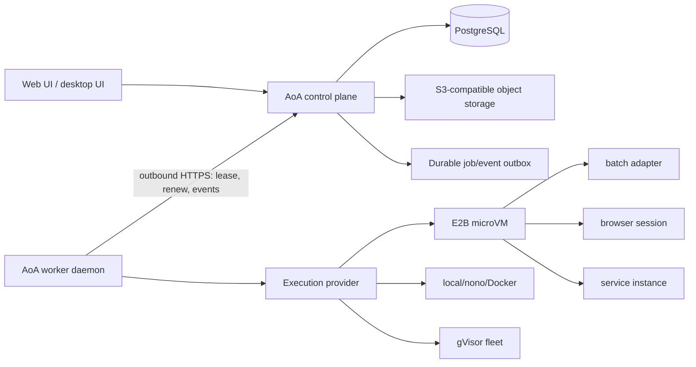
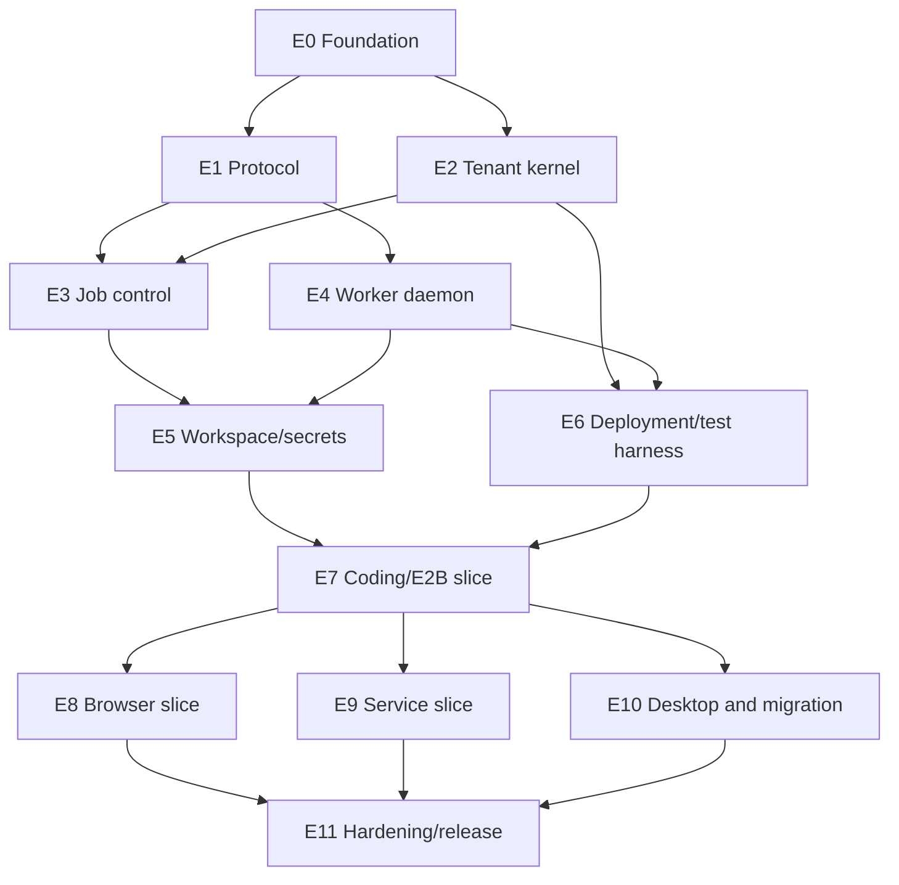

# Cloud Control Plane and Worker Re-platform Program Design

**Date:** 2026-08-07

## Goal

Turn AoA into a hosted control plane that can safely coordinate coding/CLI jobs, browser-automation sessions, long-running service agents, desktop workers, and managed cloud workers without making the existing monolith or any worker-local database a peer source of truth.

This document is the portfolio design and groomed program backlog. Each epic is intentionally small enough to receive its own code-level implementation plan before agents implement it.

## Scope decisions

- Design one worker protocol for three workload classes from the start:
  - `batch`: bounded coding and CLI work;
  - `browser_session`: bounded browser automation with screenshots, traces, approvals, and session artifacts;
  - `service`: a desired-state, supervised process that can run for days and be restarted or moved.
- Ship in that order: batch first, browser second, service third.
- The first distributed deployment is one control-plane process plus one separately deployed worker, external PostgreSQL, and S3-compatible object storage.
- All worker connections are outbound. A worker never needs an inbound firewall opening and never receives database credentials.
- PostgreSQL owns business, policy, scheduler, lease, and audit state. Git owns source history. Object storage owns immutable workspace snapshots, logs, traces, and artifacts. Worker disks are caches plus encrypted unacknowledged event buffers.
- Do not synchronize AoA databases between cloud and desktop systems. Synchronize job envelopes, events, workspace snapshots, patches, and artifacts.
- Long-running services initially support outbound network access under policy and connector/queue consumption. Tenant-defined public ingress is a separate future design because it requires routing, certificates, abuse controls, and another isolation boundary.
- Cloud plugin execution stays blocked until a separately isolated plugin-worker design exists. An agent sandbox does not implicitly make plugins safe.
- Existing `local_trusted` behavior remains available during the migration. New distributed behavior stays behind explicit feature and tenant rollout flags.

## Current-main integration baseline

This design is rebased on `main` after PR #316 (multi-tenant cloud control plane), PR #317 (MCP OAuth connector broker), and PR #318 (enterprise memory). Those capabilities are inputs to the re-platform, not parallel systems to replace:

- Decision #117's execution-target registry and hardened gVisor seam remain the legacy routing and isolation boundary until the new worker path takes ownership through an explicit cutover.
- PostgreSQL remains authoritative for memory items, visibility, retrieval audit, and actor scope. Distributed workers receive authorized, immutable context inputs or call a tenant-scoped control-plane API; they never receive direct memory-table or database access. Decisions #118 and #119 remain controlling for memory visibility.
- The existing company-scoped MCP OAuth broker remains authoritative for connector discovery, refresh leases, token rotation, and revocation. Distributed execution adds lease-scoped opaque handles and sandbox-local materialization; it does not create a second OAuth token store or serialize refresh/access tokens into job envelopes.
- The existing heartbeat, Commander, crew, workspace, provider-resolution, and connector paths remain migration sources. A ticket that bridges one of them must characterize its current-main behavior before introducing the distributed owner.

## Non-goals

- A blank-slate rewrite of the AoA UI, task model, memory model, Commander, or marketplace.
- A microservice per domain in the first release.
- Active-active multi-region control-plane writes.
- Public ingress for tenant service processes.
- Bidirectional database replication between legacy and new modules.
- Enabling the process-wide unsandboxed multi-tenant execution override.
- Treating gVisor, E2B, Daytona, Docker, or nono as the scheduler or worker protocol.

## Delivery approach

### Rejected: continue patching execution into the server process

This is initially fast, but leaves tenancy, workspace access, child-process execution, cancellation, and secret handling inside the same failure and trust boundary. It also makes desktop and managed cloud execution different products.

### Rejected: full rewrite and big-bang cutover

This provides a clean codebase but discards working product behavior and forces the team to rediscover years of edge cases before producing value. A large agent swarm would increase merge volume without reducing integration risk.

### Selected: contract-first strangler with a modular control plane

Create a versioned protocol package, a separately deployable worker, and focused control-plane modules inside the current monorepo. Preserve existing product APIs and UI wherever possible. Route one golden journey through the new path, then move workloads and tenants incrementally. Keep the control plane as a modular monolith until load or ownership proves a service boundary is necessary.

## Target topology



The control plane may begin as one replica. Correctness must nevertheless live in PostgreSQL transactions and lease fences, not process memory, so a second replica can be added without redesigning jobs.

## Core lifecycle model

### Job and attempt

A `job` is immutable intent plus mutable scheduler state. Every dispatch creates an increasing `attempt`. An attempt may own at most one active lease. Delivery is at least once; externally visible effects must be idempotent.

Required identity chain:

```text
organization -> company -> run -> job -> attempt -> lease -> sandbox/service instance
```

Every mutation from a worker carries `jobId`, `attempt`, `leaseId`, and an unpredictable fencing token. The control plane rejects stale fences even if a late worker successfully finishes computation.

### Workload-specific lifecycle

| Workload | Lifetime | Completion | Recovery |
|---|---:|---|---|
| `batch` | minutes to hours | terminal result, patch, or artifact | retry a new attempt from a declared base snapshot |
| `browser_session` | minutes to hours | terminal result plus screenshots/trace/video | retry from a clean session or an explicitly approved checkpoint |
| `service` | hours to days | desired state becomes stopped/deleted | reconciler replaces failed instances and advances generations |

A service is not modeled as an infinitely renewed batch job. It has a durable desired-state row, generation, instance records, health state, restart policy, and budget/TTL policy. Each running instance still uses the common lease and event protocol.

## Source-of-truth and synchronization rules

- Business and scheduler writes are accepted only by the control plane.
- Workers append events; they do not directly update run, issue, cost, or membership rows.
- Worker events are idempotent and uniquely ordered by `(job_id, attempt, seq)`.
- The worker retains an encrypted SQLite outbox until cumulative acknowledgement.
- Large files go directly to object storage with short-lived, prefix-scoped upload grants.
- Artifact commit is a fenced control-plane operation that validates hashes, sizes, ownership, and active lease.
- Coding outputs are patches or Git commits tied to a declared base hash. Conflicting results are quarantined for review rather than blindly copied over a workspace.
- Browser cookies, storage state, screenshots, videos, and traces are job-scoped artifacts with explicit retention.
- Service state survives only through declared checkpoints, durable external stores, or replayable inputs; local worker disk is never authoritative.

## Security invariants

- A non-owner database role enforces RLS on every tenant-owned table used by the new path.
- The transaction establishes one mandatory Organization context before a tenant repository can execute.
- Duplicated Organization/Company identifiers use composite foreign keys or validated database constraints.
- Worker credentials are short lived, audience bound, target bound, and revocable. The current static worker token may only bootstrap enrollment.
- Secret handles, not plaintext secrets, appear in job envelopes.
- Secret material is released only after live lease and tenant validation, and every release is audited.
- Prefer credential injection through an egress proxy. If a CLI requires a credential locally, use a per-job tmpfs file or short-lived environment value and destroy it on lease loss.
- Sandbox egress is default deny. Metadata endpoints, RFC1918 destinations, worker-host control ports, and the AoA data plane are denied unless explicitly required.
- The host worker supervises sandboxes but never executes tenant commands in its own process.
- Each shared-cloud job gets a distinct sandbox, writable workspace, home directory, and process namespace.
- Worker revocation stops new leases, prevents session renewal, cancels active leases, and triggers sandbox termination.

## Deployment progression

### D0: Hermetic component tests

Protocol, state-machine, repository, and worker-supervisor tests run without external providers. These are required on every ticket.

### D1: Distributed local topology

Docker Compose runs:

- `postgres`
- `minio`
- `control-plane`
- `worker`
- `fake-sandbox-provider`
- `toxiproxy`
- `test-runner`

The control-plane container has no Docker socket. The worker has no database credentials. They share no writable filesystem volume. Every job crosses the network protocol and object store.

### D2: Real E2B nightly lane

Run a small coding job, cancellation job, artifact round trip, and cleanup reconciliation against E2B. Failures block promotion but do not make ordinary pull requests depend on a vendor.

### D3: Browser nightly lane

Run Playwright inside the remote sandbox against a deterministic test site. Assert browser outputs, egress policy, secret/cookie cleanup, cancellation, and trace retrieval.

### D4: Service canary lane

Run a supervised service for at least 30 minutes. Restart the control plane, restart the worker, drain the worker, advance a service generation, and verify bounded duplicate work plus stable desired state.

### D5: Staging

Use external PostgreSQL and object storage, at least two workers, a managed secret store, central logs/metrics, canary rollout, database backup/restore, and worker revocation exercises.

### D6: Production beta

Enable only selected Organizations. Maintain instant scheduling disablement, provider kill switches, per-Organization concurrency and spend caps, and a documented rollback to the legacy execution path where semantics allow it.

## Test and merge policy

“Merge now and test later” is prohibited for tenant, lease, secret, migration, and protocol work. It creates failures that are expensive to attribute across parallel agents.

Every ticket must provide:

1. A failing focused test or contract fixture that demonstrates the missing behavior.
2. The minimal implementation.
3. Passing focused tests, typecheck for affected packages, and generated-contract checks.
4. A small documentation or runbook update when an operator-visible contract changes.
5. One reviewable commit or a short, clean commit sequence.

Expensive validation is delayed only to a merge train or nightly lane:

| Lane | Frequency | Required coverage |
|---|---|---|
| Focused | every ticket | changed unit/contract/integration tests and affected-package typecheck |
| Merge train | every 5–10 merged tickets | D1 distributed happy path and failure injection |
| Nightly | nightly | D1 full suite plus real E2B; browser/service lanes when available |
| Weekly | weekly | chaos, cross-tenant adversarial suite, load, backup/restore, leaked-sandbox reconciliation |
| Release | each candidate | all gates, image/SBOM/signature checks, migration rehearsal, rollback rehearsal |

## Agent operating model

- One ticket, one branch/worktree, one implementation agent.
- A protocol/schema custodian owns changes to shared protocol types and database migrations. Other agents consume released contracts rather than editing them concurrently.
- No ticket may own both a protocol redesign and a provider implementation.
- Avoid parallel tickets that touch the same migration, state machine, or route module.
- Keep new modules focused; do not add worker logic to `heartbeat.ts` or more process timers to `server/src/index.ts`.
- Use feature flags to merge dormant paths safely, but dormant code still requires tests.
- The merge queue rebases, runs the focused lane, and merges sequentially.
- At each delivery gate, assign one fresh integration agent to run the gate, inspect evidence, and open narrow repair tickets. Do not let implementation agents self-certify the whole gate.
- Freeze contract changes during provider, browser, and service delivery trains except for versioned additive fields.

## Dependency graph



## Definition of Ready for every implementation ticket

A ticket is assignable only when it includes:

- one outcome and explicit non-goals;
- exact dependencies by ticket ID;
- owned module/file area;
- input and output interfaces;
- acceptance examples, including failure behavior;
- named focused test lane and commands in the epic implementation plan;
- migration and compatibility impact;
- observable signals and rollback/disable mechanism;
- size of no more than three agent-days; otherwise split it.

## Groomed backlog

Sizes are planning estimates: **S** is up to one agent-day, **M** is up to three. Each ticket is independently reviewable. Code-level file lists, signatures, and red/green commands are produced in the implementation plan for that epic.

### E0 — Program foundation

#### FND-001 — Record the workload lifecycle ADR (S)

- **Depends on:** none.
- **Outcome:** Lock `batch`, `browser_session`, and `service` semantics, including time limits, cancellation, retries, checkpoint rules, and the no-public-ingress service constraint.
- **Acceptance:** The ADR contains state diagrams, forbidden transitions, and one example lifecycle for each workload. Existing heartbeat and Commander concepts are mapped to the new terms without changing runtime code.
- **Test:** Documentation link and state-name consistency check.

#### FND-002 — Record authority and migration ADR (S)

- **Depends on:** none.
- **Outcome:** Declare PostgreSQL/Git/object-store/worker authority and the single-writer strangler rule.
- **Acceptance:** The ADR forbids database peer sync and permanent dual writes, defines cutover ownership per aggregate, and defines quarantine behavior for late worker output.
- **Test:** Architecture lint/checklist in the program gate.

#### FND-003 — Threat model and trust-boundary inventory (M)

- **Depends on:** FND-001, FND-002.
- **Outcome:** Model tenant, operator, worker host, sandbox, provider, plugin, secret store, object store, and browser-session threats.
- **Acceptance:** Every trust crossing has an authentication, authorization, confidentiality, revocation, audit, and failure requirement. The unsafe multi-tenant override is classified as forbidden in hosted deployments.
- **Test:** Security-requirement-to-ticket traceability table has no unowned high-severity item.

#### FND-004 — Golden journey and failure corpus (M)

- **Depends on:** FND-001.
- **Outcome:** Define deterministic fixtures for one coding job, one browser job, one service, and their failure variants.
- **Acceptance:** Fixtures specify inputs, expected events, artifacts, costs, terminal state, cancellation points, and tenant ownership. Fake provider behavior is deterministic.
- **Test:** JSON/schema validation for every fixture.

#### FND-005 — Merge gates, feature flags, and ownership rules (S)

- **Depends on:** FND-003.
- **Outcome:** Add the program’s branch protection, merge-train, flag, and code-ownership policy.
- **Acceptance:** Distributed execution defaults off; it can be enabled per deployment and Organization; protocol/migration paths have named custodians; required CI checks are documented.
- **Test:** Configuration test proves hosted mode cannot enable the unsafe execution escape hatch.

### E1 — Versioned worker protocol

#### PRT-001 — Create the worker-protocol package (S)

- **Depends on:** FND-001.
- **Outcome:** Add a dependency-light package containing wire types, validators, constants, and JSON fixtures, usable by server and worker without importing either.
- **Acceptance:** Package builds in isolation, publishes no Node-only runtime dependency, and has a stable exported entrypoint.
- **Test:** Package typecheck and import smoke from both server and a minimal worker fixture.

#### PRT-002 — Define identifiers and state machines (M)

- **Depends on:** PRT-001.
- **Outcome:** Define branded IDs and legal state transitions for jobs, attempts, leases, browser sessions, services, and service instances.
- **Acceptance:** Unknown states fail closed; transition functions reject backward or cross-lifecycle transitions; terminal states are immutable.
- **Test:** Table-driven state-transition tests, including every illegal transition.

#### PRT-003 — Define job and lease envelopes (M)

- **Depends on:** PRT-002, FND-003.
- **Outcome:** Define immutable job input, capability requirements, lease ACK, renewal, cancellation, deadlines, attempt number, and fencing token.
- **Acceptance:** Tenant IDs and policy hashes are mandatory; secret plaintext and arbitrary host paths are unrepresentable; additive optional fields preserve version compatibility.
- **Test:** Valid/invalid fixtures plus round-trip serialization.

#### PRT-004 — Define worker event and acknowledgement protocol (M)

- **Depends on:** PRT-002.
- **Outcome:** Define sequenced event batches, cumulative ACKs, logs, metrics, state transitions, browser observations, and service health events.
- **Acceptance:** Events require `(job, attempt, lease, seq)`; duplicate event IDs are harmless; large payloads must use blob references.
- **Test:** Duplicate, gap, out-of-order, hash-mismatch, and cumulative-ACK fixtures.

#### PRT-005 — Define artifacts, workspaces, secrets, and network policy (M)

- **Depends on:** PRT-003, FND-003.
- **Outcome:** Define workspace manifests, patch manifests, artifact upload grants, secret handles, retention class, and default-deny egress policy.
- **Acceptance:** Object keys are tenant/job prefix scoped; maximum size and expected hash are mandatory; browser cookie/storage artifacts have explicit sensitivity and retention.
- **Test:** Cross-tenant key, path traversal, oversized object, forbidden network, and plaintext-secret rejection fixtures.

#### PRT-006 — Capability and protocol negotiation (S)

- **Depends on:** PRT-003, PRT-004, PRT-005.
- **Outcome:** Define worker version, supported protocol range, workload/provider capabilities, platform facts, and policy version negotiation.
- **Acceptance:** The control plane can reject too-old workers, jobs cannot lease to incompatible capabilities, and an N-1 worker accepts additive N envelopes.
- **Test:** Compatibility matrix covering current and previous protocol version.

### E2 — Tenant-safe control-plane kernel

#### TEN-001 — Introduce new-path tenant schema and repository boundary (M)

- **Depends on:** FND-002, FND-003.
- **Outcome:** Define normalized Organization-owned job/worker/service tables and tenant-scoped repository interfaces without the sentinel Organization default.
- **Acceptance:** Every owned row has non-null Organization identity; Company-owned rows prove the Company belongs to the same Organization; raw unscoped repository reads are not exported.
- **Test:** Migration integration test and compile-time repository API test.

#### TEN-002 — Enforce a non-owner database role and RLS harness (M)

- **Depends on:** TEN-001.
- **Outcome:** Run application queries with a non-owner role and force RLS on new-path tenant tables.
- **Acceptance:** Missing tenant context returns no tenant rows or raises an error by policy; owner/superuser credentials are absent from the application container; migrations use a separate role.
- **Test:** Real PostgreSQL cross-tenant read/write/delete and missing-context suite.

#### TEN-003 — Mandatory transaction tenant context (M)

- **Depends on:** TEN-002.
- **Outcome:** Provide one transaction wrapper that sets Organization context and exposes tenant repositories only inside the callback.
- **Acceptance:** HTTP, scheduler, reconciliation, and worker-event paths use the wrapper; context cannot leak through pooled connections.
- **Test:** Concurrent two-tenant pool reuse, rollback, nested transaction, and background-job tests.

#### TEN-004 — Composite tenant integrity constraints (M)

- **Depends on:** TEN-001.
- **Outcome:** Add composite uniqueness and foreign keys for job/company/run, worker/Organization, artifact/job, service/company, and secret-handle ownership.
- **Acceptance:** Direct SQL cannot construct mixed-tenant relationships even when application checks are bypassed.
- **Test:** Negative migration integration cases for every composite relationship.

#### TEN-005 — Tenant adversarial property suite (M)

- **Depends on:** TEN-003, TEN-004.
- **Outcome:** Generate randomized tenant graphs and attempt cross-tenant identifiers through repositories, HTTP endpoints, worker events, WebSockets, and object keys.
- **Acceptance:** Every operation fails closed without disclosing existence; failures are audited where appropriate.
- **Test:** Seed-reproducible property suite in the merge-train lane.

### E3 — Durable job control

#### JOB-001 — Submit immutable jobs transactionally (M)

- **Depends on:** PRT-003, TEN-003.
- **Outcome:** Create a job plus outbox notification in the same transaction from an authorized run.
- **Acceptance:** Client idempotency key prevents duplicate jobs; input hash and policy snapshot are immutable; no worker is contacted inside the transaction.
- **Test:** Duplicate submission, transaction rollback, tenant mismatch, and concurrent submit tests.

#### JOB-002 — Enroll workers with device-bound identity (M)

- **Depends on:** PRT-006, TEN-003.
- **Outcome:** Exchange a single-use enrollment code and worker public key for a target identity and refresh credential.
- **Acceptance:** Enrollment codes expire, are Organization/owner/target-class scoped, and are consumed once; session tokens are short lived and audience bound.
- **Test:** Replay, expiry, wrong Organization, revoked owner, rotated key, and token-audience tests.

#### JOB-003 — Lease and ACK compatible jobs atomically (M)

- **Depends on:** JOB-001, JOB-002, PRT-006.
- **Outcome:** Lease the oldest compatible job under tenant, trust, capability, and concurrency constraints.
- **Acceptance:** Concurrent workers cannot own the same attempt; lease includes ACK deadline, expiry, and fence; incompatible workers see no job details.
- **Test:** Real PostgreSQL concurrent-claim and capability-selection tests.

#### JOB-004 — Renew leases and enforce fencing (M)

- **Depends on:** JOB-003.
- **Outcome:** Renew only the active lease and require its fence for events, artifacts, secret access, completion, and service health.
- **Acceptance:** Expired or replaced workers cannot mutate state; lease duration and renewal interval are server policy, not worker choice.
- **Test:** Clock-boundary, stale fence, duplicate renew, revoked worker, and replacement-attempt tests.

#### JOB-005 — Ingest events and terminal results idempotently (M)

- **Depends on:** JOB-004, PRT-004.
- **Outcome:** Store event batches with unique sequence constraints and transactionally project accepted state changes.
- **Acceptance:** Duplicate batches return the same cumulative ACK; gaps are rejected with expected sequence; terminal result is accepted exactly once.
- **Test:** Duplicate, out-of-order, partial retry, concurrent terminal, and control-plane restart tests.

#### JOB-006 — Cancellation, expiry, retry, and reconciliation (M)

- **Depends on:** JOB-004, JOB-005.
- **Outcome:** Add requested cancellation, lease reaping, bounded retry/backoff, dead-letter/quarantine, and leaked-attempt reconciliation.
- **Acceptance:** Cancellation is observable to the worker; expiry eventually creates a new attempt or terminal failure by policy; late results never overwrite the winner.
- **Test:** Disconnect before ACK, after ACK, during execution, during upload, and after terminal commit.

#### JOB-007 — Organization quotas and worker revocation (M)

- **Depends on:** JOB-003, JOB-006.
- **Outcome:** Enforce per-Organization running limits, workload-specific capacity, spend/runtime caps, and immediate target revocation.
- **Acceptance:** Revocation blocks refresh and new leases, marks active leases canceled, and requests sandbox termination; capacity is not released twice.
- **Test:** Concurrent quota claim, revocation race, budget exhaustion, and capacity reconciliation tests.

#### JOB-008 — Operator job and worker controls (M)

- **Depends on:** JOB-005, JOB-006, JOB-007.
- **Outcome:** Expose tenant-scoped job/attempt/event/worker status, cancellation, drain, and revocation through control-plane APIs and a minimal operations UI.
- **Acceptance:** Operators can explain why a job is queued or terminal, inspect redacted durable evidence, cancel an attempt, drain a worker, and revoke a target without receiving secret material or cross-tenant identifiers.
- **Test:** API authorization/contract tests plus UI tests for queued, leased, canceling, failed, revoked, and stale-worker states.

### E4 — Worker daemon

#### WRK-001 — Scaffold the separately deployable worker (S)

- **Depends on:** PRT-001, FND-005.
- **Outcome:** Add a workspace package and container entrypoint with strict config parsing, structured logs, graceful shutdown, and no server/database imports.
- **Acceptance:** Worker starts without database credentials, exposes only local health/metrics, and exits on invalid endpoint or trust configuration.
- **Test:** Build, config matrix, signal handling, and dependency-boundary test.

#### WRK-002 — Device identity and session renewal (M)

- **Depends on:** WRK-001, JOB-002.
- **Outcome:** Generate/store a worker key, enroll, maintain short-lived sessions, and handle rotation/revocation.
- **Acceptance:** Private key never enters logs/config files; container mode supports mounted secret storage; desktop mode exposes an OS-keychain interface.
- **Test:** Enrollment fake server, token expiry, key rotation, corrupt key store, and revoked-session tests.

#### WRK-003 — Poll, ACK, and capability advertisement (M)

- **Depends on:** WRK-002, JOB-003.
- **Outcome:** Long-poll for work, advertise measured capacity/capabilities, ACK promptly, and enforce local concurrency.
- **Acceptance:** Worker does not prefetch secrets or broad queues; backoff is bounded and jittered; shutdown stops leasing before draining work.
- **Test:** Empty poll, compatible job, incompatible job, backpressure, API outage, and drain tests.

#### WRK-004 — Sandbox supervisor and process-tree cancellation (M)

- **Depends on:** WRK-003, PRT-003.
- **Outcome:** Define provider-neutral create/execute/cancel/kill/destroy supervision and keep tenant commands outside the worker process.
- **Acceptance:** Lease loss triggers cancellation and eventual kill; provider operations have deadlines; sandbox identity is attached to all logs and cleanup records.
- **Test:** Fake provider happy path, hung create, ignored cancel, forced kill, destroy failure, and worker shutdown tests.

#### WRK-005 — Lease renewal and local fence enforcement (M)

- **Depends on:** WRK-004, JOB-004.
- **Outcome:** Renew while active and stop all cloud callbacks after fence loss or expiry.
- **Acceptance:** Worker cannot upload artifacts, fetch secrets, or complete after losing the fence; offline policy is explicit per workload.
- **Test:** Network partition, delayed renewal response, clock skew tolerance, replacement attempt, and reconnect tests.

#### WRK-006 — Encrypted SQLite event outbox (M)

- **Depends on:** WRK-005, JOB-005.
- **Outcome:** Persist sequenced events locally until cumulatively acknowledged.
- **Acceptance:** Restart resumes from the last ACK; queue size and disk limits are enforced; sensitive payloads are encrypted or referenced as blobs.
- **Test:** Crash between send/ACK, duplicate send, corrupt row quarantine, full disk, and sequence recovery tests.

#### WRK-007 — Restart recovery and orphan cleanup (M)

- **Depends on:** WRK-004, WRK-006, JOB-006.
- **Outcome:** On startup, reconcile local sandboxes/outbox rows with control-plane lease state.
- **Acceptance:** Live owned work resumes only when policy permits; stale sandboxes are killed; unknown artifacts are quarantined; cleanup is observable and retryable.
- **Test:** Crash at each lifecycle checkpoint using the fake provider.

### E5 — Workspaces, artifacts, secrets, and network policy

#### DAT-001 — Immutable workspace snapshot format (M)

- **Depends on:** PRT-005, TEN-004.
- **Outcome:** Create canonical manifests with base Git hash, normalized paths, sizes, hashes, executable bits, ignore policy, and object references.
- **Acceptance:** Path traversal, symlink escape, device files, case collisions, and size limits fail closed.
- **Test:** Cross-platform manifest fixture suite.

#### DAT-002 — Direct upload/download and fenced artifact commit (M)

- **Depends on:** DAT-001, JOB-004.
- **Outcome:** Issue scoped object-storage grants and commit verified manifests through the control plane.
- **Acceptance:** Worker uploads bypass the API body path; wrong prefix/hash/size/tenant/fence cannot be committed; incomplete uploads expire.
- **Test:** MinIO integration suite with malicious keys and stale fences.

#### DAT-003 — Patch output and conflict quarantine (M)

- **Depends on:** DAT-002.
- **Outcome:** Represent coding output as patch/commit plus base/result hashes and provide an explicit apply/review service.
- **Acceptance:** Matching base applies deterministically; mismatched base never auto-applies; binary and large outputs use artifact references.
- **Test:** Clean apply, conflicting base, rename, deletion, binary, and duplicate-result tests.

#### DAT-004 — Lease-scoped secret broker (M)

- **Depends on:** JOB-004, TEN-004, PRT-005.
- **Outcome:** Extend the existing secret and MCP OAuth broker paths with opaque execution handles resolved only for an active compatible lease; do not create a competing credential or OAuth-token store.
- **Acceptance:** Worker cannot list secrets or receive connector refresh tokens; owner-only credentials enforce dispatching identity; connector/header materialization occurs only inside the approved sandbox/proxy; revoke/rotate takes effect without rebuilding job envelopes.
- **Test:** Wrong tenant, wrong job, stale fence, owner mismatch, connector refresh race, rotation/revocation, plaintext-token rejection, and audit-integrity tests.

#### DAT-005 — Egress policy and credential redaction (M)

- **Depends on:** DAT-004, WRK-004.
- **Outcome:** Enforce default-deny destination policy, block private/metadata/control-plane ranges, and redact known secret values from events.
- **Acceptance:** DNS rebinding and direct IP variants are handled; policy version is recorded; redaction applies before the local outbox.
- **Test:** Fake DNS/HTTP targets plus log and artifact-leak corpus.

### E6 — Deployment and distributed test harness

#### DEP-000 — Deterministic fake sandbox provider (M)

- **Depends on:** WRK-004, FND-004.
- **Outcome:** Provide a networked fake provider that scripts create, execute, event, hang, cancel, crash, checkpoint, and destroy behavior from validated golden fixtures.
- **Acceptance:** Tests can address a fake sandbox by provider ID, inspect invocations, and inject a failure at each lifecycle checkpoint without invoking tenant code on the host worker.
- **Test:** Provider-contract suite shared with E2B plus fixture determinism and reset-isolation tests.

#### DEP-001 — Separate control-plane and worker images (M)

- **Depends on:** WRK-001, FND-005.
- **Outcome:** Produce pinned, non-root images with distinct dependencies and permissions.
- **Acceptance:** Control plane lacks Docker/worker tooling; worker lacks UI/server/database tooling; images expose health and version metadata.
- **Test:** Image contents, user/capability, read-only-root, and startup smoke tests.

#### DEP-002 — D1 Docker Compose topology (M)

- **Depends on:** DEP-000, DEP-001, TEN-002.
- **Outcome:** Add isolated networks and services for PostgreSQL, MinIO, control plane, worker, fake provider, Toxiproxy, and test runner.
- **Acceptance:** No shared writable volume; worker cannot reach PostgreSQL; control plane cannot reach provider control endpoints except through declared APIs; startup is deterministic.
- **Test:** Network-denial assertions and one fake-provider job.

#### DEP-003 — Migration job and readiness contract (M)

- **Depends on:** DEP-002, TEN-001.
- **Outcome:** Separate privileged migrations from application startup and distinguish liveness, readiness, and dependency health.
- **Acceptance:** Control plane does not serve traffic before compatible schema; worker readiness requires valid session/provider health; failed migrations do not loop destructively.
- **Test:** Old/new schema, unavailable object store, unavailable provider, and rollback-startup tests.

#### DEP-004 — Focused and merge-train CI lanes (M)

- **Depends on:** FND-005, DEP-002.
- **Outcome:** Add path-filtered unit/contract jobs and a D1 distributed merge-train job with evidence artifacts.
- **Acceptance:** Protocol/schema paths trigger their mandatory consumers; distributed logs, events, database state, and object manifests are retained on failure.
- **Test:** CI configuration validation and deliberate failing fixture proof.

#### DEP-005 — Network failure and clock-control harness (M)

- **Depends on:** DEP-002, JOB-006.
- **Outcome:** Provide deterministic latency, partition, disconnect, and time-boundary controls.
- **Acceptance:** Tests can cut worker/control-plane, worker/object-store, and control-plane/database links independently without sleeps as assertions.
- **Test:** Demonstration cases for pre-ACK disconnect, lost completion ACK, and expired lease.

#### DEP-006 — Staging manifests and configuration contract (M)

- **Depends on:** DEP-003.
- **Outcome:** Define one-control-plane/two-worker staging deployment, external database/object storage, secret injection, autoscaling limits, and rollout order.
- **Acceptance:** Database migration runs first; control plane supports N-1 workers; workers drain before termination; all mutable configuration is documented and validated.
- **Test:** Render/config validation and staging smoke deployment.

#### DEP-007 — Distributed observability baseline (M)

- **Depends on:** DEP-002, PRT-004.
- **Outcome:** Correlate `run -> job -> attempt -> lease -> sandbox`, with metrics for queues, leases, workers, provider lifecycle, egress denials, secret reads, and artifacts.
- **Acceptance:** One trace follows a fake job end to end; tenant identifiers are access controlled; high-cardinality fields are logs/traces rather than metric labels.
- **Test:** Telemetry contract assertions in D1.

### E7 — Coding/CLI workload on E2B

#### CLI-001 — E2B provider implementation (M)

- **Depends on:** WRK-004, DAT-005, DEP-004.
- **Outcome:** Implement secure create/execute/cancel/destroy operations behind the worker provider interface.
- **Acceptance:** Secured access is enabled; template/image and policy version are pinned; metadata contains no secrets; every sandbox has an enforced TTL.
- **Test:** Provider fake contract test and real-E2B create/destroy smoke.

#### CLI-002 — Full workspace staging and adapter execution (M)

- **Depends on:** CLI-001, DAT-002.
- **Outcome:** Stage a declared snapshot and actor-authorized context bundle, install only approved runtime inputs, run one existing CLI adapter, and record exact adapter/tool/context versions.
- **Acceptance:** The agent sees the expected source, instructions, and memory-derived context allowed by Decisions #118/#119; the worker has no memory/database access; host paths are absent; unsupported files fail before execution.
- **Test:** Deterministic fake CLI modifies a known file inside E2B.

#### CLI-003 — Logs, cancellation, usage, and result collection (M)

- **Depends on:** CLI-002, JOB-005, DAT-003.
- **Outcome:** Stream durable events, cancel the process tree, collect usage/cost, and commit patch/artifact results.
- **Acceptance:** Cancellation reaches terminal state within policy; duplicate result delivery is harmless; output cannot commit after lease loss.
- **Test:** Real E2B success, cancellation, forced timeout, and lost-ACK cases.

#### CLI-004 — E2B cleanup reconciliation (S)

- **Depends on:** CLI-001, JOB-006.
- **Outcome:** Reconcile leaked/paused sandboxes against active leases and terminate or quarantine them.
- **Acceptance:** Every sandbox is attributable to a job/attempt; repeated cleanup is idempotent; provider outage backs off with an alert.
- **Test:** Fake leaked sandbox plus real-provider tagged-sandbox smoke.

#### CLI-005 — Bridge existing runs to distributed jobs (M)

- **Depends on:** CLI-003, CLI-004, DEP-005.
- **Outcome:** Convert one existing heartbeat run into a new job without moving the whole product domain, and support a non-executing shadow comparison of routing and policy.
- **Acceptance:** One run has exactly one authoritative executor; shadow mode cannot lease or cause external effects; disabling the rollout flag stops new distributed jobs while explicitly draining or canceling active attempts.
- **Test:** Legacy/new envelope equivalence, double-execution prevention, flag disablement, and active-attempt drain tests.

#### CLI-006 — First coding golden journey and tenant canary (M)

- **Depends on:** CLI-005, JOB-008.
- **Outcome:** Route one Organization’s coding task through the distributed path and surface its durable evidence in the existing run experience.
- **Acceptance:** Create task, schedule, lease, stage, execute, stream, produce patch, review, retry, cancel, audit, and operator inspection all succeed; existing non-canary tenants remain on the legacy path.
- **Test:** D1 full failure matrix and D2 real E2B journey.

### E8 — Browser automation

#### BRW-001 — Browser-session job and policy extensions (M)

- **Depends on:** CLI-006, PRT-006.
- **Outcome:** Add browser engine/template, viewport, locale, download, trace, session TTL, and interaction-approval capabilities as additive protocol fields.
- **Acceptance:** Old workers reject browser jobs by capability without seeing sensitive inputs; bounded TTL and artifact retention are mandatory.
- **Test:** N-1 compatibility plus validator fixtures.

#### BRW-002 — Sandbox-local Playwright runtime (M)

- **Depends on:** BRW-001, WRK-004.
- **Outcome:** Launch Chromium/Playwright inside the sandbox without exposing CDP to other tenants or the public network.
- **Acceptance:** Browser process shares only the job sandbox; downloads stay job scoped; browser and child processes die on cancellation.
- **Test:** Deterministic local site navigation, download, popup, and kill tests.

#### BRW-003 — Browser observation artifact pipeline (M)

- **Depends on:** BRW-002, DAT-002.
- **Outcome:** Stream metadata and store screenshots, DOM snapshots where allowed, trace, video, and downloads as sensitive artifacts.
- **Acceptance:** Event payloads remain bounded; retention/redaction policy is explicit; artifact order is tied to event sequence.
- **Test:** Screenshot/trace hash, large download, retention, and stale-fence cases.

#### BRW-004 — Browser secrets, network, and human approval (M)

- **Depends on:** BRW-002, DAT-004, DAT-005.
- **Outcome:** Materialize scoped session or connector credentials through the control-plane broker and pause risky actions for approval without leaking cookies, access tokens, or refresh tokens.
- **Acceptance:** OAuth refresh remains control-plane-owned and live-lease/fence-bound; denial/timeout fails closed; session state is destroyed at terminal state; allowed domains and download/upload policy are enforced.
- **Test:** Login fixture, connector rotation/revocation, denied domain, metadata/private IP, approval allow/deny/timeout, and log-leak tests.

#### BRW-005 — Browser golden journey (M)

- **Depends on:** BRW-003, BRW-004, DEP-005.
- **Outcome:** Complete a deterministic multi-step browser task with approval, download, screenshot, cancellation, and retry.
- **Acceptance:** All durable evidence is viewable from the control plane; no browser/control socket is reachable outside the sandbox; cleanup leaves no session credential.
- **Test:** D1 fake/site suite and D3 real-sandbox nightly.

#### BRW-006 — Browser evidence and approval experience (M)

- **Depends on:** BRW-003, BRW-004, JOB-008.
- **Outcome:** Add a tenant-scoped session view for live observations, screenshots, downloads, trace/video links, pending approvals, cancellation, and retention status.
- **Acceptance:** The UI never receives browser control credentials or cookies; reconnect catches up from durable sequence; sensitive artifacts require normal Company authorization.
- **Test:** Component/API tests plus a D3 reconnect-and-approval Playwright journey.

### E9 — Long-running service agents

#### SVC-001 — Desired-state service schema and API (M)

- **Depends on:** CLI-006, TEN-004, PRT-002.
- **Outcome:** Add service definition, generation, desired replicas initially limited to one, instance, restart policy, TTL, budget, checkpoint references, and an actor/context policy reference.
- **Acceptance:** Updates create a new immutable generation; desired state and memory/context access are tenant and actor scoped; workers receive neither database credentials nor direct memory-table access; no public port/ingress configuration is accepted.
- **Test:** Schema, authorization, generation, and invalid-ingress tests.

#### SVC-002 — Service reconciler and placement (M)

- **Depends on:** SVC-001, JOB-003.
- **Outcome:** Reconcile desired state into one compatible service-instance job without duplicate placement.
- **Acceptance:** Repeated reconciliation is idempotent; tenant quota and worker drain are respected; stopped services create no new instance.
- **Test:** Concurrent reconcilers, quota, stopped state, and drained worker tests.

#### SVC-003 — Long-session lease and health semantics (M)

- **Depends on:** SVC-002, JOB-004, PRT-004.
- **Outcome:** Add service health, liveness deadline, graceful stop, checkpoint request, and bounded lease renewal semantics.
- **Acceptance:** Health events do not extend ownership without a successful lease renewal; memory/context callbacks and connector refresh/materialization require the current fence; unreachable workers are fenced and replaced by policy.
- **Test:** Missed health, missed renewal, delayed event, stale-fence context/connector request, duplicate instance, and network partition tests.

#### SVC-004 — Restart, backoff, and checkpoint recovery (M)

- **Depends on:** SVC-003, DAT-002.
- **Outcome:** Restart failed services with bounded exponential backoff and optionally restore an approved checkpoint.
- **Acceptance:** Crash loops terminalize or pause by policy; checkpoint hash and generation must match; local disk alone cannot qualify as recovery state.
- **Test:** Crash loop, corrupt checkpoint, old-generation checkpoint, provider outage, and successful restore.

#### SVC-005 — Pause, drain, generation rollout, budget, and TTL (M)

- **Depends on:** SVC-004, JOB-007.
- **Outcome:** Support operator pause/resume, worker drain, replace-before/after-stop policy for a single replica, and hard runtime/spend limits.
- **Acceptance:** No two generations may perform external effects simultaneously unless explicitly allowed; budget/TTL stop is auditable and cannot be overridden by the worker.
- **Test:** Rolling generation, drain, budget exhaustion, TTL, and stuck-stop force-kill tests.

#### SVC-006 — Service golden canary (M)

- **Depends on:** SVC-005, DEP-006, DEP-007.
- **Outcome:** Run a deterministic queue-consuming service with brokered connector access and actor-authorized memory context for at least 30 minutes through control-plane restart, worker restart, drain, and generation update.
- **Acceptance:** Desired state converges, OAuth refresh and memory visibility remain control-plane-owned, duplicate effects stay within documented at-least-once semantics, checkpoints recover, and telemetry explains every transition.
- **Test:** D4 canary lane.

#### SVC-007 — Service management and evidence experience (M)

- **Depends on:** SVC-005, JOB-008.
- **Outcome:** Add tenant-scoped create/update/pause/resume/stop controls and a view of desired state, generation, active instance, health, checkpoint, budget, and restart history.
- **Acceptance:** The UI cannot configure public ingress; stale generation actions fail clearly; every control action is audited and reflected through durable event catch-up.
- **Test:** API authorization/contract tests and UI tests for rollout, pause, restart loop, budget stop, and stale generation.

### E10 — Desktop worker, realtime, and strangler migration

#### DSK-001 — Desktop enrollment and OS key storage (M)

- **Depends on:** CLI-006, WRK-002.
- **Outcome:** Add user-visible enrollment, target status/revocation, owner binding, and OS-keychain-backed worker identity.
- **Acceptance:** Enrollment is explicit; device loss can be revoked; credentials never reside in repository config or browser storage.
- **Test:** Platform key-store adapters plus enrollment/revocation E2E.

#### DSK-002 — Folder grants, local sandbox capability, and offline policy (M)

- **Depends on:** DSK-001, DAT-003, WRK-005.
- **Outcome:** Require explicit local folder grants, report nono/Docker/OS isolation capabilities, and implement encrypted offline event buffering.
- **Acceptance:** Expired offline work cannot auto-commit; orphan patches require review; ungranted paths and symlink escapes fail closed.
- **Test:** Folder-boundary, disconnect, stale lease, orphan patch, and platform-capability tests.

#### MIG-002 — Tenant/domain cutover mechanism (M)

- **Depends on:** CLI-006, DSK-002, FND-002.
- **Outcome:** Route distributed execution by Organization and workload while retaining legacy self-hosted execution for non-migrated tenants.
- **Acceptance:** Cutover is atomic and audited; rollback stops new jobs and handles active attempts explicitly; no permanent dual writer exists.
- **Test:** Canary enable/disable, active-run rollback, mixed tenants, and mixed workload tests.

#### MIG-003 — Durable realtime fan-out and catch-up (M)

- **Depends on:** JOB-005, DEP-006.
- **Outcome:** Project durable events to WebSockets through a cross-replica broker and support sequence-based reconnect/catch-up.
- **Acceptance:** Two control-plane replicas deliver consistent invalidation; broker loss delays realtime but not correctness; presence remains explicitly ephemeral.
- **Test:** Two-replica subscription, reconnect gap, duplicate fan-out, and broker outage tests.

### E11 — Hardening and beta release

#### REL-001 — End-to-end cross-tenant and secret-exposure gate (M)

- **Depends on:** BRW-006, SVC-007, DSK-002, TEN-005.
- **Outcome:** Run hostile tenant identifiers, artifacts, worker events, browser state, checkpoints, and secret requests across all workload types.
- **Acceptance:** No cross-tenant existence disclosure or data access; all denied sensitive operations are attributable in audit records.
- **Test:** Weekly adversarial suite and release gate.

#### REL-002 — Load, fairness, and SLO gate (M)

- **Depends on:** JOB-007, DEP-007, SVC-006.
- **Outcome:** Establish queue, lease, event, artifact, and service-reconciliation limits plus initial SLOs.
- **Acceptance:** One noisy Organization cannot starve another; overload rejects or queues predictably; metrics identify the bottleneck.
- **Test:** Multi-tenant load model with worker churn and object-store latency.

#### REL-003 — Disaster recovery and migration rehearsal (M)

- **Depends on:** DEP-006, MIG-002, MIG-003.
- **Outcome:** Prove database restore, object-manifest reconciliation, worker re-enrollment/revocation, schema rollout, and rollback procedure.
- **Acceptance:** Restored state does not accept stale fences; missing objects are quarantined; rollout order supports N-1 workers.
- **Test:** Staging backup/restore and rollback exercise with measured recovery time.

#### REL-004 — Signed images, SBOM, vulnerability and provider kill gates (M)

- **Depends on:** DEP-001, CLI-004.
- **Outcome:** Pin, scan, sign, and attest control-plane, worker, and sandbox images and add provider/template kill switches.
- **Acceptance:** Unapproved digest cannot run; critical vulnerability policy blocks promotion; kill switch stops new leases and reconciles active provider resources.
- **Test:** Signature rejection, vulnerable-image fixture, and provider-kill rehearsal.

#### REL-005 — Private beta rollout and evidence pack (M)

- **Depends on:** REL-001, REL-002, REL-003, REL-004.
- **Outcome:** Enable selected Organizations with dashboards, alerts, incident runbooks, rollback owner, known limitations, and retained gate evidence.
- **Acceptance:** Coding, browser, and service workload enablement are separate flags; public ingress and cloud plugins remain disabled; every beta Organization has quotas and a named rollback path.
- **Test:** Production-like staging release rehearsal followed by one canary Organization.

## Parallel execution waves

### Wave 0 — Sequential architecture lock

Run FND-001 through FND-005. Avoid code changes other than flags/gates. This prevents multiple agents from inventing incompatible meanings for “job,” “service,” and “offline.”

### Wave 1 — Four parallel lanes

After FND-005:

- Lane A: PRT-001 through PRT-006.
- Lane B: TEN-001 through TEN-005.
- Lane C: write and validate the E6 deployment/test implementation plan and fake-provider topology; execute DEP-001 only after WRK-001 merges.
- Lane D: deterministic golden fixtures and fake-provider implementation from FND-004.

Protocol and migration custodians merge sequentially within their lane.

### Wave 2 — Core distributed runtime

- Lane A: JOB-001 through JOB-007.
- Lane B: WRK-001 through WRK-007.
- Lane C: DAT-001 through DAT-005.
- Lane D: DEP-002 through DEP-007.

Integrate after JOB-003/WRK-003, after JOB-005/WRK-006, and after JOB-006/WRK-007. Do not wait until all four lanes finish.

### Wave 3 — First customer-visible slice

Run CLI-001 through CLI-006 mostly sequentially because they share provider and golden-flow files. JOB-008 may proceed in parallel after JOB-007. Parallelize real-provider cleanup tests and UI evidence work only after CLI-002 stabilizes.

### Wave 4 — Workload expansion

Browser and service work may proceed in parallel after CLI-006:

- Browser lane: BRW-001 through BRW-006.
- Service lane: SVC-001 through SVC-007.
- Desktop/migration lane: DSK-001, DSK-002, then MIG-002.
- Realtime lane: MIG-003.

### Wave 5 — Release gates

REL-001 through REL-004 can partially overlap, but REL-005 begins only when every gate has current evidence from the same release candidate.

## Program artifact workspace

All re-platform planning and execution records live under `docs/replatform/`. The folder is committed source, not disposable agent scratch space.

- `README.md` and `epics/README.md` are the navigation and status ledgers.
- `program-design.md` is this approved cross-epic architecture and backlog.
- `artifact-policy.md` defines status, naming, evidence, redaction, and promotion rules.
- `epics/<epic>/implementation-plan.md` is the executable contract for that epic.
- `epics/<epic>/tickets/<TICKET-ID>-result.md` records one ticket’s actual delivery and focused evidence.
- `epics/<epic>/qa/<date>-<lane>-<run-id>.md` records an immutable autonomous or human QA campaign.
- `epics/<epic>/decisions.md` and `findings.md` preserve scoped reasoning and discoveries.
- `epics/<epic>/handoffs/<date>-<gate>.md` records merge-train and completion decisions.

Product-wide decisions are promoted to `docs/architecture/decisions.md` and linked from the epic-local record. Failed QA runs and resolved findings remain in history. Raw secrets, customer source, browser cookies, and unredacted provider logs are never committed.

## Planning and implementation handoff

This program must not be expanded into one enormous implementation plan. Produce plans in this order:

1. E0 Foundation.
2. E1 Worker protocol.
3. E2 Tenant kernel.
4. E6 D1 deployment/test foundation.
5. E3 Job control.
6. E4 Worker daemon.
7. E5 Workspaces/secrets.
8. E7 Coding/E2B.
9. E8 Browser automation.
10. E9 Service agents.
11. E10 Desktop/migration/realtime.
12. E11 Release hardening.

Each plan is stored at `docs/replatform/epics/<epic>/implementation-plan.md` and must name exact files, interfaces, red/green commands, expected failures, evidence records, and commits. Agents may implement only plans whose dependency gates are already green on main.
