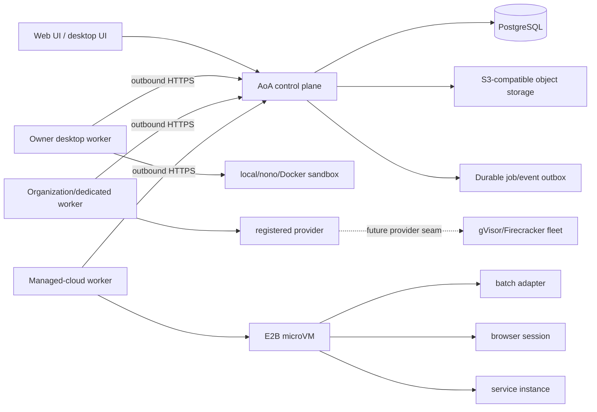
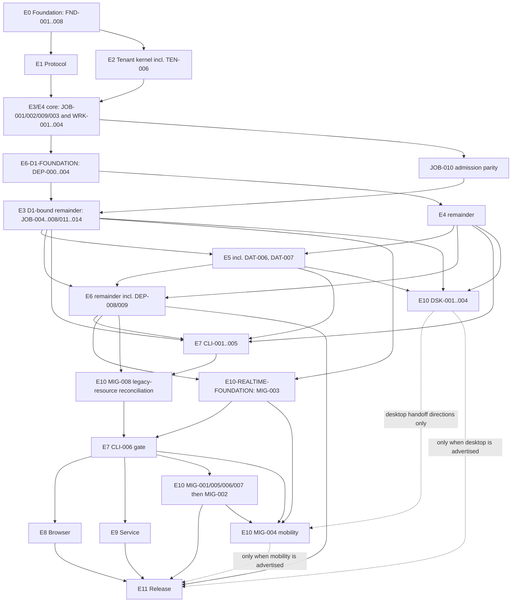

# Cloud Control Plane and Worker Re-platform Program Design

**Date:** 2026-08-08

## Goal

Turn AoA into a hosted control plane that can safely coordinate coding/CLI jobs, browser-automation sessions, long-running service agents, desktop workers, and managed cloud workers without making the existing monolith or any worker-local database a peer source of truth.

The supported hybrid fleet includes laptops running the installed desktop host, Organization-managed/dedicated workers, and isolated managed-cloud sandboxes. They synchronize only through the cloud backplane's versioned envelopes, durable events, object manifests, patches, checkpoints, and artifacts. A laptop is an execution target, not a second control plane.

This document is the portfolio design and groomed program backlog. Each epic is intentionally small enough to receive its own code-level implementation plan before agents implement it.

## Scope decisions

- Design one worker protocol for three workload classes from the start:
  - `batch`: bounded coding and CLI work;
  - `browser_session`: bounded browser automation with screenshots, traces, approvals, and session artifacts;
  - `service`: a desired-state, supervised process that can run for days and be restarted or moved.
- Ship in that order: batch first, browser second, service third.
- The first distributed test deployment is one control-plane replica plus at least two separately deployed workers (different registered target profiles), external PostgreSQL, and S3-compatible object storage. Production-like staging adds a second control-plane replica and shared admission/realtime stores.
- All worker connections are outbound. A worker never needs an inbound firewall opening and never receives database credentials.
- PostgreSQL owns business, policy, scheduler, lease, and audit state. Git owns source history. Object storage owns immutable workspace snapshots, logs, traces, and artifacts. Worker disks are caches plus encrypted unacknowledged event buffers.
- Do not synchronize AoA databases between cloud and desktop systems. Synchronize job envelopes, events, workspace snapshots, patches, and artifacts.
- Long-running services initially support outbound network access under policy and connector/queue consumption. Tenant-defined public ingress is a separate future design because it requires routing, certificates, abuse controls, and another isolation boundary.
- Cloud plugin execution stays blocked until a separately isolated plugin-worker design exists. An agent sandbox does not implicitly make plugins safe.
- Existing `local_trusted` behavior remains available during the migration. New distributed behavior stays behind explicit feature and tenant rollout flags.

## Current-main integration baseline

This design is rebased on `main` at commit `003492988269a91eadfadb352bff7f413fa61adb`, after PR #316 (multi-tenant cloud control plane), PR #317 (MCP OAuth connector broker), PR #318 (enterprise memory), PR #320 (cloud execution isolation on E2B), and the subsequent explicit migration-0188 snapshot/marker workflow for a populated `cloud_auth` flip. Those capabilities are inputs to the re-platform, not parallel systems to replace. [`current-main-crosswalk.md`](current-main-crosswalk.md) freezes the concrete PR #320 execution sinks plus the current deployment-migration seam and assigns each one a bridge, cutover, disablement, drain, rollback, and evidence owner.

- Decision #117's execution-target registry and hardened gVisor seam remain the legacy routing and isolation boundary until the new worker path takes ownership through an explicit cutover. Its process-wide `AOA_ALLOW_UNSANDBOXED_MULTITENANT` escape hatch is legacy-only and must be rejected by `cloud_auth` after FND-005; it is not a fallback for the distributed path.
- PostgreSQL remains authoritative for memory items, visibility, retrieval audit, and actor scope. Distributed workers receive authorized, immutable context inputs or call a tenant-scoped control-plane API; they never receive direct memory-table or database access. Decisions #118 and #119 remain controlling for memory visibility.
- The existing company-scoped MCP OAuth broker remains authoritative for connector discovery, refresh leases, token rotation, and revocation. Distributed execution adds lease-scoped opaque handles and sandbox-local materialization; it does not create a second OAuth token store or serialize refresh/access tokens into job envelopes.
- Decision #104 remains CLI-only: no selectable/direct API extraction engine returns. Self-hosted extraction keeps the installed CLI login; `cloud_auth` resolves the Company's model-provider credential only for sandbox-local CLI execution inside E2B under the 2026-08-08 amendment. CM-013 and DAT-004/DAT-005 own the distinct model-credential materialization boundary; it is neither MCP OAuth authority nor the E2B provider-control credential.
- Decision #120's Commander warm-E2B lifecycle remains authoritative until MIG-005 cuts it over; neither the warm lease nor in-flight Commander work may be silently abandoned or dual-run.
- Decision #103's amended `cloud_auth` rule remains controlling: the hosted control plane must not execute host-resident plugin workers. FND-006 and FND-008 close every currently reachable plugin execution sink; a future isolated plugin-worker design requires its own locked decision and isolation evidence.
- The populated single-tenant→`cloud_auth` migration-0188 gate remains an explicit one-way-door preflight: a verified restorable snapshot precedes the durable marker, and missing opt-in or any snapshot/marker verification failure stops the deployment. DEP-003/MIG-002 may move that seam only with equivalent audit/idempotency/fail-closed behavior and isolated pre-cutover restore validation. REL-003 owns the later full post-cutover disaster-recovery rehearsal as release evidence; it does not block CM-015 or MIG-002 closure. The gate must never become an automatic schema-startup bypass.
- The existing heartbeat, Commander, crew, one-shot CLI, workspace, provider-resolution, environment-lease, and connector paths remain migration sources. A ticket that bridges one of them must first satisfy the frozen current-main crosswalk and must name its shadow, cutover, drain, rollback, and hard-negative evidence.

## Non-goals

- A blank-slate rewrite of the AoA UI, task model, memory model, Commander, or marketplace.
- A microservice per domain in the first release.
- Active-active multi-region control-plane writes.
- Public ingress for tenant service processes.
- Bidirectional database replication between legacy and new modules.
- Enabling the process-wide unsandboxed multi-tenant execution override.
- Treating gVisor, E2B, Daytona, Docker, or nono as the scheduler or worker protocol.
- Building or operating a self-hosted Firecracker worker-node fleet in this program; only the provider-neutral extension seam is in scope.

## Delivery approach

### Rejected: continue patching execution into the server process

This is initially fast, but leaves tenancy, workspace access, child-process execution, cancellation, and secret handling inside the same failure and trust boundary. It also makes desktop and managed cloud execution different products.

### Rejected: full rewrite and big-bang cutover

This provides a clean codebase but discards working product behavior and forces the team to rediscover years of edge cases before producing value. A large agent swarm would increase merge volume without reducing integration risk.

### Selected: contract-first strangler with a modular control plane

Create a versioned protocol package, a separately deployable worker, and focused control-plane modules inside the current monorepo. Preserve existing product APIs and UI wherever possible. Route one golden journey through the new path, then move workloads and tenants incrementally. Keep the control plane as a modular monolith until load or ownership proves a service boundary is necessary.

## Target topology



The control plane may begin as one replica. Correctness must nevertheless live in PostgreSQL transactions and lease fences, not process memory, so a second replica can be added without redesigning jobs.

## Core lifecycle model

### Job, attempt, and lease

A `job` is immutable intent plus aggregate scheduler state. A retry never reopens a terminal attempt; it creates the next increasing `attempt`. An attempt may own at most one active lease, and a replacement lease always receives a new unpredictable fence. Delivery is at least once; externally visible effects must be idempotent.

Required identity chain:

```text
organization -> company -> execution source -> job -> attempt -> lease -> sandbox/service instance
```

`execution source` is a discriminated provenance union, not a claim that every workload has an issue run. It represents a task run, Commander turn, crew run, one-shot extraction/compaction/readiness operation, browser session origin, or service reconciliation. Only a task-run source requires `runId` and `issueId`. Every source records a typed principal (`user`, `agent`, `service`, or `system`) whose branded identifier is opaque non-empty text rather than UUID-only. Every mutation from a worker carries `jobId`, `attempt`, `leaseId`, and the fence. The control plane rejects stale fences even if a late worker successfully finishes computation.

The three state machines are distinct:

- `JobStatus = queued | running | cancel_requested | succeeded | failed | cancelled | dead_letter`. While retry policy remains, the job stays `running`; `dead_letter` is reached when retry/reconciliation policy is exhausted, while `failed` is a non-retryable aggregate failure. Terminal job states are immutable.
- `AttemptStatus = pending | offered | leased | running | cancel_requested | succeeded | failed | cancelled | expired`. Retry creates a new `pending` attempt. Attempt terminals are immutable.
- `LeaseStatus = offered | active | released | expired | revoked`. Lease terminals are immutable. A renewal extends only the matching active lease and echoes the complete job/attempt/lease/fence identity.

Browser-session state and service desired/instance state remain separate from these delivery states. A generic attempt terminal event cannot encode service-instance `healthy`, `stopped`, or `lost`; those use service-instance events and their own transition table.

### Workload-specific lifecycle

| Workload | Lifetime | Completion | Recovery |
|---|---:|---|---|
| `batch` | minutes to hours | terminal result, patch, or artifact | retry a new attempt from a declared base snapshot |
| `browser_session` | minutes to hours | terminal result plus screenshots/trace/video | retry from a clean session or an explicitly approved checkpoint |
| `service` | hours to days | desired state becomes stopped/deleted | reconciler replaces failed instances and advances generations |

A service is not modeled as an infinitely renewed batch job. It has a durable desired-state row, generation, instance records, health state, restart policy, and budget/TTL policy. Each running instance still uses the common lease and event protocol.

E2B continuous-runtime limits are an accepted product constraint, not a change to the lifecycle. A service may span multiple fenced instances through approved checkpoints or replayable input. See [`accepted-caveats.md`](accepted-caveats.md).

## Source-of-truth and synchronization rules

- Business and scheduler writes are accepted only by the control plane.
- Workers append events; they do not directly update run, issue, cost, or membership rows.
- Worker events are idempotent and uniquely ordered by `(job_id, attempt, seq)`.
- The worker retains an encrypted SQLite outbox until cumulative acknowledgement.
- Large files go directly to object storage with short-lived, prefix-scoped upload grants.
- Artifact commit is a fenced control-plane operation that validates hashes, sizes, ownership, and active lease. Stale output uses the separate device-authenticated quarantine operation and can never update the old attempt or become an approved checkpoint automatically.
- Coding outputs are patches or Git commits tied to a declared base hash. Conflicting results are quarantined for review rather than blindly copied over a workspace.
- Browser cookies, storage state, screenshots, videos, and traces are job-scoped artifacts with explicit retention.
- Service state survives only through declared checkpoints, durable external stores, or replayable inputs; local worker disk is never authoritative.

## Security invariants

- A non-owner database role enforces RLS on every tenant-owned table used by the new path.
- The transaction establishes one mandatory Organization context before a tenant repository can execute.
- Duplicated Organization/Company identifiers use composite foreign keys or validated database constraints.
- Worker credentials are short lived, audience bound, target bound, and revocable. The current static worker token may only bootstrap enrollment.
- Registered targets have explicit `platform`, `organization`, or `owner` scope. Platform targets are operator-enrolled global catalog entries with no tenant ownership and no tenant-facing listing; Organization and owner targets use Organization-scoped logical profiles. Job/RLS scope is established before any job detail is released to a platform worker.
- Secret handles, not plaintext secrets, appear in job envelopes.
- Platform-managed secret values are never serialized into protocol objects. Free-form workload strings are not claimed to make arbitrary user-provided secrets structurally impossible; producers scan all strings against registered secret canaries before persistence/dispatch, and typed secret materialization remains separate.
- Secret material is released only after live lease, tenant, actor/owner, target identity/generation, trust, and policy validation, and every release is audited.
- Every governed or metered external effect uses a fence-aware egress proxy or remote service that reauthorizes Organization, job, attempt, lease, fence, target generation, destination, and credential scope for each request. The beta does not materialize platform-managed provider credentials for direct sandbox egress.
- Lease loss revokes effect authority but never prevents safety cleanup. Provider cancel/kill/destroy and ownership-scoped list/inspect/reconcile use a separate, resource-bound, deadline-bounded monotonic cleanup authority that can only reduce or terminate work and cannot create, execute, resume, checkpoint, reveal another resource, or open egress.
- A device-local personal credential may be used only for sandbox-local work or through that same reauthorization path. Direct network use is disabled for the beta because a partitioned/replaced lease cannot revoke it synchronously; any later enablement requires a separate decision, bounded expiry, destination enforcement, and partition/replacement evidence.
- Sandbox egress is default deny. Metadata endpoints, RFC1918 destinations, worker-host control ports, and the AoA data plane are denied unless explicitly required.
- The host worker supervises sandboxes but never executes tenant commands in its own process.
- Each shared-cloud job gets a distinct sandbox, writable workspace, home directory, and process namespace.
- Worker revocation stops new leases, prevents session renewal, cancels active leases, and triggers sandbox termination.
- Target class, Organization/owner binding, trust ceiling, credential ceiling, provider allowlist, locality ceiling, revocation generation, and allowed fallback are server-assigned. Worker-reported capabilities, health, version, and capacity can only narrow eligibility.

## Deployment progression

### D0: Hermetic component tests

Protocol, state-machine, repository, and worker-supervisor tests run without external providers. Every ticket runs its focused tests plus affected-package typecheck/build once. The immutable epic/merge-train/release rollup runs repository checks and each designated critical suite three consecutive times. The exact two-cadence contract is normative in [`test-gates.md`](test-gates.md).

### D1: Distributed local topology

Docker Compose runs:

- `postgres`
- `minio`
- `control-plane`
- `worker` (at least two instances with distinct registered target profiles)
- `fake-sandbox-provider`
- `toxiproxy`
- `test-runner`

The control-plane container has no Docker socket. The worker has no database credentials. They share no writable filesystem volume. Every job crosses the network protocol and object store.

### D2: Real E2B nightly lane

Run a small coding job, cancellation job, artifact round trip, and cleanup reconciliation against E2B. Failures block promotion but do not make ordinary pull requests depend on a vendor.

### D3: Browser nightly lane

Run Playwright inside the remote sandbox against a deterministic test site. Assert browser outputs, egress policy, secret/cookie cleanup, cancellation, and trace retrieval.

### D4: Service canary lane

Run a supervised service continuity/reconciliation lane for at least 72 wall-clock hours. It may cross provider pause/resume or sandbox replacement rather than claiming one uninterrupted E2B process. Restart both control-plane and worker processes, partition the worker, drain it, advance a generation, restore a checkpoint, and verify bounded duplicate work plus stable desired state.

### D5: Staging

Use external PostgreSQL/object storage, at least two control-plane replicas, at least four workers across two failure domains, a shared realtime broker and shared admission/rate-limit store, a managed secret store, central logs/metrics, canary rollout, database backup/restore, and worker revocation exercises.

### D6: Production beta

Enable coding, browser, and service for selected Organizations. Maintain per-workload incident disablement, instant scheduling disablement, provider kill switches, per-Organization concurrency and spend caps, and a documented rollback to the legacy execution path where semantics allow it. A disabled mandatory workload stops or resets the campaign; it does not create a coding-only pass.

Every REQUIRED condition plus the exact HARD and INITIAL promotion thresholds for D0 through D6 are normative in [`test-gates.md`](test-gates.md). An external provider/environment that prevents a required lane or schedule from starting is `blocked_external`, not a pass; after a campaign starts, scheduled external failures remain in the sample set and a missed threshold is `fail`. Security/correctness invariants are never waived by an accepted provider caveat.

## Program completion definition

REL-005 produces a **selected-Organization private beta**, not public GA. Coding, browser, and service are mandatory product workloads for that beta: E7, E8, E9 and D2, D3, D4 must all be complete before REL-005, and the D6 manifest must include all three workloads. Their separate feature flags control per-Organization exposure and rollback only; they do not create a coding-only completion path. The foundation is complete when one cloud backplane can authoritatively place and reconcile work across enabled managed-cloud, dedicated, and installed-desktop targets; all target/credential/locality/fallback choices are auditable; offline and cross-target output is fenced/quarantined; two control-plane replicas preserve correctness; and the required workload plus advertised desktop/mobility matrix passes the same-candidate D0–D6 gates.

Desktop remains off if its separate beta gate has not passed. Public service ingress, cloud plugin execution, active-active multi-region writes, and a self-hosted Firecracker platform remain excluded. Adding a new provider later must require a provider adapter and conformance evidence, not a redesign of control-plane authority, the job/lease protocol, tenant isolation, or workspace promotion.

## Test and merge policy

“Merge now and test later” is prohibited for tenant, lease, secret, migration, and protocol work. It creates failures that are expensive to attribute across parallel agents.

Every ticket must provide:

1. A failing focused test or contract fixture that demonstrates the missing behavior.
2. The minimal implementation.
3. Passing focused tests, typecheck/build for affected packages, and generated-contract checks.
4. A small documentation or runbook update when an operator-visible contract changes.
5. One reviewable commit or a short, clean commit sequence.

Expensive validation is delayed only to a merge train or nightly lane:

| Lane | Frequency | Required coverage |
|---|---|---|
| Focused | every ticket | changed unit/contract/integration tests, affected-package typecheck/build, changed boundary/manifest checks once |
| D0 rollup | every epic/merge train/release candidate | repository typecheck/tests, same-revision recursive build, authoritative root build, and designated critical suites three consecutive times |
| Merge train | every 5–10 merged tickets | D1 distributed happy path and failure injection |
| Nightly | nightly | D1 full suite plus real E2B; browser/service lanes from their first implementation slice onward |
| Weekly | weekly | chaos, cross-tenant adversarial suite, load, backup/restore, leaked-sandbox reconciliation |
| Release | each candidate | all gates, image/SBOM/signature checks, migration rehearsal, rollback rehearsal |

### Integration branch and PR strategy (LOCKED)

The entire program is integrated on **one long-lived branch, `docs/replatform-program`**, as **a single continuous pull request** (currently **PR #323**, kept labeled *WIP — do not merge*). This is a locked operating decision; do not re-litigate it or ask whether to split it:

- **No per-epic PRs and no per-epic merges to `main`.** Every epic's tickets land directly on `docs/replatform-program`. The branch is a strict linear accumulation of E0→E11 work.
- **CI runs on the single PR.** The `pr.yml` gate suite (`verify`, `e2e`, `e2e-pgvector`, `migrations`, `policy`, `brand-check`, `distributed-contract`, `worker-protocol-contract-bytes`, aggregated by the required **`ci-required`** check) re-runs on every push to the PR. This PR *is* the enforcement surface for the "Focused", "D0 rollup", and "Merge train" lanes above — those lanes run against the branch tip, not against separate epic PRs. Each push cancels the prior run's in-flight `verify` (GitHub concurrency); `verify` is the ~25–40 min long pole.
- **CI-green on the branch tip is the integration invariant** that preserves cross-agent attribution (the reason "merge now, test later" is banned) — because there is no second branch to reconcile, a red tip is always attributable to the last push.
- **Manifest/grant blast-radius is expected and reconciled in-branch.** The E2/E3 security certificates are duplicated across several independent oracles (the production grant constants in `job-control-legacy-grants.ts`, the startup gate in `distributed-execution-databases.ts`, the sibling contract test `job-control-legacy-grants.contract.test.ts` with its own hand-transcribed ACL matrix + nullness fixtures, and the raw-SQL audit allowlist in `job-leasing-contract.test.ts`). Any change to a table grant, RLS policy, serving-relation inventory, or authority manifest must be mirrored across **all** of these in the same branch, and typically surfaces over **2–3 CI rounds** of blast radius (sibling certs + platform-specific tests). Budget for that; do not treat a sibling-cert failure as a regression in the change itself.
- **Merge to `main` happens only at the program integration checkpoint** (governed by the Release/gate policy), never per epic. Until then #323 stays open and WIP.

Practical note for future agents: check the vitest `Errors N` line and the *Unhandled Errors* section of the `verify` log, not just the `Tests N passed` count — a 20k-test suite plus per-test embedded-PostgreSQL surfaces tooling-scale flakes (driver teardown races, birpc RPC timeouts) that read as red despite a 100%-green suite. Those are patched via `pnpm.patchedDependencies` (see `patches/postgres@3.4.8.patch`, `patches/vitest@3.2.6.patch`).

## Agent operating model

- One ticket, one branch/worktree, one implementation agent.
- A protocol/schema custodian owns changes to shared protocol types and database migrations. Other agents consume released contracts rather than editing them concurrently.
- No ticket may own both a protocol redesign and a provider implementation.
- Avoid parallel tickets that touch the same migration, state machine, or route module.
- Keep new modules focused; do not add worker logic to `heartbeat.ts` or more process timers to `server/src/index.ts`.
- Use feature flags to merge dormant paths safely, but dormant code still requires tests.
- The merge queue rebases, runs the focused lane, and merges sequentially.
- At each delivery gate, assign one fresh integration agent to run the gate, inspect evidence, and open narrow repair tickets. Do not let implementation agents self-certify the whole gate.
- Freeze contract changes during provider, browser, and service delivery trains except for versioned additive fields.

## Dependency graph



E8/D3 and E9/D4 are unconditional release joins: browser and service are mandatory alongside coding. The dashed edges are the only conditional release joins; a non-desktop, non-mobile beta keeps desktop/mobility flags hard off and supplies negative evidence, while advertising either capability makes its complete closure blocking.

## Definition of Ready for every implementation ticket

A ticket is assignable only when it includes:

- one outcome and explicit non-goals;
- exact dependencies by ticket ID;
- owned module/file area;
- input and output interfaces;
- acceptance examples, including failure behavior;
- named focused test lane and commands in the epic implementation plan;
- migration and compatibility impact;
- authoritative target/owner/trust/locality/fallback and credential impact;
- accepted-caveat impact and provider-neutral extension impact;
- observable signals and rollback/disable mechanism;
- size of no more than three agent-days; otherwise split it. **Exemption (cutover/parity):** MIG-002, MIG-004, MIG-005, MIG-008, and the JOB-010 through JOB-014 legacy-parity tickets are exempt from the three-day bound. They are bounded wiring/parity over existing engines ("no second engine"), so their implementation scope is small; their size is dominated by legacy-parity test matrices, not new code. Each still names one outcome, exact dependencies, rollback/disablement, and is sized by its test-matrix scope in the epic implementation plan. The E11 release/campaign gate tickets (REL-001 through REL-005) are likewise exempt — they are release-orchestration gates sized by evidence scope and multi-day D6 campaign duration, not agent-days, and the Release Owner may split any of them into phased sub-tickets (e.g. evidence rollup / HA-DR rehearsal / final sign-off) at execution time. The exemption is not transitive — no other ticket may exceed three days by citing it.

## Groomed backlog

The backlog contains 95 implementation tickets. Sizes are planning estimates: **S** is up to one agent-day, **M** is up to three. Each ticket is independently reviewable. Code-level file lists, signatures, and red/green commands are produced in the implementation plan for that epic.

### E0 — Program foundation

#### FND-001 — Record the workload lifecycle ADR (S)

- **Depends on:** none.
- **Outcome:** Lock distinct job/attempt/lease delivery machines plus `batch`, `browser_session`, service desired/instance semantics, including time limits, cancellation, retries, checkpoint/quarantine, provider pause/resume, and no public ingress.
- **Acceptance:** Human-readable ADR and machine-readable JSON agree; diagrams, exhaustive allowed/forbidden transitions, reachability, terminal immutability, one example per workload, and heartbeat/Commander/crew/run mapping are present.
- **Test:** Structured checker parses both authorities and rejects graph/table drift; string-fragment presence is insufficient.

#### FND-002 — Record authority and migration ADR (S)

- **Depends on:** none.
- **Outcome:** Declare PostgreSQL/Git/object-store/worker authority and the single-writer strangler rule.
- **Acceptance:** The ADR forbids database peer sync and permanent dual writes, defines cutover ownership per aggregate, and defines quarantine behavior for late worker output.
- **Test:** Architecture checker validates every authority row and single-writer transition.

#### FND-003 — Threat model and trust-boundary inventory (M)

- **Depends on:** FND-001, FND-002.
- **Outcome:** Model tenant, operator, worker host, sandbox, provider, plugin, secret store, object store, and browser-session threats.
- **Acceptance:** Every crossing has authentication, authorization, confidentiality, integrity, revocation, audit, failure mode, severity, owner tickets, and verification lane in machine-readable and rendered forms. The unsafe hosted override is forbidden.
- **Test:** Checker rejects missing attributes/owners/unknown tickets and every Critical/High control without a release test.

#### FND-004 — Golden journey and failure corpus (M)

- **Depends on:** FND-001.
- **Outcome:** Define nine deterministic fixtures covering coding, browser, service, cancellation, egress denial, provider pause/resume, late-output quarantine, and secret-in-argv rejection.
- **Acceptance:** A strict schema covers tenant, typed requester/executor, discriminated execution source, placement, immutable inputs/base, job/attempt/lease/fence, ordered events/digests, artifacts, cost/usage bounds, cancellation/product-approval/runtime-decision, cleanup/timing, terminal state, audit, and forbidden effects.
- **Test:** Schema plus semantic/cross-reference validation for every fixture.

#### FND-005 — Merge gates, feature flags, and ownership rules (M)

- **Depends on:** FND-003.
- **Outcome:** Add the program’s branch protection, merge-train, flag, code-ownership, reproducible-build, and append-only evidence policy.
- **Acceptance:** Distributed execution defaults off and resolves deployment→Organization→workload; public ingress and unsafe hosted fallback remain hard negative; protocol/migration/security custodians, named partial gates, immutable evidence names, and D0–D6 thresholds are documented. Root `pnpm build` remains authoritative until this ticket pins mutable catalog/connector inputs and updates the root script, AGENTS, and every required CI caller together; `pnpm -r build` is additional same-revision package evidence, not a replacement. QA/handoff validation requires full revision, named owner, REQUIRED/HARD/INITIAL/OBSERVED values, requirement IDs, frozen schedule/sample fields, and append-only attempts.
- **Test:** Configuration plus gate/evidence/build-contract checkers prove hosted exclusions, shared-replica ownership, authoritative-build parity, immutable records, and non-waivable HARD failures.

#### FND-006 — Disable cloud plugin process composition (M)

- **Depends on:** FND-003, FND-005.
- **Outcome:** Make Decision #103 true at the PR #320 plugin process/composition boundary instead of trusting the current cloud allowlist or child-process marker.
- **Acceptance:** In `cloud_auth`, `worker-manager`, `worker-fork`, `lifecycle`, and `loader` cannot construct, fork, start, resume, or dispatch a plugin worker; startup cannot use `AOA_PLUGIN_WORKER_PROCESS=1` as a parent-process escape hatch; stale ready rows reconcile to blocked metadata-only state. A rolling multi-replica upgrade denies new activation, drains/cancels queued/running plugin work, terminates every child, and reaches zero runnable work before advancing. Rollback retains the Decision #103 deny boundary and never re-enables hosted plugins. `local_trusted` and single-tenant `authenticated` process behavior remain unchanged.
- **Test:** Five intentional current-defect cases plus passing `ui-static` characterization, six typed-sink GREEN matrix, real-app/startup composition, parent-marker bypass negative, process-spawn/worker-dispatch sentinels, multi-replica drain, stale-row reconciliation, safe rollback, source-boundary mutations, and self-hosted positive regression.

#### FND-007 — Freeze execution sources and legacy parity (M)

- **Depends on:** FND-002, FND-004.
- **Outcome:** Freeze the PR #320 current-system crosswalk, the closed execution-source provenance union, and a machine-readable legacy-control parity matrix before E1 can freeze v1.
- **Acceptance:** [`current-main-crosswalk.md`](current-main-crosswalk.md) covers Decision #117 routing and per-Organization concurrency clamps, heartbeat and warm agent leases, Commander/warm conversation leases, crew, direct one-shot extraction/compaction/supported readiness, workspaces/outputs/previews, connector/OAuth continuity, tenant model-provider credential materialization, E2B provider lifecycle/control credentials/environment leases, the explicit migration-0188 snapshot/marker seam, and every plugin/runtime extension sink. Every row names bridge/disable, shadow, cutover, drain, rollback, hard-negative evidence, and an existing owner ticket. The parity matrix maps each source kind to checkout/assignment, capacity claim/release/wakeup, product/runtime approvals, budgets, audit, cost, outputs/run summaries, completion/cancel/retry, and `not_applicable` rationale. Principal IDs are opaque; only `task_run` requires `runId`/`issueId`.
- **Test:** Structured checker rejects missing/unknown sinks, source variants, parity dimensions, owner tickets, dispositions, cutover phases, migration-0188 snapshot/marker evidence, or unjustified `not_applicable`; mutation fixtures cover fabricated task provenance and sentinel-Organization admission.

#### FND-008 — Disable cloud plugin runtime and browser surfaces (M)

- **Depends on:** FND-006.
- **Outcome:** Close the remaining plugin host APIs/browser surfaces and preserve the already fail-closed external-adapter boundary.
- **Acceptance:** In `cloud_auth`, `loader-import`, `ui-static`, install/reinstall/upgrade/uninstall, tools, jobs, webhooks, MCP bridge/RPC, streams/events, UI/static contributions, and background activation fail before package I/O, import, dispatch, process, or browser-code effects. Registered HTTP denials preserve Decision #103's exact 503 `PLUGIN_WORKER_BLOCKED_IN_CLOUD` envelope/docs pointer, persisted `statusReasonCode`, and marketplace `errorCode`/`errorDocs`; non-HTTP surfaces use a typed equivalent. External-adapter install/load/reload/UI-parser exclusions remain intact. Metadata-only reads do not evaluate executable manifests. Rolling upgrade drains queued/running work and subscriptions across replicas; rollback retains the deny contract. Self-hosted behavior remains unchanged and there is no operator escape hatch.
- **Test:** Real-app exact-denial route matrix; persisted/marketplace code checks; package-I/O/import/static/dispatcher sentinels; scheduled/webhook/tool/job/MCP negatives; cached UI and stale/queued/running-row drain cases; external-adapter exclusion regression; safe-rollback and source-boundary mutations; and self-hosted positives.

### E1 — Versioned worker protocol

#### PRT-001 — Create the worker-protocol package (S)

- **Depends on:** FND-001.
- **Outcome:** Add a dependency-light package containing wire types, validators, constants, and JSON fixtures, usable by server and worker without importing either.
- **Acceptance:** Package builds in isolation, publishes no Node-only runtime dependency or private source subpath, exposes only the reviewed built root API, and packs exact runtime/declaration bytes usable without source-tree resolution.
- **Test:** Package typecheck/build/pack, exact-tarball import smoke from server and minimal worker fixtures, and static/dynamic/bare-builtin import-boundary bypass corpus.

#### PRT-002 — Define identifiers and state machines (M)

- **Depends on:** PRT-001, FND-007.
- **Outcome:** Generate branded IDs and distinct job, attempt, lease, browser-session, service, and service-instance transitions from the machine-readable E0 lifecycle contract.
- **Acceptance:** Unknown states fail closed; `dead_letter` is reachable only with explicit `policy_exhausted` reason and `failed` only with `non_retryable_failure`; retry creates a new attempt; a `park_run` human-wait ends the current attempt and releases its lease, resuming as a new fenced attempt rather than a compute-holding parked state; service health/stop/loss never masquerade as generic attempt terminal states; terminals are immutable.
- **Test:** Exhaustive Cartesian state/reason transition tests compared with the E0 JSON authority, including false exhaustion reasons and every illegal/cross-lifecycle transition.

#### PRT-003 — Define job and lease envelopes (M)

- **Depends on:** PRT-002, FND-003.
- **Outcome:** Define immutable job input and discriminated provenance, capability requirements, lease ACK, renewal, cancellation, deadlines, attempt number, and fencing token.
- **Acceptance:** Tenant IDs, strict `task_run | commander_turn | crew_run | one_shot | browser_request | service_reconcile` source, typed requester/executor, authoritative placement-policy reference, target requirements, and policy hashes are mandatory. Principal IDs are opaque text; only task runs require `runId`/`issueId`. Platform-managed secret material uses typed opaque handles only. Workload-supplied workspace paths use sandbox-relative branded paths; the only sandbox-absolute path is a typed secret-file target under `/run/aoa-secrets/`. Neither form can represent a host path. Safe additive data is limited to bounded namespaced extensions with explicit `critical`/`mustUnderstand` behavior; arbitrary free-form strings receive producer-side known-secret-canary scanning before persistence or dispatch.
- **Test:** Every source-kind valid/invalid structural round trip; fabricated task identity and task execution-principal/assignee mismatch; explicit JOB-001/JOB-010 requester-authorization handoff; POSIX/Windows host-path rejection; secret canaries in argv/URL/header/extension strings; critical-extension rejection; and complete delivery identity echo on ACK/renew.

#### PRT-004 — Define worker event and acknowledgement protocol (M)

- **Depends on:** PRT-002.
- **Outcome:** Define sequenced event batches, cumulative ACKs, logs, metrics, state transitions, browser observations, and service health events.
- **Acceptance:** Events require authenticated `(Organization, Company, worker, job, attempt, lease, fence, seq)` identity plus `eventDigest`, the lowercase SHA-256 of the RFC 8785 canonical JSON for every immutable event field except the digest itself. Producer and receiver recompute it; the receiver authorizes all presented identities against the active lease and rejects a mismatch before persistence. Retransmitting an already committed ID/digest is idempotent; a duplicate ID with different recomputed digest is rejected and audited; duplicate IDs inside one submitted batch are invalid. Service-instance started/health/checkpoint/stop/lost/interrupted/resumed events carry service, instance, and generation identity. Large payloads use blob references.
- **Test:** Canonical key-order/number/Unicode bytes, mutation without rehash, retransmit, in-batch duplicate, stored-digest conflict, gap, out-of-order, service transition, stale-fence, and cumulative-ACK fixtures.

#### PRT-005 — Define artifacts, workspaces, secrets, and network policy (M)

- **Depends on:** PRT-003, FND-003.
- **Outcome:** Define workspace manifests, patch manifests, ordinary fenced artifact commits, device-authenticated quarantine uploads, secret handles, retention, and default-deny egress policy.
- **Acceptance:** Object keys are tenant/job/attempt scoped; size/hash are mandatory; sensitive browser artifacts have explicit retention. Ordinary commit requires the current fence. Quarantine has a separate prefix and operation, records observed identity/hash/size/sensitivity/reason, returns an orphan receipt, and exposes no auto-apply or checkpoint-selection operation.
- **Test:** Cross-tenant key, path traversal, oversized object, forbidden network, secret-canary, active commit, stale-fence quarantine, wrong prefix/hash/size, and quarantine non-promotion fixtures.

#### PRT-006 — Capability and protocol negotiation (S)

- **Depends on:** PRT-003, PRT-004, PRT-005.
- **Outcome:** Define worker version/range, server-registered target profile, worker-reported dynamic platform/capacity/capabilities, policy version, and must-understand negotiation.
- **Acceptance:** Eligibility is the intersection of the server target profile and worker report. A worker cannot advertise its way into a higher trust/provider/credential/locality class. Every source variant and opaque principal survives the context-free syntax conformance corpus. Reserved/sentinel and requester-authority denials remain policy conformance owned by TEN-006 and JOB-001/JOB-010; the UUID syntax schema does not pretend to know domain admission state. Unknown critical extensions and policy versions fail closed; safe optional extensions may be ignored and preserved.
- **Test:** Current/N-1 negotiation, every structurally checkable source variant and mismatch, false privileged advertisement, workload-slot, policy-version, must-understand, and no-overlap matrices; TEN-006/JOB-001/JOB-010 separately exercise sentinel/unmapped and requester-authority admission.

#### PRT-007 — Define transport, control, error, and frozen cross-version contracts (M)

- **Depends on:** PRT-003, PRT-004, PRT-005, PRT-006.
- **Outcome:** Define framework-neutral enrollment, poll/offer/no-work, ACK, renew, event upload, artifact/quarantine control, cancel, separate product-approval and runtime-decision request/results, checkpoint, graceful-stop/drain command ACKs, stable error codes, retry hints, server time, authentication audience, anti-replay, and final frozen compatibility corpus.
- **Acceptance:** Product approvals and runtime decisions have distinct IDs, digests/versions/TTL/idempotency semantics and cannot be worker-created or conflated. Runtime decisions are a strict `permission | work_question` union: permission preserves `allow_once | allow_run | allow_always | deny`, work questions preserve bounded options and answer payload, and both bind source revision plus timeout policy. `continue_with_default` binds an explicit validated default: permission permits only `allow_once | allow_run | deny` as a timeout default, while a work question has exactly one bounded default option; missing, multiple, mismatched, or `allow_always` timeout defaults fail closed. `park_run` releases the active sandbox lease and ends the current attempt without holding compute: the job stays open awaiting the human answer, and a new fenced attempt is dispatched on answer or on the validated timeout default — no managed-sandbox (E2B) VM is held across the wait (CAV-001), and resume follows the fenced-restart handoff (CAV-003). Every operation names request/response schemas, correlation/idempotency identity, payload/timeout/retry rules, and stable errors for malformed, unauthorized, incompatible, stale fence, sequence gap, event hash mismatch, revoked target, throttled, oversized payload, and terminal states without tenant-existence or secret disclosure. The complete v1 consumer is frozen only after PRT-007 exists, hash pinned, and proven independent from current source. Because the first distributed release has no earlier consumer, its gate records `baseline_established`; the first and every later contract change must prove current-producer→frozen-consumer and frozen-producer→current-consumer behavior for all common surfaces, plus fail-closed negotiation for unsupported critical behavior.
- **Test:** Frozen valid/invalid vectors for every source, product/runtime approval separation, nonce/digest/version/TTL, lost responses, retry-after, duplicate requests, stale fence, sequence gap, event hash mismatch, revocation, incompatible version/capability, oversized payload, unknown control/error, safe additive preservation, critical-extension rejection, unknown-state rejection, fixture-source independence, and manifest hashes. After the baseline, run the same corpus bidirectionally against the oldest supported frozen consumer.

### E2 — Tenant-safe control-plane kernel

#### TEN-001 — Introduce new-path tenant schema and repository boundary (M)

- **Depends on:** FND-002, FND-003.
- **Outcome:** Define normalized Organization-owned job/worker/service tables and tenant-scoped repository interfaces without the sentinel Organization default.
- **Acceptance:** Every owned row has non-null Organization identity; Company-owned rows prove the Company belongs to the same Organization; raw unscoped repository reads are not exported.
- **Test:** Migration integration test and compile-time repository API test.

#### TEN-002 — Enforce a non-owner database role and RLS harness (M)

- **Depends on:** TEN-001.
- **Outcome:** Run application queries with a non-owner role and force RLS on new-path tenant tables.
- **Acceptance:** Missing tenant context returns no tenant rows or raises an error by policy; owner/superuser credentials are absent from the application container; migrations use a separate role.
- **Test:** Real PostgreSQL cross-tenant read/write/delete and missing-context suite.

#### TEN-003 — Mandatory transaction tenant context (M)

- **Depends on:** TEN-002.
- **Outcome:** Provide one transaction wrapper that sets Organization context and exposes tenant repositories only inside the callback.
- **Acceptance:** HTTP, scheduler, reconciliation, and worker-event paths use the wrapper; context cannot leak through pooled connections.
- **Test:** Concurrent two-tenant pool reuse, rollback, nested transaction, and background-job tests.

#### TEN-004 — Composite tenant integrity constraints (M)

- **Depends on:** TEN-001.
- **Outcome:** Add composite uniqueness and foreign keys for job/company/run, worker/Organization, artifact/job, service/company, and secret-handle ownership.
- **Acceptance:** Direct SQL cannot construct mixed-tenant relationships even when application checks are bypassed.
- **Test:** Negative migration integration cases for every composite relationship.

#### TEN-005 — Tenant adversarial property suite (M)

- **Depends on:** TEN-003, TEN-004.
- **Outcome:** Generate randomized tenant graphs and attempt cross-tenant identifiers through repositories, HTTP endpoints, worker events, WebSockets, and object keys.
- **Acceptance:** Every operation fails closed without disclosing existence; failures are audited where appropriate.
- **Test:** Seed-reproducible property suite in the merge-train lane.

#### TEN-006 — Remove the sentinel Organization default (M)

- **Depends on:** TEN-001, FND-007.
- **Outcome:** Remove the fail-open sentinel Organization default from existing Company creation and every writer that can feed distributed execution, then backfill and constrain real Organization ownership before new-path multi-Organization writes are enabled.
- **Acceptance:** No schema default, seed, route, background job, import, or test helper may silently assign the sentinel Organization. Every existing Company is mapped through an explicit idempotent migration or blocks rollout with an attributable remediation record; unresolved rows cannot submit, place, lease, receive events, or own objects. Rollback preserves the explicit mapping and never restores a fail-open default.
- **Test:** Generated-migration integration, full Company-writer inventory, missing/invalid Organization negatives, idempotent backfill, rollback rehearsal, and distributed submit/placement denial for unmapped rows.

### E3 — Durable job control

#### JOB-001 — Submit immutable jobs transactionally (M)

- **Depends on:** PRT-003, TEN-003, TEN-006.
- **Outcome:** Create a job plus outbox notification in the same transaction from an authorized discriminated execution source.
- **Acceptance:** Client idempotency key prevents duplicate jobs; source provenance, input hash, and policy snapshot are immutable; only `task_run` sources require `runId`/`issueId`; the control plane validates `requestedBy` against authenticated/domain authority and rejects sentinel or unmapped Organization admission before persistence; no worker is contacted inside the transaction.
- **Test:** Duplicate submission, transaction rollback, tenant/requester-authority mismatch, sentinel/unmapped Organization, and concurrent submit tests.

#### JOB-002 — Enroll workers with device-bound identity (M)

- **Depends on:** PRT-006, PRT-007, TEN-003.
- **Outcome:** Enroll platform-managed, Organization-managed/dedicated, and owner-desktop workers with durable device identity, scoped logical target profiles, and explicit lifecycle.
- **Acceptance:** Single-use codes expire; `platform` profiles are operator-only with null Organization/owner and no tenant-facing enumeration; `organization` profiles bind Organization; `owner` profiles bind Organization plus owner; one device may have multiple Organization-scoped logical profiles. Sessions are short lived, audience/target/generation bound, and carry no authority beyond the selected profile. Rotation, reinstall, replacement, transfer, loss, owner membership removal, revocation, and deletion have explicit audited behavior.
- **Test:** Replay, expiry, platform-enrollment authorization, cross-tenant target enumeration, wrong Organization/owner, multi-Organization logical profiles, owner removal, replaced generation, rotated key, reinstall, transfer denial, revocation, and token-audience tests.

#### JOB-009 — Make hybrid target placement authoritative (M)

- **Depends on:** FND-002, PRT-006, PRT-007, TEN-003, TEN-004, JOB-001, JOB-002.
- **Outcome:** Persist one authoritative placement policy/decision selecting legacy, managed-cloud, dedicated-worker, or owner-desktop execution from rollout, workload, credential binding, scoped target profile, trust, verified capability, resolved provider constraints, locality, capacity, and health.
- **Acceptance:** One job/attempt has one target and execution owner; workers cannot self-select or self-promote; the placement transaction preserves job RLS before releasing details even for a global platform target; personal credentials remain bound to their authorized owner target; required/preferred/forbidden targets and explicit fallback are immutable and auditable; provider profile hash/runtime/resource/operation/locality ceilings are evaluated before lease; unavailable, revoked, unmapped, over-limit, or locality-incompatible targets queue or fail closed rather than silently widening placement. Shadow placement cannot lease or cause effects.
- **Test:** Mixed target-scope/tenant/workload property tests, global-target cross-tenant non-disclosure, false privileged capability/limit, provider-profile mutation/hash mismatch, owner mismatch/removal, target generation replacement, concurrent capacity, drain/revocation, required target offline, permitted/forbidden fallback, personal credential binding, local-only data, shadow mode, and deterministic replay.

#### JOB-003 — Lease and ACK compatible jobs atomically (M)

- **Depends on:** JOB-001, JOB-009, PRT-007.
- **Outcome:** Lease the oldest eligible job only through its authoritative placement decision and registered target profile.
- **Acceptance:** Concurrent workers cannot own the same attempt; lease includes ACK deadline, expiry, and fence; incompatible workers see no job details.
- **Test:** Real PostgreSQL concurrent-claim and capability-selection tests.

#### JOB-004 — Renew leases and enforce fencing (M)

- **Depends on:** JOB-003, E6-D1-FOUNDATION.
- **Outcome:** Renew only the active lease and require its fence for events, artifacts, secret access, completion, and service health.
- **Acceptance:** Expired or replaced workers cannot mutate state; lease duration and renewal interval are server policy, not worker choice.
- **Test:** Clock-boundary, stale fence, duplicate renew, revoked worker, and replacement-attempt tests.

#### JOB-005 — Ingest events and terminal results idempotently (M)

- **Depends on:** JOB-004, PRT-004.
- **Outcome:** Store event batches with unique sequence constraints and transactionally project accepted state changes.
- **Acceptance:** Duplicate batches return the same cumulative ACK; gaps are rejected with expected sequence; terminal result is accepted exactly once.
- **Test:** Duplicate, out-of-order, partial retry, concurrent terminal, and control-plane restart tests.

#### JOB-006 — Cancellation, expiry, retry, and reconciliation (M)

- **Depends on:** JOB-004, JOB-005.
- **Outcome:** Add requested cancellation, lease reaping, bounded retry/backoff, dead-letter/quarantine, and leaked-attempt reconciliation.
- **Acceptance:** Cancellation is observable to the worker; expiry eventually creates a new attempt or terminal failure by policy; late results never overwrite the winner.
- **Test:** Disconnect before ACK, after ACK, during execution, during upload, and after terminal commit.

#### JOB-007 — Organization quotas and worker revocation (M)

- **Depends on:** JOB-003, JOB-006.
- **Outcome:** Enforce per-Organization running limits, workload-specific capacity, spend/runtime caps, and immediate target revocation.
- **Acceptance:** Revocation blocks refresh and new leases, marks active leases canceled, and requests sandbox termination; capacity is not released twice.
- **Test:** Concurrent quota claim, revocation race, budget exhaustion, and capacity reconciliation tests.

#### JOB-008 — Operator job and worker controls (M)

- **Depends on:** JOB-005, JOB-006, JOB-007, JOB-009.
- **Outcome:** Expose tenant-scoped job/attempt/event/worker/placement status, cancellation, drain, and revocation through control-plane APIs and a minimal operations UI.
- **Acceptance:** Operators can explain target selection/fallback denial and why a job is queued or terminal, inspect redacted durable evidence, cancel an attempt, drain a worker, and revoke a target without secret material or cross-tenant identifiers. Until `E10-REALTIME-FOUNDATION` passes, the UI uses explicit refresh and makes no durable realtime catch-up claim.
- **Test:** API authorization/contract tests plus UI tests for queued, leased, canceling, failed, revoked, and stale-worker states.

#### JOB-010 — Preserve admission and assignment invariants (M)

- **Depends on:** TEN-006, JOB-001.
- **Outcome:** Reuse the current atomic issue checkout and single-assignee authority for task-run submission while defining explicit admission/idempotency rules for Commander, crew, one-shot, browser, and service sources.
- **Acceptance:** Each execution-source kind names its checkout/assignment rule or `not_applicable` rationale. Task admission preserves dependency eligibility, single assignee, idempotent same-source replay, and the current explicitly bounded stale-owner adoption behavior. A task cannot submit for the wrong assignee or bypass the current atomic conditional-checkout contract; concurrent legacy/distributed submission has one winner; reassignment or status change cancels/fences the losing execution; failed submission or pre-lease rollback releases the same authoritative claim exactly once; no bridge invents a second assignment store. The observable single-winner contract is authoritative; the plan does not freeze a stale SQL implementation detail.
- **Test:** Dependency eligibility, concurrent checkout/submit, same-source replay, stale-owner adoption boundary, legacy/distributed race, assignee mismatch/removal/reassignment, status-change fencing, source-kind admission matrix, duplicate idempotency key, failed submission, and rollback release.

#### JOB-011 — Preserve approvals and completion policy (M)

- **Depends on:** PRT-007, JOB-006, JOB-010.
- **Outcome:** Route existing product-action and crew-dispatch approvals, durable runtime decisions, and completion policy through the distributed lifecycle without creating a second policy engine.
- **Acceptance:** Product approvals and PRT-007 nonce/digest/version/TTL-bound runtime decisions remain separate aggregates. Denial/timeout fails closed before the governed effect; worker events cannot create, approve, or override policy; cancel, retry, and cutover rollback preserve current completion and approval semantics.
- **Test:** Product approval and runtime-decision request/result allow/deny/timeout/default/mismatch, including missing/multiple/invalid defaults and forbidden persistent timeout grant; crew-dispatch approval, completion-policy matrix, retry, stale worker event, and rollback with active work.

#### JOB-012 — Preserve budget and authoritative cost policy (M)

- **Depends on:** JOB-005, JOB-007, JOB-010.
- **Outcome:** Preserve agent/Company/department spend/runtime policy, warnings/incidents, and authoritative usage/cost attribution without creating a second budget or pricing engine.
- **Acceptance:** Worker usage is evidence, not a charge. The control plane creates one authoritative cost event per accepted event/job/attempt from server-owned provider, model, biller, billing type, rate/version, and rounding policy. Every applicable budget scope is checked at admission and before the next governed effect; post-cost evaluation, warnings/incidents, exhaustion pause/cancel, reservation release, and capacity release are idempotent and occur exactly once. Duplicate/replayed events do not double-charge, and rollback preserves current hard-stop semantics.
- **Test:** Worker-supplied price/rate rejection; server rate/version/rounding fixtures; duplicate usage/cost; each budget scope; admission/effect/post-cost checks; warning/incident idempotency; concurrent exhaustion; pause/cancel/reservation/capacity release; retry attribution; and active-work rollback.

#### JOB-013 — Preserve transactional activity audit (M)

- **Depends on:** JOB-005, JOB-010, JOB-011, JOB-012.
- **Outcome:** Project accepted distributed state changes, controls, and accounting into the existing tenant-scoped activity and hub-audit contracts without treating worker observations as accepted product actions.
- **Acceptance:** The accepted mutation and its audit projection commit in one control-plane transaction; publication follows commit. Duplicate/replayed events do not duplicate activity; actor/source/job/attempt identity and affected domain resource remain attributable; rejected/stale worker observations create no accepted product action; self-hosted audit semantics remain compatible.
- **Test:** Per-source accepted/rejected/stale mutations, approval and budget actions, duplicate/replay, transaction rollback, publication-before-commit denial, tenant scope, actor attribution, and cutover rollback.

#### JOB-014 — Preserve task outputs and run summaries (M)

- **Depends on:** JOB-005, JOB-006, JOB-010, JOB-011, JOB-012, JOB-013.
- **Outcome:** Project accepted artifacts and terminal state into the current task-output, review, primary-selection, run-summary, and terminal-status contracts.
- **Acceptance:** Artifact commit remains distinct from explicit task-output projection. Provider/external idempotency identity, primary-output rules, review state, typed creator/source provenance, and run-summary behavior are preserved. Success/failure/cancel/dead-letter creates the correct summary exactly once; stale or losing-attempt output is quarantined and cannot become the selected result; self-hosted projections remain compatible where the product contract requires it.
- **Test:** Duplicate provider/external identity, primary/review transitions, retry attribution, stale completion, output selection/quarantine, Commander/crew/one-shot projections, terminal-state and run-summary parity, and rollback after accepted versus unaccepted artifacts/events.

### E4 — Worker daemon

#### WRK-001 — Scaffold the separately deployable worker (S)

- **Depends on:** PRT-001, FND-005.
- **Outcome:** Add a workspace package and container entrypoint with strict config parsing, structured logs, graceful shutdown, and no server/database imports.
- **Acceptance:** Worker starts without database credentials, exposes only local health/metrics, and exits on invalid endpoint or trust configuration.
- **Test:** Build, config matrix, signal handling, and dependency-boundary test.

#### WRK-002 — Device identity and session renewal (M)

- **Depends on:** WRK-001, JOB-002.
- **Outcome:** Generate/store a worker key, enroll, maintain short-lived sessions, and handle rotation/revocation.
- **Acceptance:** Private key never enters logs/config files; container mode supports mounted secret storage; desktop mode exposes an OS-keychain interface.
- **Test:** Enrollment fake server, token expiry, key rotation, corrupt key store, and revoked-session tests.

#### WRK-003 — Poll, ACK, and capability advertisement (M)

- **Depends on:** WRK-002, JOB-003.
- **Outcome:** Long-poll for work, advertise measured capacity/capabilities, ACK promptly, and enforce local concurrency.
- **Acceptance:** Worker does not prefetch secrets or broad queues; backoff is bounded and jittered; shutdown stops leasing before draining work.
- **Test:** Empty poll, compatible job, incompatible job, backpressure, API outage, and drain tests.

#### WRK-004 — Sandbox supervisor and process-tree cancellation (M)

- **Depends on:** WRK-003, PRT-003.
- **Outcome:** Define provider-neutral create/execute/cancel/kill/destroy plus list/inspect and idempotent reconcile/cleanup supervision, with negotiated checkpoint/restore and health capabilities, while keeping tenant commands outside the worker process.
- **Acceptance:** Lease loss withdraws effect authority but triggers cancellation and eventual kill through a distinct monotonic cleanup authority bound to provider resource/ownership labels, target generation, job/attempt/lease/observed fence, and deadline. Cleanup can only list/inspect matching resources through a management-only projection or cancel/kill/destroy/reconcile; even same-resource inspection cannot return command, environment, logs, secrets, workspace/customer bytes, or object grants. It cannot create, execute, resume, checkpoint, reveal other resources, or open egress. Provider operations have deadlines and stable idempotency keys; unsupported checkpoint/restore/health calls fail explicitly rather than being guessed; sandbox identity and provider operation IDs are attached to all logs and cleanup records.
- **Test:** Fake provider happy path, capability negotiation, unsupported optional operations, hung create, ignored cancel, forced kill after lease expiry/replacement, denial of every effectful operation under cleanup authority, cross-resource/target label denial, same-resource safe-projection redaction, lost-response replay, list/inspect pagination, idempotent cleanup, cleanup-authority expiry/escalation, destroy failure, checkpoint/restore/health when advertised, leaked-resource reconciliation, and worker shutdown tests.

#### WRK-005 — Lease renewal and local fence enforcement (M)

- **Depends on:** WRK-004, JOB-004, E6-D1-FOUNDATION.
- **Outcome:** Renew while active and close ordinary control/data paths plus fence-aware governed egress after fence loss or expiry.
- **Acceptance:** After fence loss the worker cannot use ordinary artifact commit, fetch secrets, complete, or perform governed effects. The local proxy closes at the locally known lease deadline even while disconnected, and a remote proxy rejects a replaced generation/fence immediately. It may retain encrypted orphan output and use only the distinct device-authenticated quarantine upload defined by PRT-005/PRT-007. Offline policy is immutable per workload.
- **Test:** Control-plane partition with Internet still reachable, delayed renewal response, clock skew tolerance, remote fence replacement, locally expired proxy session, direct-destination denial, replacement attempt, quarantine-only reconnect, and no post-fence governed-effect tests.

#### WRK-006 — Encrypted SQLite event outbox (M)

- **Depends on:** WRK-005, JOB-005.
- **Outcome:** Persist sequenced events locally until cumulatively acknowledged.
- **Acceptance:** Restart resumes from the last ACK; queue size and disk limits are enforced; sensitive payloads are encrypted or referenced as blobs.
- **Test:** Crash between send/ACK, duplicate send, corrupt row quarantine, full disk, and sequence recovery tests.

#### WRK-007 — Restart recovery and orphan cleanup (M)

- **Depends on:** WRK-004, WRK-006, JOB-006.
- **Outcome:** On startup, reconcile local sandboxes/outbox rows with control-plane lease state.
- **Acceptance:** Live owned work resumes only when policy permits; stale sandboxes are killed; unknown artifacts are quarantined; cleanup is observable and retryable.
- **Test:** Crash at each lifecycle checkpoint using the fake provider.

#### WRK-008 — Serve a worker its own registered self-model (S)

- **Depends on:** JOB-002, PRT-006.
- **Outcome:** A worker-authenticated read of its OWN execution target's registered profile and provider-constraint profile, so a daemon can assemble the `WorkerSelfModel` the poll loop requires. Closes the control-plane half of the E4-D12 live-dispatch gap without a frozen wire change. **Slice 1 (control plane) has landed; slice 2 (daemon assembly and composing the loop) is OUTSTANDING and is where live dispatch actually begins.**
- **Acceptance:** The route carries no target, organization, or slug identifier — the target comes from the authenticated principal, so cross-tenant reach is answered by construction rather than by a check that can drift; a legacy credential, a stale device generation in either direction, a revoked or disabled target, and an absent profile each refuse with the same coarse code; the route is not mounted at all when distributed execution is off.
- **Test:** Unit admission matrix plus embedded-PostgreSQL integration proving the provider-constraint profile still brands after a live JSONB round trip, with a mutated-field pair proving that check can fail.

#### WRK-009 — No fabricating provider in the shipped worker image (S)

- **Depends on:** WRK-004, DEP-001.
- **Outcome:** Remove the success-fabricating test double from the worker daemon's production source tree and prove, against the BUILT image, that it is gone. A default `createFakeSandboxProvider` returns exit 0, which the supervisor maps to `terminal{status:"succeeded"}`, completing a tenant attempt for work that never ran.
- **Acceptance:** The built worker image contains no fake/test-double provider and no test tree of our own emitted output; the assertion is proven to FAIL against the pre-move image; images are reproducible from source (build outputs are excluded from the build context, so a file removed in source cannot keep shipping).
- **Test:** Image-content assertions run in the D1 lane against the freshly built images — the lane that has both a Docker daemon and both images — verified as executing, not skipping.

### E5 — Workspaces, artifacts, secrets, and network policy

#### DAT-001 — Immutable workspace snapshot format (M)

- **Depends on:** PRT-005, TEN-004.
- **Outcome:** Create canonical manifests for either a Git commit base or a content-manifest base, recording algorithm/revision, dirty state, tracked/untracked inclusion, ignore and case policy, provenance, normalized paths, sizes, hashes, executable bits, and object references.
- **Acceptance:** Git and non-Git granted folders snapshot deterministically; dirty/untracked content follows the declared inclusion policy; path traversal, symlink escape, device files, case collisions, ignored-file leakage, base-algorithm mismatch, and size limits fail closed.
- **Test:** Cross-platform Git-clean/Git-dirty/non-Git folder manifest fixtures, including untracked include/exclude, ignore rules, case sensitivity, executable bits, traversal/symlink/device attacks, and repeatable content-base hashes.

#### DAT-002 — Direct upload/download and fenced artifact commit (M)

- **Depends on:** DAT-001, JOB-004.
- **Outcome:** Issue scoped object-storage grants and commit verified manifests through the control plane.
- **Acceptance:** Worker uploads bypass the API body path; wrong prefix/hash/size/tenant/fence cannot be committed; incomplete uploads expire.
- **Test:** MinIO integration suite with malicious keys and stale fences.

#### DAT-003 — Patch output and conflict quarantine (M)

- **Depends on:** DAT-002.
- **Outcome:** Represent coding output as patch/commit plus base/result hashes and provide an explicit apply/review service.
- **Acceptance:** Matching base applies deterministically; mismatched base never auto-applies; binary and large outputs use artifact references.
- **Test:** Clean apply, conflicting base, rename, deletion, binary, and duplicate-result tests.

#### DAT-004 — Lease-scoped secret broker (M)

- **Depends on:** JOB-004, JOB-009, TEN-004, PRT-005.
- **Outcome:** Extend the existing secret and MCP OAuth broker paths with opaque execution handles resolved only for an active compatible lease and per-request fence authorization; define the same lease/fence broker contract for a device-local personal credential without creating or uploading a competing credential/token store.
- **Acceptance:** The tenant worker protocol and sandbox cannot list secrets or receive connector refresh tokens or provider-control credentials; owner-only credentials enforce dispatching identity. A device-local handle resolves only inside its OS-protected target broker and binds Organization, owner, job, attempt, lease, fence, target generation, destination, and policy; the control plane receives identity/status/audit metadata, never its value. Governed connector/header materialization occurs only inside the fence-aware proxy or remote service; platform-managed credentials never become direct sandbox egress credentials; revoke/rotate/membership loss/fence or target replacement takes effect without rebuilding job envelopes. The separate provider-management credential lifecycle is owned by DEP-006/CLI-001, not this tenant credential broker.
- **Test:** Wrong tenant/job/target/owner, stale/replaced fence, worker partition with Internet available, owner membership removal, underlying local credential present but AoA activation revoked, connector refresh race, rotation/revocation, direct platform-materialization denial, plaintext-token rejection, and audit-integrity tests. DSK-001/002 run the local-broker cases on every advertised OS.

#### DAT-005 — Egress policy and credential redaction (M)

- **Depends on:** DAT-004, WRK-004.
- **Outcome:** Enforce default-deny destination policy through the fence-aware egress path, block private/metadata/control-plane ranges and direct bypass, and redact known secret values from events.
- **Acceptance:** Every governed request carries reauthorized lease/fence/target/destination context; DNS rebinding and direct IP variants are handled; bypassing the proxy is denied; policy version is recorded; redaction applies before the local outbox; missing authorization or telemetry fails closed.
- **Test:** Fake DNS/HTTP targets, direct-socket and alternate-protocol bypass, control-plane partition with Internet available, replaced-fence denial, expiry, destination mutation, plus log and artifact-leak corpus.

#### DAT-006 — Reconcile local workspaces and orphan output (M)

- **Depends on:** FND-002, JOB-006, WRK-007, DAT-003, PRT-007.
- **Outcome:** Admit explicit local folder grants, stage isolated snapshots, and reconcile desktop/dedicated results against the declared base, owner, placement, attempt, lease, and fence through valid promotion or quarantine.
- **Acceptance:** Matching active output commits idempotently; expired, replaced, wrong-owner, locality-denied, base-mismatched, or duplicate output never overwrites the source tree. Orphan upload uses the distinct quarantine prefix/operation, retains hashes/provenance, and cannot update the old attempt. Applying a patch revalidates the current local base.
- **Test:** Folder/symlink/case/special-file escape, dirty/untracked snapshot, likely-secret exclusion, disconnect/restart, stale fence, replacement attempt, advanced base, duplicate/rename/delete/binary patch, partial write/full disk, orphan recovery, locality allowed/denied, and repeated reconciliation.

#### DAT-007 — Brokered internal tool surface over the worker path (M)

- **Depends on:** DAT-004, JOB-002.
- **Outcome:** Relocate #320's in-process brokered internal AoA tool surface (memory, tasks, goals, artifacts, `use_skill`, `ask_human`) so a remote-worker sandbox reaches it as a tenant-scoped control-plane API authenticated by the run-JWT, preserving the per-actor RBAC gate. Do not create a second tool registry, memory store, or task store; the control plane remains the sole executor of tool effects.
- **Acceptance:** Tool serving enforces Decision #118/#119 visibility for the resolved actor kind (org/crew/Commander), scoped to the job's Organization and Company; the run-JWT audience binds the calling sandbox to its job/attempt/lease/fence; a stale, replaced, or wrong-tenant caller is denied without existence disclosure; the sandbox never receives database or memory-table access; `ask_human` routes through the PRT-007 `work_question` path; unknown tools fail closed. Self-hosted behavior is byte-identical.
- **Test:** Per-actor RBAC visibility matrix (identity/company/domain tiers), cross-tenant and stale-fence denial, run-JWT audience mismatch, unknown-tool rejection, and a no-DB/no-memory-access assertion — driven by a stub run-JWT-authenticated caller against the control-plane broker in the D0/D1 harness (no live sandbox required); CLI-002 later exercises it end-to-end. This ticket takes no dependency on E7.

#### DAT-008 — Provider-credential materialization for placed work (M)

- **Depends on:** DAT-004, DAT-005.
- **Outcome:** Own inherited deferral #1 — the seam between the lease-scoped secret broker and the execution surface that must actually receive a credential. Mint an execution-secret handle at placement, resolve it only inside the sandbox boundary, and keep connector OAuth on the proxy path while the model-provider key follows the `env` + `sandbox_local_only` class fixed by crosswalk row CM-013.
- **Acceptance:** A malformed provider binding refuses rather than falling back to the company key; a proxy-class row cannot be laundered into a literal; every refusal reason is actionable at the call site rather than discarded; no credential value is serialized into protocol, prompt, or evidence.
- **Test:** Pure admission matrix plus broker round trip, with mutation coverage over every guard. **Slices 1-4 have landed; slices 5/6/7 (worker-side redemption) are DEFERRED, so this ticket does NOT yet close CM-013 — see `scripts/crosswalk-coverage.json`, where that row remains a declared `open_gap`.**

#### TRACK-001 — The dependency graph must not drift behind the work (S)

- **Depends on:** none.
- **Outcome:** `check-dependency-graph.mjs` reasons over the ticket graph in this document, which is hand-maintained and had drifted: DAT-008, WRK-008 and WRK-009 appeared here zero times while carrying landed code, so every reachability answer the checker gave was unsound. Add a guard that fails when a ticket FILE exists whose id has no `#### ID` node here.
- **Acceptance:** The check is asymmetric on purpose — a built ticket the authority cannot see is a FAILURE, while an id named here with no file yet is the BACKLOG and must not fail (19 such ids exist today); a combined filename such as `MIG-005-006-007-shadow-design.md` expands to every id it names; an empty result set is treated as a broken checker rather than a clean tree.
- **Test:** Unit suite pinning each of those decisions, plus a proven fail-first run naming exactly the untracked ids.

#### DAT-009 — Provider-side artifact export under a worker-minted grant (M)

- **Depends on:** DAT-002, DAT-006.
- **Outcome:** Implement the byte-egress decision (`DECISION-byte-egress-and-provider-topology.md`, Option D): the provider reads a file from inside its sandbox and PUTs it directly to object storage under a short-lived, prefix-scoped, worker-minted presigned grant, returning a reference. The `SandboxProvider` port gains a grant INBOUND and a reference OUTBOUND and **never** carries bytes. Unblocks BRW-003 and therefore BRW-005/006. **This is the FIRST production consumer of the DAT-002 grant pipeline** — `artifactTransferGrant` has zero production callers and the only real presigned PUT ever performed is the D1 harness.
- **Acceptance:** The frozen request schema requires `expectedSha256` and `maxBytes`, so the capability is TWO operations — digest-and-size, then export-under-grant — never one; a file that changes between them fails closed at commit against the store-observed hash. The capability lives in `packages/sandbox-provider-contract` and is implemented per provider, so a desktop provider satisfies it against local storage; `E2bTransport.readFile` stays unsurfaced. The cleanup-authority no-customer-bytes guarantee is untouched, not amended. The fence window (a presigned PUT outlives the fence checked only at mint) is closed by a stated TTL plus either a sweeper or an explicitly accepted orphan policy.
- **Test:** Contract conformance against the fake provider (no live sandbox), a fence-loss-mid-flight case proving the orphan policy, a digest-drift case proving commit refuses, and a `local_disk` case proving the path fails closed with an operator-actionable message.

#### TRACK-002 — Execution census: a test file that nothing runs is not coverage (S)

- **Depends on:** TRACK-001.
- **Outcome:** `check-test-inventory.mjs` asks whether the suite SHRANK; nothing asked whether anything RUNS what it counted. Nine `*.test.mjs` files were invoked by nothing at all — one of them 141 tests and RED, on a mutation test whose own mutation is a no-op, so it had correctly detected it could not evaluate what it guards and the detection reached nobody. Add a census: every `*.test.mjs` on disk must be declared `runs` (naming workflow + step) or `unrun` (with a reason saying what would have to change), and every package containing a vitest spec must appear in `vitest.config.ts`'s hand-maintained `projects[]`.
- **Acceptance:** Declaration-based, not observation-based, because CI jobs are separate runners, `d1-merge-train.yml` is a different workflow a `pr.yml` census could never see, and the heavy jobs skip on docs-only PRs — so an artifact-consuming census would either fail every docs PR or pass having collected nothing. A comment naming a file does NOT satisfy `runs`. An empty discovery, manifest, or projects list each fail. The limit of the `runs` direction is named in the guard's own source rather than described as enforcement.
- **Test:** Unit suite pinning each decision (comment-stripping, missing reason, renamed step, stale entry, vitest project gap, anti-vacuity), plus a proven fail-first run naming all nine.

### E6 — Deployment and distributed test harness

#### DEP-000 — Deterministic fake sandbox provider (M)

- **Depends on:** WRK-004, FND-004.
- **Outcome:** Provide a networked fake provider that scripts create, execute, event, hang, cancel, crash, checkpoint, and destroy behavior from validated golden fixtures.
- **Acceptance:** Tests can address a fake sandbox by provider ID, inspect invocations, and inject a failure at each lifecycle checkpoint without invoking tenant code on the host worker.
- **Test:** Provider-contract suite shared with E2B plus fixture determinism and reset-isolation tests.

#### DEP-001 — Separate signed control-plane and worker images (M)

- **Depends on:** WRK-001, FND-005.
- **Outcome:** Produce pinned, non-root images with distinct dependencies/permissions plus minimum SBOM, source provenance, test-root signing, and admission verification used by D1.
- **Acceptance:** Control plane lacks Docker/worker tooling; worker lacks UI/server/database tooling; images expose health/version/source metadata; D1 accepts only recorded signed digests and rejects a tampered or unsigned digest. REL-004 later replaces test roots with release roots and adds vulnerability policy/attestation breadth.
- **Test:** Image contents, user/capability, read-only-root, reproducible source linkage, SBOM generation, signature/provenance allow/deny, tampered digest, and startup smoke tests.

#### DEP-002 — D1 Docker Compose topology (M)

- **Depends on:** DEP-000, DEP-001, TEN-002.
- **Outcome:** Add isolated networks and services for PostgreSQL, MinIO, one control-plane replica, at least two workers with distinct registered profiles, fake provider, Toxiproxy, and test runner.
- **Acceptance:** No shared writable volume; worker cannot reach PostgreSQL; control plane cannot reach provider control endpoints except through declared APIs; startup is deterministic.
- **Test:** Network-denial assertions and one fake-provider job.

#### DEP-003 — Migration job and readiness contract (M)

- **Depends on:** DEP-002, TEN-001.
- **Outcome:** Separate privileged migrations from application startup, preserve the explicit populated-instance migration-0188 snapshot/marker preflight, and distinguish liveness, readiness, and dependency health.
- **Acceptance:** Control plane does not serve traffic before compatible schema; worker readiness requires valid session/provider health; failed migrations do not loop destructively. The first populated single-tenant→`cloud_auth` flip requires explicit operator intent and exact candidate SHA, takes and checksum-validates a snapshot before writing the durable `0188` marker, validates that snapshot by restoring it to an isolated pre-cutover database, verifies the marker, and is idempotent. Missing opt-in, snapshot/restore-validation failure, marker write failure, or verification failure stops before deployment/cutover; application startup cannot auto-bypass the gate.
- **Test:** Old/new schema, empty/populated database, no opt-in, snapshot failure with no marker, isolated restore-validation failure, marker write/verification failure, repeated idempotent invocation, unavailable object store/provider, and rollback-startup tests.

#### DEP-004 — Focused and merge-train CI lanes (M)

- **Depends on:** FND-005, DEP-002.
- **Outcome:** Add path-filtered unit/contract jobs and a D1 distributed merge-train job with evidence artifacts.
- **Acceptance:** Protocol/schema paths trigger their mandatory consumers; distributed logs, events, database state, and object manifests are retained on failure.
- **Test:** CI configuration validation and deliberate failing fixture proof.

### E6-D1-FOUNDATION — Core distributed integration gate

This is a named partial gate, not a ticket and not E6 completion. It requires DEP-000 through DEP-004 on the same main revision; their closure requires TEN-002, JOB-003, and WRK-004.

Evidence meets the separate quantitative preflight in [`test-gates.md`](test-gates.md): deterministic fake-provider behavior; separate least-privilege, test-signed/provenanced images; the networked PostgreSQL/MinIO/control-plane/worker/fake-provider/Toxiproxy/runner topology; no shared writable volume; worker database denial; control-plane provider/tenant-command denial; submit→placement→lease→ACK and provider fault samples; migration/readiness; retained failure evidence; and an independent `e6-d1-foundation` QA record/handoff.

It unblocks JOB-004 through JOB-008, JOB-011 through JOB-014, and WRK-005 onward. It does not certify the event outbox, full failure harness, staging, managed-provider isolation, two-replica HA, or release readiness.

#### DEP-005 — Network failure and clock-control harness (M)

- **Depends on:** DEP-002, JOB-006.
- **Outcome:** Provide deterministic latency, partition, disconnect, and time-boundary controls.
- **Acceptance:** Tests can cut worker/control-plane, worker/object-store, and control-plane/database links independently without sleeps as assertions.
- **Test:** Demonstration cases for pre-ACK disconnect, lost completion ACK, and expired lease.

#### DEP-006 — Staging manifests and configuration contract (M)

- **Depends on:** DEP-003, DEP-008, DEP-009.
- **Outcome:** Define a two-control-plane/four-worker staging deployment across two failure domains with external database/object storage, shared realtime and admission stores, managed provider-control secret injection confined to the adapter management boundary, autoscaling limits, and rollout order.
- **Acceptance:** Migration runs first; N/N-1 control-plane and worker rollout works; workers drain before termination; shared admission cannot fall back to process memory; all mutable configuration is documented and validated. Provider-control credentials are provider-account/audience scoped, mounted or brokered only to the adapter-management process, absent from tenant sandbox/protocol/env/metadata/evidence, rotatable without image rebuild, revocable through the provider/target kill path, and never retained in a leaked-resource record.
- **Test:** Render/config validation and staging smoke deployment plus managed-secret mount/broker scope, sandbox/env/metadata/support-bundle absence, rotation overlap/cutoff, old-key denial, revocation, worker restart, and post-rotation cleanup reconciliation.

#### DEP-007 — Distributed observability baseline (M)

- **Depends on:** DEP-002, PRT-004, JOB-005, WRK-006.
- **Outcome:** Correlate `execution source -> job -> attempt -> lease -> sandbox/service instance`, with metrics for queues, leases, workers, provider lifecycle, egress denials, secret reads, and artifacts.
- **Acceptance:** One trace follows a fake job end to end; tenant identifiers are access controlled; high-cardinality fields are logs/traces rather than metric labels.
- **Test:** Telemetry contract assertions in D1.

#### DEP-008 — Managed sandbox isolation conformance (M)

- **Depends on:** DAT-005, DEP-004, E6-D1-FOUNDATION.
- **Outcome:** Create the provider-neutral hostile isolation/cleanup suite every managed sandbox adapter must pass before tenant canary.
- **Acceptance:** Tenant commands run only inside the sandbox; jobs share no writable workspace/home/process/network/secret/object grant; host/provider sockets, database, metadata, private networks, worker controls, and control-plane internals are unreachable; fence loss blocks governed effects while the narrow monotonic cleanup authority remains usable; TTL, cancel, kill, destroy failure, worker crash, provider outage, and leak reconciliation are bounded. E6 certifies the suite and its hostile local/reference implementation, not E2B. CLI-001 must pass the same applicable suite against E2B before any E2B canary or D2 pass.
- **Test:** Malicious workload probes, cross-job access, DNS/IP/proxy bypasses, provider-credential probes, a control-plane partition that leaves public Internet reachable followed by fence replacement, stale-fence governed-effect denial, post-fence cleanup success, cleanup-authority privilege/cross-resource denial, same-resource management-only inspect projection with zero command/env/log/secret/customer bytes, ignored cancel, forced kill, destroy failure, crash/outage, and leaked-resource cleanup.

#### DEP-009 — Two-replica control-plane HA and shared admission (M)

- **Depends on:** TEN-005, JOB-007, JOB-009, DEP-005, DEP-007, E6-D1-FOUNDATION.
- **Outcome:** Extend D1 to two interchangeable control-plane replicas using PostgreSQL/shared-store placement, lease, quota, rate-limit, and admission authority.
- **Acceptance:** Replicas cannot double-place/lease, exceed Organization capacity, or disagree on an accepted event/terminal result; polling is replica agnostic; replica loss preserves correctness and bounded progress; process-local admission state is forbidden.
- **Test:** Concurrent submit/poll/lease/event with restart, partition, delayed commit, quota/placement race, lost ACK, shared rate-limit behavior, and cross-tenant adversarial traffic.

### E7 — Coding/CLI workload on E2B

#### CLI-001 — E2B provider implementation (M)

- **Depends on:** WRK-004, DAT-005, DEP-006, DEP-008.
- **Outcome:** Implement secure create/execute/cancel/kill/destroy/list/inspect/reconcile-cleanup operations and advertised optional checkpoint/restore/health capabilities behind the worker provider interface.
- **Acceptance:** Secured access is enabled; the provider-control credential is injected only into the adapter-management boundary under DEP-006, is account/audience scoped, rotatable/revocable without tenant exposure, and old-key denial does not prevent cleanup through current management authority. Template/image/policy and verified E2B limit/capability matrix are pinned; admission rejects or attributes work outside those limits; metadata contains no secrets; every sandbox has an enforced TTL; cleanup is idempotent after lost responses; unsupported operations are explicit; the common provider/protocol seam contains no E2B-specific field.
- **Test:** Provider contract plus every applicable DEP-008 real-E2B isolation/cleanup case, not a subset, and real-E2B managed-secret injection/rotation/revocation: tenant credential probes fail, old key fails after cutoff, new key continues lifecycle operations, kill switch stops create/execute, and current monotonic cleanup still destroys pre-rotation resources. Record provider/template/policy versions, the verified limit/capability matrix, each supported case, and each genuinely unsupported optional capability with its fallback; no required isolation, fencing, TTL, kill, inspect, or cleanup case may be marked unsupported.

#### CLI-002 — Full workspace staging and adapter execution (M)

- **Depends on:** CLI-001, DAT-002.
- **Outcome:** Stage a declared snapshot and actor-authorized context bundle, install only approved runtime inputs, run one existing CLI adapter, and record exact adapter/tool/context versions. **v1 sandboxed-coding adapter scope is `claude_local` + `codex_local`** — the two #320 fully wired (provider-key allowlist plus brokered MCP staged into the VM) and that W8 live-validates. Every registered adapter has an explicit disposition, grounded in the registry (`server/src/adapters/registry.ts` — 12 types) and the sandbox provider-key map (`sandbox-env-allowlist.ts`: anthropic/openai/gemini/xai/cursor), not the CLAUDE.md table (which omits several): **Follow-up** (local CLI with a #320-threaded sandbox provider key; admit once in-VM MCP staging + model→provider mapping are proven) — `gemini_local`, `opencode_local`, `cursor`, `grok_local`, `pi_local`. **Out of scope for the sandbox path in v1** (remain on the legacy/self-hosted route; fail closed under `cloud_auth`) — `acpx_local` and `openclaw` (local CLIs with no sandbox provider-key mapping), `cursor_cloud` (executes on the Cursor cloud service, not a local CLI in the VM), `openclaw_gateway` (gateway transport, not a CLI), and `hermes_local` (PAPERCLIP wire-protocol external-agent runtime). No adapter is left undispositioned. See CM-007 for the parallel readiness-probe matrix. On the shared cloud pool, coding jobs authenticate with the company's own provider API key (CM-013) resolved on the host and materialized in-sandbox via the U5 allowlist, reaching the provider API through the DAT-005 fence-aware egress proxy; Decision #104's keyless-CLI (subscription) model applies to self-hosted/local execution only, not the shared cloud pool.
- **Acceptance:** The agent sees the expected source, instructions, and memory-derived context allowed by Decisions #118/#119; the worker has no memory/database access; host paths are absent; unsupported files fail before execution. A coding adapter outside the v1 sandboxed scope fails closed with an attributable reason before execution — never a silent host fallback.
- **Test:** Deterministic fake CLI modifies a known file inside E2B.

#### CLI-003 — Logs, cancellation, usage, and result collection (M)

- **Depends on:** CLI-002, JOB-005, DAT-003.
- **Outcome:** Stream durable events, cancel the process tree, collect bounded usage evidence for JOB-012 to price server-side, and commit patch/artifact results.
- **Acceptance:** Cancellation reaches terminal state within policy; duplicate result delivery is harmless; output cannot commit after lease loss.
- **Test:** Real E2B success, cancellation, forced timeout, and lost-ACK cases.

#### CLI-004 — E2B cleanup reconciliation (S)

- **Depends on:** CLI-001, JOB-006.
- **Outcome:** Reconcile leaked/paused sandboxes against active leases and terminate or quarantine them through WRK-004's monotonic cleanup authority.
- **Acceptance:** Every sandbox is attributable to a job/attempt/resource/target generation; repeated cleanup is idempotent; cleanup cannot create/execute/resume/checkpoint/open egress or inspect command/env/log/secret/customer bytes; list/inspect returns only ownership labels, opaque management IDs, lifecycle state, and cleanup metadata for matching resources; provider outage backs off with an alert; expired authority cannot be escalated or retargeted.
- **Test:** Fake leaked sandbox plus real-E2B tagged-resource reconciliation covering post-fence cleanup, cross-resource/label denial, same-resource safe projection, effect-operation denial, lost-response replay, authority expiry/escalation, provider credential rotation, and final zero-resource assertion.

#### CLI-005 — Bridge existing runs to distributed jobs (M)

- **Depends on:** CLI-003, CLI-004, DEP-005, JOB-009, JOB-010, JOB-011, JOB-012, JOB-013, JOB-014.
- **Outcome:** Convert one existing Organization heartbeat run into a new job without moving the whole product domain, and support a non-executing shadow comparison of routing, provenance, and policy.
- **Acceptance:** One run has exactly one authoritative executor; shadow mode cannot lease or cause external effects; atomic checkout, single assignee, approvals/completion, all budget/cost hard stops, transactional activity, output/run-summary behavior, and failure release match the current path; disabling the rollout flag stops new distributed jobs while explicitly draining or canceling active attempts.
- **Test:** Legacy/new envelope and control-invariant equivalence, checkout/approval/budget/audit/cost/output parity, double-execution prevention, failed-submit release, flag disablement, rollback, and active-attempt drain tests.

#### CLI-006 — First coding golden journey and tenant canary (M)

- **Depends on:** CLI-005, JOB-008, DEP-009, MIG-008, E10-REALTIME-FOUNDATION.
- **Outcome:** Route one Organization’s coding task through the distributed path and surface its durable evidence in the existing run experience.
- **Acceptance:** MIG-008 has reconciled legacy environment leases/resources and moved provider-control authority before the rollout flag can transfer the first live execution. Create task, schedule, lease, stage, execute, stream, produce patch, review, retry, cancel, audit, and operator inspection all succeed; existing non-canary tenants remain on the legacy path.
- **Test:** D1 full failure matrix and D2 real E2B journey.

### E8 — Browser automation

#### BRW-001 — Browser-session job and policy extensions (M)

- **Depends on:** CLI-006, PRT-006, PRT-007.
- **Outcome:** Add browser engine/template, viewport, locale, download, trace, session TTL, and interaction-approval capabilities as additive protocol fields.
- **Acceptance:** Old workers reject browser jobs by capability without seeing sensitive inputs; bounded TTL and artifact retention are mandatory.
- **Test:** N-1 compatibility plus validator fixtures.

#### BRW-002 — Sandbox-local Playwright runtime (M)

- **Depends on:** BRW-001, WRK-004.
- **Outcome:** Launch Chromium/Playwright inside the sandbox without exposing CDP to other tenants or the public network.
- **Acceptance:** Browser process shares only the job sandbox; downloads stay job scoped; browser and child processes die on cancellation.
- **Test:** Deterministic local site navigation, download, popup, and kill tests.

#### BRW-003 — Browser observation artifact pipeline (M)

- **Depends on:** BRW-002, DAT-002.
- **Outcome:** Stream metadata and store screenshots, DOM snapshots where allowed, trace, video, and downloads as sensitive artifacts.
- **Acceptance:** Event payloads remain bounded; retention/redaction policy is explicit; artifact order is tied to event sequence.
- **Test:** Screenshot/trace hash, large download, retention, and stale-fence cases.

#### BRW-004 — Browser secrets, network, and human approval (M)

- **Depends on:** BRW-002, DAT-004, DAT-005.
- **Outcome:** Materialize scoped session or connector credentials through the control-plane broker and pause risky actions for approval without leaking cookies, access tokens, or refresh tokens.
- **Acceptance:** OAuth refresh remains control-plane-owned and live-lease/fence-bound; denial/timeout fails closed; session state is destroyed at terminal state; allowed domains and download/upload policy are enforced.
- **Test:** Login fixture, connector rotation/revocation, denied domain, metadata/private IP, approval allow/deny/timeout, and log-leak tests.

#### BRW-005 — Browser golden journey (M)

- **Depends on:** BRW-003, BRW-004, DEP-005.
- **Outcome:** Complete a deterministic multi-step browser task with approval, download, screenshot, cancellation, and retry.
- **Acceptance:** All durable evidence is viewable from the control plane; no browser/control socket is reachable outside the sandbox; cleanup leaves no session credential.
- **Test:** D1 fake/site suite and D3 real-sandbox nightly.

#### BRW-006 — Browser evidence and approval experience (M)

- **Depends on:** BRW-003, BRW-004, JOB-008, E10-REALTIME-FOUNDATION.
- **Outcome:** Add a tenant-scoped session view for live observations, screenshots, downloads, trace/video links, pending approvals, cancellation, and retention status.
- **Acceptance:** The UI never receives browser control credentials or cookies; reconnect catches up from durable sequence; sensitive artifacts require normal Company authorization.
- **Test:** Component/API tests plus a D3 reconnect-and-approval Playwright journey.

### E9 — Long-running service agents

#### SVC-001 — Desired-state service schema and API (M)

- **Depends on:** CLI-006, TEN-004, PRT-002.
- **Outcome:** Add service definition, generation, desired replicas initially limited to one, instance, restart policy, TTL, budget, checkpoint references, and an actor/context policy reference.
- **Acceptance:** Updates create a new immutable generation; desired state and memory/context access are tenant and actor scoped; workers receive neither database credentials nor direct memory-table access; no public port/ingress configuration is accepted.
- **Test:** Schema, authorization, generation, and invalid-ingress tests.

#### SVC-002 — Service reconciler and placement (M)

- **Depends on:** SVC-001, JOB-003, JOB-009.
- **Outcome:** Reconcile desired state into one compatible service-instance job without duplicate placement.
- **Acceptance:** Repeated reconciliation is idempotent; tenant quota and worker drain are respected; stopped services create no new instance.
- **Test:** Concurrent reconcilers, quota, stopped state, and drained worker tests.

#### SVC-003 — Long-session lease and health semantics (M)

- **Depends on:** SVC-002, JOB-004, PRT-004.
- **Outcome:** Add service health, liveness deadline, graceful stop, checkpoint request, and bounded lease renewal semantics.
- **Acceptance:** Health events do not extend ownership without a successful lease renewal; memory/context callbacks and connector refresh/materialization require the current fence; unreachable workers are fenced and replaced by policy.
- **Test:** Missed health, missed renewal, delayed event, stale-fence context/connector request, duplicate instance, and network partition tests.

#### SVC-004 — Restart, backoff, and checkpoint recovery (M)

- **Depends on:** SVC-003, DAT-002.
- **Outcome:** Restart failed services with bounded exponential backoff and optionally restore an approved checkpoint.
- **Acceptance:** Crash loops terminalize or pause by policy; checkpoint hash and generation must match; local disk alone cannot qualify as recovery state.
- **Test:** Crash loop, corrupt checkpoint, old-generation checkpoint, provider outage, and successful restore.

#### SVC-005 — Pause, drain, generation rollout, budget, and TTL (M)

- **Depends on:** SVC-004, JOB-007.
- **Outcome:** Support operator pause/resume, worker drain, replace-before/after-stop policy for a single replica, and hard runtime/spend limits.
- **Acceptance:** No two generations may perform external effects simultaneously unless a later approved architecture decision explicitly permits overlap and defines its fencing and idempotency policy; budget/TTL stop is auditable and cannot be overridden by the worker.
- **Test:** Rolling generation, denial of overlap without that later approved decision, drain, budget exhaustion, TTL, and stuck-stop force-kill tests.

#### SVC-006 — Service golden canary (M)

- **Depends on:** SVC-005, DEP-006, DEP-007.
- **Outcome:** Run a deterministic queue-consuming service with brokered connector access and actor-authorized memory context for at least 72 wall-clock hours through control-plane/worker restart, partition, provider pause/resume or sandbox replacement, drain, generation update, checkpoint restore, and budget/TTL stop.
- **Acceptance:** Desired state converges, OAuth refresh and memory visibility remain control-plane-owned, duplicate effects stay within documented at-least-once semantics, checkpoints recover, and telemetry explains every transition.
- **Test:** D4 canary lane.

#### SVC-007 — Service management and evidence experience (M)

- **Depends on:** SVC-005, JOB-008, E10-REALTIME-FOUNDATION.
- **Outcome:** Add tenant-scoped create/update/pause/resume/stop controls and a view of desired state, generation, active instance, health, checkpoint, budget, and restart history.
- **Acceptance:** The UI cannot configure public ingress; stale generation actions fail clearly; every control action is audited and reflected through durable event catch-up.
- **Test:** API authorization/contract tests and UI tests for rollout, pause, restart loop, budget stop, and stale generation.

### E10 — Desktop worker, realtime, and strangler migration

#### DSK-001 — Desktop enrollment and OS key storage (M)

- **Depends on:** JOB-002, JOB-009, WRK-002, DAT-004.
- **Outcome:** Add user-visible enrollment, target status/revocation, owner binding, OS-keychain-backed worker identity, and the OS-protected device-local credential-handle adapter consumed by DAT-004.
- **Acceptance:** Enrollment and every local credential grant are explicit; device loss, owner membership loss, target replacement, or handle revocation disables AoA use; credential values never leave the OS store or enter repository config, browser storage, protocol/evidence, or support bundles. Listing exposes only redacted handle metadata to the owning user.
- **Test:** Per-OS key-store adapter, locked/unavailable store, wrong OS user, enrollment/revocation, owner removal, target replacement, handle grant/revoke, redaction, uninstall retain/delete choice, and zero-upload E2E.

#### DSK-002 — Folder grants, local sandbox capability, and offline policy (M)

- **Depends on:** DSK-001, DAT-005, DAT-006, WRK-005.
- **Outcome:** Require explicit local folder grants, report nono/Docker/OS isolation capabilities, implement encrypted offline event buffering, and mediate device-local handles through the DAT-004 broker plus fence-aware egress path.
- **Acceptance:** Expired offline work cannot auto-commit or use a local credential for governed remote effects; orphan patches require review; ungranted paths and symlink escapes fail closed; the sandbox cannot read OS credential storage or bypass the broker/proxy; local activation is destroyed at lease/session deadline even while the public Internet remains reachable.
- **Test:** Folder-boundary, disconnect with Internet reachable, stale/replaced fence, owner/session revocation, direct-egress/broker bypass, activation expiry/destruction, secret-canary/log/support scan, orphan patch, and platform-capability tests on every advertised OS.

#### DSK-003 — Desktop host, background worker, and signed installers (M)

- **Depends on:** DSK-002, WRK-007, DEP-004.
- **Outcome:** Package the worker as a least-privilege desktop background host with signed Windows/macOS installers, notarization where required, explicit enrollment, OS-key-store identity, autostart, diagnostics, repair, and uninstall.
- **Acceptance:** No credential is embedded; the host runs without administrator privileges after install where possible; restart preserves encrypted outbox state; status/log/drain/revoke controls are available; uninstall stops work and explicitly retains or revokes identity by policy.
- **Test:** Packaging/signature tamper, install/start/stop/restart, key-store isolation, crash recovery, repair, uninstall, and embedded-secret scans using CI test identities.

#### DSK-004 — Desktop signed update, drain, rollback, and repair (M)

- **Depends on:** DSK-003, JOB-007, PRT-006, PRT-007.
- **Outcome:** Add signed update manifests/packages, compatibility checks, staged rollout, lease drain, atomic replacement, health confirmation, interrupted-update recovery, and rollback.
- **Acceptance:** Only signed compatible builds install; update stops new leases before draining or policy-canceling/fencing active work; outbox/device identity survive; failed health confirmation rolls back; power loss recovers to one valid version; revoked versions cannot reconnect; source workspaces are untouched.
- **Test:** N-1 update/rollback, incompatible/tampered manifest, active lease, forced cancel/fence, power loss at each replacement step, failed health, identity/outbox preservation, and revoked version.

#### MIG-001 — Cut Decision #117 target and credential routing over (M)

- **Depends on:** FND-002, CLI-006, JOB-009, DEP-009.
- **Outcome:** Migrate Decision #117 execution-target registry/resolver and gVisor/dedicated/local-host route-by-credential seams to JOB-009 placement without a second scheduler or implicit fallback.
- **Acceptance:** Every active legacy target maps to one supported new class or is explicitly blocked; owner/credential bindings persist; cutover/rollback are atomic per Organization/workload; shadow comparison causes no effects; active attempts retain their original owner; unmapped/unsafe fallback fails closed. Desktop mappings remain disabled unless their DSK closure and conditional release evidence pass.
- **Test:** Legacy/new equivalence, mixed target/credential fixtures, idempotent migration, unmapped target, active-attempt cutover/rollback, revocation, and no-double-execution.

#### MIG-002 — Tenant/domain cutover mechanism (M)

- **Depends on:** CLI-006, MIG-001, MIG-005, MIG-006, MIG-007, MIG-008, FND-002.
- **Outcome:** Route distributed execution by Organization and workload while retaining legacy self-hosted execution for non-migrated tenants.
- **Acceptance:** Cutover is atomic and audited; every applicable row in [`current-main-crosswalk.md`](current-main-crosswalk.md) is closed. For CM-015, cutover consumes DEP-003's exact-candidate snapshot/isolated-restore/marker record, refuses a missing or mismatched record, and never writes the one-way marker as an implicit startup side effect. Dry-run/shadow writes no marker and transfers no ownership; active legacy work remains legacy-owned until the recorded drain succeeds. Rollback stops new jobs and handles active attempts, paused leases, provider resources, and the pre-cutover snapshot explicitly; marker deletion is not rollback and no permanent dual writer exists.
- **Test:** Canary enable/disable, CM-015 no-opt-in/snapshot/marker/candidate-mismatch and idempotent-rerun cases, dry-run no-effect, active-run and warm-lease drain/rollback, mixed tenants, mixed workloads, closed-crosswalk validation, and no-double-executor/resource tests.

#### MIG-003 — Durable realtime fan-out and catch-up (M)

- **Depends on:** JOB-005, DEP-009.
- **Outcome:** Project durable events to WebSockets through a cross-replica broker and support sequence-based reconnect/catch-up.
- **Acceptance:** Two control-plane replicas deliver consistent invalidation; broker loss delays realtime but not correctness; presence remains explicitly ephemeral.
- **Test:** Two-replica subscription, reconnect gap, duplicate fan-out, and broker outage tests.

### E10-REALTIME-FOUNDATION — Durable realtime partial gate

This is a named partial gate, not a ticket and not E10 completion. It requires JOB-005, DEP-009, MIG-003, and their dependency closure on one exact revision. Its immutable QA record and handoff prove durable event sequence/cursor authorization, two-replica delivery, disconnect/reconnect gap recovery, duplicate suppression, broker outage and recovery, redaction, backpressure, and bounded snapshot fallback. It unblocks reconnect-safe claims in CLI-006, BRW-006, and SVC-007. It does not certify desktop packaging, legacy execution cutover, mobility, D3, D4, or full E10.

#### MIG-004 — Cross-target handoff and mobility (M)

- **Depends on:** JOB-006, JOB-009, DAT-006, DEP-005, MIG-001, MIG-002, E10-REALTIME-FOUNDATION.
- **Conditional feature join:** Desktop source or destination directions additionally require DSK-004 and its dependency closure; this is a release-matrix join, not an unconditional prerequisite for the managed↔dedicated core.
- **Outcome:** Move eligible work between managed and dedicated targets through an immutable snapshot/checkpoint, a new attempt or service instance, and a new lease/fence. Add desktop source or destination directions only after the conditional DSK-004 closure passes.
- **Acceptance:** The source attempt or service instance stops governed effects and is permanently fenced before the destination attempt or instance may perform any. Source and destination attempts for the same job, or source and destination instances for the same service generation, never perform governed external effects concurrently. Base, policy, actor/owner, locality, credential, capability, and provider limits are revalidated; stale source output is quarantined; unsupported browser/service handoff fails explicitly; audit links attempts and artifacts. Destination failure or rollback creates another new attempt/instance and fence or leaves work stopped; it never revives source effect authority. Managed↔dedicated mobility has no desktop artifact dependency, while any desktop direction fails closed until DSK-004 and the advertised desktop matrix pass.
- **Test:** Managed→dedicated and dedicated→managed handoff without desktop artifacts; conditional desktop→managed and managed→desktop after DSK-004; partition and source/destination concurrent-effect races at every handoff step; duplicate request; stale source completion; incompatible target; changed base; desktop offline; destination failure/rollback with no source revival; browser clean retry; and service checkpoint generation.

#### MIG-005 — Cut Commander and warm conversation leases over (M)

- **Depends on:** CLI-005, JOB-010, JOB-011, JOB-012, JOB-013, JOB-014, MIG-008, E10-REALTIME-FOUNDATION.
- **Outcome:** Convert Commander turns to `commander_turn` execution sources and transfer Decision #120's warm per-conversation E2B lifecycle to the distributed owner without losing continuity or reviving an old owner.
- **Acceptance:** Warm and ephemeral-per-turn modes retain conversation, run-JWT, tool/approval, cost, audit, and output semantics; shadow mode does not execute; new-turn cutover is atomic; an in-flight turn finishes or is canceled under recorded policy; paused legacy leases are drained or mapped exactly once; the old path cannot resume after transfer; rollback selects one owner and never reuses a distributed fence.
- **Test:** Warm resume, ephemeral mode, concurrent turn, shadow, paused/in-flight cutover, reaper/TTL/cap, cancellation, provider outage, stale legacy resume denial, rollback, and final zero-unmapped-resource cases.

#### MIG-006 — Cut crew execution over (M)

- **Depends on:** CLI-005, JOB-010, JOB-011, JOB-012, JOB-013, JOB-014, MIG-008.
- **Outcome:** Convert crew dispatch to `crew_run` execution sources while preserving roster/team trigger, run, completion, activity, budget, cost, and output semantics.
- **Acceptance:** One trigger creates one authoritative execution; shadow mode performs no model/provider effect; crew identity is not fabricated as an issue run; active legacy work drains or cancels explicitly; retries and rollback cannot double-dispatch; non-migrated self-hosted Companies retain the legacy path.
- **Test:** Trigger/idempotency, provenance, roster changes, approvals/budgets, concurrent dispatch, active cutover, retry, rollback, output/cost/audit parity, and no-double-execution tests.

#### MIG-007 — Cut one-shot CLI operations over (M)

- **Depends on:** CLI-005, JOB-010, JOB-011, JOB-012, JOB-013, JOB-014, MIG-008.
- **Outcome:** Convert extraction, compaction, and supported readiness probes to typed `one_shot` execution sources without inventing `runId` or `issueId`.
- **Acceptance:** Each operation preserves its current claim/idempotency, actor/company scope, credential audience, timeout, result, cost, and audit contract; unsupported readiness adapters remain explicit fail-closed; shadow mode invokes no model/provider effect; active operations drain/cancel; `cloud_auth` has no host fallback; self-hosted modes retain their documented path.
- **Test:** Per-operation provenance and result parity, extraction claim/replay, compaction hash, supported/unsupported readiness adapter matrix, credential/secret denial, timeout/cleanup, shadow, active cutover, rollback, and no-host-fallback tests.

#### MIG-008 — Reconcile legacy E2B leases, resources, and provider authority (M)

- **Depends on:** CLI-001, CLI-004, JOB-006, DEP-006, DEP-008.
- **Outcome:** Inventory and reconcile PR #320 environment leases, warm/paused resources, provider labels, reapers, and E2B provider-control credentials before any current execution sink transfers ownership.
- **Acceptance:** Every live or paused legacy lease/resource has one immutable mapping or terminal cleanup record; active effect authority is never translated into a distributed fence; warm agent and Commander leases, ephemeral one-shot/crew leases, workspace/preview references, and failed cleanup are covered. Provider credentials move from the current server-side runtime into the adapter-management boundary with rotation, old-key denial, kill, and cleanup continuity. No unmapped or unattributable resource remains at closure.
- **Test:** Status/provider/owner inventory, active/paused/released/failed rows, warm reaper races, lost provider responses, workspace/preview mapping, credential rotation/revocation, old-key denial, current cleanup authority, cutover rollback before ownership transfer, and final zero-resource reconciliation.

### E11 — Hardening and beta release

#### REL-001 — End-to-end cross-tenant and secret-exposure gate (M)

- **Depends on:** BRW-006, SVC-007, TEN-005, DEP-008.
- **Outcome:** Run hostile tenant identifiers, artifacts, worker events, browser state, checkpoints, and secret requests across mandatory coding, browser, and service workloads and every advertised target class.
- **Acceptance:** No cross-tenant existence disclosure or data access; all denied sensitive operations are attributable in audit records.
- **Test:** Weekly adversarial suite and release gate.

#### REL-002 — Load, fairness, and SLO gate (M)

- **Depends on:** JOB-007, JOB-009, DEP-009, SVC-006.
- **Outcome:** Establish queue, lease, event, artifact, and service-reconciliation limits plus initial SLOs.
- **Acceptance:** One noisy Organization cannot starve another; overload rejects or queues predictably; metrics identify the bottleneck.
- **Test:** Multi-tenant load model with worker churn and object-store latency.

#### REL-003 — Disaster recovery and migration rehearsal (M)

- **Depends on:** DEP-006, MIG-002, E10-REALTIME-FOUNDATION.
- **Outcome:** Prove database and required object-byte restore, object-manifest reconciliation, worker re-enrollment/revocation, schema rollout, and rollback procedure.
- **Acceptance:** Restored state does not accept stale fences; database and versioned object-store RPO/RTO meet D5; every object referenced by the recovered authoritative manifest set restores with matching bytes/hash/size/scope; injected missing/corrupt objects fail the restore and are quarantined; missing required current objects prevent full-service recovery from passing; rollout order supports N-1 workers. Rehearse full post-cutover recovery from the CM-015 pre-0188 snapshot to the prior release and forward recovery to the candidate; marker deletion alone is never accepted as rollback. This rehearsal is downstream release evidence after MIG-002, not a CM-015 closure prerequisite. If desktop/dedicated mobility is enabled, MIG-004 evidence is an additional release prerequisite.
- **Test:** Staging database plus object-store backup/restore, pre-0188 snapshot→prior-release restore and forward-recovery rehearsal, complete recovered-manifest byte/hash verification, injected missing/corrupt objects, stale-fence rejection, marker-deletion negative, and rollback exercise with measured recovery time.

#### REL-004 — Signed images, SBOM, vulnerability and provider kill gates (M)

- **Depends on:** DEP-001, DEP-008, CLI-004.
- **Outcome:** Pin, scan, sign, and attest control-plane, worker, sandbox, and every enabled desktop installer/updater artifact and add provider/template/target kill switches.
- **Acceptance:** Unapproved digest cannot run; critical vulnerability policy blocks promotion; kill switch stops new leases and reconciles active provider resources.
- **Test:** Signature rejection, vulnerable-image fixture, and provider-kill rehearsal.

#### REL-005 — Private beta rollout and evidence pack (M)

- **Depends on:** REL-001, REL-002, REL-003, REL-004.
- **Outcome:** Enable selected Organizations with dashboards, alerts, incident runbooks, rollback owner, known limitations, and retained gate evidence.
- **Acceptance:** Coding, browser, and service have separate per-Organization exposure/incident/rollback flags but all three are mandatory for program completion and every D6 participant; disabling any one blocks or resets the campaign and never creates a coding-only pass. Desktop and cross-target mobility remain the only optional capability flags. Public ingress and cloud plugins remain disabled; every beta Organization has quotas and a named rollback path; E2B limits and the Firecracker exclusion are visible; D2, D3, D4, and all applicable D0–D6 evidence are current for the same candidate. The Release Owner records the immutable target/provider/OS/credential/locality/fallback/mobility matrix with stable row IDs, at least one coding/browser/service row per beta Organization, and directed handoff pairs. Every advertised row meets the D6 per-row SLI. Desktop-disabled beta requires negative flag/route/update evidence; mobility-disabled beta requires negative flag/API/UI/route evidence and no cross-target fallback; enabling desktop additionally requires DSK-003/004, MIG-001, DAT-006, desktop-covered REL-001/003/004 evidence, and the desktop beta gate. MIG-004 and its direction-specific tests are additional only when cross-target mobility is advertised. External design partners require approved beta terms, privacy/provider disclosure, prohibited-data and acceptable-use scope, retention/deletion/export procedure, security contact, and incident/breach process; billing remains out of scope.
- **Test:** Production-like staging rehearsal with one internal Organization, followed by the full D6 campaign across at least three external design-partner Organizations for 14 consecutive days and every advertised matrix combination.

Release dependencies above are the cloud-managed core, not permission to advertise every target. Before REL-005 starts, the Integration Gate Owner freezes a matrix manifest and applies these mandatory and conditional joins on the same candidate:

| Advertised capability | Additional blocking closure |
|---|---|
| Coding, browser, and service | All three are mandatory: E7/D2, E8/D3, E9/D4, their REL-001/002 coverage, and their D6 floors/rows. A disabled flag blocks promotion rather than removing a join. |
| Any provider/target profile | Its adapter passes DEP-008 and the applicable D1/D2 conformance suite with its signed profile/constraint digest. |
| Dedicated/local-folder execution | DAT-006 and the relevant JOB/WRK/DAT integration evidence; MIG-004 if cross-target mobility is advertised. |
| Installed desktop on an OS | DSK-003, DSK-004, MIG-001, DAT-006, the desktop beta gate on that OS, and REL-001/003/004 rerun with desktop included; MIG-004 if mobility is advertised. |
| Desktop disabled | Desktop enrollment, leasing, update, and route flags remain hard off and their negative tests pass; desktop artifacts need not block the cloud-only candidate. |
| Cross-target mobility advertised | MIG-004 plus every declared directed handoff's success, partition, destination-failure, permanent-source-fence, and no-concurrent-effects evidence; desktop directions also require the installed-desktop closure. |
| Cross-target mobility disabled | Handoff flags, API/UI actions, and routes remain hard off; target loss follows immutable queue/fail/fallback policy without creating a cross-target attempt, and negative tests pass. |

Removing a row from the manifest disables its flags and claims; it does not waive a failed invariant for a capability that remains advertised.

## Parallel execution waves

### Wave 0 — Foundation lock

Run FND-001 through FND-008 and the independent E0 gate. Runtime work is limited to rollout/build/evidence enforcement and the scoped Decision #103 plugin exclusion in FND-006/FND-008; no distributed scheduler, worker, provider, or schema is implemented. This locks the machine-readable lifecycle, execution sources/parity, current-main crosswalk, authority, threat/control, fixture, caveat, gate, and ownership contracts.

### Wave 1 — Protocol and tenant kernel

After E0, run two independent lanes:

- Protocol Custodian: PRT-001 → PRT-002 → PRT-003/PRT-004 → PRT-005 → PRT-006 → PRT-007 → E1 gate.
- Tenant Custodian: TEN-001 → TEN-002/TEN-004/TEN-006 → TEN-003 → TEN-005 → E2 gate; TEN-006 and every unmapped sentinel row block distributed admission.

E3/E4/E6 planners may write dependency-accurate briefs in parallel, but no DEP fake-provider/topology implementation starts before its ticket dependencies.

### Wave 2 — Core bootstrap and `E6-D1-FOUNDATION`

- Start JOB-001, JOB-002, and WRK-001 in parallel.
- JOB-001 + JOB-002 → JOB-009; JOB-001 + JOB-009 → JOB-003.
- JOB-002 + WRK-001 → WRK-002; JOB-003 + WRK-002 → WRK-003 → WRK-004.
- WRK-001 → DEP-001; WRK-004 → DEP-000; DEP-000 + DEP-001 + TEN-002 → DEP-002 → DEP-003/DEP-004.
- DEP-000 through DEP-004 and their closure → independent `E6-D1-FOUNDATION` gate.

### Wave 3 — Runtime, data, harness, realtime, and desktop foundation

- Job lane: JOB-004 → JOB-005 → JOB-006 → JOB-007 → JOB-008. JOB-010 follows JOB-001/TEN-006; JOB-011 follows PRT-007/JOB-006/JOB-010; JOB-012 follows JOB-005/JOB-007/JOB-010; JOB-013 follows JOB-005/JOB-010/JOB-011/JOB-012; and JOB-014 follows JOB-005/JOB-006/JOB-010/JOB-011/JOB-012/JOB-013. E3 does not pass until all five parity tickets pass.
- Worker lane: WRK-004 + JOB-004 + the foundation preflight → WRK-005; WRK-005 + JOB-005 → WRK-006; WRK-004 + WRK-006 + JOB-006 → WRK-007.
- Data lane: DAT-001 + JOB-004 → DAT-002 → DAT-003; JOB-004 + JOB-009 → DAT-004 → DAT-005; DAT-006 after DAT-003/JOB-006/WRK-007.
- Harness lane: DEP-005 after JOB-006; DEP-007 after JOB-005/WRK-006; DEP-008 after DAT-005; DEP-009 after JOB-007/JOB-009/DEP-005/DEP-007; DEP-006 after DEP-008/DEP-009.
- Realtime lane: MIG-003 after JOB-005 and DEP-009, followed by the independent `E10-REALTIME-FOUNDATION` QA/handoff.
- Desktop foundation: DSK-001 after JOB-002/JOB-009/WRK-002/DAT-004, then DSK-002 after DSK-001/DAT-005/DAT-006/WRK-005.

Pass E3, E4, E5, and full E6 gates before E7. `E10-REALTIME-FOUNDATION` may finish within this wave; only its passing handoff lets customer-visible UIs claim durable catch-up.

### Wave 4 — First customer-visible coding slice and desktop distribution

- Coding lane: CLI-001 through CLI-005, then CLI-006 after `E10-REALTIME-FOUNDATION`.
- Desktop lane: DSK-003 → DSK-004 after DSK-002/WRK-007/CI groundwork.

Real-provider isolation/cleanup evidence runs against E2B in CLI-001 and D2; accepted E2B time limits do not weaken the gate.

### Wave 5 — Workload and target expansion

After CLI-006, the mandatory browser and service lanes proceed in parallel:

- Browser: BRW-001 through BRW-006.
- Service: SVC-001 through SVC-007 and the 72-hour D4 lane.
- Current-path migration: MIG-008 establishes lease/resource/provider reconciliation, then MIG-005 Commander, MIG-006 crew, and MIG-007 one-shot cutovers may proceed with their parity dependencies. MIG-001 follows CLI-006/JOB-009/DEP-009; MIG-002 closes only after MIG-001 and MIG-005 through MIG-008. Desktop mappings remain disabled until DSK evidence passes. MIG-004 managed↔dedicated mobility follows MIG-001/MIG-002/`E10-REALTIME-FOUNDATION` and its data/failure dependencies; desktop handoff directions join only after DSK-004 and its dependency closure.

### Wave 6 — Release gates

REL-001 through REL-004 may overlap after their amended dependencies. REL-005 begins only when coding/D2, browser/D3, service/D4, and every applicable REQUIRED, HARD, and INITIAL condition have current evidence from the same release candidate and every OBSERVED value is recorded.

## Program artifact workspace

All re-platform planning and execution records live under `docs/replatform/`. The folder is committed source, not disposable agent scratch space.

- `README.md` and `epics/README.md` are the navigation and status ledgers.
- `program-design.md` is this approved cross-epic architecture and backlog.
- `accepted-caveats.md` records approved scope/continuity limits without weakening invariants.
- `test-gates.md` owns quantitative D0–D6 promotion criteria.
- `agent-execution-guide.md` owns assignment and handoff instructions for agents.
- `artifact-policy.md` defines status, naming, evidence, redaction, and promotion rules.
- `epics/<epic>/implementation-plan.md` is the executable contract for that epic.
- `epics/<epic>/tickets/<TICKET-ID>-result.md` is an append-only review ledger for one ticket's actual delivery and focused evidence until approved complete, then frozen.
- `epics/<epic>/qa/<date>-<lane>-<scope>-<sha12>-a<attempt>.md` records an immutable autonomous or human QA campaign; correction/rerun creates a higher attempt with `Supersedes`.
- `epics/<epic>/decisions.md` and `findings.md` preserve scoped reasoning and discoveries.
- `epics/<epic>/handoffs/<date>-<gate>-<sha12>-a<attempt>.md` records immutable merge-train, named partial-gate, and completion decisions, pins ticket-result blobs/reviewed SHAs, and never overwrites a failed or earlier-revision review.

Product-wide decisions are promoted to `docs/architecture/decisions.md` and linked from the epic-local record. Failed QA runs and resolved findings remain in history. Raw secrets, customer source, browser cookies, and unredacted provider logs are never committed.

## Planning and implementation handoff

This program must not be expanded into one enormous implementation plan. Produce plans in this order:

1. E0 Foundation.
2. E1 Worker protocol.
3. E2 Tenant kernel.
4. E3/E4 core through JOB-003 and WRK-004, coordinated with the E6 partial plan.
5. E6 through `E6-D1-FOUNDATION`.
6. E3/E4 remainder and E5 Workspaces/secrets.
7. E6 remainder, MIG-003 plus `E10-REALTIME-FOUNDATION`, and desktop foundation tickets whose dependencies are green.
8. E7 Coding/E2B and desktop distribution.
9. E8 Browser automation and E9 Service agents.
10. E10 target migration/handoff remainder.
11. E11 Release hardening.

Each plan is stored at `docs/replatform/epics/<epic>/implementation-plan.md` and must name exact files, interfaces, red/green commands, expected failures, evidence records, and commits. Agents may implement only plans whose dependency gates are already green on main.
